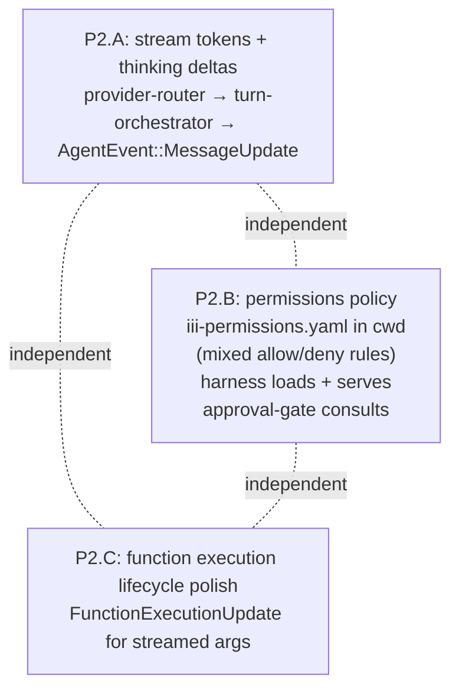
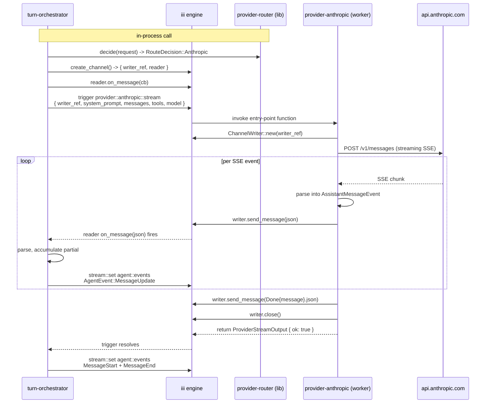
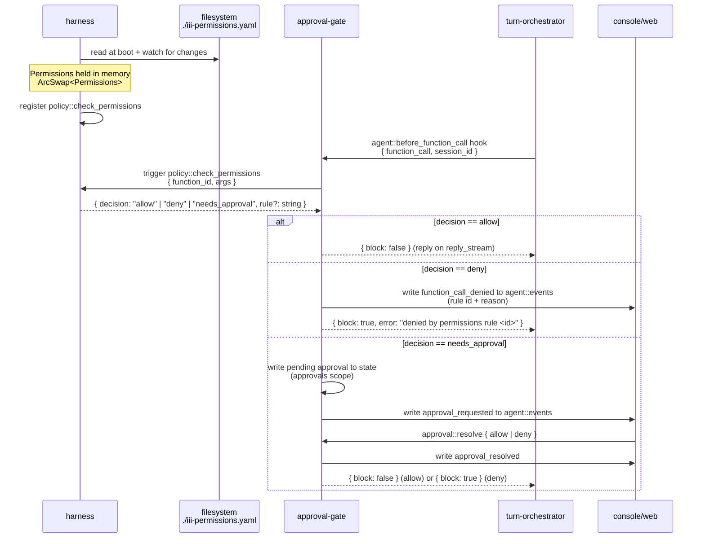
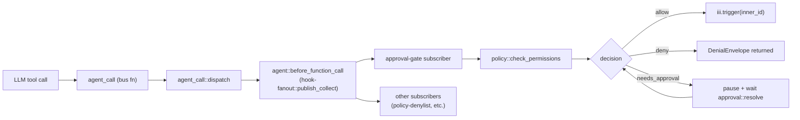

# Phase 2 plan — backend feature support for `console/web`

> **Purpose.** Self-contained execution plan for a fresh session. Hand this
> to a new agent (or pick it up tomorrow) and it should have everything
> needed to land Phase 2 without rereading the full Phase 1 history.

## 1. Where we are

Phase 1 landed and is on disk. It removed the `:3111` HTTP bootstrap, ported
the `iii-browser-sdk` plumbing into `console/web`, wired `real.ts` to today's
`AgentEvent` stream, and deleted `harness/web/`. Receipts:

- Phase 1 plan: [`.cursor/plans/move-iii-client-to-console_97e4e6bf.plan.md`](/.cursor/plans/move-iii-client-to-console_97e4e6bf.plan.md) (read for context).
- `harness/src/lib.rs` — no more `harness::call` / `harness::info` / HTTP trigger. Registers `harness::status`, `ui::subscribe`, `ui::unsubscribe`, `harness::fs::read_inline`, plus fanout pumps in `harness/src/fanout.rs`.
- [`console/web/src/lib/iii-client.ts`](console/web/src/lib/iii-client.ts) — `iii-browser-sdk` singleton, no HTTP bootstrap, WS URL via `VITE_ENGINE_WS_URL` or relative `/iii/ws`.
- [`console/web/src/types/iii-agent-event.ts`](console/web/src/types/iii-agent-event.ts) — hand-written TS for `AgentEvent`, `AgentMessage`, `ContentBlock`, `FunctionCall`, `FunctionResult`, `SessionEventEnvelope`.
- [`console/web/src/lib/backend/translate.ts`](console/web/src/lib/backend/translate.ts) — `translateAgentEvent(event) -> StreamEvent[]`. The `message_update` slot is already a no-op stub (returns `[]`); Phase 2.A will fill it in.
- [`console/web/src/lib/backend/real.ts`](console/web/src/lib/backend/real.ts) — subscribes `ui::session::event`, fires `run::start`, pumps events through `translateAgentEvent`. The `resolveRunParams` helper currently sends a hard-coded `approval_required` list; Phase 2.B replaces that mechanism entirely.

Phase 1's deliberate degradations (each is a Phase 2 target below):

- Assistant body arrives as one chunk (no per-token streaming).
- Thinking blocks ride inside the assistant `MessageStart` (no streaming).
- Approvals show `pendingApproval: true` but the UI can't resolve them yet (Phase 3 — out of scope here).
- `approval_required` is a hard-coded list in `real.ts` — Phase 2.B replaces it with a per-cwd permissions file owned by the harness (mixed allow/deny rules).

The Playground (`#/playground` route in dev) still works against `mockBackend`
because `.env.development` keeps `VITE_PLAYGROUND=1`. **Do not change the
`StreamEvent` contract** — see [`console/web/PLAYGROUND.md`](console/web/PLAYGROUND.md)
for the regression-suite scenarios.

## 2. Goals

Make the four backend features that `console/web`'s chat surface needs
actually work end-to-end:

1. **Token-by-token streaming responses** (P2.A).
2. **Thinking and thoughts** as a streamed delta (P2.A — shares infrastructure with #1).
3. **Permissions to execute functions, man-in-the-middle, controlled by a permissions file in cwd** that mixes allow and deny rules (P2.B).
4. **Better streamlined function execution lifecycle** (P2.C — smaller).

Out of scope for Phase 2 (track separately):

- Console/web UI for approving/denying pending calls (Phase 3 — needs buttons in [`FunctionCallMessage`](console/web/src/components/chat/FunctionCallMessage.tsx) wired to a new `approval::resolve` call).
- Multi-turn session persistence (Phase 4 — `real.ts` mints a fresh `session_id` per `stream()` call today).
- Changing the `StreamEvent` contract or any Playground scenario.

## 3. Sub-phase map



The three sub-phases are independent. Recommended order:

1. **P2.B first** (highest user value, no cross-stream coordination needed).
2. **P2.A second** (the streaming pipeline change is the riskiest because it touches three crates).
3. **P2.C last** (smallest scope, mostly a nice-to-have).

Each sub-phase is fully described below.

---

## 4. P2.A — Token streaming + thinking deltas

> **Architectural reset (May 2026).** This section has been rewritten twice
> from the original Phase 2 draft. The current shape: providers stay as
> separate iii worker processes but with the **minimum possible surface** —
> each provider registers exactly one entry-point function (e.g.,
> `provider::anthropic::stream`), receives a channel `writer_ref` in the
> payload per the [iii channels protocol](https://docs.iii.dev/docs/0-11-0/architecture/channels.md),
> and pushes each `AssistantMessageEvent` as a JSON text message via
> `ChannelWriter::send_message`. `provider-router` becomes a pure
> decision library imported by `turn-orchestrator`. All registrations use
> the typed `RegisterFunction::new_async` idiom from
> [`iii-directory/src/functions/directory.rs:297-312`](iii-directory/src/functions/directory.rs)
> — no raw `serde_json::Value` payloads, no manual `extract_channel_refs`.
>
> Earlier drafts of this section described (a) providers emitting
> `stream::set` on a `provider::events` stream with `turn-orchestrator`
> subscribing via `register_trigger`, and (b) providers as pure in-process
> libraries with no iii dependency at all. Both are obsolete; ignore any
> stray references that survive elsewhere in the repo's plans folder.

### Current state

Each provider crate today registers a `provider::<name>::complete` iii
function and synchronously folds an internal
`ReceiverStream<AssistantMessageEvent>` via `collect_final` to return one
assembled `AssistantMessage`:

- [`provider-anthropic/crates/provider-base/src/iii_register.rs:32-69, 134-194`](provider-anthropic/crates/provider-base/src/iii_register.rs)
- [`provider-openai/src/lib.rs:133-167`](provider-openai/src/lib.rs)

`provider-router` ([`provider-router/src/register.rs:232-269`](provider-router/src/register.rs)) registers `router::stream_assistant`, picks a provider via `router::decide`, calls `provider::<name>::complete` over the bus, optionally calls `budget::check` / `budget::record`, and returns the assembled message.

`turn-orchestrator/src/states/assistant.rs:77-103` `handle_streaming` makes one synchronous `iii.trigger("router::stream_assistant")` call and gets a single `AssistantMessage` back:

```rust
let response = iii
    .trigger(TriggerRequest {
        function_id: "router::stream_assistant".into(),
        payload,
        action: None,
        timeout_ms: Some(300_000),
    })
    .await?;
let assistant: AssistantMessage = serde_json::from_value(response)?;
record.last_assistant = Some(assistant);
```

Then `handle_finished` (`assistant.rs:106-148`) emits the assistant via
`assistant_lifecycle_events` — `MessageStart` and `MessageEnd` only, no
intermediate `MessageUpdate`:

```rust
pub(crate) fn assistant_lifecycle_events(assistant: &AssistantMessage) -> Vec<AgentEvent> {
    let msg = AgentMessage::Assistant(assistant.clone());
    vec![
        AgentEvent::MessageStart { message: msg.clone() },
        AgentEvent::MessageEnd { message: msg },
    ]
}
```

The `AgentEvent::MessageUpdate` variant exists at
[`harness/crates/harness-types/src/agent_event.rs:38-42`](harness/crates/harness-types/src/agent_event.rs) but is never emitted today:

```rust
MessageUpdate {
    message: AgentMessage,
    llm_event: AssistantMessageEvent,
},
```

`AssistantMessageEvent` is fully defined in
[`harness/crates/harness-types/src/stream_event.rs:50-103`](harness/crates/harness-types/src/stream_event.rs) with `TextStart`, `TextDelta`, `TextEnd`, `ThinkingStart`, `ThinkingDelta`, `ThinkingEnd`, `FunctioncallStart`, `FunctioncallDelta`, `FunctioncallEnd`, `Usage`, `Stop`, `Done`, `Error`. That's the producer-side building block providers already construct internally; Phase 2.A's job is to push it across the process boundary into `turn-orchestrator` via an iii channel rather than swallowing it in `collect_final`. No channels are in the picture today.

### Investigate first

Before writing code, run this pre-flight against the in-repo iii crates and surface any blocker:

- **`iii_sdk` channels API.** Confirm the in-repo Rust SDK version exposes `iii.create_channel(buffer_size: Option<usize>) -> Channel`, `ChannelWriter::new(addr, &writer_ref)`, `ChannelReader::new(addr, &reader_ref)`, `ChannelDirection::{Read, Write}`, and `writer.send_message(&str)` / `writer.close()` / `reader.on_message(cb)` per the [channels doc](https://docs.iii.dev/docs/0-11-0/architecture/channels.md). If the engine version pinned by the workspace is older than 0.11.0, this is the blocker — surface it before touching any code.
- **`StreamChannelRef` derives.** Confirm `iii_sdk::StreamChannelRef` derives (or at least implements) `serde::Deserialize` + `serde::Serialize` + `schemars::JsonSchema`. The typed-registration pattern requires it as a field on `ProviderStreamInput` (see Design below). If `JsonSchema` is missing, either (a) wrap it in a local newtype with a hand-written `JsonSchema` impl, or (b) fall back to a `serde_json::Value` field and peel via `iii_sdk::extract_channel_refs` — but prefer fixing it upstream in `iii_sdk` since the directory's typed pattern is now the convention.
- **`RegisterFunction` API.** Confirm `iii_sdk::RegisterFunction::new_async(id, async_closure)` and the chainable `.description(...)` shape match the example at [`iii-directory/src/functions/directory.rs:297-312`](iii-directory/src/functions/directory.rs). This is the only registration idiom used in the new plan.
- **iii callsite inventory in providers.** Grep [`provider-anthropic/`](provider-anthropic/), [`provider-openai/`](provider-openai/), [`provider-router/`](provider-router/) for `iii_sdk`, `register_function`, `register_trigger`, `RegisterFunctionMessage`, `RegisterTriggerInput`, `TriggerRequest`. Each match must be deleted, simplified, or moved into `turn-orchestrator`. The two surviving registrations are the new typed entry-point functions (one per provider). Everything else goes.
- **Tool-result serializer.** Both `provider-anthropic/src/lib.rs:156-171` (Anthropic `tool_result` wire) and `provider-openai/crates/provider-base/src/openai_compat.rs:135-149` (OpenAI tool message wire) stay — those are pure encoders for the message history sent to the LLM, not iii calls.
- **External callers.** `rg -t rust 'router::stream_assistant|provider::anthropic::complete|provider::openai::complete|router::decide'` to confirm `turn-orchestrator` is the only caller (initial exploration shows it is). If any other crate calls these, add a migration note in CHANGELOG before deleting the function ids.

### Design (target architecture)

There is one process boundary on the agent's path to the LLM (the HTTP
call to Anthropic / OpenAI). Everything else either runs in-process inside
`turn-orchestrator` or crosses the bus via a single typed channel hop.



Architectural principles:

1. **Each provider crate registers exactly one entry-point function** and uses one iii primitive (channels). No `stream::set`, no `register_trigger`, no awareness of `agent::events` or `AgentEvent` variants, no hooks. The provider sees: `{ writer_ref, system_prompt, messages, tools, model }` in, `AssistantMessageEvent`s written to the channel, channel closed on Done. That's the entire contract.
2. **Typed registration via `RegisterFunction::new_async`.** Both provider entry points use the same idiom established in [`iii-directory/src/functions/directory.rs:297-312`](iii-directory/src/functions/directory.rs): a `#[derive(Debug, Deserialize, JsonSchema)]` input struct, a `#[derive(Debug, Serialize, JsonSchema)]` output struct, an async handler function, and `iii.register_function(RegisterFunction::new_async(id, closure).description(...))`. Auto-derived JSON schemas mean `directory::engine::functions::info` can introspect the provider's contract; manual `serde_json::from_value` / `extract_channel_refs` boilerplate disappears. **No new code in this plan uses the older `RegisterFunctionMessage::with_id(...)` + raw `Value` pattern.**
3. **`provider-router` is a pure library.** No iii dependency beyond importing the `StreamChannelRef` type. Exports `pub fn decide(req) -> RouteDecision`, `pub fn target_function_id(decision) -> &'static str`, and `pub fn build_input(...) -> ProviderStreamInput`. `turn-orchestrator` imports it and dispatches the chosen provider's function over the bus.
4. **`turn-orchestrator` owns the iii dance.** Creates the channel, triggers the provider, drains the reader concurrently, emits `AgentEvent::MessageUpdate` per non-terminal frame, calls `budget::*`, and finalizes via the existing `assistant_lifecycle_events`.
5. **Bus surface that disappears:** `router::stream_assistant`, `router::decide`, `provider::anthropic::complete`, `provider::openai::complete`. The bus surface that **stays per-provider** is one function id each — concretely `provider::anthropic::stream` and `provider::openai::stream`.

#### Shared input/output types (lives in `harness-types`)

Both providers and `provider-router::build_input` reference the same shared types so `directory::engine::functions::info` reports a single canonical JSON Schema. Lives next to `AgentMessage`, `FunctionSchema`, and `AssistantMessageEvent` in `harness-types`:

```rust
// harness/crates/harness-types/src/provider.rs (new)
use iii_sdk::StreamChannelRef;
use schemars::JsonSchema;
use serde::{Deserialize, Serialize};

use crate::{function::FunctionSchema, AgentMessage};

#[derive(Debug, Deserialize, Serialize, JsonSchema)]
pub struct ProviderStreamInput {
    /// Writer end of the channel the orchestrator opened; provider writes
    /// AssistantMessageEvent text messages here, then closes.
    pub writer_ref: StreamChannelRef,
    #[serde(default)]
    pub system_prompt: Option<String>,
    pub model: String,
    pub messages: Vec<AgentMessage>,
    #[serde(default)]
    pub tools: Vec<FunctionSchema>,
}

#[derive(Debug, Deserialize, Serialize, JsonSchema)]
pub struct ProviderStreamOutput {
    pub ok: bool,
}
```

#### Provider entry point (mirrored shape for Anthropic and OpenAI)

```rust
// provider-anthropic/src/lib.rs
use std::sync::Arc;

use iii_sdk::{ChannelWriter, IIIError, RegisterFunction, III};
use harness_types::{
    provider::{ProviderStreamInput, ProviderStreamOutput},
    stream_event::AssistantMessageEvent,
};

fn register_stream(iii: &Arc<III>, build_config: BuildConfig) {
    let iii_inner = iii.clone();
    let build_config = Arc::new(build_config);
    iii.register_function(
        RegisterFunction::new_async(
            "provider::anthropic::stream",
            move |req: ProviderStreamInput| {
                let iii = iii_inner.clone();
                let build_config = build_config.clone();
                async move {
                    stream_anthropic(&iii, &build_config, req)
                        .await
                        .map_err(IIIError::Handler)
                }
            },
        )
        .description(
            "Stream a single assistant turn from Anthropic into the caller-supplied channel. \
             Emits one AssistantMessageEvent JSON per text message, terminated by Done or Error \
             followed by channel close.",
        ),
    );
}

async fn stream_anthropic(
    iii: &III,
    build_config: &BuildConfig,
    req: ProviderStreamInput,
) -> Result<ProviderStreamOutput, String> {
    let writer = ChannelWriter::new(iii.address(), &req.writer_ref);
    let config = decode_config(&req, build_config)
        .map_err(|e| format!("decode config: {e}"))?;

    let mut stream = pure_provider_stream(
        config,
        req.system_prompt,
        req.messages,
        req.tools,
    )
    .await;

    while let Some(event) = stream.next().await {
        let json = serde_json::to_string(&event)
            .map_err(|e| format!("encode event: {e}"))?;
        writer
            .send_message(&json)
            .await
            .map_err(|e| format!("channel send: {e}"))?;
        if matches!(
            event,
            AssistantMessageEvent::Done { .. } | AssistantMessageEvent::Error { .. }
        ) {
            break;
        }
    }

    writer
        .close()
        .await
        .map_err(|e| format!("channel close: {e}"))?;

    Ok(ProviderStreamOutput { ok: true })
}
```

Notes on the pattern:

- The input struct derives `Deserialize` + `JsonSchema`, so callers (and `directory::engine::functions::info`) see a typed schema instead of `any`.
- The handler is a free `async fn stream_anthropic(...)` returning `Result<ProviderStreamOutput, String>`. The closure passed to `RegisterFunction::new_async` is a thin adapter that clones the captured `iii` / `build_config` and `.map_err(IIIError::Handler)`s the string error — exactly the shape used at [`iii-directory/src/functions/directory.rs:297-312`](iii-directory/src/functions/directory.rs).
- `StreamChannelRef` carried as a typed field replaces the prior plan drafts' manual `extract_channel_refs(&Value)` peel. If `iii_sdk::StreamChannelRef` doesn't yet derive `JsonSchema`, fall back to a hand-written `JsonSchema` impl or a `serde_json::Value` field — see Open decisions.
- `pure_provider_stream` is the existing `ReceiverStream<AssistantMessageEvent>` producer that lives today inside `provider-anthropic/crates/provider-base/`. It stays exactly as it is — only the iii wrapper around it changes.
- No `Arc<III>` is needed inside the handler beyond what `iii.address()` exposes for the `ChannelWriter`. If `ChannelWriter::new` ever evolves to take `&III` directly, drop the address call accordingly.

#### `provider-router` as a pure decision lib

```rust
// provider-router/src/lib.rs (replaces register.rs)
use iii_sdk::StreamChannelRef;
use serde::{Deserialize, Serialize};

use harness_types::{
    function::FunctionSchema,
    provider::{ProviderStreamInput, ProviderStreamOutput},
    AgentMessage,
};

pub struct RouteRequest {
    pub provider: Option<String>,
    pub model: String,
    pub session_id: String,
    // ... whatever the existing payload carries
}

pub enum RouteDecision {
    Anthropic { model: String /* ... */ },
    OpenAi    { model: String /* ... */ },
}

pub fn decide(req: &RouteRequest) -> RouteDecision {
    // Today's logic from provider-router/src/register.rs::router::decide,
    // hoisted out of the iii closure. No bus call.
}

pub fn target_function_id(decision: &RouteDecision) -> &'static str {
    match decision {
        RouteDecision::Anthropic { .. } => "provider::anthropic::stream",
        RouteDecision::OpenAi    { .. } => "provider::openai::stream",
    }
}

pub fn build_input(
    decision: &RouteDecision,
    writer_ref: StreamChannelRef,
    system_prompt: Option<String>,
    messages: Vec<AgentMessage>,
    tools: Vec<FunctionSchema>,
) -> ProviderStreamInput {
    ProviderStreamInput {
        writer_ref,
        system_prompt,
        model: match decision {
            RouteDecision::Anthropic { model } | RouteDecision::OpenAi { model } => model.clone(),
        },
        messages,
        tools,
    }
}
```

The function-id table makes routing transparent to `turn-orchestrator`. The single `iii_sdk` import is `StreamChannelRef` — needed because the typed input carries it. If we want to eliminate even that, leave `writer_ref` as `serde_json::Value` in the input struct and let providers peel it via `extract_channel_refs`. Plan picks the typed-ref shape for symmetry with the rest of the input.

#### `turn-orchestrator/src/states/assistant.rs::handle_streaming` rewrite

```rust
pub async fn handle_streaming(iii: &III, record: &mut TurnStateRecord) -> anyhow::Result<()> {
    let request  = persistence::load_run_request(iii, &record.session_id).await;
    let messages = persistence::load_messages(iii, &record.session_id).await;
    let schemas  = persistence::load_function_schemas(iii, &record.session_id).await;

    let route_req = route_request_from(&request, &record.session_id);
    let decision  = provider_router::decide(&route_req);
    let target_fn = provider_router::target_function_id(&decision);

    // Budget check stays bus-mediated:
    let _ = iii.trigger(TriggerRequest {
        function_id: "budget::check".into(),
        payload: budget_payload(&decision),
        action: None,
        timeout_ms: None,
    }).await;

    // Open a channel; the provider will write into it.
    let channel = iii.create_channel(None).await
        .map_err(|e| anyhow::anyhow!("create_channel: {e}"))?;
    let writer_ref = channel.writer_ref.clone();

    // Register a per-message callback BEFORE triggering the provider so the
    // reader is connected and no events are missed.
    let (tx, mut rx) = tokio::sync::mpsc::unbounded_channel::<String>();
    channel.reader.on_message(move |msg: String| {
        let _ = tx.send(msg);
    }).await;

    let input = provider_router::build_input(
        &decision,
        writer_ref,
        request.get("system_prompt").and_then(Value::as_str).map(str::to_string),
        messages.clone(),
        schemas.clone(),
    );
    let payload = serde_json::to_value(&input)
        .map_err(|e| anyhow::anyhow!("encode ProviderStreamInput: {e}"))?;

    // Run the trigger and the read loop concurrently. The trigger resolves
    // when the provider returns (after close()); the read loop terminates
    // when it has consumed the terminal Done/Error.
    let trigger_fut = iii.trigger(TriggerRequest {
        function_id: target_fn.into(),
        payload,
        action: None,
        timeout_ms: Some(300_000),
    });

    let session_id = record.session_id.clone();
    let iii_for_loop = iii.clone();
    let read_fut = async move {
        let mut partial = AssistantMessage::default();
        let mut final_msg: Option<AssistantMessage> = None;
        while let Some(text) = rx.recv().await {
            let event: AssistantMessageEvent = match serde_json::from_str(&text) {
                Ok(e) => e,
                Err(err) => { tracing::warn!(%err, %session_id, "decode event failed"); continue; }
            };
            match &event {
                AssistantMessageEvent::Done  { message } => { final_msg = Some(message.clone()); break; }
                AssistantMessageEvent::Error { error   } => { final_msg = Some(error.clone());   break; }
                e if let Some(p) = event_partial(e) => { partial = p.clone(); }
                _ => {}
            }
            events::emit(&iii_for_loop, &session_id, &AgentEvent::MessageUpdate {
                message:   AgentMessage::Assistant(partial.clone()),
                llm_event: event,
            }).await;
        }
        final_msg.ok_or_else(|| anyhow::anyhow!("provider channel closed without Done"))
    };

    let (trigger_res, read_res) = tokio::join!(trigger_fut, read_fut);
    trigger_res.map_err(|e| anyhow::anyhow!("provider trigger failed: {e}"))?;
    let assistant = read_res?;

    // Budget record:
    let _ = iii.trigger(TriggerRequest {
        function_id: "budget::record".into(),
        payload: budget_payload_for_final(&assistant),
        action: None,
        timeout_ms: None,
    }).await;

    record.last_assistant = Some(assistant);
    record.transition_to(TurnState::AssistantFinished);
    Ok(())
}
```

`handle_finished` continues to emit `MessageStart` / `MessageEnd` via the existing `assistant_lifecycle_events` (`states/assistant.rs:95-101`); nothing there changes.

`AgentEvent::MessageUpdate`'s shape is unchanged — it already carries `message: AgentMessage` (the accumulated partial) and `llm_event: AssistantMessageEvent` (the raw delta).

### Channel protocol

A short normative section so providers and consumers agree on the wire shape:

- **Direction.** One-way: caller → provider gets the `writer_ref`; provider writes; caller reads. No reverse channel in Phase 2.
- **Message kind.** Text only (`send_message` / `on_message`). Binary path (`write` / `next_binary`) is unused.
- **Message body.** Each message is one JSON-serialized `AssistantMessageEvent` (the discriminated union at [`harness/crates/harness-types/src/stream_event.rs:50-103`](harness/crates/harness-types/src/stream_event.rs)). No envelope wrapper; the `type` tag is part of the event.
- **Termination.** The provider sends `AssistantMessageEvent::Done { message }` (or `Error { error }`) as the final message, then calls `writer.close()`. The consumer can treat either "received Done/Error" or "channel closed" as end-of-stream; both happen.
- **Ordering.** Providers MUST emit events in the order they're produced by the upstream SSE/HTTP stream. The terminal `Done` / `Error` MUST be the last message before close.
- **Error handling.** If the provider's upstream fails mid-stream, send `Error { error: AssistantMessage }` carrying the partial accumulator plus an error string, then close. The consumer surfaces this as an `AssistantMessageEvent::Error` and uses the partial as the final message.
- **Backpressure.** Per the [channels doc](https://docs.iii.dev/docs/0-11-0/architecture/channels.md), the WebSocket pauses when the reader's buffer fills. `create_channel(None)` uses the default buffer size. Phase 2 doesn't tune; revisit if streaming feels laggy under realistic load.

### Frontend translator changes ([`console/web/src/lib/backend/translate.ts`](console/web/src/lib/backend/translate.ts))

Today the `message_update` branch returns `[]`. Phase 2.A:

```ts
case 'message_update': {
  // Switch on event.llm_event.type and emit StreamEvents
  switch (event.llm_event?.type) {
    case 'text_delta':
      return [{ kind: 'assistant-token', token: event.llm_event.delta }]
    case 'thinking_delta':
      return [{ kind: 'thought-token', token: event.llm_event.delta }]
    case 'thinking_start':
      return [{ kind: 'thought-start' }]
    case 'thinking_end':
      return [{ kind: 'thought-end', durationMs: 0 }]
    // text_start / text_end / functioncall_* / usage / stop: no UI signal
    default:
      return []
  }
}
```

For the assistant body, you don't need `assistant-start`/`assistant-end` —
the consumer in `ChatView.tsx` (around lines 137-162) lazily creates the
assistant message on the first `assistant-token`. `assistant-end` is emitted
by the `agent_end` translation already.

**Important:** once `message_update` emits real tokens, the existing
`translateMessageStart` for the assistant role should stop unconditionally
splitting content blocks into thought/assistant tokens — those will now
arrive as deltas. Two options:

- **(A) Replace** the assistant body in `translateMessageStart` with a
  no-op (since deltas already populated it). Risks losing thinking/text
  for providers that don't stream.
- **(B) Keep** `translateMessageStart` as-is but flag the message as
  "already streamed" via a `Set<sessionId+messageHash>` to skip re-emitting
  when the final `MessageStart` arrives. Simpler: dedupe at the renderer.

Recommend (A): if the backend streams, it streams everything. Documenting
the contract: providers that don't support streaming must emit a single
`TextDelta` with the full body before `Done`. Stream-or-die.

Also extend [`console/web/src/types/iii-agent-event.ts`](console/web/src/types/iii-agent-event.ts)
to type `AssistantMessageEvent` (mirror `stream_event.rs:50-103`).

### Update [`console/web/PLAYGROUND.md`](console/web/PLAYGROUND.md)

The mock backend already emits `thought-token` and `assistant-token` per
chunk, so the playground scenarios already exercise this case. No scenario
change. Add a paragraph to the doc noting that the real backend now emits
real deltas (not single-shot bodies).

### Files to edit (P2.A)

- **New shared types** — [`harness/crates/harness-types/src/provider.rs`](harness/crates/harness-types/src/provider.rs) (new file): `ProviderStreamInput { writer_ref: StreamChannelRef, system_prompt: Option<String>, model: String, messages: Vec<AgentMessage>, tools: Vec<FunctionSchema> }` and `ProviderStreamOutput { ok: bool }`, both deriving `Debug, Deserialize, Serialize, JsonSchema`. Re-export from `harness/crates/harness-types/src/lib.rs`. Add `iii_sdk` and `schemars` to `harness-types`'s `Cargo.toml` if they aren't already there.
- [`provider-anthropic/Cargo.toml`](provider-anthropic/Cargo.toml) — keeps `iii_sdk` (for channels + `RegisterFunction`), adds `schemars` if not present, depends on `harness-types`.
- [`provider-anthropic/src/lib.rs`](provider-anthropic/src/lib.rs) — new `fn register_stream(iii: &Arc<III>, build_config: BuildConfig)` + `async fn stream_anthropic(...)` per the Design snippets. Uses `RegisterFunction::new_async` + typed `ProviderStreamInput` (no raw `Value`, no `extract_channel_refs`).
- [`provider-anthropic/crates/provider-base/src/iii_register.rs`](provider-anthropic/crates/provider-base/src/iii_register.rs) — delete the `collect_final` wrapping and the `provider::anthropic::complete` registration. Either move the new `register_stream` function here or to the top-level crate; delete the rest.
- [`provider-openai/Cargo.toml`](provider-openai/Cargo.toml), [`provider-openai/src/lib.rs`](provider-openai/src/lib.rs) — same pattern: typed `RegisterFunction::new_async` registering `provider::openai::stream` with `ProviderStreamInput`.
- [`provider-router/Cargo.toml`](provider-router/Cargo.toml) — keeps `iii_sdk` only for the `StreamChannelRef` type. No `register_function` calls remain.
- [`provider-router/src/lib.rs`](provider-router/src/lib.rs) — new pure-lib API (`decide`, `target_function_id`, `build_input`). Re-exports `RouteDecision`, `RouteRequest`. `build_input` returns a `ProviderStreamInput` (typed); `turn-orchestrator` serializes it before calling `iii.trigger`.
- [`provider-router/src/register.rs`](provider-router/src/register.rs) — delete. The budget logic that lives in this file moves into `turn-orchestrator` (it's already a per-call decision, not a routing concern).
- [`provider-router/src/main.rs`](provider-router/src/main.rs) (if present) — delete; `provider-router` is library-only.
- [`turn-orchestrator/Cargo.toml`](turn-orchestrator/Cargo.toml) — add `provider-router` and `harness-types` (if not already direct) as workspace deps. Provider crates are NOT direct deps; the orchestrator talks to them over the bus.
- [`turn-orchestrator/src/states/assistant.rs`](turn-orchestrator/src/states/assistant.rs) — rewrite `handle_streaming` per the Design snippet. Add helpers `route_request_from`, `event_partial`, `budget_payload`, `budget_payload_for_final` in the same module or a small new `streaming.rs`.
- [`turn-orchestrator/src/events.rs`](turn-orchestrator/src/events.rs) — no change; already owns `EVENTS_STREAM = "agent::events"`.
- [`console/web/src/types/iii-agent-event.ts`](console/web/src/types/iii-agent-event.ts) — add `AssistantMessageEvent` discriminated union (mirror `stream_event.rs:50-103`). Unchanged from the original P2.A plan — frontend only sees `AgentEvent::MessageUpdate` on `agent::events` and doesn't care how it was produced.
- [`console/web/src/lib/backend/translate.ts`](console/web/src/lib/backend/translate.ts) — fill in the `message_update` branch as documented in "Frontend translator changes" above.
- [`console/web/PLAYGROUND.md`](console/web/PLAYGROUND.md) — paragraph on real backend streaming.

### Verification (P2.A)

- `cd harness && cargo clippy --all-targets -- -D warnings` clean (covers the new `harness-types/src/provider.rs`).
- `cd provider-anthropic && cargo test` — drive the registered `provider::anthropic::stream` with a fake `iii` test harness; assert each `AssistantMessageEvent` from the stub upstream is forwarded via `send_message` in order, terminated by `Done`, then `close()` is called, and the function returns `ProviderStreamOutput { ok: true }`. Pure-stream tests inside `crates/provider-base/` are unaffected.
- `cd provider-openai && cargo test` — same, for `provider::openai::stream`.
- `cd provider-router && cargo test` — `decide(...)` picks the right provider for known model names; `target_function_id` returns matching ids; `build_input(...)` produces a `ProviderStreamInput` whose `writer_ref`, `messages`, `tools`, and `model` fields round-trip through `serde_json::to_value` + `serde_json::from_value` back to the same struct.
- `cd turn-orchestrator && cargo clippy --all-targets -- -D warnings && cargo test` — new test in `states/assistant.rs`: with a fake provider that opens a `ChannelReader` from the `writer_ref`, writes three `TextDelta`s + `Done`, asserts the orchestrator emits three `MessageUpdate` events followed by `MessageEnd` on `agent::events` for the right `session_id`. (Register a no-op test function to stand in for the provider.)
- **Schema discoverability.** `cargo run --bin iii-directory -- query` (or whatever the directory's smoke CLI is): assert `directory::engine::functions::info { function_id: "provider::anthropic::stream" }` returns a `request_schema` whose JSON Schema matches `ProviderStreamInput` (`writer_ref`, `system_prompt?`, `model`, `messages[]`, `tools[]`). Same for `provider::openai::stream`. This is the pay-off for the typed-input pattern — operators and skill authors can introspect the providers without grepping source.
- `cd console/web && pnpm typecheck && pnpm lint && pnpm build` clean.
- `pnpm dev` against a running engine + harness + turn-orchestrator + at least one provider worker: send a prompt, watch the assistant body grow token-by-token (DevTools network shows continuous WS frames; the UI buffer in `ChatView.tsx` grows). `turn-orchestrator`'s logs show one `create_channel` + one `trigger provider::*::stream` per turn.
- Send a prompt to a thinking-capable model: thoughts render in the `ThoughtMessage` component as they stream.

### Open decisions (P2.A)

1. **Text vs binary channel.** Plan uses `send_message` / `on_message` (text). Alternative: serialize each event as JSON bytes and use `write` / `next_binary`. Text is simpler (natural message boundaries) and the [channels doc](https://docs.iii.dev/docs/0-11-0/architecture/channels.md) treats binary as "the main data path", but for our use case events are small and discrete so message-shape fits better. Revisit if event volume gets large enough that text encoding overhead matters.
2. **Channel buffer size.** Phase 2 uses `iii.create_channel(None)` (default). If streaming feels laggy under realistic load, pass an explicit `Some(N)` and document the chosen value.
3. **Cancellation.** Today there's no in-flight cancellation path for an assistant turn. A natural extension is to create a second channel (caller → provider) carrying a `cancel` message; the provider's loop checks for it and aborts the upstream SSE. Out of scope for Phase 2; track as a follow-up.
4. **Bus surface deletion timeline.** `router::stream_assistant`, `router::decide`, `provider::anthropic::complete`, `provider::openai::complete` cease to exist when P2.A lands. Confirm no in-repo caller other than `turn-orchestrator` references them (the initial exploration confirmed none today). External callers — if any deploy out-of-tree — need migration notes in CHANGELOG.
5. **`provider-router` as workspace dep vs git submodule.** Plan adds it as a direct workspace dep of `turn-orchestrator`. If we ever want to swap routers without rebuilding the orchestrator, route through a small trait + dynamic dispatch instead. Not needed in Phase 2.
6. **Provider-side ordering guarantee.** Already in the "Channel protocol" subsection: providers MUST emit `Done` / `Error` last and MUST NOT emit anything after. Worth a per-provider test.
7. **Where do `ProviderStreamInput` / `ProviderStreamOutput` live?** Plan recommends `harness-types` (sibling of `AssistantMessageEvent`, `AgentMessage`, `FunctionSchema`). Alternatives: a new `provider-types` crate (keeps `harness-types` from depending on `iii_sdk` for `StreamChannelRef`), or each provider crate owning its own copy (defeats the purpose — `directory::engine::functions::info` would report two different schemas). Pick `harness-types` unless adding `iii_sdk` to its deps is a problem.
8. **`StreamChannelRef` `JsonSchema`.** If `iii_sdk` doesn't yet derive `JsonSchema` for `StreamChannelRef`, the typed-input pattern degrades. Plan recommends fixing `iii_sdk` upstream rather than wrapping locally — once fixed, every typed-input crate in the workspace benefits, not just providers. Hand-written `JsonSchema` impl is the fallback if upstream is too slow.

### What does NOT change

- The §5 (P2.B) work — permissions file, chokepoint guarantee, `DenialEnvelope`, default `iii-permissions.yaml` — is **independent** and stays as already drafted. The provider re-architecture doesn't touch the gate/approval path.
- The `AgentEvent::MessageUpdate` shape and the `agent::events` stream are unchanged. Console/web's translator (filling in the `message_update` branch) is unaffected by how providers produce the events.
- `assistant_lifecycle_events` keeps emitting `MessageStart` + `MessageEnd` on Done; `handle_finished` doesn't move.

---

## 5. P2.B — Permissions policy: per-cwd allow/deny rules (NEW)

This is the user-requested new mechanism. It **replaces** the current
`approval_required` array (carried in the `run::start` payload) with a
declarative **permissions file** in the working directory. The file holds an
ordered list of rules, each tagged with `action: allow` or `action: deny`.

Evaluation: rules are scanned **top-to-bottom; first match wins**.

- A matching `allow` rule → the call runs without prompting.
- A matching `deny` rule → the call is blocked without prompting (the
  function call completes with a permission-denied error).
- No rule matches → fall through to the existing `approval-gate`
  man-in-the-middle pause-and-wait flow.

Ordering matters because deny rules are most useful as scoped carve-outs in
front of broader allow rules (e.g. "deny `git push --force` but allow any
other `git` invocation").

### Investigate first (P2.B)

Before writing code, walk these three bypasses surfaced by the Phase 2.B
exploration. Every concrete-change subsection below assumes they're sealed.

1. **Fail-open hook.** [`turn-orchestrator/src/states/functions.rs:284-307`](turn-orchestrator/src/states/functions.rs) — `publish_collect` swallows trigger errors with `.ok().and_then(...).unwrap_or_else(|| json!({}))`. An empty merge reads `block` as `false`, so any hook timeout / approval-gate crash / network blip silently allows the call. §F below makes this fail-closed.

2. **Dispatcher bypass.** [`turn-orchestrator/src/agent_call.rs:144-151`](turn-orchestrator/src/agent_call.rs) — `dispatch` calls `iii.trigger(inner_function_id, ...)` unconditionally. The hook only fires because the FSM (`handle_prepare`) emits it before calling `dispatch`. Any worker that posts `agent::call` on the bus outside the FSM (or any future code path that calls `dispatch` directly) skips the gate entirely. §F moves the hook *into* `dispatch` so the chokepoint is unconditional.

3. **OpenAI wire drops denial signal.** [`provider-openai/crates/provider-base/src/openai_compat.rs:135-149`](provider-openai/crates/provider-base/src/openai_compat.rs) — the function-result serializer ignores `is_error` and `details`. The model only sees a plain string. §G fixes the wire so denials reach the LLM as structured, parseable content.

The chokepoint guarantee below ties these together: the permissions gate is the **single** path from an agent-issued tool call to iii, and denials surface to the LLM as machine-readable envelopes so it can productively re-plan.

### Current state

- [`approval-gate/src/lib.rs:33-39`](approval-gate/src/lib.rs):
  ```rust
  impl IncomingCall {
      pub fn requires_approval(&self) -> bool {
          self.approval_required.iter().any(|n| n == &self.function_id)
      }
  }
  ```
  Plain substring match against a list of function ids. No arg inspection,
  no deny notion (the only outcomes are "approve" or "let through").

- The list comes from [`turn-orchestrator/src/run_start.rs:73-76`](turn-orchestrator/src/run_start.rs) `build_run_request`, which copies `approval_required` from the run::start payload into the persisted run request.

- [`console/web/src/lib/backend/real.ts:66-79`](console/web/src/lib/backend/real.ts) sends a hard-coded array.

- The denylist worker [`policy-denylist/`](policy-denylist/) is a parallel mechanism. P2.B does NOT replace it; the permissions file is a per-cwd / per-deployment policy edited by the operator, while `policy-denylist/` is a separate worker that can encode global hard-blocks. They coexist as independent subscribers on `agent::before_function_call`. (Folding the denylist worker into the permissions file is a follow-up — see open decisions.)

### Permissions file format

Default path: `./iii-permissions.yaml` (relative to the harness's cwd, with
the path being configurable via harness config). YAML matches the rest of
the harness's config style.

```yaml
# iii-permissions.yaml — agent permission rules.
#
# Rules are scanned top-to-bottom; the first rule whose match condition
# holds wins.
#   action: allow  → call runs without prompting
#   action: deny   → call is blocked without prompting (the function call
#                    completes with a permission-denied error)
# Calls that match no rule trigger an approval_requested event; the UI
# must call approval::resolve { allow | deny } to proceed.
#
# Every detailed rule MUST declare a stable `rule_id`. The id surfaces
# verbatim in the DenialEnvelope (see "Denial envelope schema" below) so
# operators can grep logs and the LLM gets a specific guardrail name to
# reason about. Bare-string shorthand auto-derives rule_id = function_id.

version: 1

rules:
  # Deny rules come first if you want them to win over later allows.
  # Catastrophic shell invocations: block, never prompt.
  - rule_id: shell/no-rm-rf-root
    function: shell::exec
    action: deny
    args:
      command:
        matches: "^rm -rf /( |$)"

  - rule_id: git/no-force-push
    function: shell::exec
    action: deny
    args:
      command:
        matches: "^git push --force"

  # Bare strings are a shorthand for { rule_id: <id>, function: <id>, action: allow }.
  # The rule_id is auto-derived from the function id at load time.
  - shell::fs::ls
  - shell::fs::stat
  - shell::fs::read
  - state::get
  - engine::functions::list

  # Explicit allow with no arg constraints.
  - rule_id: harness/status-readonly
    function: harness::status
    action: allow

  # Allow with single-field arg constraint (equality).
  - rule_id: git/status-only
    function: shell::exec
    action: allow
    args:
      command:
        equals: "git status"

  # Allow with single-field arg constraint (regex).
  - rule_id: git/readonly-commands
    function: shell::exec
    action: allow
    args:
      command:
        matches: "^git (status|log|diff)( |$)"

  - rule_id: scratch/tmp-writes
    function: shell::fs::write
    action: allow
    args:
      path:
        matches: "^/tmp/scratch/.*\\.txt$"

  # Multiple field constraints under `args` are AND-combined.
  - rule_id: state/agent-notes-workspace
    function: state::set
    action: allow
    args:
      scope:
        equals: "agent"
      key:
        matches: "^session/[a-zA-Z0-9-]+/(notes|workspace)$"
```

Rule shapes (parser):

| Shape                                                                                | Match condition                                                 | Outcome                                                       |
|--------------------------------------------------------------------------------------|-----------------------------------------------------------------|---------------------------------------------------------------|
| `"function_id"` (bare string)                                                        | `function_id == string`, args ignored                           | `allow` shorthand; `rule_id` auto-derived to `function_id`    |
| `{ rule_id: id, function: f, action: allow\|deny }`                                  | `function_id == f`, args ignored                                | per `action`                                                  |
| `{ rule_id: id, function: f, action: allow\|deny, args: { field: { equals: v } } }`  | `function_id == f` AND `args[field] == v`                       | per `action`                                                  |
| `{ rule_id: id, function: f, action: allow\|deny, args: { field: { matches: re } } }` | `function_id == f` AND `args[field]` is a string matching `re` | per `action`                                                  |
| Multiple fields under `args`                                                         | all constraints must match (logical AND)                        | per `action`                                                  |

Notes:

- `rule_id` is **required** on the detailed form. Missing `rule_id` is a
  load-time error. Convention: namespace the id with a `category/short-name`
  shape (e.g. `git/no-force-push`, `kernel/no-self-approve`). The shipped
  default file in §H reserves the `kernel/*` namespace.
- Duplicate `rule_id` across two rules is a load-time warning (not an
  error). First-match-wins still applies, so duplicates are operationally
  harmless but defeat observability — see open decisions.
- `action` is **required** on the detailed form. The bare string shorthand
  is allow-only by design (deny rules are always impactful and should be
  written out explicitly with a `rule_id`).
- The `equals` value is compared with `serde_json::Value`-equality, so
  strings, numbers, booleans, and nested objects all work. `matches` is
  string-only (regex against `as_str()`); silently fails to match for
  non-string values.
- Regex flavor: Rust `regex` crate (default — no PCRE). Document this in
  the file's leading comment.
- Order matters: a `deny` rule earlier in the list overrides a broader
  `allow` later in the list, and vice versa. Treat the file like an
  iptables chain.

### Architecture

The harness owns the permissions file (loads it, watches for changes,
exposes a bus function). Approval-gate consumes it. This keeps approval-gate
generic and concentrates policy in the meta-worker.



`function_call_denied` reuses the existing function-call-error rendering
path on the UI side (same shape as a runtime error from the function), so
no new `StreamEvent` kind is needed for Phase 2.

### Chokepoint guarantee

The permissions gate is the **only** path from an agent-issued tool call to
iii. Three invariants follow from that:

1. **Every `agent::call` dispatch consults `agent::before_function_call`.**
   The hook is emitted from inside [`turn-orchestrator/src/agent_call.rs::dispatch`](turn-orchestrator/src/agent_call.rs) — not from the FSM — so any caller that reaches the dispatcher is gated. Workers that post `agent::call` on the bus directly (rather than going through `handle_prepare`) are gated automatically. See §F for the move.

2. **Fail-closed.** If the hook times out, errors, or no subscriber responds, the call is treated as **denied** (not allowed). The denial envelope reports `denied_by: "gate_unavailable"` so the LLM understands the cause is infrastructure, not policy. Today's `unwrap_or_else(|| json!({}))` fail-open is removed.

3. **No kernel denylist.** The permissions file is the single source of truth. Self-approval surfaces (`approval::resolve`, `policy::check_permissions`, `hook-fanout::publish_collect`, …) are protected because the **shipped default** `iii-permissions.yaml` deny-lists them with `kernel/*` rule ids. Operators can edit those rules; removing them is supported but discouraged and documented in §H.



Boundary note: this guarantee covers **agent-surface** dispatch (anything
the LLM picked as a tool call). It does **not** cover **infrastructure**
calls the orchestrator/router/harness make on their own behalf
(`stream::set`, `state::set`, `iii::durable::publish`, etc.). Those are
plumbing, not agent intent. If an LLM ever managed to route one of those
through `agent::call`, the shipped default would deny it — see §H.

### Concrete file changes

#### Denial envelope schema

The hook reply shape changes from today's plain `{ block, reason }` (which
becomes `"approval-gate: <reason>"` on the wire) to a structured
`DenialEnvelope` carried inside `details`. This is what subscribers must
return, what `agent_call::dispatch` propagates, and what providers
serialize to the LLM.

```jsonc
{
  "block": true,
  "denial": {
    "schema_version": 1,
    "status": "denied",
    "denied_by": "permissions" | "user" | "gate_unavailable",
    "function_id": "shell::exec",
    "rule_id": "no-force-push",
    "rule_action": "deny",
    "matched_constraint": {
      "field": "command",
      "operator": "matches",
      "value": "^git push --force"
    },
    "args_excerpt": { "command": "git push --force origin main" },
    "reason": "Permission denied: shell::exec matched rule no-force-push. Try a non-force push (e.g. `git push origin main`) or use a different function."
  }
}
```

Field semantics:

- `denied_by`:
  - `"permissions"` — a `deny` rule in `iii-permissions.yaml` matched. `rule_id`, `rule_action`, and (if applicable) `matched_constraint` are present.
  - `"user"` — the call hit `needs_approval` and a human rejected it via `approval::resolve`. `rule_id` is absent; `reason` carries the operator-supplied text (or a default).
  - `"gate_unavailable"` — the hook timed out, errored, or no subscriber responded. `rule_id` absent; `reason` describes the infrastructure failure. See §F (fail-closed).
- `matched_constraint` — populated only when the matching rule had `args` constraints. Lets the LLM see *which* field/value blocked the call so it can retry with different args. Absent for function-id-only matches.
- `args_excerpt` — a copy of the call's args, truncated by length and with secrets-shaped keys redacted (`token`, `password`, `api_key`, …). Best-effort hint to the LLM, not a security boundary.
- `reason` — human-readable explanation written for the LLM's benefit. Should be specific enough to enable a different attempt (different args, different function, or back off).
- `schema_version` — bumped when the envelope adds breaking fields. Providers and console/web must tolerate unknown versions and pass them through.

When `block: false`, `denial` is absent.

The success-path reply is unchanged: `{ "block": false }`. A future
extension could carry the matched allow rule's `rule_id` for observability
(`{ block: false, allow: { rule_id, … } }`); out of scope for Phase 2.

#### A. harness — load the permissions file, expose `policy::check_permissions`

New module: `harness/src/policy.rs`. Wire it from `harness/src/lib.rs` via
a new `register_function` call. Add `policy::check_permissions` to
`HarnessFunctionRefs`.

Suggested types:

```rust
// harness/src/policy.rs
use regex::Regex;
use serde::Deserialize;
use std::collections::HashMap;

#[derive(Debug, Deserialize)]
pub struct PermissionsFile {
    pub version: u32,
    pub rules: Vec<RuleSpec>,
}

#[derive(Debug, Deserialize)]
#[serde(untagged)]
pub enum RuleSpec {
    // Shorthand: equivalent to `{ rule_id: <string>, function: <string>, action: allow }`.
    // The rule_id is auto-derived from the function id at load time.
    Bare(String),
    Detailed {
        rule_id: String,            // REQUIRED — missing field is a load-time error
        function: String,
        action: Action,
        #[serde(default)]
        args: HashMap<String, ConstraintSpec>,
    },
}

#[derive(Debug, Deserialize, Clone, Copy, PartialEq, Eq)]
#[serde(rename_all = "lowercase")]
pub enum Action {
    Allow,
    Deny,
}

#[derive(Debug, Deserialize)]
#[serde(untagged)]
pub enum ConstraintSpec {
    Equals { equals: serde_json::Value },
    Matches { matches: String },
}

#[derive(Debug)]
pub struct Permissions {
    rules: Vec<CompiledRule>,
}

#[derive(Debug)]
struct CompiledRule {
    rule_id: String,                // for bare strings, this equals function_id
    function_id: String,
    action: Action,
    constraints: Vec<(String, CompiledConstraint)>,
}

#[derive(Debug)]
enum CompiledConstraint {
    Equals(serde_json::Value),
    Matches(Regex),
}

impl Permissions {
    pub fn load_from_path(path: &Path) -> anyhow::Result<Self> { /* ... */ }

    /// Returns the decision for the first matching rule, or `NeedsApproval`
    /// if no rule matches. Order matters — callers MUST NOT reorder rules.
    pub fn check(&self, function_id: &str, args: &Value) -> Decision { /* ... */ }
}

pub enum Decision {
    Allow { rule_id: String },
    Deny { rule_id: String },
    NeedsApproval,
}
```

File watching: use `notify` crate (already in the workers monorepo's
dependency graph — confirm before adding). On change, atomically replace
the `Arc<Permissions>` held in an `ArcSwap`. Errors during reload log at
warn level and keep the previous version live.

Default path: `./iii-permissions.yaml`, relative to the harness's cwd.
Override via [`harness/src/config.rs`](harness/src/config.rs):

```rust
pub struct WorkerConfig {
    #[serde(default = "default_engine_url")]
    pub engine_url: String,
    #[serde(default = "default_permissions_path")]
    pub permissions_path: String,
}
fn default_permissions_path() -> String { "./iii-permissions.yaml".to_string() }
```

If the file is missing on boot, log a warning and treat as **empty
permissions** (no rule matches anything → every call goes through
approval, the same default behaviour as today's empty `approval_required`).

`Permissions::check` returns a richer `Decision` so the harness can hand
approval-gate enough context to assemble the `DenialEnvelope` without
re-parsing the file:

```rust
pub enum Decision {
    Allow {
        rule_id: String,
    },
    Deny {
        rule_id: String,
        /// The arg constraint that matched, if the rule had any. None for
        /// function-id-only deny rules.
        matched_constraint: Option<MatchedConstraint>,
    },
    NeedsApproval,
}

pub struct MatchedConstraint {
    pub field: String,
    /// Lowercase operator name from the rule shape: "equals" or "matches".
    pub operator: String,
    /// JSON-encoded constraint value (string for matches, raw value for equals).
    pub value: serde_json::Value,
}
```

Function registration in `harness/src/lib.rs::register_with_iii_with_engine_url`:

```rust
let policy_fn = iii.register_function((
    RegisterFunctionMessage::with_id("policy::check_permissions".into())
        .with_description("Evaluate a function call against the current permissions file.".into()),
    move |input: Value| {
        let permissions = permissions_handle.clone();
        async move {
            let body = input.get("body").cloned().unwrap_or(input);
            let function_id = body.get("function_id").and_then(Value::as_str)
                .ok_or_else(|| IIIError::Handler("missing function_id".into()))?;
            let args = body.get("args").cloned().unwrap_or_else(|| json!({}));
            let decision = permissions.load().check(function_id, &args);
            Ok::<_, IIIError>(match decision {
                Decision::Allow { rule_id } => json!({
                    "decision": "allow",
                    "rule_id": rule_id,
                }),
                Decision::Deny { rule_id, matched_constraint } => json!({
                    "decision": "deny",
                    "rule_id": rule_id,
                    "rule_action": "deny",
                    "matched_constraint": matched_constraint,
                }),
                Decision::NeedsApproval => json!({
                    "decision": "needs_approval",
                }),
            })
        }
    },
));
```

Add `policy_fn` to `HarnessFunctionRefs` and unregister in `unregister_all`.

Note: this function never builds a full `DenialEnvelope` itself — it only
returns the policy decision. Envelope assembly (with `denied_by`,
`function_id`, `args_excerpt`, and a human-readable `reason`) lives in
approval-gate (§B) so the same code path can also synthesize envelopes for
`denied_by: "user"` rejections coming from `approval::resolve`.

#### B. approval-gate — consult `policy::check_permissions` and assemble `DenialEnvelope`

[`approval-gate/src/lib.rs`](approval-gate/src/lib.rs) currently uses
`IncomingCall::requires_approval()` (line 34-38) which reads the run-supplied
`approval_required` array, and `block_reply_for` (lines 120-127) emits a
plain `{ block, reason: "approval-gate: <reason>" }`. Both change.

New gating decision:

1. Call `policy::check_permissions { function_id, args }`.
2. If `{ decision: "allow", rule_id }` → return `{ block: false }` immediately. Tracing log includes the matched `rule_id` for observability. Do NOT emit `approval_requested`.
3. If `{ decision: "deny", rule_id, rule_action, matched_constraint }` → return `{ block: true, denial }` where `denial` is the full envelope with `denied_by: "permissions"`, `function_id`, `rule_id`, `rule_action`, `matched_constraint`, an `args_excerpt` built from the incoming call (length-truncated, secret-shaped keys redacted), and a human-readable `reason` synthesized from the rule. Emit `function_call_denied` on `agent::events` carrying the same envelope. Do NOT emit `approval_requested`.
4. If `{ decision: "needs_approval" }` → enter today's pause-and-wait flow (write pending approval to state, emit `approval_requested`). On `approval::resolve { decision: "deny", reason? }`, assemble an envelope with `denied_by: "user"`, no `rule_id`, and `reason` taken from the operator's input (default: `"Rejected by operator."`).
5. If `policy::check_permissions` is unregistered (e.g. harness not running) → fall back to the legacy `approval_required` substring check (so the worker keeps working in isolation tests). Denials from the fallback path use `denied_by: "permissions"` with `rule_id: "legacy/approval_required"` and no `matched_constraint`. **Note:** this fallback only applies when the harness is intentionally absent; the orchestrator's fail-closed behaviour (§F) is separate — when the *gate* is unreachable, dispatch denies with `denied_by: "gate_unavailable"`.

Replace `block_reply_for`:

```rust
pub fn block_reply_for(decision: &Decision) -> Value {
    match decision {
        Decision::Allow => json!({ "block": false }),
        Decision::Deny { envelope } => json!({
            "block": true,
            "denial": envelope,
        }),
    }
}
```

Where the internal `Decision::Deny { envelope: DenialEnvelope }` carries
the assembled envelope. The `Decision` enum here is approval-gate's
internal type — not the harness `policy::Decision` — and is constructed
in one place per branch above so the envelope shape stays consistent
across `permissions`, `user`, and legacy fallback paths.

Implementation hook: inside the `policy::approval_gate` subscriber handler
(`register_function` at [`approval-gate/src/lib.rs:374`](approval-gate/src/lib.rs)
through the durable-subscriber `register_trigger` at line 467). Before
checking `call.requires_approval()`, do the `policy::check_permissions`
call and short-circuit on `allow` or `deny`.

Add a config field to `WorkerConfig` in [`approval-gate/src/config.rs`](approval-gate/src/config.rs):

```rust
#[serde(default = "default_policy_function_id")]
pub policy_function_id: String,
```

Default: `"policy::check_permissions"`. Lets operators rename the function
or swap in a different policy worker (e.g. an OPA-backed evaluator).

Reason-text helper (lives in approval-gate; small enough that operators
don't customize it for Phase 2):

```rust
fn reason_for_permissions_deny(
    function_id: &str,
    rule_id: &str,
    matched: Option<&MatchedConstraint>,
) -> String {
    match matched {
        Some(c) => format!(
            "Permission denied: {function_id} matched rule {rule_id} \
             on {field} {op} {value}. Try different arguments or use \
             a different function.",
            field = c.field, op = c.operator, value = c.value,
        ),
        None => format!(
            "Permission denied: {function_id} matched rule {rule_id}. \
             This function is blocked by policy; try a different function."
        ),
    }
}
```

The phrasing is deliberately re-plan-friendly — it tells the LLM what it
matched and gives a concrete next-action hint.

#### C. turn-orchestrator — stop persisting `approval_required`

[`turn-orchestrator/src/run_start.rs:73-76`](turn-orchestrator/src/run_start.rs) `build_run_request`
copies `approval_required` from the payload. Remove that copy. The field
on the orchestrator side becomes unused. Update the test at lines 241-251
(`build_run_request_propagates_approval_required` and the default-empty
test) — delete or invert.

Update tests for `build_run_request` in the same file to assert the field
is **no longer** propagated.

#### D. console/web — stop sending `approval_required`

[`console/web/src/lib/backend/real.ts`](console/web/src/lib/backend/real.ts):

- Delete `approvalRequired` from `RunParams` and `resolveRunParams`.
- Stop sending it in the `run::start` payload (around lines 130-148).
- Update the JSDoc summary at the top to point at the new permissions file.

#### E. docs

- Update [`harness/README.md`](harness/README.md) and [`harness/ARCHITECTURE.md`](harness/ARCHITECTURE.md) to document `policy::check_permissions` and the `iii-permissions.yaml` file (including the allow/deny rule shape and first-match-wins semantics).
- Update [`approval-gate/README.md`](approval-gate/README.md): mention that approval gating consults `policy::check_permissions` (with the run-supplied `approval_required` as a fallback) and now has a third outcome (`deny`) in addition to approve/skip.
- Add a top-level reference in the harness skill table or readme: "the agent permissions file lives at `./iii-permissions.yaml`".
- Document the `DenialEnvelope` schema (see "Denial envelope schema" above) in both `harness/ARCHITECTURE.md` and `approval-gate/README.md` so downstream consumers know what shape `details` carries on blocked function calls.

#### F. turn-orchestrator — make the dispatcher the single chokepoint

Three changes in [`turn-orchestrator/src/`](turn-orchestrator/src/) seal
the bypasses listed in "Investigate first" and wire `DenialEnvelope`
through the function-result path.

**F.1. Fail-closed `publish_collect`.** [`turn-orchestrator/src/states/functions.rs:284-307`](turn-orchestrator/src/states/functions.rs) — the merge currently swallows errors:

```rust
iii.trigger(TriggerRequest { /* ... */ })
    .await
    .ok()
    .and_then(|v| v.get("merged").cloned())
    .unwrap_or_else(|| json!({}))
```

Replace with an explicit fail-closed branch that synthesizes a denial
envelope when the hook is unreachable:

```rust
match iii.trigger(TriggerRequest { /* ... */ }).await {
    Ok(v) => v.get("merged").cloned().unwrap_or_else(|| json!({})),
    Err(err) => json!({
        "block": true,
        "denial": {
            "schema_version": 1,
            "status": "denied",
            "denied_by": "gate_unavailable",
            "function_id": function_id_from_inner_payload(&inner),
            "reason": format!("permission gate did not respond: {err}"),
        },
    }),
}
```

(An empty merge — `{}` — also fails closed because the new `block` reader,
F.3 below, defaults to `block: true` when no subscriber wrote a reply at
all. That is the inverse of today's `unwrap_or(false)`.)

**F.2. Move the hook into `agent_call::dispatch`.** Today the FSM emits
the hook in [`turn-orchestrator/src/states/functions.rs:66-91`](turn-orchestrator/src/states/functions.rs) (`handle_prepare`) and the dispatcher in [`turn-orchestrator/src/agent_call.rs:144-151`](turn-orchestrator/src/agent_call.rs) calls `iii.trigger(inner_id)` unconditionally. Invert that:

- Delete the per-call `publish_collect` loop in `handle_prepare` (lines 66-91). `handle_prepare` becomes a pass-through that just schedules execution.
- Inside `agent_call::dispatch`, before `iii.trigger(inner_id, args)`, call `publish_collect(TOPIC_BEFORE, build_before_function_call_payload(&fc, &approval_required), "first_block_wins", HOOK_TIMEOUT_MS)`. If the merged reply contains `block: true`, build a blocked `FunctionResult` from `merged.denial` (see F.3) and return it instead of invoking the inner function.
- The FSM no longer needs `prefilled`; the dispatcher returns the blocked result and the FSM treats it like any other result.

This makes the dispatcher the unconditional chokepoint: any caller —
FSM, throwaway worker, future code path — that lands on `agent::call` runs
through the hook. No bypass surface remains.

**F.3. Build `FunctionResult` from the envelope.** Replace the existing
text-only prefill at [`turn-orchestrator/src/states/functions.rs:81-91`](turn-orchestrator/src/states/functions.rs):

```rust
let prefilled = if blocked {
    let reason = merged.get("reason").and_then(Value::as_str)
        .unwrap_or("blocked").to_string();
    Some(FunctionResult {
        content: vec![ContentBlock::Text(TextContent { text: reason })],
        details: json!({ "blocked": true }),
        terminate: false,
    })
}
```

With (now living inside `agent_call::dispatch` per F.2):

```rust
let denial = merged.get("denial").cloned().unwrap_or_else(|| json!({
    "schema_version": 1,
    "status": "denied",
    "denied_by": "gate_unavailable",
    "function_id": function_id,
    "reason": "permission gate produced an empty reply",
}));
let reason = denial.get("reason").and_then(Value::as_str)
    .unwrap_or("Permission denied.").to_string();
FunctionResult {
    content: vec![ContentBlock::Text(TextContent { text: reason })],
    details: denial, // full envelope flows into FunctionResultMessage.details
    terminate: false,
}
```

`is_error` for blocked calls stays `true` (the existing derivation at
`states/functions.rs:160-167` reads `details.error`; extend it to also
treat `details.status == "denied"` as error, since the envelope uses
`status` not `error`).

Wire `agent_call::dispatch`'s existing `error_result(envelope)` path
(`agent_call.rs:56-63` — used for `missing_function`, `timeout`,
`trigger_failed`) to also produce `denial`-shaped envelopes with
`denied_by: "gate_unavailable"` when the failure is the gate itself
(distinct from the inner function failing). Inner-function failures keep
today's `details: { error: "..." }` shape.

#### G. provider wire — forward `is_error` and the denial envelope

Both provider adapters serialize `FunctionResultMessage` (defined at
[`harness/crates/harness-types/src/agent_message.rs:40-50`](harness/crates/harness-types/src/agent_message.rs)) into a wire-specific tool-result block. Today the OpenAI path drops
`is_error` and both paths drop `details`, so a denial reaches the model as
a bare string that the LLM has to guess at.

The contract for the **content text** when `details.status == "denied"`:

```text
[PERMISSION_DENIED]
{"schema_version":1,"status":"denied","denied_by":"permissions","function_id":"shell::exec","rule_id":"no-force-push","rule_action":"deny","matched_constraint":{"field":"command","operator":"matches","value":"^git push --force"},"args_excerpt":{"command":"git push --force origin main"},"reason":"Permission denied: shell::exec matched rule no-force-push on command matches \"^git push --force\". Try different arguments or use a different function."}

Permission denied: shell::exec matched rule no-force-push on command matches "^git push --force". Try different arguments or use a different function.
```

Three lines: the `[PERMISSION_DENIED]` marker, the JSON envelope on a
single line, an empty separator, then the human-readable `reason`. Models
that ignore the JSON still get a clear English explanation; models that
parse it get the structured fields. The marker is grep-able for tests.

A small helper in `harness-types` (or `harness-providers`, whichever
shared crate exists) keeps both serializers in sync:

```rust
pub fn format_function_result_content(msg: &FunctionResultMessage) -> String {
    let body = msg.content.iter().filter_map(|c| match c {
        ContentBlock::Text(t) => Some(t.text.clone()),
        _ => None,
    }).collect::<Vec<_>>().join("\n");
    let status = msg.details.get("status").and_then(|v| v.as_str());
    if status == Some("denied") {
        let envelope = serde_json::to_string(&msg.details).unwrap_or_default();
        format!("[PERMISSION_DENIED]\n{envelope}\n\n{body}")
    } else {
        body
    }
}
```

**Anthropic** ([`provider-anthropic/src/lib.rs:156-171`](provider-anthropic/src/lib.rs)): keep the existing `tool_result` shape; replace the inline `.join("\n")` with `format_function_result_content(t)`. `is_error` is already forwarded; no change to the boolean.

**OpenAI** ([`provider-openai/crates/provider-base/src/openai_compat.rs:135-149`](provider-openai/crates/provider-base/src/openai_compat.rs)): same content-helper swap, and ensure `is_error` is preserved where the underlying API supports it. The Responses-API surface accepts a top-level boolean on function call outputs; the legacy chat-completions tool message does not. Concretely:

```rust
let mut row = serde_json::json!({
    "role": "tool",
    "tool_call_id": t.function_call_id,
    "content": format_function_result_content(t),
});
if t.is_error {
    // Responses-API surface: pass through; chat-completions: harmless extra key, ignored by OpenAI.
    row["is_error"] = serde_json::Value::Bool(true);
}
out.push(row);
```

The JSON envelope inside `content` is the authoritative channel; the
`is_error` flag is an additional signal for surfaces that honor it. If
testing shows the chat-completions API rejects unknown keys, gate the
write behind a feature/config flag — tracked in open decisions.

#### H. Ship a hardened default `iii-permissions.yaml`

Because there's no kernel denylist (the permissions file is the single
source of truth — see "Chokepoint guarantee"), the workspace must ship a
default file at the repo root that pre-denies the self-approval and
direct-bus-control surfaces. Every rule carries a stable `rule_id` under
the `kernel/*` namespace so denial envelopes name a specific guardrail.

New file at the workspace root: `iii-permissions.yaml`. Initial contents:

```yaml
# iii-permissions.yaml — shipped default. Operators may edit; the kernel/*
# deny rules below protect the gate itself and the direct-state surfaces
# that bypass the agent loop. Removing them is supported but discouraged
# (an LLM that reached one of these could self-approve, mutate state out
# of band, or short-circuit the hook).

version: 1

rules:
  # Self-approval surfaces — agents must never call these.
  - rule_id: kernel/no-self-approve
    function: approval::resolve
    action: deny
  - rule_id: kernel/no-self-policy
    function: policy::check_permissions
    action: deny
  - rule_id: kernel/no-self-hook
    function: hook-fanout::publish_collect
    action: deny

  # Direct state/event manipulation — bypasses the agent loop.
  - rule_id: kernel/no-state-set
    function: state::set
    action: deny
  - rule_id: kernel/no-state-update
    function: state::update
    action: deny
  - rule_id: kernel/no-stream-set
    function: stream::set
    action: deny
  - rule_id: kernel/no-durable-publish
    function: iii::durable::publish
    action: deny

  # Add operator allow rules below this line.
```

This list is a **starting set**, not exhaustive — see the corresponding
open decision in "Open decisions (P2.B)" for the full enumeration work
the executing session should run against `harness/src/lib.rs` and any
other crates that register iii functions.

### Verification (P2.B)

- `cd harness && cargo test` — add unit tests for `Permissions::check` covering:
  - bare string match → `Allow`
  - explicit `{ function, action: allow }` match → `Allow`
  - explicit `{ function, action: deny }` match → `Deny`
  - function + `equals` constraint → respects `action`
  - function + `matches` constraint → respects `action`
  - multiple `args` constraints AND-combined
  - no rule matches → `NeedsApproval`
  - **order-matters test**: a `deny` rule earlier in the list wins over a broader `allow` later, and vice versa.
- `cd approval-gate && cargo test` — three tests, one per decision branch:
  - policy returns `{ decision: "allow" }` → gate replies `{ block: false }`, no pending record, no `approval_requested`.
  - policy returns `{ decision: "deny" }` → gate replies `{ block: true }`, no pending record, emits `function_call_denied`.
  - policy returns `{ decision: "needs_approval" }` → gate writes pending record and emits `approval_requested` (today's behaviour).
- `cd harness && cargo clippy --all-targets -- -D warnings` clean.
- `pnpm typecheck && pnpm lint && pnpm build` in `console/web/`.
- E2E: create a sample `iii-permissions.yaml` in the harness cwd with one `allow` for `shell::fs::ls` and one `deny` for `shell::exec` whose `command` matches `^rm -rf /`. Boot engine + harness + turn-orchestrator + approval-gate + a provider. From `console/web` chat:
  - "list the files in /tmp" → `shell::fs::ls` runs without prompting (no `approval_requested` event in the network log).
  - Ask the model to run `rm -rf /tmp/foo` → `shell::exec` is denied immediately, function-call error renders, no approval prompt.
  - Ask the model to write a file → `shell::fs::write` produces `approval_requested` (it matches no rule).
- File-watch test: while engine is up, edit `iii-permissions.yaml` to add an `allow` for `shell::fs::write`. Next call should be allowed without restart.
- **Bypass test (chokepoint).** From a throwaway worker (or an integration test that calls iii directly), invoke `iii.trigger("agent::call", { function: "shell::fs::ls", payload: {} })` **without** going through `turn-orchestrator`'s FSM. Expect: the hook fires inside `agent_call::dispatch` (§F.2), the call respects `iii-permissions.yaml`, and a `deny` rule produces a `FunctionResult.details` with `status: "denied"`. Today this dispatch path would skip the gate; the test fails before §F lands and passes after.
- **Fail-closed test.** Boot the stack without `approval-gate` (or unregister it mid-run). Issue any tool call from the chat. Expect: the call is denied with `FunctionResult.details.denied_by == "gate_unavailable"` and `reason` mentioning the gate. No bypass.
- **Default-safety test.** With the shipped default `iii-permissions.yaml` (§H) and no operator edits, drive a fake assistant turn that asks `agent_call({ function: "approval::resolve", ... })`. Expect: `denied_by: "permissions"`, `rule_id: "kernel/no-self-approve"`. Same for `state::set` → `kernel/no-state-set`, etc., per the shipped rule set.
- **LLM round-trip test.** Drive a fake assistant turn that requests a denied call against both providers. Assert that the next turn's transcript carries `is_error: true`, `details.rule_id == "<expected-id>"`, and that the `content` text starts with `[PERMISSION_DENIED]\n` followed by a parseable JSON envelope (per §G's contract). Run once per provider.
- **Rule-id parser test.** `cd harness && cargo test`:
  - Detailed rule missing `rule_id` → `Permissions::load_from_path` returns an error mentioning the offending rule index.
  - Two rules sharing the same `rule_id` → load succeeds; loader emits a warn-level log; `Permissions::check` first-match-wins still applies.
  - Bare string rule → `compiled.rule_id == compiled.function_id`.

### Open decisions (P2.B)

1. **Whose cwd?** The harness's startup cwd (simplest, one file per deployment) or the session's `cwd` from `run_start` payload (per-project permissions)? Recommend harness cwd for Phase 2; add per-session override in a later phase.
2. **What if the file is missing or malformed?** Recommend: missing = empty permissions (every call needs approval). Malformed YAML = log error, keep last good version (or empty if no last good).
3. **Per-rule names / IDs?** Resolved: `rule_id` is **required** on the detailed form (load-time error if missing), auto-derived as the function id for bare-string shorthand, and surfaces verbatim in the `DenialEnvelope.rule_id`. No `<file>:<line>` fallback — rule ids are stable, human-meaningful, and authored. UI displays "blocked by rule `git/no-force-push`" or "approved by rule `git/readonly-commands`".
4. **Recursive args matching?** `args.command` is straightforward; what about `args.foo.bar.baz`? Phase 2 supports flat top-level fields only (`HashMap<String, ConstraintSpec>`); document the restriction. Add a dotted-path or JSONPath form in a follow-up if needed.
5. **`approval_required` deprecation timeline.** Keep it as an accepted-but-ignored field on `run::start` for one release; emit a deprecation tracing warning; remove in a subsequent release.
6. **File watching dependency.** If `notify` is not already in the workers monorepo, an explicit `pnpm`-like decision is needed. Alternative: poll the file's mtime every N seconds.
7. **Bare-string shorthand semantics.** Currently bare strings are allow-only. Alternative: forbid the shorthand entirely and require `action:` on every rule. Recommend keeping the shorthand for ergonomics (allow is the overwhelmingly common case) and documenting it explicitly so deny rules never sneak in as bare strings.
8. **Fold `policy-denylist/` into permissions?** With deny now expressible in the permissions file, the existing denylist worker overlaps in capability. Recommend keeping both for Phase 2 (different audiences: deployment operator vs. global infra policy) and revisiting in a follow-up. If folded, the denylist worker becomes an extra `policy::check_permissions` evaluator stacked behind the per-cwd file.
9. **Deny event shape.** `function_call_denied` could be its own event or a reuse of the existing function-call-error path. Recommend reuse for Phase 2 (no new `StreamEvent` kind, no UI work); add a dedicated event in Phase 3 if denials need distinct rendering.
10. **Chokepoint placement.** Move the hook into `agent_call::dispatch` (recommended in §F.2 — the dispatcher becomes the single gate) vs. keep the FSM-level pre-hook with an idempotency guard inside the dispatcher (two hooks per call; the dispatcher skips if the FSM passed a "gated" token). Recommended single-chokepoint is simpler; dual-hook would let the FSM batch approvals for the UI in a single round-trip if that turns out to matter. Defer the dual-hook variant until profiling shows the single-chokepoint approach is too chatty.
11. **`is_error` on OpenAI wire.** Confirm whether the Responses-API surface accepts the boolean flag, and whether the legacy chat-completions API silently drops unknown keys. If chat-completions rejects, gate the `is_error` write behind a feature flag and rely on the `[PERMISSION_DENIED]\n<json>` content prefix as the sole signal. Either way the JSON envelope inside `content` is authoritative.
12. **Default file enumeration.** §H ships a starting set of `kernel/*` deny rules. The executing session must enumerate every function id the workspace registers (search `register_function` across `harness/`, `policy-denylist/`, `approval-gate/`, `provider-router/`, `provider-anthropic/`, `provider-openai/`, `turn-orchestrator/`, `hook-fanout/`, `session-inbox/`, `budget*/`, …) and slot each one into deny / allow / needs-approval, each tagged with a stable `rule_id`. Tracked as a follow-up to the §H landing.
13. **Envelope evolution.** The `DenialEnvelope` carries `schema_version: 1`. Phase 3+ additions (e.g. an `allowed_alternatives` hint listing rule ids of relevant `allow` rules for the same function) should bump the version. Consumers (orchestrator, providers, console/web) must tolerate unknown fields and pass them through unmodified.
14. **Rule-id uniqueness.** Should duplicate `rule_id`s be a load-time **warning** (current recommendation in the rule-shapes Notes) or a **hard error**? Hard error trades author convenience for unambiguous observability; warning lets operators copy-paste rules during prototyping. Recommend warning for Phase 2 and revisit after operator feedback.
15. **`args_excerpt` redaction policy.** The envelope copies the call's args (truncated by length, with secret-shaped keys redacted) into `args_excerpt` so the LLM can see what triggered the rule. Open question: which key patterns count as secret (`password`, `token`, `api_key`, `secret`, anything ending in `_token`?), and what length cap (1 KB? 4 KB?). Phase 2 ships a conservative default and tracks expansion as a follow-up.

---

## 6. P2.C — Function execution lifecycle polish (optional)

### Current state

`turn-orchestrator/src/states/functions.rs` emits two function-call events:

- `FunctionExecutionStart { function_call_id, function_id, args }` — before dispatch.
- `FunctionExecutionEnd { function_call_id, function_id, result, is_error }` — after dispatch (or after the blocked-prefilled case from the approval flow).

The variant `FunctionExecutionUpdate` exists in
`harness/crates/harness-types/src/agent_event.rs:56-64` but is never emitted.

### Proposal

Emit `FunctionExecutionUpdate` when a provider streams partial function-call
arguments (Anthropic `input_json_delta`, OpenAI tool-call deltas, etc.). The
`partial_result` field can carry the accumulating args object.

This is only meaningful AFTER P2.A lands (the providers must already be
streaming events for this to surface). Specifically:

- When the provider emits `AssistantMessageEvent::FunctioncallDelta`,
  turn-orchestrator's stream subscriber forwards it both as
  `AgentEvent::MessageUpdate { llm_event: FunctioncallDelta }` (for the UI
  to render "claude is preparing a call to `shell::exec`...") AND as a
  separate `AgentEvent::FunctionExecutionUpdate { args: accumulated }` so
  consumers tracking the call lifecycle see incremental args.
- The translator in `console/web/src/lib/backend/translate.ts` can render
  `FunctionExecutionUpdate` as a `fcall-update` event… but the `StreamEvent`
  contract doesn't have that today. Either extend `StreamEvent` (Phase 3
  scope) or render via the existing `MessageUpdate` path.

Recommend deferring this until Phase 3 of console/web — the UI needs an
"args being prepared" state on `FunctionCallMessage` to make it visible.
For Phase 2.C as backend-only work, just emit the event so consumers can
opt in later.

### Files to edit (P2.C)

- [`turn-orchestrator/src/states/functions.rs`](turn-orchestrator/src/states/functions.rs) — emit `FunctionExecutionUpdate` from the stream subscriber when `FunctioncallDelta` arrives mid-assistant. (Requires P2.A's subscriber infrastructure.)

### Verification (P2.C)

- Unit test: drive a fake `AssistantMessageEvent` stream with `FunctioncallStart` → `FunctioncallDelta` × N → `FunctioncallEnd`, assert the corresponding `FunctionExecutionUpdate` events on `agent::events`.

---

## 7. Top-level verification (after all sub-phases land)

```bash
# Rust
cd harness && cargo clippy --all-targets -- -D warnings && cargo test
cd ../turn-orchestrator && cargo clippy --all-targets -- -D warnings && cargo test
cd ../approval-gate && cargo clippy --all-targets -- -D warnings && cargo test
cd ../provider-router && cargo clippy --all-targets -- -D warnings && cargo test
cd ../provider-anthropic && cargo clippy --all-targets -- -D warnings && cargo test
cd ../provider-openai && cargo clippy --all-targets -- -D warnings && cargo test

# Frontend
cd ../console/web && pnpm typecheck && pnpm lint && pnpm build
VITE_PLAYGROUND=1 pnpm build  # confirm playground chunks still emitted

# Playground smoke (mock backend untouched)
pnpm dev
# open #/playground, walk every scenario in
# console/web/src/pages/Playground/scenarios/index.ts
# (happy-plan, happy-ask, happy-agent, multi-tool-agent, pending-approval,
#  abort-mid-thought, error-on-fcall, slow-tokens, fast-tokens, long-markdown,
#  markdown-stress) — all should still emit the expected StreamEvent
#  sequence per console/web/PLAYGROUND.md.

# Real-backend E2E
cd harness && make engine        # boots engine + harness + workers
# place an iii-permissions.yaml in harness cwd (see P2.B sample)
cd ../console/web && VITE_PLAYGROUND= pnpm dev
# open the chat, send a streaming prompt:
#   - tokens appear incrementally (P2.A)
#   - thinking renders as it streams (P2.A)
#   - a permission-allowed call (e.g. shell::fs::ls) runs without prompt (P2.B)
#   - a permission-denied call (e.g. shell::exec for `rm -rf /`) errors
#     immediately with no approval prompt (P2.B)
#   - an unmatched call (e.g. shell::fs::rm) surfaces pendingApproval
#     (UI can't resolve it yet — that's Phase 3)
```

## 8. Out of scope (Phase 3 and beyond)

- **Console/web approve / deny buttons.** [`FunctionCallMessage`](console/web/src/components/chat/FunctionCallMessage.tsx) shows `pendingApproval: true` but the user can't act. Phase 3 adds buttons that call `approval::resolve { session_id, function_call_id, decision }` via the iii-client.
- **Per-session permissions override.** P2.B supports one permissions file for the whole harness; per-session (per-cwd-of-`run::start`) override is a follow-up.
- **Permissions UI editor.** Hand-edited YAML for Phase 2. A console/web settings panel for it is a separate ticket.
- **Fold `policy-denylist/` worker into permissions.** With `action: deny` available in the permissions file, the standalone denylist worker is conceptually a subset. A follow-up can either retire it or make it a stacked policy evaluator behind the per-cwd file.
- **Multi-turn session persistence.** Today every `stream()` call mints a fresh session id. Phase 4 persists session id per console/web conversation in [`console/web/src/lib/storage.ts`](console/web/src/lib/storage.ts).
- **Streaming function results.** P2.A streams the assistant body. Streaming the tool's response back into the UI (e.g. shell command output as it runs) is a separate, larger effort.
- **`StreamEvent` contract changes.** Anything that requires a new `kind` (e.g. `fcall-update`) is Phase 3+ work and must update [`console/web/PLAYGROUND.md`](console/web/PLAYGROUND.md), every scenario, and the mock backend in lockstep.

## 9. Pre-flight checklist for the executing session

Before writing code:

1. Read this file end-to-end (you are here).
2. Skim the Phase 1 plan referenced in §1 for context.
3. Spend 15 minutes exploring `provider-anthropic/src/` and `provider-openai/src/` to answer **Open decision P2.A #4**: do these providers already emit `AssistantMessageEvent` deltas into a stream? If so, where? If not, that's where the streaming work begins.
4. Spend 5 minutes opening `harness/src/lib.rs`, [`approval-gate/src/lib.rs`](approval-gate/src/lib.rs) (the durable subscriber block around lines 374-467; the file is 839 lines total), and [`turn-orchestrator/src/run_start.rs`](turn-orchestrator/src/run_start.rs) to internalise the current shapes referenced above.
5. Confirm `notify` (filesystem watching) is in the workspace's dependency graph. If not, pick a polling alternative for P2.B file-watching.
6. Confirm there's a running iii engine you can point the work at (`make engine` from `harness/`). Several verification steps need it.

Once the above is done, commit to a sub-phase order (recommend P2.B → P2.A → P2.C), drive each to completion, and run the top-level verification in §7.

Good luck. The Phase 1 work is rock-solid; build on it. Don't break the
Playground.
