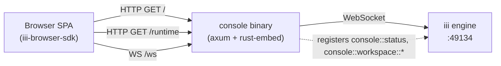

<div align="center">

# ade

**A single binary. A chat. A trace explorer. The whole [iii](https://github.com/iii-hq) engine in your browser.**

<p>
  <a href="#install"></a>
  <a href="../LICENSE"></a>
  <a href="https://www.rust-lang.org"></a>
  <a href="https://react.dev"></a>
  <a href="https://vitejs.dev"></a>
</p>

</div>

<p align="center">
  <a href="https://raw.githubusercontent.com/iii-hq/workers/main/ade/docs/images/console-traces.webp">
    
  </a>
</p>

## Notice: renamed from `console`

This worker used to be called `console`. Only its identity changed, so nothing that talks to it needs to be rewritten:

- worker name, binary, Cargo package and registry entry: `console` → `ade` (`iii trigger compose::add worker=ade`, `npx skills add iii-hq/workers --skill ade`)
- source directory: `console/` → `ade/`; dependents pin `ade` in their `iii.worker.yaml`
- unchanged on purpose: the `console::*` function ids (`console::status`, `console::ui-manifest`, `console::workspace::*`, …), the `iii::console::*` stream topics, the `console` configuration entry, and the `console:script` / `console:style` trigger types shared through `iii-console-ui` / `@iii-dev/console-ui`

## Install

```bash
iii trigger compose::add worker=ade
```

This resolves the worker, writes its declaration to `worker-compose.yaml`, and reconciles the Compose project.

## Quickstart

```bash
curl -fsSL https://install.iii.dev/iii/main/install.sh | sh
iii project init iii-app && cd iii-app
iii compose --up                 # engine on ws://127.0.0.1:49134
```

```bash
# New terminal, same folder
iii trigger compose::add worker=ade # UI + /ws proxy on :3113
open http://127.0.0.1:3113
```

The browser hits `/` for the SPA shell and upgrades `/ws` to the engine WebSocket — one origin, no CORS, no API base URL to configure.

### Bring up the chat stack

Chat runs on the [`harness`](https://github.com/iii-hq/workers/tree/main/harness) durable turn loop. Its manifest declares the whole stack as dependencies — [`session-manager`](https://github.com/iii-hq/workers/tree/main/session-manager) (the conversation store the sidebar, transcripts, and live token rendering are backed by), [`llm-router`](https://github.com/iii-hq/workers/tree/main/llm-router) (generation + the model catalog), [`context-manager`](https://github.com/iii-hq/workers/tree/main/context-manager) (the `/compact` summariser), [`approval-gate`](https://github.com/iii-hq/workers/tree/main/approval-gate) (human-in-the-loop approvals), and the provider workers — so a single command resolves and installs all of it:

```bash
iii trigger compose::add worker=harness
```

### Connect a model: the setup wizard

The provider workers install with the harness, but they need credentials before any model appears — until then the model picker reads **no models** and chat won't generate. The first time a person loads the ADE on a machine it opens a setup wizard that does this for you — never in a browser under automation (an e2e run, an agent's browser session), which gets the page it asked for. Reopen it any time from the command palette: **Set up the harness**.

1. **Your machine** — `console::onboarding::scan` looks for the Claude Code and Codex CLIs and whether each is signed in (presence and paths only, never a credential). With the [`secrets`](https://github.com/iii-hq/workers/tree/main/secrets) worker running, `secrets::detect` also looks for provider keys in your shell profile and the project's `.env`, and shows them masked (`sk-ant…9f2c`).
2. **Models** — recommends what that scan found: a signed-in Claude Code or Codex adds [`provider-claude-code`](https://github.com/iii-hq/workers/tree/main/provider-claude-code) / [`provider-openai-codex`](https://github.com/iii-hq/workers/tree/main/provider-openai-codex) and needs no key; a found key is imported by the secrets worker itself, and a pasted one is stored there. Either way only a reference, `secret://ANTHROPIC_API_KEY`, is written to the `llm-router` configuration, so no key lands in `./config`. Every other provider worker in the registry is listed too.
3. **Judge** (optional) — adds [`judge`](https://github.com/iii-hq/workers/tree/main/judge) with Jev ([`judge-typesafe`](https://github.com/iii-hq/workers/tree/main/judge-typesafe), its `TYPESAFE_API_KEY` behind a `secret://` reference) or a local judge, and explains where the harness uses it.
4. **Ready** — what is connected, every worker setup added, and a starter prompt for each thing worth trying first (a kanban board, calling your backend's functions, function search, the registry, triggers). A starter goes into the composer for you to read and send.

Nothing is added without a click: each step lists the exact actions it will run — `compose::add` with each worker and why, `secrets::import` / `secrets::set`, the configuration value written — and, once you continue, logs them live with the compose phase of each worker being added. Finishing or skipping is remembered per machine in `<data_dir>/onboarding.json` (`console::onboarding::get` / `::set`).

After setup, every place that takes a provider key uses the same field: **Configure** in the model picker (applied at once, then checked — a key the provider refuses lists no models and is flagged as such), **Settings → Workers → llm-router**, and **Settings → Workers → judge-typesafe** (both apply on Save). It shows the reference and the masked key with **Replace** and **Remove**, offers a key found on the machine, and moves a plain-text or `${VAR}` value into the secrets store. Injected worker forms get it as `host.components.SecretKeyField`. A configured provider that lists no models stays in the picker, so its key can be fixed from there.

Keys can still come from the environment: `llm-router` falls back to a provider's credential env var (e.g. `ANTHROPIC_API_KEY`), read in the router's own process — in the harness template that means the project's `.env` plus `iii trigger compose::restart worker=llm-router`. See [`llm-router`](https://github.com/iii-hq/workers/tree/main/llm-router#configuration) for the credential model.

Pick a model in the composer and send — the turn streams back through the harness loop.

<details>
<summary><strong>Programmatic check from the SDK</strong></summary>

```rust
use iii_sdk::{register_worker, InitOptions, TriggerRequest};
use serde_json::json;

#[tokio::main]
async fn main() -> anyhow::Result<()> {
    let iii = register_worker("ws://localhost:49134", InitOptions::default());

    let result = iii.trigger(TriggerRequest {
        function_id: "console::status".into(),
        payload: json!({}),
        action: None,
        timeout_ms: Some(5_000),
    }).await?;

    println!("{result:#?}");
    Ok(())
}
```

Returns `{ http_port, engine_url, version }` — useful for liveness and readiness probes.

</details>

## Why `console`

- **One port, one binary.** The React UI is baked into the executable with [`rust-embed`](https://docs.rs/rust-embed), and the engine WebSocket is reverse-proxied at `/ws` on the same origin. No CORS preflight, no side-car static server, no `dist/` directory to deploy. See [`src/assets.rs`](src/assets.rs) and [`src/proxy.rs`](src/proxy.rs).
- **Live engine, live UI.** Functions, models, traces, and chat sessions all stream over a single WebSocket via the iii browser SDK. Mention any registered function with `@`, switch models on the fly, and watch the trace appear in the panel next to you. See [`web/src/lib/iii-client.ts`](web/src/lib/iii-client.ts).
- **Built for production.** SIGINT *and* SIGTERM graceful shutdown (so `docker stop` and `kubectl delete` actually drain), URL credentials redacted from logs, immutable cache headers on content-hashed assets, and a fully self-contained binary with no runtime filesystem deps. See [`src/main.rs`](src/main.rs).

## Features

### Chat

A purpose-built agentic chat UI on top of [Lexical](https://lexical.dev). Lives in [`web/src/components/chat/`](web/src/components/chat).

- **Two modes** — `ask` and `agent` toggle right in the composer
- **Live model picker** — provider-grouped from `router::models::list`; static fallback (OpenAI, Anthropic, Google) when the catalog is unreachable
- **`@`-mentions** — one paged menu over every function registered against the engine _and_ the files under the session's working directory (the shell worker's `.gitignore`-aware quick-open search); a file pill carries an optional line window (`#file(src/a.ts:12-40)`), opens the shell explorer on those lines when clicked, and is what the shell's "Reference in chat" selection action inserts. A whole-file or folder pill is a reference — the token reaches the model as-is and the agent reads the file or lists the folder on demand; only a line window is read at send time and attached inline as an `<attached-file …>` block
- **`/compact` slash command** — summarises conversation history via the `context-manager` worker's `context::compact`, then persists a `compaction` custom session entry; the durable transcript is untouched — the marker renders from that entry and the summary anchors future turns (and the next `/compact`, which updates it in place instead of re-summarising from scratch). Text after the command — `/compact keep the schema decisions, drop the CSS detour` — is one-shot guidance for the summariser on what to keep, drop, or emphasise
- **Attachments** — multi-file picker with text/image previews
- **Function calls** — running / pending / error cards; consecutive calls collapse to the latest and expand as one tight stack, while rich code/screenshot displays, approvals, and live calls stay visible; intermediate agent prose summarizes the completed batch; pending approvals use **approve/deny** gating (`approval::resolve`)
- **Streaming** — abortable mid-flight; live thought stream removed from the DOM on completion
- **Markdown** — GFM, code blocks with [prism-react-renderer](https://github.com/FormidableLabs/prism-react-renderer), syntax-highlighted JSON inputs and outputs
- **Conversation sidebar** — create, inline rename, delete, auto-title from the first message
- **Context-usage meter** — token estimate with warn / danger thresholds and a `/compact` nudge
- **Session ID** — copyable, deep-links every conversation into the trace explorer via `iii.session.id`
- **Persistence** — conversations, active id, last model, sidebar state — all in `localStorage`

### Import local conversations

Use **Import conversations** in the chat sidebar to discover, preview, and select histories on the machine running ADE. Codex uses `CODEX_HOME` (default `~/.codex`); Claude Code uses `CLAUDE_CONFIG_DIR` (default `~/.claude`). A container needs read access to these directories. The browser's local filesystem is not scanned.

- Every import creates a new, independent, editable ADE session. Importing the same source again creates another copy. There is no subsequent synchronization with the original.
- Copies include user and assistant text, the commands the agent ran with their recorded output, original message timestamps, and available model metadata. Reasoning, attachments, and subagent histories are omitted. Source files are never changed.
- Commands become the console's own function rows: Codex `CommandExecution`, `FileChange`, `McpToolCall`, and `WebSearch` items, and Claude Code `tool_use`/`tool_result` blocks, are stored as `function_call` blocks with matching `function_result` entries. They keep the source's tool names (`exec`, `apply_patch`, `Bash`, `Read`, …) and never re-run. Planning comes across too: Codex `update_plan` calls become function rows with their recorded output, a Codex plan-mode proposal (its latest revision) becomes an assistant message, and Claude Code's `TodoWrite` and `ExitPlanMode` calls are carried like any other tool. Results the source filed on a sibling branch of a parallel batch are placed right after the call they answer.
- Choose an ADE model and working directory to continue through the normal composer. The original project path is provenance only and grants no filesystem access. Rename, compact, and delete work normally.
- Native readers support Codex 0.154.0 completed-item events and Claude Code's main conversation branch (checked against Claude Agent SDK 0.3.173). Older Codex histories without completed-item events and rewound Codex histories are unsupported; discovery reports skipped histories.
- Discovery is paginated and reads files incrementally. Preview shows the last 50 messages; import copies the full history.

Deploy the matching ADE and Harness changes so a session with imported history and no prior turn requires its initial ADE model and working directory. Sessions that explicitly carry `read_only: true` remain protected.

### Traces

Full-fledged OpenTelemetry explorer over `engine::traces::*` and `engine::logs::list`. Lives in [`web/src/pages/TracesV2/`](web/src/pages/TracesV2).

- **Live timeline strip masthead** — every span streamed in real time, with a shared funnel as the volume control
- **Two detail visualizations** — lane timeline (same visual grammar as the strip) and a waterfall tree virtualized for huge traces
- **Rich filtering** — status, time presets, min/max duration, arbitrary attribute key/value pairs, debounced free-text search, saved views
- **Group by** — server-side aggregation with lazy per-group member expansion
- **Span detail tabs** — info, attributes, events, errors, OTel logs, context (baggage), links
- **Live streaming** — spans append over iii streams (`iii:devtools:*`) instead of polling; one seed read, then append

### Worktrees

The human window into the [`worktree`](https://github.com/iii-hq/workers/tree/main/worktree) worker: parallel agent checkouts, ownership, and land outcomes. Lives in [`web/src/pages/Worktrees/`](web/src/pages/Worktrees) and [`web/src/components/chat/`](web/src/components/chat). The whole surface is presence-gated: it appears only while the worktree worker is connected to the engine (the nav entry and picker tab hide; a direct `#/worktrees` hit lands on an install notice).

- **Graph page** (`#/worktrees`) — repo, worktree, and owning-session nodes from `worktree::list { include_status: true }`, refreshed live off all six `worktree::*` lifecycle trigger types (poll fallback while bindings are unavailable), with a per-worktree detail panel: branch, base, advisory dev port, clean / ahead / behind, diffstat, and the integrated marker for squash- or rebase-landed branches
- **Picker tab** — the chat working-directory picker grows a **worktrees** tab next to directory browsing: picking a managed worktree validates the path and claims it for the conversation's session; the console-made claim auto-releases when the conversation points elsewhere (best-effort; the worker's prune sweep is the durable backstop). Worktrees with a land in progress are listed but not retargetable
- **Working-dir badge** — a conversation rooted in a managed worktree shows branch, short id, dirty `*` / ahead `+n` indicators, and a lifecycle dot instead of the plain path chip; the raw path stays reachable as the tooltip
- **Live land notices** — `worktree::landed` / `worktree::land-blocked` events surface in the chat as notices (target branch and merged sha, or the block reason and conflicted files) and refresh the badge

### Memory

The human window into the [`memory`](https://github.com/iii-hq/workers/tree/main/memory) worker: named banks of always-injected markdown rules and auto-extracted memories. Lives in [`web/src/pages/Memory/`](web/src/pages/Memory). Presence-gated like Worktrees: the page appears only while the memory worker is connected (a direct `#/memory` hit lands on an install notice).

- **Bank rail** — every bank with live memory / pinned / rule counts and inline create
- **Rules tab (first)** — the bank's markdown rules as in-place editors (save appears only on edit; delete asks to confirm); the agent appends learned standing instructions to the auto-managed `learned` rule as you correct it in chat
- **Memories tab** — server-paged newest-first list with pin / edit-in-place / tombstone delete, a show-history toggle, and search that runs `memory::recall` (the ranked scorer, not a client filter)
- **Graph tab** — entity hubs with memories as spokes: level-of-detail for large banks, draggable nodes, wheel zoom/pan, click a node for an inspect card
- **Preview tab** — the whole turn before it happens: `memory::preview` composes the exact system-prompt rules section and the appended memories (ambient floor + budgets applied) for a hypothetical question, with clickable example questions from the bank's own content
- **Live** — the page re-reads off `memory::item-changed` / `memory::bank-changed` (poll fallback), so memories appear the moment they're learned
- **In chat** — a bank picker in the composer (session metadata `memory_bank`) and a memory chip on each assistant reply naming the bank, how many rules and memories fed the turn, and whether recall ran semantic; click it to expand the exact records

### Live catalogs

The composer's `@`-mentions and the model picker pull from the engine in real time.

- `coder::search` (shell worker, path-only, fuzzy, `respect_gitignore`, no dot-entries) — the files half of the `@` menu, one call per settled keystroke → [`web/src/lib/file-search.ts`](web/src/lib/file-search.ts)
- `engine::functions::list` — TTL-cached function list (`VITE_FUNCTIONS_LIST_CACHE_MS`, default 10s) → [`web/src/lib/functions-catalog.ts`](web/src/lib/functions-catalog.ts)
- `router::models::list` — provider-grouped model catalog, refreshed live off the `router::models::changed` trigger type → [`web/src/lib/models-catalog.ts`](web/src/lib/models-catalog.ts)

### Theming

Light and dark themes via `data-theme` + CSS custom properties. Persisted to `localStorage` with an inline init script in `index.html` to prevent flash-of-wrong-theme on first paint.

### Worker SDK surface

`console` registers a health probe for `iii worker info` smoke tests, plus the workspace functions that let an agent show the human a screen next to the conversation:

| Function | Input | Output |
|---|---|---|
| `console::status` | `{}` | `{ http_port, engine_url, version }` |
| `console::workspace::list` | `{}` | `{ tabs: [{ id, name?, columns, screens, sizes, active }], active_tab_id }` |
| `console::workspace::open` | `{ screen, session_id?, relative_to?, direction?, sizes?, activate? }` | `{ tab_id, column, placement, screens, sizes, activated }` |
| `console::workspace::close` | `{ screen, session_id? }` | `{ tab_ids }` |
| `console::workspace::get` (internal) | `{}` | `{ value, path }` — the raw layout document and the file it lives in |
| `console::workspace::set` (internal) | `{ value, expected_revision? }` | `{ ok }` — replaces the document wholesale (the SPA's read-modify-write path). Every write stamps the document's `revision`; with `expected_revision` older than the stored one, nothing is written and the call fails `WORKSPACE_CONFLICT` |

A screen is `chat`, `chat:<session-id>`, `traces`, `workers`, or `ext:<page-id>` for a worker page (`ext:ide`, `ext:browser`, `ext:editor`, ...). Call `open` with `{ screen: "chat", session_id: "<id>" }` to open a panel pinned to one conversation; the structured input is persisted as `chat:<session-id>`, and opening that exact session again reuses its existing panel. The workspace layout is stored by the console worker in `<data_dir>/workspace.json` (`data_dir` is a `console` configuration setting, default `data/ade`) and every write rings the `console::workspace::changed` trigger type (empty config, empty event: re-read with `list`), which each browser pointed at this engine binds to pick the change up at once (every binding is also rung once as it registers, which catches a browser up after its first read and after each reconnect; a tab polls only until that first ring arrives, and re-reads when it regains focus); it is ephemeral per-instance state and is deliberately kept out of the committed configuration YAML. `open` stays on the active tab when it already shows the screen, else switches to the tab that does, else places the screen beside an anchor column (adjacent empty column, any empty column, new column), else opens a fresh tab; `placement` reports which (`existing`, `empty_column`, `new_column`, `new_tab`). The anchor is `relative_to` — a screen in the same vocabulary, defaulting to `chat`, which matches whichever chat panel the active tab shows — and `direction` (`right`, the default, or `left`) picks the side of it. A named anchor (anything but `chat`) is looked for in every tab, the active one first, because the active pointer is whichever browser clicked last; an anchor mounted nowhere puts the column at the end of the active tab. `activate` (default `true`) stamps a function activation every time, pointer moved or not, so every open console switches to the tab holding the screen. `sizes` sets the tab's column widths — one positive number per column of the tab AFTER the call, normalized by their sum — in the same write that places the screen, so no other writer can land between placement and sizing; `list` reports the current widths to compute them from, and a list that does not match the column count fails with `WORKSPACE_INVALID_SIZES` rather than being ignored. It never replaces a mounted screen. `close` detaches the screen everywhere it is mounted and is idempotent; pass the same `screen: "chat"` and `session_id` to close one pinned conversation panel. Unknown screens fail with `WORKSPACE_INVALID_SCREEN`; an unreadable or unwritable `data_dir` with `WORKSPACE_UNAVAILABLE`.

Defined in [`src/functions/status.rs`](src/functions/status.rs) and [`src/functions/workspace.rs`](src/functions/workspace.rs); the file store is [`src/workspace_store.rs`](src/workspace_store.rs).

### Workers screen and the compose project

The `workers` screen lists every worker the compose daemon runs, grouped into what needs attention, registry packages and local-path workers, plus the workers connected to the engine outside compose. A container opens on its followed log (`compose::logs`), its Source (pin another registry version through `compose::add`, which restarts only that container, or point a local worker at another checkout), its Settings (run script, `start_after`, environment, `config_override`) and, while connected, the functions it registered. The project view shows the start order, which packages have newer releases, the compose file and the daemon; **Add worker** declares one from the registry or a local directory. Lifecycle is the daemon's own `compose::*` functions; `add`, `update` and `remove` run as compose operations the page follows with `compose::operation`. A change restarts only the container it touches (a Settings edit to a registry package restarts it explicitly, since compose only bounces a package whose version changed); because compose brings every declared container up after an add or a remove, the page names the stopped ones first.

The console adds what the daemon does not expose, read from the compose file and this host (the console runs beside the daemon):

| Function | Input | Output |
|---|---|---|
| `console::compose::project` | `{ file? }` | The compose file as declared: namespace, engine endpoint, timeouts, each container's source, version, `start_after`, environment keys and run script |
| `console::compose::versions` | `{ container? , name?, file? }` | `{ container, reference, declared, versions: [{ version, tags, created_at }] }` from the registry, newest first |
| `console::compose::search` | `{ query }` | `{ workers: [{ name, version, description, dependencies }] }`; engine workers are left out |
| `console::compose::inspect` | `{ path, run? }` | `{ path, exists, manifest, run_found, checkouts, workers }`: a directory's `iii.worker.yaml`, whether a relative run command is built, its git checkouts (branch, HEAD commit time, uncommitted changes), or the workers inside a folder |
| `console::compose::container` | `{ container, file? }` | One declaration; literal values whose names look like credentials are masked |
| `console::compose::edit` | `{ container, worker?, run?, start_after?, environment?: { set, unset }, config_override?, file? }` | The accepted `compose::add` operation. The change merges with the declared entry, so masked values keep their file values; a new path must keep the container's name |

`console::compose::changed` fires when the daemon writes `state.json` or the compose file changes (bind with an empty config; the event carries `kind`, `file`, `namespace`, `state_dir`, `path`, `captured_at`). Defined in [`src/compose/`](src/compose/).

## Architecture



`console` is a thin HTTP server. It serves the embedded SPA bundle and
runtime connection settings, hosts injected worker UI assets, and transparently
proxies `/ws` to the iii engine. The browser only ever talks to one origin.

## Configuration

Console registers a `console` entry with the central `configuration` worker.
Its `http_port` value is authoritative after first registration: Console reads
it before binding, watches `configuration:updated`, and moves the listener live
when the port changes. The replacement port is bound and started before the old
listener is gracefully drained; a failed bind keeps the previous listener and
port active.

The local `config.yaml` is a first-registration seed and a fallback for direct
runs where the configuration worker is unavailable:

```yaml
http_host: 0.0.0.0    # HTTP bind address (default: all IPv4 interfaces)
http_port: 3113       # initial port seed for the UI + /ws (default: 3113)
injectable_ui: true   # kill switch for runtime-injected worker UI (default: true)
data_dir: data/ade    # ephemeral per-instance state: the workspace layout (default: data/ade)
```

| Key | Default | Description |
|---|---|---|
| `http_host` | `0.0.0.0` | HTTP bind address; set `127.0.0.1` for local access only. Applied at startup |
| `http_port` | `3113` | Initial TCP port seed for `/`, `/assets/*`, and `/ws`; the stored `console.http_port` wins thereafter |
| `injectable_ui` | `true` | When `false`, skips the `console:script` / `console:style` / `console:module` / `console:assets` trigger types, the `/ui` + `/vendor` routes, and the SPA loader (`console::ui-manifest` answers `disabled: true`) |
| `data_dir` | `data/ade` | Initial seed for the directory holding ephemeral per-instance state — the workspace tabs/panes layout (`workspace.json`). Relative paths resolve against `III_COMPOSE_DIR` (or the process directory outside Compose); absolute and `~/` paths keep their meaning. The stored `console.data_dir` wins thereafter |

The configuration entry also stores UI preferences and
`injectableUi.disabledWorkers`. Port, `data_dir` and per-worker UI changes apply
without a Console restart; the local `injectable_ui` kill switch remains
startup-only.

The workspace layout itself (tabs, panes, active tab) is **not** part of the
entry: it changes on every click, and the configuration YAML is meant to be
committed. It lives in `<data_dir>/workspace.json` (atomic writes; a missing
or unreadable file starts from the default chat + traces tab). Entries written
by older Console versions still carry a `workspace` section — on boot the
worker imports it into the file once (unless the file already exists) and
removes it from the entry.

### CLI flags

| Flag | Default | Description |
|---|---|---|
| `--config <path>` | `./config.yaml` | Path to the first-registration YAML seed/fallback |
| `--url <ws://…>` | `ws://127.0.0.1:49134` | iii engine WebSocket URL (`DEFAULT_ENGINE_URL` in [`src/config.rs`](src/config.rs)) |
| `--http-host <address>` | from seed | Overrides the YAML bind address; applied at startup |
| `--http-port <port>` | from seed | Overrides the YAML port seed; an existing configuration-worker value still wins |
| `--manifest` | — | Print the publish manifest as JSON and exit (used by the registry pipeline) |

## Routes

| Path | Behavior |
|---|---|
| `GET /` | Embedded `index.html` (SPA shell, hash-routed client-side). `Cache-Control: no-cache, must-revalidate` |
| `GET /assets/*` | Embedded JS / CSS, content-hashed filenames. `Cache-Control: public, max-age=31536000, immutable` |
| `GET /runtime` | Runtime connection settings for the SPA, including the console worker namespace. `Cache-Control: no-store` |
| `GET /ui` | Injected-asset manifest JSON (same shape as `console::ui-manifest`). `no-cache` |
| `GET /ui/*` | Current bytes for a registered injected UI asset. `no-cache` + `ETag: "<hash>"` (304 on `If-None-Match`) |
| `GET /vendor/*` | Shared-dep ESM shims for injected scripts (react, `@iii-dev/console-ui`), generated at web build time. `no-cache` |
| `GET /ws` (Upgrade) | WebSocket upgrade; transparent proxy to `engine_url` (drops browser-originated `registertriggertype` frames; stamps `metadata.internal` on `registerfunction`) |
| anything else | `404 Not Found` |

The SPA bundle is embedded into the binary at compile time via [`rust-embed`](https://docs.rs/rust-embed) — the released `console` has no separate `dist/` directory, no side-car asset server, and no runtime filesystem dependency for the UI.

## Injectable UI

Workers extend the console at **runtime** — whole pages, function-trigger
renderers, and layered trigger-activity renderers as plain React
components sharing the console's React instance
(spec: `iii/tech-specs/2026-07-17-injectable-ui`). The console owns four
injectable-UI trigger types:

| Type id | Registered by | Carries |
|---|---|---|
| `console:script` | workers | an ESM script asset; `config.path` (e.g. `state/page.js`) is its identity — re-registering a path overrides it (hot reload) |
| `console:module` | workers | an ESM module served at `/ui/<path>` like a script (`.js`, same cap and per-worker toggle) but never imported at mount: a script loads it with `host.importModule(path)` (the ide's xterm terminal). Manifest and pushes carry it as kind `module` |
| `console:style` | workers | a CSS asset, applied as a `<link>` swap |
| `console:assets` | console tabs | the live-update subscription the console pushes `sync`/`set`/`delete` events to |

The trigger's `function_id` is the worker's *content function*
(`{path} → {content, content_type?}`); the console fetches over the bus,
hashes, serves from `/ui/*`, and pushes invalidations so every open tab
disposes the old module and re-imports the new one. Injected scripts default-
export `setup(host)` and register through `host.pages` (whole pages, opened
through `host.panels.open` or `console::workspace::open`; built-in screens open through `host.panels.openScreen` (below); `#/worker/<scope>/<id>`
renders one alone), `host.functionTriggers` (function-trigger message renderers —
injected renderers dispatch before the built-in families, so matching a
built-in id overrides it; `metadata.display` promotes the winning renderer's
rich result into the collapsed chat flow), `host.triggerRenderers` (override
the compact timeline display, expanded details, source section, and raw-data
redaction for normalized registration/fired/retirement activities, with host
fallbacks for every slot), and
`host.configForms` (provide the deliberate form body for one configuration id
inside global Settings; dirty/save/reset and schema validation stay
host-owned). There is no generic schema-generated form fallback. A
configuration form can opt into `{ layout: 'full' }` to receive the entire
available editor width and height; contained layout remains the default.
Renders are fenced by an ErrorBoundary and scoped under
`data-iii-ui="<worker>"`. `console::ui-manifest` (internal) lists the
loadable assets. The `state` worker's `ui/` directory is the broad delivery
reference; `cron/ui/` is the trigger-activity renderer reference.

## Tech stack

| Layer | Choice |
|---|---|
| Web server | [axum 0.7](https://github.com/tokio-rs/axum), [tokio](https://tokio.rs), [tokio-tungstenite](https://github.com/snapview/tokio-tungstenite) |
| Asset embedding | [`rust-embed` 8](https://docs.rs/rust-embed), [`mime_guess`](https://docs.rs/mime_guess) |
| Worker SDK | [`iii-sdk` 0.19.4](https://docs.rs/iii-sdk) |
| UI framework | [React 19](https://react.dev), [Vite 8](https://vitejs.dev), [TypeScript 6](https://www.typescriptlang.org) |
| Styling | [Tailwind CSS v4](https://tailwindcss.com), [Radix UI](https://www.radix-ui.com), [`class-variance-authority`](https://cva.style), [lucide-react](https://lucide.dev) |
| Editor | [Lexical 0.44](https://lexical.dev) |
| Data fetching | [TanStack Query 5](https://tanstack.com/query) |
| Trace graphs | [`@xyflow/react` 12](https://reactflow.dev) + [dagre](https://github.com/dagrejs/dagre), [TanStack Virtual](https://tanstack.com/virtual) |
| Markdown | [react-markdown](https://github.com/remarkjs/react-markdown) + [remark-gfm](https://github.com/remarkjs/remark-gfm), [prism-react-renderer](https://github.com/FormidableLabs/prism-react-renderer) |
| Browser SDK | [`iii-browser-sdk` 0.21.6](https://www.npmjs.com/package/iii-browser-sdk) |

<details>
<summary><strong>Build from source (contributors only)</strong></summary>

`cargo build` runs `pnpm install --frozen-lockfile && pnpm build` inside [`web/`](web/) automatically when the `web/dist/` bundle is missing or stale (Node + pnpm must be on `PATH`). To pre-build the bundle once and skip the embedded-asset rebuild loop:

```bash
cd web && pnpm install && pnpm build && cd ..
cargo build --release
```

Escape hatches (see [`build.rs`](build.rs)):

- `SKIP_WEB_BUILD=1` — skip the JS build step entirely; the existing `web/dist/` (if any) is embedded as-is. Useful in CI when the bundle was built in a previous stage.
- `PNPM=/path/to/pnpm` — override pnpm discovery.

Run the test suite:

```bash
cargo test                          # unit + manifest + e2e (e2e self-skips if `iii` isn't on PATH)
cd web && pnpm test                 # vitest
cd web && pnpm typecheck && pnpm lint
```

</details>

## License

Apache 2.0 — see [LICENSE](https://github.com/iii-hq/workers/blob/main/LICENSE).
