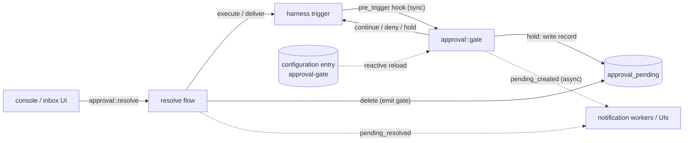

# approval-gate architecture

Reference documentation for the `approval-gate` worker — the policy and
decision surface for human-held function calls specified in
[tech-specs/2026-06-agentic/approval-gate.md](../../tech-specs/2026-06-agentic/approval-gate.md).
These documents are written to be sufficient on their own: a reader (human or
LLM) should be able to maintain the worker or integrate against it without
opening the source.

## Document map

| Document | Audience | Read it when |
|---|---|---|
| [internals.md](internals.md) | Maintainers of this worker | You are changing approval-gate itself: the evaluation order, the pending-record lifecycle, the emit gate, redaction, configuration reload. |
| [integration.md](integration.md) | Authors of other workers / clients | You are building something that calls `approval::*` or binds its trigger types — the console, a notification worker, the harness (once its hook surface lands). This file is the handoff contract. |
| [permissions-source.md](permissions-source.md) | Operators / integrators | You need to know where permission truth lives and how harness and the console consume the single `approval-gate` rules list. |

The unit suites beside each module and the engine-backed scenarios in
[../tests/integration.rs](../tests/integration.rs) are the executable
companion: the seven prior-art permission-matrix cases, the fail-closed
rows, and the exactly-once emission contract are all pinned by tests.

## The system in one paragraph

approval-gate decides, for one function call at a time, whether a human must
be involved — and routes the human's answer back to the parked turn. It is a
`pre_trigger` hook (`approval::gate`) that answers `continue` / `deny` /
`hold` from a per-session permission model (mode + two allow-lists) with an
inline config-`rules` fallback; a decision plane (`approval::resolve` + settings RPCs,
human/console-only); and an **ephemeral** pending inbox (state scope
`approval_pending`, two custom trigger types) that exists only while calls
are held. It never executes the held function itself — on allow it asks the
harness to release the call through its own trigger pipeline
(`harness::function::resolve`, `action: "execute"`); on deny it
delivers an `is_error` result. No decision history is kept: the transcript
and the `pending_resolved` event are the audit trail, and every state record
this worker writes has an explicit deletion path (resolve, turn abort,
session delete). Holds do not expire.

## Vocabulary

| Term | Meaning |
|---|---|
| **hold** | The gate's hook answer that parks the call: the harness checkpoints it `pending` with `held_by`, the turn parks, and the inbox record is the human-facing handle. |
| **pending record** | `approval_pending/<session_id>/<function_call_id>` — self-describing, redacted, ephemeral; exists only while the call is held. |
| **emit gate** | The rule that whoever observes the record's live value at deletion (and only them) emits `pending_resolved` — exactly-once across racing deletion paths. |
| **mode** | Per-session permission mode: `manual` (default) / `auto` / `full`. |
| **`approved_always`** | Per-session grants from an approval prompt; honoured in **every** mode (remembered human decisions). |
| **`always_allow`** | Curated trust list (seeded from the deployment's `always_allow_seed`); consulted **only in auto mode**, dormant under manual. |
| **lazy seeding** | Settings records materialize on first mutation only; reads compute effective settings from configuration defaults in memory. |

## Standalone status

The harness contracts this worker binds (`harness::hook::pre-trigger`,
`harness::function::resolve`, `harness::turn-completed`) are specified in
harness.md but not implemented by the current harness. All bindings are
best-effort: the worker boots and serves its full RPC + trigger surface
without them, and the integration suite fakes them. See
[integration.md § Harness contract](integration.md#harness-contract).
