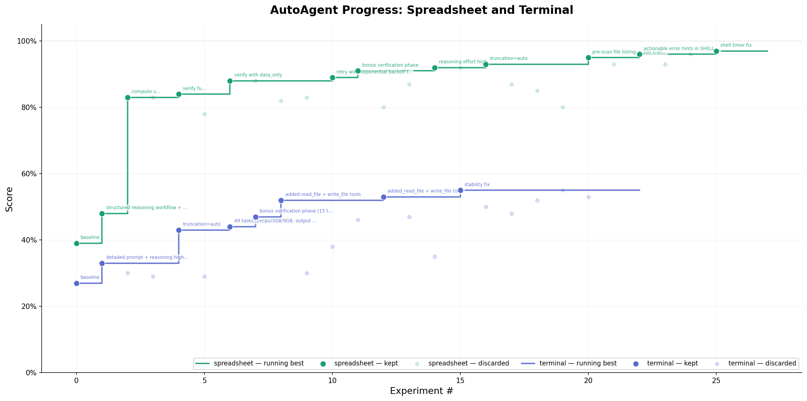

# autoagent-iii

> Like autoagent but with structured experiment tracking, parallel execution, adaptive search, and real-time monitoring — all powered by [iii-engine](https://github.com/iii-hq/iii-engine) Worker/Function/Trigger primitives.

Give an AI agent a task, let it build and iterate on an agent harness autonomously overnight. It modifies the system prompt, tools, agent configuration, and orchestration, runs the benchmark, checks the score, keeps or discards the change, and repeats. The difference from vanilla [autoagent](https://github.com/kevinrgu/autoagent): every experiment is tracked in a structured state store, the search strategy adapts automatically, failures are diagnosed across runs, and you get 33 REST endpoints for live monitoring.



## Why This Exists

The original autoagent is a great idea executed simply: single file harness, `results.tsv`, hill-climbing, Docker isolation. It works. But after watching it run overnight you notice the gaps:

**You can't query experiment history.** The TSV is append-only. Want to find all experiments that touched the system prompt and improved? Grep through a flat file. Want the keep rate for the last 10 runs? Count lines manually.

**You can't run tasks in parallel.** One task at a time, one experiment at a time. With 50+ benchmark tasks, each taking 2-5 minutes, a single experiment cycle takes hours. Multiple GPUs or runners sit idle.

**The search is blind.** Hill-climbing treats every experiment equally. It doesn't know that "tools" changes have a 40% keep rate while "system_prompt" changes have 5%. It doesn't notice that two near-misses in different categories could be combined. It doesn't switch from exploration to exploitation when the score plateaus.

**Crashes are silent.** If the agent breaks the harness (bad import, infinite loop, OOM), the meta-agent just sees "it didn't work" and tries again. Three crashes in a row? Same treatment as three failed experiments. No abort, no signal to the meta-agent to try something safer.

**No failure analysis.** If task 7 fails in every single experiment, the meta-agent doesn't know. It keeps trying random changes instead of focusing on what's actually broken.

autoagent-iii fixes all of these by replacing the flat-file state with iii-engine's Worker/Function/Trigger primitives. The same experiment loop, the same Docker isolation, the same single-file harness — but with infrastructure that makes the loop smarter.

## How It Works

The repo has a few files and directories that matter:

- **`agent.py`** — the entire harness under test in a single file. Config, tool definitions, agent construction, orchestration, and the Harbor adapter boundary. The adapter section is marked as fixed; everything above it is the edit surface for the meta-agent.
- **`agent-claude.py`** — alternative harness using the Claude Agent SDK instead of OpenAI.
- **`program.md`** — instructions for the meta-agent and the directive (what kind of agent to build). This file is edited by the human.
- **`tasks/`** — evaluation tasks in [Harbor](https://github.com/laude-institute/harbor) format. Three sample tasks are included.
- **`workers/orchestrator/`** — Python worker that registers 33 functions with iii-engine for experiment tracking, task execution, search strategy, harness management, runner pooling, and reporting.
- **`workers/runner/`** — Rust worker that executes tasks inside Docker containers, captures ATIF trajectories, and parses scores.
- **`iii-config.yaml`** — iii-engine runtime configuration (state store, REST API, PubSub, cron, OpenTelemetry).
- **`plot_progress.py`** — generates the progress chart above from experiment history via the iii REST API.
- **`bench.sh`** — one-command benchmark runner that handles the full cycle: setup tag, register experiment, run all tasks, record results, show summary and suggestions.

The metric is total **score** produced by the benchmark's task test suites. The meta-agent hill-climbs on this score, but with guidance: the orchestrator tells it which categories to explore, which near-misses to combine, and when to switch from exploration to exploitation.

## Architecture

```
+------------------------------------------------------------+
|  Meta-Agent (Claude, GPT-5, Codex, etc.)                   |
|  Reads program.md, modifies agent.py, runs experiments     |
|  Uses iii REST API (localhost:3111) for everything          |
+----------------------------+-------------------------------+
                             | HTTP
          +------------------v--------------------+
          |  iii-engine                            |
          |  State KV . REST API . PubSub . Cron  |
          +--------+-----------------+------------+
                   |                 |
    +--------------v---+   +---------v-------------+
    |  Orchestrator     |   |  Runner Workers       |
    |  (Python)         |   |  (Rust)               |
    |  33 functions     |   |  Docker containers    |
    |  33 HTTP triggers |   |  ATIF trajectories    |
    +------------------+   +-----------------------+
```

The orchestrator is the brain. It connects to iii-engine over WebSocket and registers 33 functions across six groups, each exposed as an HTTP endpoint:

| Group | Functions | What it does |
|-------|-----------|-------------|
| `experiment::*` | 7 | Lifecycle management. Setup tags, register experiments with hypotheses and categories, record results with auto keep/discard, track crashes with consecutive counting and auto-abort, query history and best results, detect near-misses within threshold of the current best. |
| `task::*` | 5 | Benchmark execution. List available tasks, run individual tasks via Harbor, batch-run all tasks with configurable concurrency, retrieve per-task scores, surface failures with stdout/stderr tails. |
| `search::*` | 4 | Adaptive strategy. Get the current search mode, override it manually, auto-adapt based on keep rate / crash rate / plateau detection / near-miss availability, suggest concrete next directions with category stats and failure patterns. |
| `harness::*` | 5 | Harness management. Read the current agent.py with editable-region detection, diff against previous commit, save named snapshots to the KV store, restore any snapshot to disk (auth-protected), list all snapshots. |
| `pool::*` | 7 | Runner pool. Register Docker runners, heartbeat to stay alive, reap stale runners via cron, list all runners with status, atomically acquire an idle runner for an experiment, release when done, deregister on shutdown. |
| `report::*` | 5 | Monitoring and export. Full summary with stats and score progression, TSV export in original autoagent format, per-task diff between any two experiments showing regressions and improvements, top-N leaderboard, list all tags. |

The runner workers are optional. They connect to the same iii-engine, register themselves in the pool, and execute tasks inside Docker containers with resource limits (`--memory 2g --cpus 2 --pids-limit 256 --read-only`). The orchestrator can also run tasks directly via Harbor's CLI without the Rust runner.

## The Experiment Loop

This is the same loop as autoagent, but with structured API calls instead of file manipulation:

**Step 1: Get search guidance.** The meta-agent calls `POST /api/search/suggest` which returns the current strategy mode (explore, exploit, combine, or ablation), category-level statistics showing which types of changes have the highest keep rates, a list of underexplored categories, available near-misses for combination, recently recurring failure tasks, and concrete English-language suggestions for what to try next.

**Step 2: Modify agent.py.** The meta-agent edits the editable section of the harness — the system prompt, tools, agent construction, orchestration logic. One change per experiment to isolate variables. Each change is classified into a category: `system_prompt`, `tools`, `orchestration`, `model_selection`, `error_handling`, `context_management`, `output_parsing`, `multi_step_planning`, `simplification`, `combination`, `ablation`, or `other`.

**Step 3: Commit and register.** `git add agent.py && git commit`, then `POST /api/experiment/register` with the tag, hypothesis, description, category, commit SHA, and diff summary. The orchestrator assigns an experiment ID and appends it to the lineage for the tag.

**Step 4: Run the benchmark.** `POST /api/task/batch` with the experiment ID. The orchestrator runs all tasks with configurable concurrency (default 4), collects scores, and returns passed count, total tasks, aggregate score, and per-task scores.

**Step 5: Record results.** `POST /api/experiment/complete` with the scores. The orchestrator compares against the current best for the tag. If the passed count improved, or the passed count is equal but the aggregate score is higher, the experiment is marked "keep". Otherwise "discard". Near-misses — experiments within 1 passed task and 0.02 aggregate score of the best — are tracked separately for future combination. The response tells the meta-agent: `"action": "keep_commit"` or `"action": "git_reset"`.

**Step 6: Act on the decision.** If keep, advance. If discard, `git reset --hard HEAD~1`. If 3+ consecutive crashes, stop and rethink.

**Step 7: Repeat from step 1.** The search strategy auto-adapts after each experiment. The loop runs until the human interrupts or the budget cap (default 200 experiments) is reached.

## Search Strategy Adaptation

The system doesn't just hill-climb blindly. After each experiment, `search::adapt` evaluates the last 10 experiments and transitions between four modes:

**Explore** is the default. The meta-agent is encouraged to try changes in underexplored categories, attempt radical architectural changes, and experiment broadly. This mode activates when the keep rate is moderate and no pathological patterns are detected.

**Exploit** activates when the keep rate exceeds 30% — the current direction is working, so the system suggests doubling down on high-yield categories with incremental tweaks. It also activates when the crash rate exceeds 50%, switching to conservative changes to stabilize.

**Combine** activates when the system detects a plateau (zero keeps in the last 15+ experiments) but has accumulated two or more near-misses. Near-misses are experiments that almost beat the best — within 1 task and 0.02 score. The system suggests merging ideas from the top near-misses, because each was close independently and their combination might push over the threshold.

**Ablation** activates during a long plateau with no near-misses. When nothing is working and there's nothing close to combine, the system suggests removing components one at a time to identify what's actually contributing. Simplification that maintains score is valuable — it means the removed component was dead weight.

## Near-Miss Detection

Most experiment frameworks treat "didn't beat the best" as a binary failure. autoagent-iii tracks near-misses: experiments that came close but didn't quite make it. The threshold is configurable (`NEAR_MISS_THRESHOLD`, default 0.02 aggregate score and 1 passed task).

Near-misses matter because they represent partially successful ideas. An experiment that adds a file-reading tool might fail because it slightly regresses on tasks that don't need file reading, but it dramatically improves on tasks that do. Another experiment that adds a verification step might fail for a different reason. Combining both — file reading plus verification — might beat the best on all fronts.

The `search::suggest_direction` endpoint surfaces near-misses and their categories, hypotheses, and diff summaries, making it easy for the meta-agent to find complementary ideas.

## Failure Pattern Detection

Each experiment records per-task scores, not just an aggregate. The orchestrator maintains a running count of how often each task fails across all experiments. If task "complex-git-merge" fails in 90% of experiments, that's surfaced in `search::suggest_direction` as a recurring failure pattern.

This changes the meta-agent's behavior. Instead of making random improvements and hoping they help, it can focus on the specific tasks that are dragging down the score. `POST /api/task/failures` returns the failed tasks for any experiment with their stdout/stderr tails, so the meta-agent can diagnose why a specific task fails and target its fix.

`POST /api/report/diff` compares any two experiments at the task level, showing exactly which tasks regressed and which improved. This is critical for understanding whether a change that improves the aggregate score actually introduced regressions on previously-passing tasks.

## Quick Start

Requirements: Docker, Python 3.10+, [iii-engine](https://github.com/iii-hq/iii-engine), [Harbor](https://github.com/laude-institute/harbor), and whatever model-provider credentials your agent harness requires.

```bash
# Install Harbor
uv tool install harbor

# Clone and enter
git clone <this-repo>
cd autoagent-iii

# Set up credentials
cat > .env << 'EOF'
ANTHROPIC_API_KEY=sk-ant-...
EOF

# Build base Docker image
docker build -t autoagent-base -f Dockerfile.base .

# Start iii-engine (terminal 1)
iii --config iii-config.yaml

# Start orchestrator (terminal 2)
cd workers/orchestrator && python3 orchestrator.py

# Run the benchmark (terminal 3)
./bench.sh apr06
```

The `bench.sh` script handles the full cycle: sets up the tag, registers the experiment, runs all tasks via Harbor, records results into the orchestrator, shows the summary, and prints suggestions for the next experiment.

To run the meta-agent loop autonomously:

```bash
# Point your coding agent at the repo
claude -p "Read program.md and let's kick off a new experiment!"
```

The meta-agent reads `program.md`, inspects the current harness, runs the benchmark, diagnoses failures, modifies `agent.py`, and iterates. It uses the iii REST API for everything — no file parsing, no manual score tracking, no blind guessing.

## Adding Tasks

Each task is a self-contained directory under `tasks/` following [Harbor's task format](https://harborframework.com/docs/tasks):

```
tasks/my-task/
  task.toml           -- config (timeouts, resources, metadata)
  instruction.md      -- the prompt sent to the agent
  tests/
    test.sh           -- verifier entry point, writes reward to /logs/verifier/reward.txt
  environment/
    Dockerfile        -- task container (FROM autoagent-base)
```

The `task.toml` configuration controls timeouts, resource limits, network access, and environment variables:

```toml
schema_version = "1.1"

[task]
name = "autoagent/my-task"
description = "What the task tests"

[agent]
timeout_sec = 300.0

[environment]
cpus = 2
memory_mb = 4096
allow_internet = true

[environment.env]
ANTHROPIC_API_KEY = "${ANTHROPIC_API_KEY}"
```

The test script runs inside the container after the agent finishes. It checks the agent's work and writes `0` (fail) or `1` (pass) to `/logs/verifier/reward.txt`. Partial scores between 0 and 1 are supported.

Three sample tasks are included: `hello-world` (file creation), `fizzbuzz` (code generation), and `file-organizer` (multi-step filesystem manipulation). For real benchmarks, use Harbor's published datasets:

```bash
harbor run -d terminal-bench/terminal-bench-2 -a claude-code --env-file .env
harbor run -d swe-bench/swe-bench-verified -a claude-code --env-file .env
```

## Generating the Progress Chart

The `plot_progress.py` script pulls experiment history from the iii REST API and generates the progress chart shown at the top of this README. It supports multiple datasets overlaid on one chart, matching the style of the original autoagent's `progress.png`.

```bash
# Single dataset
python3 plot_progress.py --tag apr06 --output progress.png

# Multiple datasets overlaid (like SpreadSheetBench + TerminalBench)
python3 plot_progress.py --tag spreadsheet --tag terminal --output progress.png

# Custom API endpoint
python3 plot_progress.py --tag apr06 --api http://remote-host:3111
```

The chart shows kept experiments as large colored dots with description labels, discarded experiments as small faded dots, crashed experiments as red X marks, and a step line tracking the running best score per dataset. The Y-axis is percentage (0-100%).

## Monitoring

The orchestrator exposes 33 HTTP endpoints at `http://localhost:3111`. During a run, you can query any of them for live status:

```bash
# Full summary: stats, best score, category breakdown, strategy, cost
curl -X POST http://localhost:3111/api/report/summary -d '{"tag":"apr06"}'

# What should the meta-agent try next?
curl -X POST http://localhost:3111/api/search/suggest -d '{"tag":"apr06"}'

# Top 10 experiments ranked by score
curl -X POST http://localhost:3111/api/report/leaderboard -d '{"tag":"apr06"}'

# Which tasks keep failing?
curl -X POST http://localhost:3111/api/task/failures -d '{"experiment_id":"exp-xxx"}'

# Compare two experiments at the task level
curl -X POST http://localhost:3111/api/report/diff \
  -d '{"experiment_a":"exp-xxx","experiment_b":"exp-yyy"}'

# Near-misses available for combination
curl -X POST http://localhost:3111/api/experiment/near-misses -d '{"tag":"apr06"}'

# Export in original autoagent TSV format
curl -X POST http://localhost:3111/api/report/tsv -d '{"tag":"apr06"}'

# List all experiment tags
curl http://localhost:3111/api/report/tags
```

## API Reference

All endpoints at `http://localhost:3111`. POST endpoints accept JSON bodies. GET endpoints take no body.

### Experiment Lifecycle

```
POST /api/experiment/setup        {"tag": "apr06"}
POST /api/experiment/register     {"tag", "hypothesis", "description", "category", "commit_sha", "diff_summary"}
POST /api/experiment/complete     {"experiment_id", "passed", "total_tasks", "aggregate_score", "task_scores", "duration_seconds", "tokens_used", "estimated_cost"}
POST /api/experiment/crash        {"experiment_id", "error"}
POST /api/experiment/history      {"tag", "status"?, "limit"?}
POST /api/experiment/best         {"tag"}
POST /api/experiment/near-misses  {"tag", "limit"?}
```

### Task Execution

```
GET  /api/task/list
POST /api/task/run                {"task_name", "experiment_id", "timeout"?}
POST /api/task/batch              {"experiment_id", "concurrency"?, "timeout"?, "tasks"?}
POST /api/task/scores             {"experiment_id"}
POST /api/task/failures           {"experiment_id"}
```

### Search Strategy

```
POST /api/search/suggest          {"tag"}
POST /api/search/strategy         {"tag"}
POST /api/search/set-strategy     {"tag", "mode", "reason"}
POST /api/search/adapt            {"tag"}
```

### Harness Management

```
GET  /api/harness/read
GET  /api/harness/diff
POST /api/harness/snapshot        {"name", "commit_sha"?, "experiment_id"?}
POST /api/harness/restore         {"name"}  (auth required)
GET  /api/harness/snapshots
```

### Runner Pool

```
POST /api/pool/register           {"runner_id", "name"?, "type"?, "max_concurrent"?}
POST /api/pool/heartbeat          {"runner_id"}
POST /api/pool/reap               {}
GET  /api/pool/list
POST /api/pool/acquire            {"experiment_id"}
POST /api/pool/release            {"runner_id", "experiment_id"}
```

### Reports

```
POST /api/report/summary          {"tag"}
POST /api/report/leaderboard      {"tag", "limit"?}
POST /api/report/diff             {"experiment_a", "experiment_b"}
POST /api/report/tsv              {"tag"}
GET  /api/report/tags
```

## Security

The orchestrator supports bearer token authentication via the `AUTOAGENT_AUTH_TOKEN` environment variable. When set, write operations (harness snapshot/restore) require the token in the `Authorization: Bearer <token>` header. When not set, all endpoints are open — suitable for local development.

Additional security measures:
- Path traversal protection on task names (regex validation + resolve + prefix check)
- Docker containers run with resource limits (`--memory 2g --cpus 2 --pids-limit 256`)
- Container filesystem is read-only (`--read-only`) with tmpfs for `/tmp`
- HMAC timing-safe comparison for auth tokens
- Snapshot restore validates content size (500KB limit) and file extension
- Runner pool uses atomic acquire with asyncio lock to prevent race conditions
- Stale runner reaping separated from listing to avoid read-side mutations

## Configuration

All configuration is via environment variables:

| Variable | Default | Description |
|----------|---------|-------------|
| `III_WS_URL` | `ws://localhost:49134` | iii-engine WebSocket URL |
| `III_REST_PORT` | `3111` | REST API port (set in iii-config.yaml) |
| `AUTOAGENT_AUTH_TOKEN` | (empty) | Bearer token for write endpoints |
| `HARNESS_PATH` | `../../agent.py` | Path to the agent harness file |
| `TASKS_DIR` | `../../tasks` | Path to the benchmark tasks directory |
| `HARBOR_TIMEOUT` | `600` | Per-task timeout in seconds |
| `HARBOR_CONCURRENCY` | `4` | Max parallel task executions |
| `MAX_CONSECUTIVE_CRASHES` | `3` | Crashes before auto-abort |
| `NEAR_MISS_THRESHOLD` | `0.02` | Score threshold for near-miss detection |
| `MAX_EXPERIMENTS` | `200` | Budget cap per tag |
| `AUTOAGENT_BASE_IMAGE` | `autoagent-base:latest` | Docker image for runners |
| `TASK_TIMEOUT` | `600` | Runner task timeout in seconds |
| `MAX_CONCURRENT` | `4` | Runner max concurrent tasks |

## What Changed from Original autoagent

| Concern | Original | autoagent-iii |
|---------|----------|--------------|
| State management | `results.tsv` flat file, append-only, no queries | Structured KV store with scoped queries via iii-engine |
| Task execution | Serial, one task at a time | Parallel via runner pool with semaphore-controlled concurrency |
| Search strategy | Blind hill-climbing, no memory of what works | Adaptive explore/exploit/combine/ablation with auto-transitions |
| Crash handling | Silent failures, no tracking | Consecutive crash counter, auto-abort at 3, crash rate feeds into strategy |
| Near-miss detection | Everything below best is equally "failed" | Tracks experiments within threshold, surfaces for combination |
| Failure analysis | Manual trajectory reading | Per-task failure tracking, common failure aggregation, task-level diffs |
| Monitoring | Read files manually, no live status | 33 REST endpoints, full summary, leaderboard, TSV export |
| Harness management | Git commits only | Named snapshots with instant restore, diff against previous commit |
| Cost tracking | None | Token count and cost estimation per experiment |
| Observability | None | OpenTelemetry tracing and metrics via iii-engine |
| Change classification | None | 12 categories with per-category yield tracking |
| Progress visualization | Single-dataset `progress.png` | Multi-dataset overlay chart with category breakdown |
| Security | None | Bearer token auth, path traversal protection, Docker resource limits |

## Project Structure

```
autoagent-iii/
  agent.py                          -- OpenAI Agents SDK harness (editable + fixed adapter)
  agent-claude.py                   -- Claude Agent SDK harness (alternative)
  program.md                        -- meta-agent instructions and experiment loop rules
  bench.sh                          -- one-command benchmark runner
  plot_progress.py                  -- progress chart generator (pulls from iii API)
  iii-config.yaml                   -- iii-engine runtime configuration
  Dockerfile.base                   -- base Docker image for task containers
  pyproject.toml                    -- Python dependencies
  package.json                      -- Node.js metadata and npm scripts
  .env                              -- credentials (gitignored)
  .dockerignore                     -- Docker build context exclusions
  progress.png                      -- generated progress chart
  tasks/                            -- benchmark tasks in Harbor format
    hello-world/                    -- sample: file creation
    fizzbuzz/                       -- sample: code generation
    file-organizer/                 -- sample: multi-step filesystem
  workers/
    orchestrator/
      orchestrator.py               -- Python worker: 33 functions, 33 triggers
      test_orchestrator.py          -- integration tests (56 tests)
    runner/
      Cargo.toml                    -- Rust worker dependencies
      src/
        main.rs                     -- runner init, pool registration, signal handling
        config.rs                   -- environment configuration
        functions/
          task.rs                   -- Docker task execution with resource limits
          health.rs                 -- heartbeat relay to pool
  data/                             -- iii-engine state store (gitignored)
  jobs/                             -- Harbor job outputs (gitignored)
```

## Cleanup

Docker images and containers accumulate across runs. Clean up regularly:

```bash
# Harbor's cached task images
harbor cache clean -f

# Docker prune
docker system prune -a -f

# Just dead containers
docker container prune -f
```

## License

Apache-2.0
