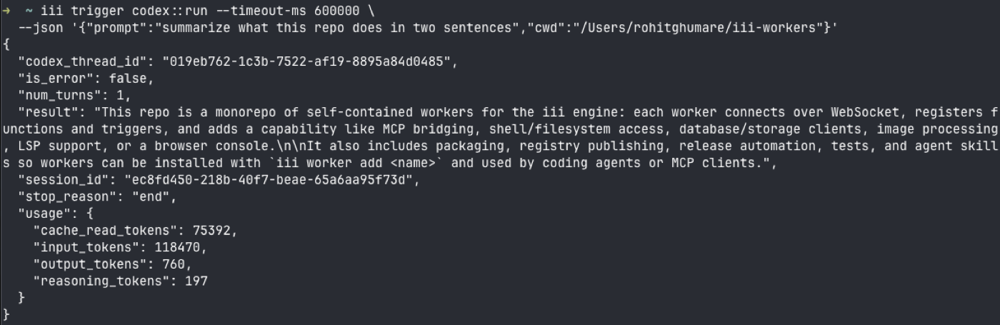
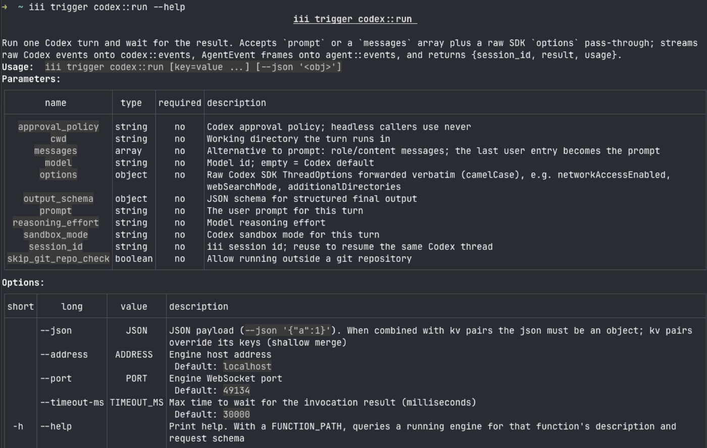
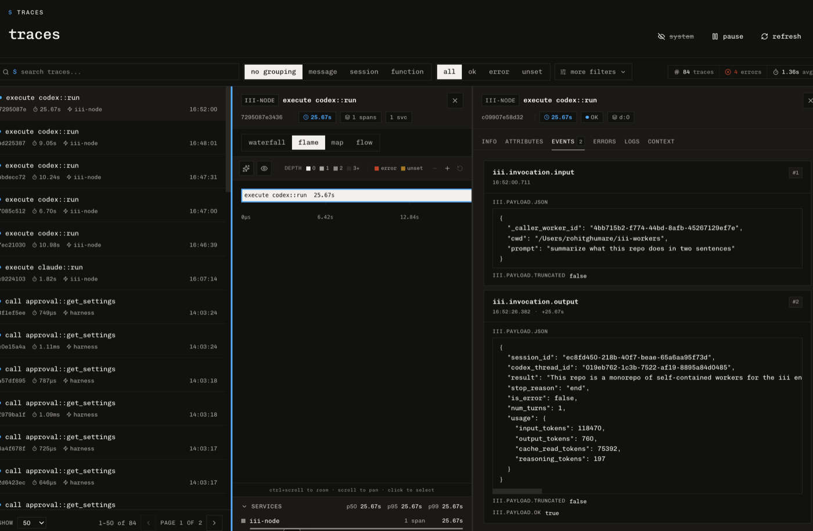

# codex

OpenAI Codex as an iii worker: the Codex API exposed as functions and streams on the iii bus, nothing else. The worker spawns the same `codex` binary the user runs in their terminal, with the same login (ChatGPT or API key), the same filesystem, and the same sandbox. `codex::run` executes one headless turn and returns the result; the raw Codex thread events mirror verbatim onto the `codex::events` stream, and a translated AgentEvent view lands on `agent::events`, so the iii console and any sibling worker observe a Codex run exactly like a native harness turn.

## Install

```bash
iii worker add codex
```

Requires the [Codex CLI](https://github.com/openai/codex) on the host (`npm i -g @openai/codex`) and either an existing `codex login` or `OPENAI_API_KEY` in the worker environment.

## Skills

Install the `codex` agent skill for Claude Code, Cursor, and 30+ other agents:

```bash
npx skills add iii-hq/workers --skill codex
```

## Quickstart

From zero to a Codex turn over the bus:

```bash
curl -fsSL https://install.iii.dev/iii/main/install.sh | sh
iii worker add codex
iii   # starts the engine + worker
```

Then talk to it like any other function: from `iii trigger codex::run`, or from any SDK:

```ts
import { registerWorker } from 'iii-sdk';

const iii = registerWorker('ws://127.0.0.1:49134', { workerName: 'demo' });

const res = await iii.trigger({
  function_id: 'codex::run',
  payload: {
    prompt: 'Add a /health endpoint to server.ts and run the tests',
    cwd: '/path/to/repo',
    sandbox_mode: 'workspace-write',
  },
  timeout_ms: 600_000,
});
// { session_id, codex_thread_id, result, stop_reason, usage }
```

Or straight from the terminal with the `iii trigger` CLI:

```bash
# one full turn (raise the timeout; the default 30s is too short for agent turns)
iii trigger codex::run --timeout-ms 600000 \
  --json '{"prompt":"add a /health endpoint and run the tests","cwd":"/path/to/repo"}'

# quick reads use key=value syntax
iii trigger codex::sessions::list
iii trigger codex::status session_id=<session_id>

# background turn + control
iii trigger codex::start --json '{"prompt":"...","cwd":"/path/to/repo"}'
iii trigger codex::stop session_id=<session_id>

# ask the running engine for a function's description and parameter table
iii trigger codex::run --help
```

A turn from the CLI and the published schema:





Call `codex::run` again with the returned `session_id` to continue the same conversation: the worker maps iii session ids to Codex thread ids in engine state and resumes automatically (threads persist in `~/.codex/sessions`).

Two ids come back from every run. `session_id` is the iii session id: the key for `codex::status`, `codex::stop`, resume, and the stream group. `codex_thread_id` is Codex's internal thread id (what the worker passes to `resumeThread` under the hood) — returned for reference, not a lookup key.

## Functions

| Function | Purpose |
| --- | --- |
| `codex::run` | Run one turn, wait, return the final result |
| `codex::start` | Fire-and-forget turn; progress arrives on the streams |
| `codex::stop` | Interrupt a live run |
| `codex::status` | Session state, live flag, usage |
| `codex::sessions::list` | All sessions this worker has run |

`codex::run` accepts either a bare `prompt` string or a `messages` array (`[{ role: 'user', content: [{ type: 'text', text }] }]`) — the same input contract as the claude-code worker and `run::start_and_wait`, so the acp worker drives Codex with `--brain-fn codex::run` — plus `model`, `cwd`, `sandbox_mode`, `approval_policy`, `reasoning_effort`, `skip_git_repo_check`, `output_schema`, `images` (local image paths), `additional_directories` (extra writable roots), and `codex_config`.

### Raw API pass-through

The worker drives the `codex exec --json` CLI, so anything the CLI exposes as a `config.toml` override goes through the `codex_config` field untouched — MCP servers, model providers, profiles, network access, web search, and the rest. Each key/value becomes a `--config key=value` on the spawn:

```jsonc
{
  "prompt": "...",
  "codex_config": {
    "sandbox_workspace_write": { "network_access": true },
    "web_search": "live",
    "mcp_servers": { "github": { "command": "gh-mcp" } }
  }
}
```

Extra writable directories use the named `additional_directories` field (the CLI's `--add-dir`).

And the full output side is available raw: every event Codex emits (`thread.started`, `turn.started`, `item.started/updated/completed` for commands, patches, MCP tool calls, web searches, reasoning, agent messages, `turn.completed` with usage, `turn.failed`) is mirrored verbatim onto the `codex::events` stream, group_id = session_id. Consumers that want the exact Codex wire format read `codex::events`; consumers that want harness-shaped frames read `agent::events`. Same turn, two views.

## Configuration

```yaml
engine_url: ws://127.0.0.1:49134

defaults:
  model: ""                       # empty = Codex default
  sandbox_mode: workspace-write   # read-only | workspace-write | danger-full-access
  approval_policy: never          # never | on-request | on-failure | untrusted
  reasoning_effort: ""            # empty = Codex default
  cwd: ""                         # default working directory for runs
  skip_git_repo_check: true

events_stream: agent::events       # translated AgentEvent frames
raw_events_stream: codex::events   # verbatim Codex thread events
codex_executable: ""               # path to the codex CLI; empty = PATH resolution
```

Sandboxing is Codex's own: `read-only` blocks writes, `workspace-write` allows edits inside `cwd`, `danger-full-access` disables the sandbox. `approval_policy` is forwarded to Codex per turn from the payload or the configured default; headless callers leave it at `never` so a command the sandbox blocks fails instead of prompting, but any other value is passed through and respected.

## The agent on the bus

By default every turn carries the iii runtime context, delivered through Codex's native `developer_instructions` config (a developer-role message in the turn context, the channel Codex itself uses for standing instructions): the same engine-grounded rules as the harness identity prompts, retargeted to the `iii` CLI the agent reaches through its sandboxed shell. The agent discovers capabilities from the live engine instead of memory — `iii trigger engine::functions::list` to find function ids, `iii trigger <fn> --help` as the contract before every first call, the registry flow (`directory::registry::workers::list/info`, `worker::add`) when nothing registered fits — plus the calling rules and error-handling discipline that go with them. Local file edits stay on Codex's native tools; backend actions go through registered functions.

```bash
# the agent answers this by querying the live engine itself
iii trigger codex::run --timeout-ms 300000 \
  --json '{"prompt":"List every worker connected to this engine and what each one does.","cwd":"/tmp"}'
```

The block rides the turn context on every call, resumes included, without touching your prompt or Codex's base instructions. Turn it off per call with `"iii_context": false` or globally in `config.yaml`; a caller-supplied `developer_instructions` in `codex_config` wins over it.

## Plan-then-execute with sandbox modes

Codex has no named plan mode; the equivalent is a planning prompt under the `read-only` sandbox. The guarantee is OS-level (Seatbelt on macOS, Landlock on Linux), so writes physically fail rather than being policy-declined. Because the worker resumes threads, plan-then-execute is two calls against the same `session_id`:

```bash
# 1. plan (OS-enforced read-only)
iii trigger codex::run --timeout-ms 600000 \
  --json '{"prompt":"Plan how to add rate limiting to the REST API. Do not implement.","cwd":"/path/to/repo","sandbox_mode":"read-only"}'

# 2. execute the plan with full context, same thread
iii trigger codex::run --timeout-ms 600000 \
  --json '{"session_id":"<from-step-1>","prompt":"Implement the plan.","sandbox_mode":"workspace-write","cwd":"/path/to/repo"}'
```

The approval step is whatever sits between the two calls — a human reading the plan, another worker, or a trigger.

## Observability

Every `codex::run` is an ordinary traced invocation on the engine: the trace carries the full input payload and the output (result, usage) as span events, with per-function p50/p95/p99 in the console's trace explorer — no extra instrumentation in the worker.



## How it maps

| Codex | iii |
| --- | --- |
| SDK `runStreamed()` turn | `codex::run` invocation |
| every thread event, verbatim | `codex::events` stream frame |
| agent_message / reasoning item | `message_complete` frame on `agent::events` |
| command_execution / file_change / mcp_tool_call / web_search | `function_execution_start` / `function_execution_end` frames |
| turn end | `turn_end` + `agent_end` frames, function return value |
| thread resume | engine state scope `codex_sessions`, keyed by iii session_id |
| extra capability | another iii worker on the bus (`shell`, `database`, `storage`, ...) |
