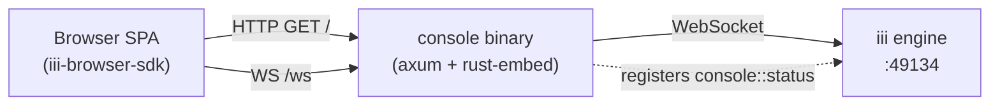

<div align="center">

# console

**A single binary. A chat. A trace explorer. The whole [iii](https://github.com/iii-hq) engine in your browser.**

<p>
  <a href="#install"></a>
  <a href="../LICENSE"></a>
  <a href="https://www.rust-lang.org"></a>
  <a href="https://react.dev"></a>
  <a href="https://vitejs.dev"></a>
</p>

</div>

<p align="center">
  <a href="https://raw.githubusercontent.com/iii-hq/workers/main/console/screenshot.png">
    
  </a>
</p>

## Why `console`

- **One port, one binary.** The React UI is baked into the executable with [`rust-embed`](https://docs.rs/rust-embed), and the engine WebSocket is reverse-proxied at `/ws` on the same origin. No CORS preflight, no side-car static server, no `dist/` directory to deploy. See [`src/assets.rs`](src/assets.rs) and [`src/proxy.rs`](src/proxy.rs).
- **Live engine, live UI.** Functions, models, traces, and chat sessions all stream over a single WebSocket via the iii browser SDK. Mention any registered function with `@`, switch models on the fly, and watch the trace appear in the panel next to you. See [`web/src/lib/iii-client.ts`](web/src/lib/iii-client.ts).
- **Built for production.** SIGINT *and* SIGTERM graceful shutdown (so `docker stop` and `kubectl delete` actually drain), URL credentials redacted from logs, immutable cache headers on content-hashed assets, and a fully self-contained binary with no runtime filesystem deps. See [`src/main.rs`](src/main.rs).

## Features

### Chat

A purpose-built agentic chat UI on top of [Lexical](https://lexical.dev). Lives in [`web/src/components/chat/`](web/src/components/chat).

- **Two modes** — `ask` and `agent` toggle right in the composer
- **Live model picker** — provider-grouped from `router::models::list`; static fallback (OpenAI, Anthropic, Google) when the catalog is unreachable
- **`@`-mentions** — fuzzy-search every function registered against the engine
- **`/compact` slash command** — summarises conversation history via the `context-manager` worker's `context::compact`, then persists a `compaction` custom session entry; the durable transcript is untouched — the marker renders from that entry and the summary anchors future turns
- **Attachments** — multi-file picker with text/image previews
- **Function calls** — running / pending / error cards, consecutive calls grouped, with **approve/deny** gating for pending approvals (`approval::resolve`)
- **Streaming** — abortable mid-flight; thinking shimmer; collapsible thought messages
- **Markdown** — GFM, code blocks with [prism-react-renderer](https://github.com/FormidableLabs/prism-react-renderer), syntax-highlighted JSON inputs and outputs
- **Conversation sidebar** — create, inline rename, delete, auto-title from the first message
- **Context-usage meter** — token estimate with warn / danger thresholds and a `/compact` nudge
- **Session ID** — copyable, deep-links every conversation into the trace explorer via `iii.session.id`
- **Persistence** — conversations, active id, last model, sidebar state — all in `localStorage`

### Traces

Full-fledged OpenTelemetry explorer over `engine::traces::*` and `engine::logs::list`. Lives in [`web/src/pages/TracesV2/`](web/src/pages/TracesV2).

- **Live timeline strip masthead** — every span streamed in real time, with a shared funnel as the volume control
- **Two detail visualizations** — lane timeline (same visual grammar as the strip) and a waterfall tree virtualized for huge traces
- **Rich filtering** — status, time presets, min/max duration, arbitrary attribute key/value pairs, debounced free-text search, saved views
- **Group by** — server-side aggregation with lazy per-group member expansion
- **Span detail tabs** — info, attributes, events, errors, OTel logs, context (baggage), links
- **Live streaming** — spans append over iii streams (`iii:devtools:*`) instead of polling; one seed read, then append

### Worktrees

The human window into the [`worktree`](https://github.com/iii-hq/workers/tree/main/worktree) worker: parallel agent checkouts, ownership, and land outcomes. Lives in [`web/src/pages/Worktrees/`](web/src/pages/Worktrees) and [`web/src/components/chat/`](web/src/components/chat). The whole surface is presence-gated: it appears only while the worktree worker is connected to the engine (the nav entry and picker tab hide; a direct `#/worktrees` hit lands on an install notice).

- **Graph page** (`#/worktrees`) — repo, worktree, and owning-session nodes from `worktree::list { include_status: true }`, refreshed live off all six `worktree::*` lifecycle trigger types (poll fallback while bindings are unavailable), with a per-worktree detail panel: branch, base, advisory dev port, clean / ahead / behind, diffstat, and the integrated marker for squash- or rebase-landed branches
- **Picker tab** — the chat working-directory picker grows a **worktrees** tab next to directory browsing: picking a managed worktree validates the path and claims it for the conversation's session; the console-made claim auto-releases when the conversation points elsewhere (best-effort; the worker's prune sweep is the durable backstop). Worktrees with a land in progress are listed but not retargetable
- **Working-dir badge** — a conversation rooted in a managed worktree shows branch, short id, dirty `*` / ahead `+n` indicators, and a lifecycle dot instead of the plain path chip; the raw path stays reachable as the tooltip
- **Live land notices** — `worktree::landed` / `worktree::land-blocked` events surface in the chat as notices (target branch and merged sha, or the block reason and conflicted files) and refresh the badge

### Memory

The human window into the [`memory`](https://github.com/iii-hq/workers/tree/main/memory) worker: named banks of always-injected markdown rules and auto-extracted memories. Lives in [`web/src/pages/Memory/`](web/src/pages/Memory). Presence-gated like Worktrees: the page appears only while the memory worker is connected (a direct `#/memory` hit lands on an install notice).

- **Bank rail** — every bank with live memory / pinned / rule counts and inline create
- **Rules tab (first)** — the bank's markdown rules as in-place editors (save appears only on edit; delete asks to confirm); the agent appends learned standing instructions to the auto-managed `learned` rule as you correct it in chat
- **Memories tab** — server-paged newest-first list with pin / edit-in-place / tombstone delete, a show-history toggle, and search that runs `memory::recall` (the ranked scorer, not a client filter)
- **Graph tab** — entity hubs with memories as spokes: level-of-detail for large banks, draggable nodes, wheel zoom/pan, click a node for an inspect card
- **Preview tab** — the whole turn before it happens: `memory::preview` composes the exact system-prompt rules section and the appended memories (ambient floor + budgets applied) for a hypothetical question, with clickable example questions from the bank's own content
- **Live** — the page re-reads off `memory::item-changed` / `memory::bank-changed` (poll fallback), so memories appear the moment they're learned
- **In chat** — a bank picker in the composer (session metadata `memory_bank`) and a memory chip on each assistant reply naming the bank, how many rules and memories fed the turn, and whether recall ran semantic; click it to expand the exact records

### Live catalogs

The composer's `@`-mentions and the model picker pull from the engine in real time.

- `engine::functions::list` — TTL-cached function list (`VITE_FUNCTIONS_LIST_CACHE_MS`, default 10s) → [`web/src/lib/functions-catalog.ts`](web/src/lib/functions-catalog.ts)
- `router::models::list` — provider-grouped model catalog, refreshed live off the `router::models::changed` trigger type → [`web/src/lib/models-catalog.ts`](web/src/lib/models-catalog.ts)

### Theming

Light and dark themes via `data-theme` + CSS custom properties. Persisted to `localStorage` with an inline init script in `index.html` to prevent flash-of-wrong-theme on first paint.

### Worker SDK surface

`console` registers a single function against the engine for health probes and `iii worker info` smoke tests:

| Function | Input | Output |
|---|---|---|
| `console::status` | `{}` | `{ http_port, engine_url, version }` |

Defined in [`src/functions/status.rs`](src/functions/status.rs).

## Install

```bash
iii worker add console
```

This fetches the prebuilt binary, writes a `console:` block into `~/.iii/config.yaml`, and the engine launches the worker on the next `iii start`.

## Quickstart

```bash
iii start                       # engine on ws://127.0.0.1:49134
console --http-port 3113        # UI + /ws proxy on :3113
open http://127.0.0.1:3113
```

The browser hits `/` for the SPA shell and upgrades `/ws` to the engine WebSocket — one origin, no CORS, no API base URL to configure.

### Bring up the chat stack

Chat runs on the [`harness`](https://github.com/iii-hq/workers/tree/main/harness) durable turn loop. Its manifest declares the whole stack as dependencies — [`session-manager`](https://github.com/iii-hq/workers/tree/main/session-manager) (the conversation store the sidebar, transcripts, and live token rendering are backed by), [`llm-router`](https://github.com/iii-hq/workers/tree/main/llm-router) (generation + the model catalog), [`context-manager`](https://github.com/iii-hq/workers/tree/main/context-manager) (the `/compact` summariser), [`approval-gate`](https://github.com/iii-hq/workers/tree/main/approval-gate) (human-in-the-loop approvals), and the provider workers — so a single command resolves and installs all of it:

```bash
iii worker add harness
```

### Add a provider key

The provider workers install with the harness, but they need credentials before any model appears — until then the model picker reads **no models** and chat won't generate. Add a key either way:

- **In the UI (recommended)** — open the model picker and use **configure anthropic** / **configure openai** to paste a key. It's written to that provider's slice of the `llm-router` configuration entry, and the catalog populates within seconds.
- **From the environment** — `llm-router` falls back to a provider's credential env var (e.g. `ANTHROPIC_API_KEY`), read in the router's own process. See [`llm-router`](https://github.com/iii-hq/workers/tree/main/llm-router#configuration) for the credential model.

Pick a model in the composer and send — the turn streams back through the harness loop.

<details>
<summary><strong>Programmatic check from the SDK</strong></summary>

```rust
use iii_sdk::{register_worker, InitOptions, TriggerRequest};
use serde_json::json;

#[tokio::main]
async fn main() -> anyhow::Result<()> {
    let iii = register_worker("ws://localhost:49134", InitOptions::default());

    let result = iii.trigger(TriggerRequest {
        function_id: "console::status".into(),
        payload: json!({}),
        action: None,
        timeout_ms: Some(5_000),
    }).await?;

    println!("{result:#?}");
    Ok(())
}
```

Returns `{ http_port, engine_url, version }` — useful for liveness and readiness probes.

</details>

## Architecture



`console` is a thin HTTP server with exactly two jobs: serve the embedded SPA bundle (with appropriate cache headers) and transparently proxy `/ws` to the iii engine. The browser only ever talks to one origin.

## Configuration

### `config.yaml`

```yaml
http_port: 3113   # port the UI + /ws are served on (default: 3113)
```

| Key | Default | Description |
|---|---|---|
| `http_port` | `3113` | TCP port the worker binds for `/`, `/assets/*`, and `/ws` |

### CLI flags

| Flag | Default | Description |
|---|---|---|
| `--config <path>` | `./config.yaml` | Path to the YAML config |
| `--url <ws://…>` | `ws://127.0.0.1:49134` | iii engine WebSocket URL (`DEFAULT_ENGINE_URL` in [`src/config.rs`](src/config.rs)) |
| `--http-port <port>` | from config | Overrides `http_port` from the config file |
| `--manifest` | — | Print the publish manifest as JSON and exit (used by the registry pipeline) |

## Routes

| Path | Behavior |
|---|---|
| `GET /` | Embedded `index.html` (SPA shell, hash-routed client-side). `Cache-Control: no-cache, must-revalidate` |
| `GET /assets/*` | Embedded JS / CSS, content-hashed filenames. `Cache-Control: public, max-age=31536000, immutable` |
| `GET /ws` (Upgrade) | WebSocket upgrade; transparent proxy to `engine_url` |
| anything else | `404 Not Found` |

The SPA bundle is embedded into the binary at compile time via [`rust-embed`](https://docs.rs/rust-embed) — the released `console` has no separate `dist/` directory, no side-car asset server, and no runtime filesystem dependency for the UI.

## Tech stack

| Layer | Choice |
|---|---|
| Web server | [axum 0.7](https://github.com/tokio-rs/axum), [tokio](https://tokio.rs), [tokio-tungstenite](https://github.com/snapview/tokio-tungstenite) |
| Asset embedding | [`rust-embed` 8](https://docs.rs/rust-embed), [`mime_guess`](https://docs.rs/mime_guess) |
| Worker SDK | [`iii-sdk` 0.19.4](https://docs.rs/iii-sdk) |
| UI framework | [React 19](https://react.dev), [Vite 8](https://vitejs.dev), [TypeScript 6](https://www.typescriptlang.org) |
| Styling | [Tailwind CSS v4](https://tailwindcss.com), [Radix UI](https://www.radix-ui.com), [`class-variance-authority`](https://cva.style), [lucide-react](https://lucide.dev) |
| Editor | [Lexical 0.44](https://lexical.dev) |
| Data fetching | [TanStack Query 5](https://tanstack.com/query) |
| Trace graphs | [`@xyflow/react` 12](https://reactflow.dev) + [dagre](https://github.com/dagrejs/dagre), [TanStack Virtual](https://tanstack.com/virtual) |
| Markdown | [react-markdown](https://github.com/remarkjs/react-markdown) + [remark-gfm](https://github.com/remarkjs/remark-gfm), [prism-react-renderer](https://github.com/FormidableLabs/prism-react-renderer) |
| Browser SDK | [`iii-browser-sdk` 0.21.6](https://www.npmjs.com/package/iii-browser-sdk) |

<details>
<summary><strong>Build from source (contributors only)</strong></summary>

`cargo build` runs `pnpm install --frozen-lockfile && pnpm build` inside [`web/`](web/) automatically when the `web/dist/` bundle is missing or stale (Node + pnpm must be on `PATH`). To pre-build the bundle once and skip the embedded-asset rebuild loop:

```bash
cd web && pnpm install && pnpm build && cd ..
cargo build --release
```

Escape hatches (see [`build.rs`](build.rs)):

- `SKIP_WEB_BUILD=1` — skip the JS build step entirely; the existing `web/dist/` (if any) is embedded as-is. Useful in CI when the bundle was built in a previous stage.
- `PNPM=/path/to/pnpm` — override pnpm discovery.

Run the test suite:

```bash
cargo test                          # unit + manifest + e2e (e2e self-skips if `iii` isn't on PATH)
cd web && pnpm test                 # vitest
cd web && pnpm typecheck && pnpm lint
```

</details>

## License

Apache 2.0 — see [LICENSE](https://github.com/iii-hq/workers/blob/main/LICENSE).
