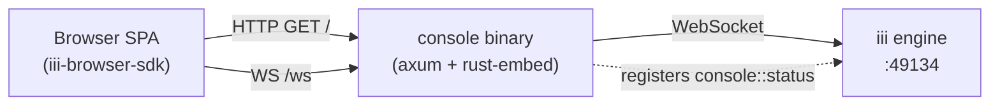

<div align="center">

# console

**A single binary. A chat. A trace explorer. The whole [iii](https://github.com/iii-hq) engine in your browser.**

[](#install)
[](../LICENSE)
[](https://www.rust-lang.org)
[](https://react.dev)
[](https://vitejs.dev)

</div>

<p align="center">
  <a href="https://raw.githubusercontent.com/iii-hq/workers/main/console/screenshot.png">
    
  </a>
</p>

## Why `console`

- **One port, one binary.** The React UI is baked into the executable with [`rust-embed`](https://docs.rs/rust-embed), and the engine WebSocket is reverse-proxied at `/ws` on the same origin. No CORS preflight, no side-car static server, no `dist/` directory to deploy. See [`src/assets.rs`](src/assets.rs) and [`src/proxy.rs`](src/proxy.rs).
- **Live engine, live UI.** Functions, models, traces, and chat sessions all stream over a single WebSocket via the iii browser SDK. Mention any registered function with `@`, switch models on the fly, and watch the trace appear in the panel next to you. See [`web/src/lib/iii-client.ts`](web/src/lib/iii-client.ts).
- **Built for production.** SIGINT *and* SIGTERM graceful shutdown (so `docker stop` and `kubectl delete` actually drain), URL credentials redacted from logs, immutable cache headers on content-hashed assets, and a fully self-contained binary with no runtime filesystem deps. See [`src/main.rs`](src/main.rs).

## Features

### Chat

A purpose-built agentic chat UI on top of [Lexical](https://lexical.dev). Lives in [`web/src/components/chat/`](web/src/components/chat).

- **Three modes** — `plan`, `ask`, and `agent` toggle right in the composer
- **Live model picker** — provider-grouped from `models::list`; static fallback (OpenAI, Anthropic, Google) when the catalog is unreachable
- **`@`-mentions** — fuzzy-search every function registered against the engine
- **`/compact` slash command** — collapses conversation history via `context-compaction::compact_session`
- **Attachments** — multi-file picker with text/image previews
- **Function calls** — running / pending / error cards, consecutive calls grouped, with **approve/deny** gating for pending approvals (`approval::resolve`)
- **Streaming** — abortable mid-flight; thinking shimmer; collapsible thought messages
- **Markdown** — GFM, code blocks with [prism-react-renderer](https://github.com/FormidableLabs/prism-react-renderer), syntax-highlighted JSON inputs and outputs
- **Conversation sidebar** — create, inline rename, delete, auto-title from the first message
- **Context-usage meter** — token estimate with warn / danger thresholds and a `/compact` nudge
- **Session ID** — copyable, deep-links every conversation into the trace explorer via `iii.session.id`
- **Persistence** — conversations, active id, last model, sidebar state — all in `localStorage`

### Traces

Full-fledged OpenTelemetry explorer over `engine::traces::*` and `engine::logs::list`. Lives in [`web/src/pages/Traces/`](web/src/pages/Traces).

- **Four visualizations** — waterfall (virtualized for huge traces), flame graph, service map, and a `dagre`-laid-out flow view via [`@xyflow/react`](https://reactflow.dev)
- **Rich filtering** — status (ok / error / unset), time presets, sort, min/max duration, service, operation, arbitrary attribute key/value pairs, debounced free-text search
- **Group by** — none, message, session, function — server-side aggregation with lazy per-group span trees
- **Span detail tabs** — info, attributes, events, errors, OTel logs, context (baggage), links
- **Live polling** — pause / resume, hover-deferred refreshes, 25 / 50 / 100 page sizes
- **Resizable panels** — drag to resize, double-click to reset
- **Critical-path breadcrumb** with cross-trace parent jump

### Live catalogs

The composer's `@`-mentions and the model picker pull from the engine in real time.

- `engine::functions::list` — TTL-cached function list (`VITE_FUNCTIONS_LIST_CACHE_MS`, default 10s) → [`web/src/lib/functions-catalog.ts`](web/src/lib/functions-catalog.ts)
- `models::list` — provider-grouped model catalog → [`web/src/lib/models-catalog.ts`](web/src/lib/models-catalog.ts)

### Theming

Light and dark themes via `data-theme` + CSS custom properties. Persisted to `localStorage` with an inline init script in `index.html` to prevent flash-of-wrong-theme on first paint.

### Worker SDK surface

`console` registers a single function against the engine for health probes and `iii worker info` smoke tests:

| Function | Input | Output |
|---|---|---|
| `console::status` | `{}` | `{ http_port, engine_url, version }` |

Defined in [`src/functions/status.rs`](src/functions/status.rs).

## Install

```bash
iii worker add console
```

This fetches the prebuilt binary, writes a `console:` block into `~/.iii/config.yaml`, and the engine launches the worker on the next `iii start`.

## Quickstart

```bash
iii start                       # engine on ws://127.0.0.1:49134
console --http-port 3113        # UI + /ws proxy on :3113
open http://127.0.0.1:3113
```

The browser hits `/` for the SPA shell and upgrades `/ws` to the engine WebSocket — one origin, no CORS, no API base URL to configure.

<details>
<summary><strong>Programmatic check from the SDK</strong></summary>

```rust
use iii_sdk::{register_worker, InitOptions, TriggerRequest};
use serde_json::json;

#[tokio::main]
async fn main() -> anyhow::Result<()> {
    let iii = register_worker("ws://localhost:49134", InitOptions::default());

    let result = iii.trigger(TriggerRequest {
        function_id: "console::status".into(),
        payload: json!({}),
        action: None,
        timeout_ms: Some(5_000),
    }).await?;

    println!("{result:#?}");
    Ok(())
}
```

Returns `{ http_port, engine_url, version }` — useful for liveness and readiness probes.

</details>

## Architecture



`console` is a thin HTTP server with exactly two jobs: serve the embedded SPA bundle (with appropriate cache headers) and transparently proxy `/ws` to the iii engine. The browser only ever talks to one origin.

## Configuration

### `config.yaml`

```yaml
http_port: 3113   # port the UI + /ws are served on (default: 3113)
```

| Key | Default | Description |
|---|---|---|
| `http_port` | `3113` | TCP port the worker binds for `/`, `/assets/*`, and `/ws` |

### CLI flags

| Flag | Default | Description |
|---|---|---|
| `--config <path>` | `./config.yaml` | Path to the YAML config |
| `--url <ws://…>` | `ws://127.0.0.1:49134` | iii engine WebSocket URL (`DEFAULT_ENGINE_URL` in [`src/config.rs`](src/config.rs)) |
| `--http-port <port>` | from config | Overrides `http_port` from the config file |
| `--manifest` | — | Print the publish manifest as JSON and exit (used by the registry pipeline) |

## Routes

| Path | Behavior |
|---|---|
| `GET /` | Embedded `index.html` (SPA shell, hash-routed client-side). `Cache-Control: no-cache, must-revalidate` |
| `GET /assets/*` | Embedded JS / CSS, content-hashed filenames. `Cache-Control: public, max-age=31536000, immutable` |
| `GET /ws` (Upgrade) | WebSocket upgrade; transparent proxy to `engine_url` |
| anything else | `404 Not Found` |

The SPA bundle is embedded into the binary at compile time via [`rust-embed`](https://docs.rs/rust-embed) — the released `console` has no separate `dist/` directory, no side-car asset server, and no runtime filesystem dependency for the UI.

## Tech stack

| Layer | Choice |
|---|---|
| Web server | [axum 0.7](https://github.com/tokio-rs/axum), [tokio](https://tokio.rs), [tokio-tungstenite](https://github.com/snapview/tokio-tungstenite) |
| Asset embedding | [`rust-embed` 8](https://docs.rs/rust-embed), [`mime_guess`](https://docs.rs/mime_guess) |
| Worker SDK | [`iii-sdk` 0.12](https://docs.rs/iii-sdk) |
| UI framework | [React 19](https://react.dev), [Vite 8](https://vitejs.dev), [TypeScript 6](https://www.typescriptlang.org) |
| Styling | [Tailwind CSS v4](https://tailwindcss.com), [Radix UI](https://www.radix-ui.com), [`class-variance-authority`](https://cva.style), [lucide-react](https://lucide.dev) |
| Editor | [Lexical 0.44](https://lexical.dev) |
| Data fetching | [TanStack Query 5](https://tanstack.com/query) |
| Trace graphs | [`@xyflow/react` 12](https://reactflow.dev) + [dagre](https://github.com/dagrejs/dagre), [TanStack Virtual](https://tanstack.com/virtual) |
| Markdown | [react-markdown](https://github.com/remarkjs/react-markdown) + [remark-gfm](https://github.com/remarkjs/remark-gfm), [prism-react-renderer](https://github.com/FormidableLabs/prism-react-renderer) |
| Browser SDK | [`iii-browser-sdk` 0.12](https://www.npmjs.com/package/iii-browser-sdk) |

<details>
<summary><strong>Build from source (contributors only)</strong></summary>

`cargo build` runs `pnpm install --frozen-lockfile && pnpm build` inside [`web/`](web/) automatically when the `web/dist/` bundle is missing or stale (Node + pnpm must be on `PATH`). To pre-build the bundle once and skip the embedded-asset rebuild loop:

```bash
cd web && pnpm install && pnpm build && cd ..
cargo build --release
```

Escape hatches (see [`build.rs`](build.rs)):

- `SKIP_WEB_BUILD=1` — skip the JS build step entirely; the existing `web/dist/` (if any) is embedded as-is. Useful in CI when the bundle was built in a previous stage.
- `PNPM=/path/to/pnpm` — override pnpm discovery.

Run the test suite:

```bash
cargo test                          # unit + manifest + e2e (e2e self-skips if `iii` isn't on PATH)
cd web && pnpm test                 # vitest
cd web && pnpm typecheck && pnpm lint
```

</details>

## License

Apache 2.0 — see [LICENSE](https://github.com/iii-hq/workers/blob/main/LICENSE).
