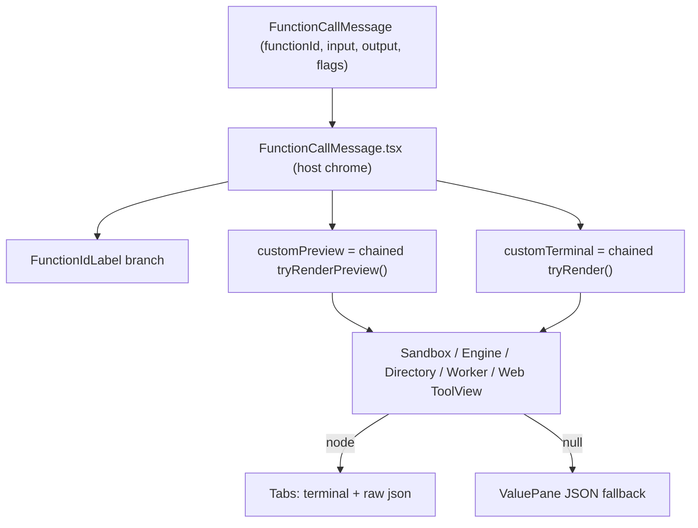

# Custom `FunctionCallMessage` renderers

How to add bespoke UI for `function-call` chat messages in the console, instead of falling back to the default request/response JSON panes.

This is the end-to-end authoring guide: architecture, the message contract, the parser/view layer, how to wire a new family into the host component, and the two Storybook surfaces (fixture galleries + Playground scenarios) every renderer must ship with.

**Reference implementations** (five families are wired today):

| Family | Module | Predicate | Notable |
|--------|--------|-----------|---------|
| `sandbox::*` | [`../web/src/components/chat/sandbox/`](../web/src/components/chat/sandbox) | `isSandboxFunction` | 15 tools, terminal + raw-json tabs, approval previews, shared error handling |
| `engine::*::list` | [`../web/src/components/chat/engine/`](../web/src/components/chat/engine) | `isEngineListFunction` | read-only list/info views, no preview |
| `directory::*` | [`../web/src/components/chat/directory/`](../web/src/components/chat/directory) | `isDirectoryFunction` | skills / prompts / registry views |
| `web::fetch` | [`../web/src/components/chat/web/`](../web/src/components/chat/web) | `isWebFunction` | single tool — smallest end-to-end example |
| `worker::*` | [`../web/src/components/chat/worker/`](../web/src/components/chat/worker) | `isWorkerFunction` | lifecycle ops, request JSON used as preview |

> Starting a brand-new family? Copy [`web/`](../web/src/components/chat/web) for the smallest complete example, or [`sandbox/`](../web/src/components/chat/sandbox) for the full feature set (terminal chrome, error views, previews).

**Definition of done:** a renderer is not complete until it ships with **both** dev surfaces — static cards in a **fixture family gallery** and at least one interactive **Playground** scenario. Do not merge UI-only changes without playground coverage.

---

## 1. The principle: opt in, or fall back to JSON

Every tool invocation becomes a `FunctionCallMessage` (see [`../web/src/types/chat.ts`](../web/src/types/chat.ts)). The host component [`FunctionCallMessage.tsx`](../web/src/components/chat/FunctionCallMessage.tsx) (FCM) always renders the same chrome:

1. **Header** — status dot, `permission to run` / `running` / `ran`, the function id, and duration.
2. **Body** — depends on lifecycle and whether a custom renderer returned a node.
3. **Pending bar** — approve / deny / always-allow (owned by FCM, never by your renderer).

The default body is two `ValuePane`s (request + response) with `JsonHighlight`. A custom renderer **opts in** by returning a React node from `tryRender` / `tryRenderPreview`. If it returns `null`, FCM silently shows the JSON fallback. This is the core contract: **a renderer never has to handle a shape it doesn't recognize — just return `null`.**

---

## 2. How it works today

FCM is the host; each function family is a small plugin module that exports a `ToolView` object plus a `FunctionIdLabel`. FCM imports the five families directly and tries each in turn with the `??` (nullish-coalescing) operator — first non-null wins.



The exact dispatch in [`FunctionCallMessage.tsx`](../web/src/components/chat/FunctionCallMessage.tsx):

```tsx
const customPreview =
  SandboxToolView.tryRenderPreview(message) ??
  EngineToolView.tryRenderPreview(message) ??
  DirectoryToolView.tryRenderPreview(message) ??
  WorkerToolView.tryRenderPreview(message) ??
  WebToolView.tryRenderPreview(message)

const customTerminal = !pending
  ? (SandboxToolView.tryRender(message) ??
    EngineToolView.tryRender(message) ??
    DirectoryToolView.tryRender(message) ??
    WorkerToolView.tryRender(message) ??
    WebToolView.tryRender(message))
  : null
```

> **Note on scale.** Five families chained by hand is fine; it is explicit and tree-shakes cleanly. There is no plugin *registry* yet — see [Scale beyond hand-wiring](#11-scale-beyond-hand-wiring) for the refactor sketch if the chain grows unwieldy. Until then, follow the [minimal wiring](#7-wire-the-family-into-functioncallmessagetsx) below.

---

## 3. The message contract

```typescript
// ../web/src/types/chat.ts
interface FunctionCallMessage extends BaseMessage {
  role: 'function-call'
  functionId: string       // e.g. "sandbox::exec", "web::fetch"
  input: unknown
  output?: unknown
  durationMs?: number
  running?: boolean
  /** awaiting user approval before execution; lifecycle: pending -> running -> done */
  pendingApproval?: boolean
  functionCallId?: string  // iii function_call_id — for approval::resolve
  sessionId?: string       // iii session_id — paired with functionCallId
}
```

The lifecycle flags drive what your renderer should return:

| State | Flags | What the custom UI should do |
|-------|-------|------------------------------|
| **Pending approval** | `pendingApproval: true` | Return your compact preview from `tryRenderPreview`; return `null` from `tryRender`. FCM keeps the approve/deny bar. |
| **Running** | `running: true`, not pending | `tryRender` with the `running` flag — same shell as done, body shows a muted `executing…` shimmer. |
| **Done** | neither flag | `tryRender` returns success UI; FCM wraps it in **terminal** (default) + **raw json** tabs when non-null. |
| **Failed** | `output` carries an error | Detect and return error UI from `tryRender` **before** success parsing (see [error shapes](#43-structured-tool-errors-sandboxerrorwire)). |

Wire shapes come straight from the harness/engine and are **not** normalized in the UI layer except inside your `parsers.ts`.

---

## 4. Payload shapes to plan for

Your parsers must tolerate four shapes. The `unwrapEnvelope` + Zod-`safeParse` pattern below handles all of them.

### 4.1 Raw handler JSON

What the Rust/Python handler returns directly, e.g. sandbox `ExecResponse`:

```json
{ "stdout": "...", "stderr": "", "exit_code": 0, "duration_ms": 41, "success": true }
```

### 4.2 Harness agent envelope

The harness `agent-trigger.ts` wraps many tool results before relaying them to the agent. The console receives the same shape:

```json
{
  "content": [{ "type": "text", "text": "..." }],
  "details": { "/* the actual payload */": true },
  "terminate": true
}
```

Always unwrap before Zod parsing. The discriminator is `Array.isArray(value.content) && 'details' in value`; `unwrapEnvelope` is idempotent (a flat payload passes through unchanged):

```typescript
// ../web/src/components/chat/sandbox/parsers.ts
import { unwrapEnvelope } from '@/components/chat/sandbox/parsers'
const payload = unwrapEnvelope(message.output) // -> details, or the input unchanged
```

### 4.3 Structured tool errors (`SandboxErrorWire`)

A flat, Stripe-style error object inside `details` (or raw output):

```json
{
  "type": "exec_timeout",
  "code": "S200",
  "message": "command timed out after 100ms",
  "docs_url": "https://...",
  "retryable": true,
  "fix": { "/* partial result */": true },
  "fix_note": "increase timeout_ms or simplify the command"
}
```

### 4.4 Transport / gate / `function_error` wrapper

What you see when an invocation fails *before* the handler body — e.g. a `gate_unavailable` denial:

```json
{
  "error": {
    "kind": "function_error",
    "message": "trigger_failed: ...",
    "details": {
      "status": "denied",
      "denied_by": "gate_unavailable",
      "function_id": "sandbox::fs::write",
      "reason": "approval gate unreachable"
    },
    "content": [{ "type": "text", "text": "..." }]
  }
}
```

The sandbox module centralizes 4.3 + 4.4 in `parseSandboxErrorDisplay()` -> `SandboxErrorView`. Because the `function_error` envelope is shared infra (it comes from [`../web/src/lib/backend/translate.ts`](../web/src/lib/backend/translate.ts), not anything sandbox-specific), **every other family reuses it**:

```tsx
import { SandboxErrorView } from '@/components/chat/sandbox/ErrorView'
import { parseSandboxErrorDisplay } from '@/components/chat/sandbox/parsers'

const errorDisplay =
  !running && rawOutput != null ? parseSandboxErrorDisplay(rawOutput) : null
if (errorDisplay) return <SandboxErrorView display={errorDisplay} />
```

---

## 5. Module layout for a new family

Mirror `sandbox/` (example family `myfeature/`):

```
../web/src/components/chat/myfeature/
  index.tsx           # dispatcher: is<Family>Function, tryRender, tryRenderPreview, <Family>FunctionIdLabel, exported ToolView
  parsers.ts          # Zod schemas + unwrapEnvelope re-export + safeParseRequest/Response + *_FUNCTION_IDS allowlist
  SomeToolView.tsx    # one component per function_id (or grouped by response shape)
  format.ts           # display helpers (bytes, paths, durations) — optional
  ErrorView.tsx       # domain errors — optional; most families reuse sandbox/ErrorView
  shared.tsx          # Chip / MetaRow / StatusPill — or import from sandbox/shared.tsx
  __tests__/
    parsers.test.ts   # envelope unwrap + every schema + error cases
```

The `web/` family is the smallest real instance of this layout — [`index.tsx`](../web/src/components/chat/web/index.tsx) + [`parsers.ts`](../web/src/components/chat/web/parsers.ts) + [`FetchView.tsx`](../web/src/components/chat/web/FetchView.tsx), reusing `sandbox/shared.tsx` and `sandbox/ErrorView.tsx`.

---

## 6. The dispatcher (`index.tsx`)

Export a single `ToolView` object. Every family today exposes the same surface:

| Member | When called | Contract |
|--------|-------------|----------|
| `is<Family>Function(id)` | FCM routing (label + chains) | Match against an explicit `Set` of ids — never a broad regex. The name can reflect the subset you handle (e.g. `isEngineListFunction`). |
| `tryRender(message)` | Not pending; running or done | `ReactNode \| null`. Check errors first, then `switch (functionId)`. |
| `tryRenderRunning` | (alias) | Set to `tryRender`; running state lives inside each view via the `running` prop. |
| `tryRenderPreview(message)` | `pendingApproval` | Compact approval UI; `null` -> FCM shows request JSON. Return `null` if the request JSON is already a fine preview (see `worker`, `directory`). |
| `<Family>FunctionIdLabel` | Header | Optional. Dim the `family::` prefix, emphasize the tail. |

Canonical `tryRender` skeleton (from [`web/index.tsx`](../web/src/components/chat/web/index.tsx)):

```tsx
function tryRender(message: FunctionCallMessage): React.ReactNode | null {
  if (!isWebFunction(message.functionId)) return null   // 1. not ours
  if (message.pendingApproval) return null               // 2. preview owns pending

  const input = unwrapEnvelope(message.input)            // 3. unwrap input
  const rawOutput = message.output
  const output = rawOutput != null ? unwrapEnvelope(rawOutput) : undefined
  const running = !!message.running

  const errorDisplay =                                   // 4. errors BEFORE success
    !running && rawOutput != null ? parseSandboxErrorDisplay(rawOutput) : null
  if (errorDisplay) return <SandboxErrorView display={errorDisplay} />

  switch (message.functionId) {                          // 5. one view per id
    case 'web::fetch':
      return <FetchView input={input} output={output} running={running} />
    default:
      return null
  }
}

export const WebToolView = {
  isWebFunction,
  tryRender,
  tryRenderRunning: tryRender,
  tryRenderPreview,
}
```

The matching label:

```tsx
export function WebFunctionIdLabel({ functionId }: { functionId: string }) {
  if (!functionId.startsWith('web::')) return <span className="text-ink">{functionId}</span>
  const tail = functionId.slice('web::'.length)
  return (
    <>
      <span className="text-ink-faint">web::</span>
      <span className="text-ink font-medium">{tail}</span>
    </>
  )
}
```

---

## 7. Parsers (`parsers.ts`)

- **One Zod schema per request/response struct.** Keep schemas non-strict (plain `z.object({...})`, no `.strict()`) so additive wire fields never break the UI.
- **Document the wire source** in a comment (the Rust file or the harness `schemas.ts`) like `sandbox/parsers.ts` and `web/parsers.ts` do.
- **Export an explicit allowlist** — `MY_FEATURE_FUNCTION_IDS` `as const` + a `Set`-backed `isMyFeatureFunction(id): id is MyFeatureFunctionId`.
- **`safeParseRequest` parses the input as-is; `safeParseResponse` unwraps first**, then parses:

```typescript
import { unwrapEnvelope } from '@/components/chat/sandbox/parsers'
export { unwrapEnvelope }

export function safeParseRequest<T>(schema: z.ZodType<T>, value: unknown): T | null {
  const parsed = schema.safeParse(value ?? {})
  return parsed.success ? parsed.data : null
}

export function safeParseResponse<T>(schema: z.ZodType<T>, value: unknown): T | null {
  const parsed = schema.safeParse(unwrapEnvelope(value))
  return parsed.success ? parsed.data : null
}
```

The `web` family re-exports `unwrapEnvelope` and the two `safeParse*` helpers from `sandbox/parsers.ts` instead of re-implementing them — do the same unless you need different behavior.

---

## 8. Views

Each per-tool view accepts `{ input, output?, running? }` and returns `null` internally if parsing fails (the dispatcher already returned `null` for unknown ids, so this only guards malformed payloads).

- **Reuse design tokens** rather than raw colors: `border-rule`, `border-rule-2`, `bg-bg`, `bg-paper-2`, `text-ink`, `text-ink-faint`, `text-warn`, `font-mono`. They flip correctly across light/dark themes.
- **Reuse shared chrome** from [`sandbox/shared.tsx`](../web/src/components/chat/sandbox/shared.tsx): `Chip`, `MetaRow`, `StatusPill`, `ActionLine`. And UI primitives from [`../web/src/components/ui/`](../web/src/components/ui) (`Badge`, `Button`, `Tabs`, `Cell`, `EmptyState`).
- **Terminal-style output?** Copy [`sandbox/terminal/Terminal.tsx`](../web/src/components/chat/sandbox/terminal/Terminal.tsx) + `AnsiOutput.tsx`.
- **Code / JSON blocks:** `JsonHighlight` / `CodeHighlight` from [`../web/src/lib/syntax.tsx`](../web/src/lib/syntax.tsx).
- **Running state** uses the same shell as done; the body shows a muted shimmer. The `web::fetch` running branch is a clean template:

```tsx
if (running) {
  return (
    <div className="border-t border-rule-2 bg-bg">
      <MetaRow>
        <StatusPill label="fetching…" variant="default" />
        <Chip>{method}</Chip>
      </MetaRow>
      <ActionLine symbol="→" tone="ink"><span className="break-all">{req.url}</span></ActionLine>
      <div className="px-3 py-3 font-mono text-[12.5px] text-ink-ghost animate-pulse">
        · waiting for response…
      </div>
    </div>
  )
}
```

---

## 9. Wire the family into `FunctionCallMessage.tsx`

Three edits, all in [`FunctionCallMessage.tsx`](../web/src/components/chat/FunctionCallMessage.tsx). Add to the existing chains — order is priority (first non-null wins), so put your family wherever it should win ties (in practice families are disjoint, so order rarely matters).

**1. Import** your `ToolView` and label:

```tsx
import { MyFeatureFunctionIdLabel, MyFeatureToolView } from '@/components/chat/myfeature'
```

**2. Add a branch** to the header `FunctionIdLabel`:

```tsx
function FunctionIdLabel({ functionId }: { functionId: string }) {
  if (DirectoryToolView.isDirectoryFunction(functionId)) return <DirectoryFunctionIdLabel functionId={functionId} />
  if (EngineToolView.isEngineListFunction(functionId)) return <EngineFunctionIdLabel functionId={functionId} />
  if (WorkerToolView.isWorkerFunction(functionId)) return <WorkerFunctionIdLabel functionId={functionId} />
  if (WebToolView.isWebFunction(functionId)) return <WebFunctionIdLabel functionId={functionId} />
  if (SandboxToolView.isSandboxFunction(functionId)) return <SandboxFunctionIdLabel functionId={functionId} />
  if (MyFeatureToolView.isMyFeatureFunction(functionId)) return <MyFeatureFunctionIdLabel functionId={functionId} />
  return <span className="text-ink">{functionId}</span>
}
```

**3. Add to the `customPreview` and `customTerminal` chains:**

```tsx
const customPreview =
  SandboxToolView.tryRenderPreview(message) ??
  EngineToolView.tryRenderPreview(message) ??
  DirectoryToolView.tryRenderPreview(message) ??
  WorkerToolView.tryRenderPreview(message) ??
  WebToolView.tryRenderPreview(message) ??
  MyFeatureToolView.tryRenderPreview(message)

const customTerminal = !pending
  ? (SandboxToolView.tryRender(message) ??
    EngineToolView.tryRender(message) ??
    DirectoryToolView.tryRender(message) ??
    WorkerToolView.tryRender(message) ??
    WebToolView.tryRender(message) ??
    MyFeatureToolView.tryRender(message))
  : null
```

Nothing else changes — `showRequestPaneAbove`, the `Tabs`, and the approve/deny bar are family-agnostic. The tab labels stay **terminal** / **raw json**; rename them only if "terminal" is wrong for your UX.

---

## 10. Stories (required)

A renderer needs two kinds of Storybook coverage. Run `pnpm storybook` in `console/web`. See [`../web/PLAYGROUND.md`](../web/PLAYGROUND.md) for the streaming contract.

| Kind | Where | Purpose |
|------|-------|---------|
| **Fixture gallery** | [`FunctionCallMessage.stories.tsx`](../web/src/components/chat/FunctionCallMessage.stories.tsx) + `stories/fixtures/<family>-fixtures.ts` | Static spec sheet — every variant visible at once, no send button. Best for pixel-polishing each card. |
| **Playground scenario** | `stories/playground/scenarios/*.ts` | Live chat driven by a `ChatBackend` — exercises the `fcall-start` -> `fcall-end` streaming contract and the event-log rail. |

### 10.1 Fixtures + the family gallery (worked example)

Create `stories/fixtures/myfeature-fixtures.ts` with a `base()` factory (copy [`sandbox-fixtures.ts`](../web/src/stories/fixtures/sandbox-fixtures.ts)). It centralizes the boilerplate so each fixture is one call:

```ts
import type { FunctionCallMessage } from '@/types/chat'

const now = Date.now()

/** Harness `{ content, details, terminate }` envelope — use for tools that go through agent-trigger. */
export function wrapHarness(details: unknown) {
  return { content: [{ type: 'text' as const, text: JSON.stringify(details, null, 2) }], details, terminate: true }
}

function base(id: string, functionId: string, input: unknown, output?: unknown, extra?: Partial<FunctionCallMessage>): FunctionCallMessage {
  return { id, role: 'function-call', functionId, input, output, durationMs: 240, createdAt: now, ...extra }
}

export const myfeatureDoThing = base(
  'mf-do', 'myfeature::do_thing',
  { target: 'staging' },
  wrapHarness({ ok: true, affected: 3 }),
)

// states your renderer cares about:
export const myfeatureRunning = base('mf-run', 'myfeature::do_thing', { target: 'prod' }, undefined, { running: true })
export const myfeaturePending = base('mf-pend', 'myfeature::do_thing', { target: 'prod' }, undefined, { pendingApproval: true })

export const myfeatureFixtures = [myfeatureDoThing, myfeatureRunning, myfeaturePending /* , errors, edge cases */] as const
```

Then register a gallery story in [`FunctionCallMessage.stories.tsx`](../web/src/components/chat/FunctionCallMessage.stories.tsx). The file already defines a `FamilyGallery` helper that renders each fixture in a bordered, `defaultOpen` box; the existing `SandboxFamily` story (the canonical example) is just:

```tsx
import { myfeatureFixtures } from '@/stories/fixtures/myfeature-fixtures'

export const MyFeatureFamily: Story = {
  name: 'myfeature family',
  render: () => <FamilyGallery fixtures={myfeatureFixtures} />,
}
```

That mirrors the five shipping galleries (`SandboxFamily`, `DirectoryFamily`, `EngineFamily`, `WebFamily`, `WorkerFamily`). Open **Chat / FunctionCallMessage / myfeature family** and confirm the **terminal** (default) and **raw json** tabs on each card.

Cover, at minimum: one **done** fixture per `function_id` (mix envelope-wrapped and raw payloads), plus **pending**, **running**, and **error / gate denial** fixtures for the states your renderer handles.

### 10.2 Playground scenario (at least one)

Add an interactive scenario under [`stories/playground/scenarios/`](../web/src/stories/playground/scenarios) using `makeBackend` + `streamFcall` from [`helpers.ts`](../web/src/stories/playground/scenarios/helpers.ts):

```ts
import { makeBackend, streamAssistant, streamFcall, streamThought } from './helpers'
import { myfeatureDoThing } from '@/stories/fixtures/myfeature-fixtures' // reuse fixture payloads

export const myfeatureHero = makeBackend(
  'myfeature-hero',
  async function* (_prompt, _mode, _model, opts) {
    const signal = opts?.signal
    yield* streamThought('calling myfeature…', { signal })
    yield* streamFcall({
      functionId: 'myfeature::do_thing',
      input: myfeatureDoThing.input,
      output: myfeatureDoThing.output,
      waitMs: 700,
      signal,
    })
    yield* streamAssistant('done.', { signal })
  },
)
```

Register it in [`scenarios/index.ts`](../web/src/stories/playground/scenarios/index.ts) (the `group` decides which `Playground/*.stories.tsx` surfaces it):

```ts
import { myfeatureHero } from './myfeature-hero'

// inside SCENARIOS:
{
  id: 'myfeature-hero',
  label: 'myfeature · hero',
  description: 'one myfeature:: call with realistic request/response payloads.',
  group: 'agent',          // an existing ScenarioGroup
  preferredMode: 'agent',
  backend: myfeatureHero,
}
```

Verify: `pnpm storybook` -> open the scenario under **Playground** -> send any message -> confirm the custom card renders (not JSON-only) and the event log shows `fcall-start` / `fcall-end`.

### 10.3 Coverage matrix

| Renderer feature | Fixture gallery | Playground scenario |
|------------------|-----------------|---------------------|
| Success / done | per `function_id` | one `streamFcall` with success output |
| Pending approval | `pendingApproval: true` | `streamFcall({ pendingApproval: true, approvalWaitMs })` — see [`pending-approval.ts`](../web/src/stories/playground/scenarios/pending-approval.ts) |
| Running shimmer | `running: true` | shorten `waitMs` and watch mid-flight |
| Error / gate | error fixture | `output: { error: … }` — see [`error-on-fcall.ts`](../web/src/stories/playground/scenarios/error-on-fcall.ts) |

> **Existing gap:** the fixtures cover all five families, but there is **no** dedicated per-family `*::*` Playground scenario yet (only generic ones like `multi-function-agent`, `pending-approval`, `error-on-fcall`). Adding a focused scenario when you touch a family doubles as the template for the next one.

---

## 11. `FunctionCallMessage` body logic (reference)

Custom renderers interact with these derived flags in [`FunctionCallMessage.tsx`](../web/src/components/chat/FunctionCallMessage.tsx):

```tsx
const hasCustomTerminal = customTerminal != null
const showRequestPaneAbove =
  !(pending && customPreview) &&
  !(running && hasCustomTerminal) &&
  !(!pending && !running && hasCustomTerminal)
```

Which resolve to:

| Case | Request pane above | Running slot | Done body |
|------|--------------------|--------------|-----------|
| Pending + preview | hidden | — | — |
| Pending, no preview | shown | — | — |
| Running + custom | hidden | custom | — |
| Running, no custom | shown | response JSON | — |
| Done + custom | hidden | — | Tabs: custom + raw json |
| Done, no custom | shown | — | request + response JSON |

Approve / deny / always-allow are props on `FunctionCallMessage` (wired by [`FunctionCallGroup.tsx`](../web/src/components/chat/FunctionCallGroup.tsx) to `approval::resolve`). Custom modules never implement approval themselves.

---

## 12. Scale beyond hand-wiring

Adding a sixth, seventh family to the `??` chains stays readable for a while, but eventually a registry is cleaner. This is **not implemented yet** — sketch only:

```
../web/src/components/chat/function-plugins/
  types.ts      # FunctionCallRenderer interface
  registry.ts   # ordered list of plugins
  index.ts      # resolvePreview(message), resolveTerminal(message), resolveLabel(functionId)
```

```typescript
export interface FunctionCallRenderer {
  id: string
  isMatch: (functionId: string) => boolean
  tryRender: (message: FunctionCallMessage) => React.ReactNode | null
  tryRenderPreview?: (message: FunctionCallMessage) => React.ReactNode | null
  FunctionIdLabel?: (props: { functionId: string }) => React.ReactNode
  primaryTabLabel?: string // default "terminal"
}
```

FCM would collapse to `resolveTerminal(message)` / `resolvePreview(message)` over a registered list. Until that lands, follow the [minimal wiring](#9-wire-the-family-into-functioncallmessagetsx) in step 9.

---

## 13. Shared utilities you can reuse

| Utility | Location | Use for |
|---------|----------|---------|
| `unwrapEnvelope` | [`sandbox/parsers.ts`](../web/src/components/chat/sandbox/parsers.ts) | Harness `{ content, details, terminate }` |
| `parseSandboxErrorDisplay` / `SandboxErrorView` | [`sandbox/parsers.ts`](../web/src/components/chat/sandbox/parsers.ts) / [`sandbox/ErrorView.tsx`](../web/src/components/chat/sandbox/ErrorView.tsx) | The shared `function_error` / gate-denial + `SandboxErrorWire` shapes |
| `Chip`, `MetaRow`, `StatusPill`, `ActionLine` | [`sandbox/shared.tsx`](../web/src/components/chat/sandbox/shared.tsx) | Metadata rows |
| `Terminal`, `AnsiOutput` | [`sandbox/terminal/`](../web/src/components/chat/sandbox/terminal) | Exec / run-style output |
| `JsonHighlight` / `CodeHighlight` | [`../web/src/lib/syntax.tsx`](../web/src/lib/syntax.tsx) | JSON / code blocks |
| `wrapHarness` + `base()` | [`sandbox-fixtures.ts`](../web/src/stories/fixtures/sandbox-fixtures.ts) | Fixture envelopes |
| `makeBackend`, `streamFcall`, `streamThought`, `streamAssistant` | [`scenarios/helpers.ts`](../web/src/stories/playground/scenarios/helpers.ts) | Playground scenarios |
| UI primitives | [`../web/src/components/ui/`](../web/src/components/ui) | `Badge`, `Button`, `Tabs`, `Cell`, `EmptyState` |

---

## 14. Backend / catalog alignment

- Function ids must match what the engine registers (`::` separator).
- The composer's `@`-mention catalog ([`../web/src/lib/functions-catalog.ts`](../web/src/lib/functions-catalog.ts)) is **separate** from renderers — update it only if you also want composer discoverability.
- Agent events become `FunctionCallMessage`s in [`../web/src/lib/backend/translate.ts`](../web/src/lib/backend/translate.ts). Custom UI changes display only, never translation.

---

## 15. Out of scope (by design)

- Streaming partial stdout into a card (exec is buffered upstream).
- Interactive terminal / PTY (`xterm.js`).
- Full ANSI color parsing (stdout/stderr two-tone only).
- Persisting the terminal-vs-json tab choice across messages.
- Re-run / edit from the function card.

---

## 16. Pre-merge checklist

```bash
cd console/web
pnpm test -- src/components/chat/myfeature   # parsers + error cases
pnpm typecheck
pnpm exec biome check --write \
  src/components/chat/myfeature \
  src/components/chat/FunctionCallMessage.tsx \
  src/components/chat/FunctionCallMessage.stories.tsx \
  src/stories/fixtures/myfeature-fixtures.ts \
  src/stories/playground/scenarios/myfeature-hero.ts \
  src/stories/playground/scenarios/index.ts
pnpm build
pnpm storybook   # smoke: family gallery (toggle tabs) + your Playground scenario
```

- [ ] Allowlist of every `function_id` in `parsers.ts`.
- [ ] Zod schema per request/response shape, non-strict, wire source documented.
- [ ] One view per id; success + running + (optional) preview; `null` on parse failure.
- [ ] Errors detected before success parsing.
- [ ] Wired into all three FCM chains (label + preview + terminal).
- [ ] Fixture file + `FamilyGallery` story.
- [ ] At least one Playground scenario registered.
- [ ] `parsers.test.ts` covers raw + harness-wrapped + error payloads.

---

## Quick reference: family file map

| File | Role |
|------|------|
| `<family>/index.tsx` | Dispatcher + `<Family>FunctionIdLabel` + exported `ToolView` |
| `<family>/parsers.ts` | Zod schemas + envelope unwrap + allowlist |
| `<family>/*View.tsx` | Per-tool UI |
| `<family>/__tests__/parsers.test.ts` | Unit tests |
| `stories/fixtures/<family>-fixtures.ts` | Fixture data (required) |
| [`components/chat/FunctionCallMessage.stories.tsx`](../web/src/components/chat/FunctionCallMessage.stories.tsx) | Registers the `FamilyGallery` story |
| [`stories/playground/scenarios/*.ts`](../web/src/stories/playground/scenarios) | Playground `ChatBackend` scenarios (required) |
| [`stories/playground/scenarios/index.ts`](../web/src/stories/playground/scenarios/index.ts) | Scenario registry |
| [`FunctionCallMessage.tsx`](../web/src/components/chat/FunctionCallMessage.tsx) | Host integration |
| [`PLAYGROUND.md`](../web/PLAYGROUND.md) | Streaming contract for scenarios |

> An earlier, sandbox-only version of this guide lives at [`../web/docs/custom-function-components.md`](../web/docs/custom-function-components.md). This document is the current, multi-family source of truth.
