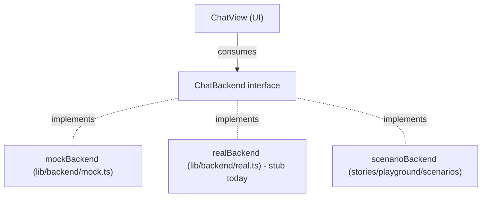

# Playground & Backend Contract

This document is the source of truth for two things:

1. **The streaming contract** every `ChatBackend` honors. The chat surface
   only knows about this contract, never about a specific provider — so the
   internals can churn freely as long as the contract holds.
2. **The Playground stories** in Storybook that exercise the contract through
   a catalog of scenarios (slow streams, errors, multi-function runs, markdown
   stress, etc).

If you're swapping the mock for a real backend, this is the file to read
first. If a scenario fails after your refactor, the contract has drifted —
either fix the backend or update both the scenario and this doc together.

## Quickstart

The Playground and the component spec sheet live in Storybook.

```bash
cd console/web
pnpm storybook
# open http://localhost:6006 → Playground
```

Pick a scenario story from the sidebar, send any message, and watch the
right-hand event log mirror every `StreamEvent` the backend yields. The same
mock contract powers the in-app chat dock in dev (`pnpm dev`).

## Component stories

Storybook is a static gallery of every UI primitive and surface, used to
sanity-check visual changes in isolation. Stories are co-located next to their
component (e.g. [`Select.stories.tsx`](src/components/ui/Select.stories.tsx));
the sidebar groups them under `UI`, `Chat`, `Workers`, `Design`, and
`Playground`.

Alongside the chat primitives (composer, messages, loading, primitives,
typography, color) it covers the worker-configuration surfaces:

| group                | file                                                                                                    | what it shows                                                                                                          |
|----------------------|---------------------------------------------------------------------------------------------------------|------------------------------------------------------------------------------------------------------------------------|
| `UI/Select`          | [`Select.stories.tsx`](src/components/ui/Select.stories.tsx)                                            | the shared `Select`: flat / grouped / disabled, plus the empty-value and ellipsis fixes.                               |
| `Workers/SchemaForm` | [`SchemaForm.stories.tsx`](src/pages/Configuration/tabs/WorkersTab/schema-form/SchemaForm.stories.tsx)  | one live `SchemaForm` per field variation (string/env, number, enum, oneOf, nullable, array, object, dictionary, $ref, errors). |
| `Workers/WorkersTab` | [`WorkersTab.stories.tsx`](src/pages/Configuration/tabs/WorkersTab/WorkersTab.stories.tsx)              | the full master-detail editor over mock fixtures: select / edit / dirty / reset / save, including the inline error path. |

The mock schemas and configs live in
[`worker-fixtures.ts`](src/stories/fixtures/worker-fixtures.ts).
Stories that render env-template string inputs are wrapped in a `.workers-tab`
container (the `WorkersTabDecorator` in
[`decorators.tsx`](src/stories/decorators.tsx)) so the Lexical pill styling
(scoped to that class in `index.css`) applies. The worker-config harness
simulates `configuration::set` with `mockValidate` — saving `telemetry` with
`sample_rate > 1`, or clearing the `database` url, drives the inline
validation-error path.

### Select fixes documented here

`UI/Select` is the regression surface for two
[`Select`](src/components/ui/Select.tsx) fixes:

- **Empty / unmatched values render the placeholder**, not the raw token. A
  value of `undefined` (or any id absent from the options) no longer prints
  "undefined". `allowEmpty` adds a leading clear option that fires `onClear`;
  the schema-form `EnumField` uses it for optional enums (clearing to `null`).
- **Long labels ellipsis** instead of stretching the trigger and pushing the
  chevron off-screen.

## The streaming contract

Every backend implements:

```ts
export interface ChatBackend {
  readonly id: string
  stream(
    prompt: string,
    mode: Mode,
    model: ModelId,
    opts?: ChatStreamOptions,
  ): AsyncGenerator<StreamEvent>
}
```

The generator yields `StreamEvent`s in this taxonomy:

| event              | payload                                   | when                                       |
|--------------------|-------------------------------------------|--------------------------------------------|
| `thought-start`    | —                                         | a thought block is opening                  |
| `thought-token`    | `{ token: string }`                       | one chunk of the thought body               |
| `thought-end`      | `{ durationMs: number }`                  | the thought block has finished              |
| `fcall-start`      | `{ functionId, input, pendingApproval? }` | a function call begins (or awaits approval) |
| `fcall-end`        | `{ output, durationMs }`                  | the function call resolved                  |
| `assistant-token`  | `{ token: string }`                       | one chunk of the assistant body             |
| `assistant-end`    | —                                         | the assistant body has finished             |

### Ordering rules

1. A `thought-start` is always followed by zero or more `thought-token`
   events and then exactly one `thought-end`. Backends never interleave a
   thought with another phase.
2. An `fcall-start` is always paired with exactly one matching `fcall-end`.
   Multiple `fcall-*` pairs may appear back-to-back; the consumer resets its
   pointer between pairs (see `multi-function-agent`).
3. `assistant-token`s may be empty or whitespace-only; the consumer treats
   them as opaque appends.
4. `assistant-end` is the terminal event for that turn. After yielding it,
   the generator returns.
5. A turn may legally contain *no* thought block, *no* function calls, or
   *no* assistant body. The minimum legal turn is a single `assistant-end`
   on an empty body.

### Abort semantics

The caller passes an `AbortSignal` via `opts.signal`. Backends MUST:

- Check `signal.aborted` between async waits and stop iterating early.
- Treat the signal as advisory: emitting a partial sequence is fine, the
  consumer's `finally` cleans up streaming flags. No special "aborted"
  event is required.
- Optionally throw a `DOMException('...', 'AbortError')` to signal that the
  backend itself initiated the abort. The chat surface treats AbortError as
  benign; any other thrown error is logged.

### Error semantics

There are two distinct shapes for failures:

- **Soft errors** (the call ran but didn't succeed) ride on `fcall-end`'s
  `output` field. The convention is `{ error: { kind, message, ... } }`.
  The `error-on-fcall` scenario asserts this. Backends should prefer this
  shape over thrown exceptions for anything the user can act on.
- **Hard errors** (the stream itself broke) are thrown out of the generator.
  The chat surface logs them and returns the surface to "ready" state.

## The seam



The seam is `chat-app/src/lib/backend/`:

- [`types.ts`](src/lib/backend/types.ts) — the contract types: `StreamEvent`,
  `ChatStreamOptions`, `ChatBackend`.
- [`mock.ts`](src/lib/backend/mock.ts) — three canned bodies, jittered token
  delays, abort-aware sleeps. Used in dev; tree-shaken from prod builds.
- [`real.ts`](src/lib/backend/real.ts) — stub that throws
  `'backend not configured'`. Replace its body with your provider; preserve
  the `ChatBackend` shape and you're done.
- [`index.ts`](src/lib/backend/index.ts) — `getDefaultBackend()` returns the
  mock when `import.meta.env.DEV`, otherwise the real backend.

The chat page imports `getDefaultBackend()` once at module load and passes
it to `ChatView` as a prop. Nothing else in the app depends on the choice.

## Scenarios

Each scenario is a `ChatBackend` exported from
[`stories/playground/scenarios/`](src/stories/playground/scenarios/). The
registry in [`scenarios/index.ts`](src/stories/playground/scenarios/index.ts)
groups them; each group maps to a `Playground/*.stories.tsx` file, so every
scenario shows up as its own story in the Storybook sidebar.

| id                  | group         | what it asserts                                                              |
|---------------------|---------------|------------------------------------------------------------------------------|
| `happy-plan`        | happy paths   | thought + assistant body, no function calls.                                 |
| `happy-ask`         | happy paths   | assistant body only, no thought, no function calls.                          |
| `happy-agent`       | happy paths   | thought + one function call + assistant body.                                |
| `multi-function-agent`  | agent         | three sequential `fcall-*` pairs — exercises pointer reset in `ChatView`.    |
| `pending-approval`  | agent         | `pendingApproval: true` lifecycle: pending → running → done.                 |
| `abort-mid-thought` | failure modes | half a thought, then `throw new DOMException('...', 'AbortError')`.          |
| `error-on-fcall`    | failure modes | `fcall-end.output = { error: { kind: 'rate_limited' } }`.                    |
| `slow-tokens`       | timing        | ~200ms between assistant tokens — watch for cursor flicker.                  |
| `fast-tokens`       | timing        | ~5ms between assistant tokens — stresses the patch path.                    |
| `long-markdown`     | markdown      | ~4kB body: headings, lists, tables, fenced code in 3 langs.                  |
| `markdown-stress`   | markdown      | nested lists, footnotes, autolinks, hard breaks, busy GFM tables.            |

This list is the regression suite. Wiring a real backend without breaking
any of these scenarios means the chat surface continues to render correctly.

## Agent turn layouts (exploration)

When a turn fans out into multiple `fcall-*` pairs (today's `multi-function-agent`
scenario, tomorrow's real harness), the current renderer stacks each call as
its own bordered box in
[`MessageList`](src/components/chat/MessageList.tsx). Five functions is five
boxes; the user's prompt and the eventual assistant reply scroll way out of
view, and there's no visual hint that the calls belong to the same turn.

Every proposal below is a **pure render concern** over the existing
`Message[]`. None of them require changes to the `StreamEvent` contract,
the `Message` schema, or the scenario catalog — only to how `MessageList`
arranges what it already has. They differ on how aggressively they push
toward the "message always present, function activity on the side, both equally
important" direction.

### Proposal A — Grouped function accordion (shipping in this round)

Consecutive `function-call` messages collapse into one bordered accordion
in the message flow. Single-call runs stay rendered as a standalone
[`FunctionCallMessage`](src/components/chat/FunctionCallMessage.tsx).

```
┌─[chat column]──────────────────────┐
│ you ›                              │
│   how do i probe worker-7?         │
│                                    │
│ ▸ thought briefly                  │
│                                    │
│ ┌────────────────────────────────┐ │
│ │ ▸ ● running function 2 of 3:       │ │  ← header is live; one
│ │     ƒ engine::info             │ │    box, one accordion
│ └────────────────────────────────┘ │
│                                    │
│ › assistant reply…                 │
└────────────────────────────────────┘

expanded body:
  ▾ ● running function 2 of 3: ƒ engine::info
  ─────────────────────────────────────────
    ✓  ƒ engine::list   for 450ms
    ●  ƒ engine::info   running…
    ·  ƒ engine::echo   queued
```

- **Header label** (priority order): `permission to run ƒ <name>` ·
  `running function i of N: ƒ <name>` · `N functions failed` · `ran N functions for
  <sum>ms`.
- **StatusDot tone** reflects worst-current-state: `warn` (pending),
  `accent` + pulse (running), `alert` (any errored output), `ink` (done).
- **Default open** while any child is pending/running/errored; respects
  user toggle once everything settles.
- **Files touched**: new
  [`FunctionCallGroup.tsx`](src/components/chat/FunctionCallGroup.tsx),
  new `embedded` prop on `FunctionCallMessage`, grouping helper inside
  `MessageList`.
- **Pros**: minimal change, no layout work, immediate noise reduction,
  fully revertible (storage stays flat).
- **Cons**: partial win — the user's prompt still scrolls away if the
  group expands and the reply is long. Doesn't satisfy "side by side".

#### Live backend

The same renderer runs unchanged over `realBackend`'s output. Two
contract-honoring details connect the harness to the group's header:

- **Durations are server-side.** `function_execution_end` carries a
  required `duration_ms: number` field, captured by the orchestrator
  between the matching `function_execution_start` and end emits and
  persisted on `ExecutedEntry` so resumed runs replay the original
  timing instead of ~0ms. [`translate.ts`](src/lib/backend/translate.ts)
  reads `event.duration_ms` directly — no client-side timing map. The
  group's `ran N functions for <sum>ms` header sums these per-child
  durations. Approval wait time is excluded by design: pending calls
  discard their timer, and the resumed step starts a new one.
- **Errors land on the canonical shape.** When the harness sets
  `is_error: true`, [`translate.ts`](src/lib/backend/translate.ts) wraps
  the `FunctionResult` into `{ error: { kind: 'function_error',
  message, details, content } }` (matching the `approval_resolved` deny
  branch and the [Error semantics](#error-semantics) contract). The
  group's `isErrorOutput()` then picks it up and bumps the
  `N functions failed` counter.

### Proposal B — Right-hand function activity pane

Add a third column to the chat surface (after `Sidebar | Chat`).
Individual `function-call` messages stop rendering in the main column;
instead a small `ran N functions ↗` chip appears inside the assistant message
that linked them. The pane is a persistent vertical timeline of function
calls for the active conversation.

```
┌─sidebar──┬─chat column─────────┬─function pane─────────┐
│ convo 1  │ you ›               │ functions (3)         │
│ convo 2  │   how do i probe…?  │ ─────────────────  │
│ * convo3 │                     │ ✓ engine::list    │
│          │ ▸ thought briefly   │   450ms           │
│          │                     │ ● engine::info    │
│          │ › assistant reply…  │   running…        │
│          │   ran 3 functions ↗     │ · engine::echo    │
│          │                     │   pending         │
└──────────┴─────────────────────┴───────────────────┘
              ↑                              ↑
        prose stays clean             live timeline never
        and full width                leaves the viewport
```

- **Files touched**: new `FunctionActivityPane.tsx`, layout split in
  `Chat.tsx` (or a new `ChatLayout`), filter in `MessageList` to skip
  standalone fcalls, new inline chip in `Message.tsx`'s assistant
  renderer, hash anchor or shared `useFunctionPane` hook so the chip can
  scroll the pane to the right call.
- **Pros**: most literal answer to "both equally important, on the side".
  Function activity is always visible without competing with prose.
- **Cons**: largest implementation cost. Needs collapse behavior for
  narrow viewports. Splits the surface in half on mobile.
- **Best-fit follow-up to this round.**

### Proposal C — Two-column turn block

Each agent turn (thought → fcalls → assistant) becomes one bordered block
split into two columns: function activity on the left, reply on the right.
The block is self-contained, so the reply is always adjacent to the
activity that produced it. Pre-turn user messages and post-turn replies
stay as flat rows above/below.

```
┌────────────────────────────────────────────┐
│ you ›                                      │
│   how do i probe worker-7?                 │
└────────────────────────────────────────────┘

┌─agent turn────────────────────────────────┐
│ ▸ thought briefly · ran 3 functions · 1.3s    │
├─functions (left)───────┬─reply (right)────────┤
│ ✓ engine::list 450 │ ## probe complete    │
│ ✓ engine::info 500 │ ran three functions…     │
│ ✓ engine::echo 350 │ all returned cleanly │
└────────────────────┴──────────────────────┘
```

- **Files touched**: new `AgentTurnBlock.tsx`, turn-segmentation helper
  inside `MessageList` (walks `Message[]` and packages each turn that
  contains at least one fcall), layout tweaks to keep the block readable
  at the current `max-w-[760px]`.
- **Pros**: clear turn boundaries; reply and functions sit at equal weight
  inside one frame; no full-layout change to the surface.
- **Cons**: needs turn segmentation logic (a turn is "everything from the
  end of the last user/assistant boundary up to and including the next
  `assistant-end`"). Stretches the chat column width assumption.

### Proposal D — Gutter trace markers

Function calls compress to status dots in the left gutter of the message
column (like a code-review gutter). The assistant reply gets the full
column width, uninterrupted. Hovering or clicking a dot reveals
input/output in a popover.

```
┌─[chat column]──────────────────────────────┐
│       you ›                                │
│         how do i probe worker-7?           │
│                                            │
│       ▸ thought briefly                    │
│                                            │
│  ●─── › assistant reply…                   │  ← marker hovered:
│  │       opens popover:                    │
│  │       ┌────────────────────┐            │
│  │       │ ƒ engine::list     │            │
│  │       │   input: {}        │            │
│  │       │   ✓ 450ms          │            │
│  │       └────────────────────┘            │
│  ●───                                      │
│  ●───                                      │
└────────────────────────────────────────────┘
```

- **Files touched**: new `GutterTrace.tsx` (absolute-positioned column
  anchored to the assistant message), popover primitive (none in
  `components/ui` today — would need a floating-ui wrapper), filter in
  `MessageList` to skip standalone fcalls.
- **Pros**: prose gets primacy without losing access to function detail.
  Visually quiet during long agent turns.
- **Cons**: discovery is poor — markers are easy to miss. Popover
  primitive is net-new. Doesn't render the *current* activity in a
  glance the way the pane (B) does.

### Proposal E — Sticky turn header + inline function strip

While a turn is in flight, the user's prompt becomes sticky at the top
of the message viewport and a compact horizontal chip strip of function calls
sits directly under it. Once the turn ends, the sticky behavior releases
and the block joins the normal flow.

```
┌─sticky─[user prompt stays anchored]────────┐
│ you ›                                      │
│   how do i probe worker-7?                 │
├────────────────────────────────────────────┤
│ [✓ list 450] [● info…] [· echo]            │  ← horizontal chip strip
└────────────────────────────────────────────┘
┌─[scrolls below the sticky]─────────────────┐
│ ▸ thought briefly                          │
│                                            │
│ › assistant reply…                         │
│                                            │
└────────────────────────────────────────────┘
```

- **Files touched**: `MessageList.tsx` grows a sticky region driven by
  `isStreaming`, new `FunctionStripChip` component, optional thoughts move
  below the sticky.
- **Pros**: cheapest path to "message always present" — the intent never
  leaves the viewport during the turn.
- **Cons**: sticky regions stack weirdly with the existing scrollable
  composer + header. Chip strip is a new affordance the rest of the
  surface doesn't echo.

### Comparison

| proposal                         | preserves contract | message in view             | impl cost |
| -------------------------------- | ------------------ | --------------------------- | --------- |
| A. grouped accordion             | yes                | partial (less push)         | S         |
| B. right-hand function pane          | yes                | yes (separate column)       | L         |
| C. two-column turn block         | yes                | yes (within turn block)     | M         |
| D. gutter trace markers          | yes                | yes (full-width reply)      | M         |
| E. sticky turn header + strip    | yes                | yes (anchored at top)       | M         |

**This round ships A.** It's the cheapest cut that removes the immediate
noise from `multi-function-agent`-style fan-outs, lands without any layout
change, and leaves the bigger redesigns documented and unblocked.
**Proposal B is the strongest match for the "side by side, both equally
important" direction** and is the most likely follow-up.

## Dev vs prod backend

There's no build-time flag anymore. The Playground and the component spec
sheet are Storybook-only — their stories, the scenarios, the `EventLog`, and
the fixtures all live under [`src/stories/`](src/stories) and are never part
of the app's module graph, so they can't leak into the production bundle.

The one runtime choice left is which backend the **in-app chat dock** uses:

| build               | `getDefaultBackend()` | effect                                     |
|---------------------|-----------------------|--------------------------------------------|
| dev (`pnpm dev`)    | `mockBackend`         | canned streaming, no API keys.             |
| prod (`pnpm build`) | `realBackend`         | the stub you replace with a real provider. |

[`src/lib/backend/index.ts`](src/lib/backend/index.ts) keys off
`import.meta.env.DEV`, which Vite/Rolldown inlines as a literal at build time,
so `mockBackend` (and its transitive imports) is dropped by tree-shaking in
production.

### Verifying a prod build is clean

```bash
pnpm build
# the scenario ids live in Storybook only, so none should appear in the app
# bundle:
grep -E '"happy-(plan|ask|agent)"|"abort-mid-thought"|"long-markdown"' dist/assets/*.js && echo "LEAK" || echo "clean"
```

Storybook builds separately: `pnpm build-storybook` emits `storybook-static/`,
which is git-ignored and never embedded into the `console` binary.

## Adding a new scenario

Four steps. Average size is 30–60 lines.

1. Create `src/stories/playground/scenarios/<id>.ts`. Use the helpers from
   [`scenarios/helpers.ts`](src/stories/playground/scenarios/helpers.ts):

   ```ts
   import { makeBackend, streamAssistant, streamThought } from './helpers'

   export const myScenario = makeBackend(
     'my-scenario',
     async function* (_prompt, _mode, _model, opts) {
       yield* streamThought('reasoning…', { signal: opts?.signal })
       yield* streamAssistant('answer…', { signal: opts?.signal })
     },
   )
   ```

2. Register it in
   [`scenarios/index.ts`](src/stories/playground/scenarios/index.ts):

   ```ts
   import { myScenario } from './my-scenario'

   export const SCENARIOS: PlaygroundScenario[] = [
     // ...
     {
       id: 'my-scenario',
       label: 'my scenario',
       description: 'one sentence about what this asserts.',
       group: 'happy paths',
       preferredMode: 'agent',
       backend: myScenario,
     },
   ]
   ```

3. Surface it as a story. Add an export to the group's
   `Playground/*.stories.tsx` file (e.g. `HappyPaths.stories.tsx`), or create a
   new group file if you added a new `ScenarioGroup`:

   ```ts
   export const MyScenario: Story = scenarioStory('my-scenario')
   ```

4. Add a row to the table in [the Scenarios section](#scenarios) of this
   doc. The table is the regression contract — keep it in sync.

## Out of scope

- **The real backend's transcript path.** [`real.ts`](src/lib/backend/real.ts)
  no longer streams transcript content through `StreamEvent`s — text/thought
  tokens render from session-manager events (`session::message_updated`
  snapshots) reconciled by `use-conversations` + `lib/sessions/entry-mapper`.
  The real backend's stream carries only ephemeral turn state (approvals,
  function-call lifecycle, stop-reason notices, agent_end). Mock scenario
  backends still exercise the full `StreamEvent` surface below, and ChatView
  keeps rendering all of it — that is exactly what these stories pin.
- **Persisting playground conversations.** They're ephemeral by design;
  the real chat surface persists conversations in the session-manager
  worker (not localStorage).
- **CI assertions on the prod bundle.** Documented above as a manual step;
  not enforced automatically.
