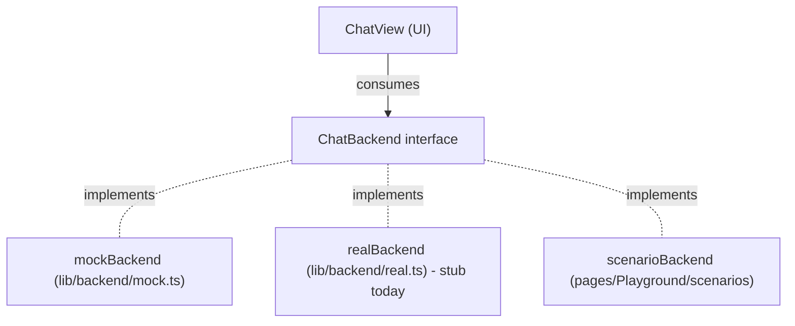

# Playground & Backend Contract

This document is the source of truth for two things:

1. **The streaming contract** every `ChatBackend` honors. The chat surface
   only knows about this contract, never about a specific provider — so the
   internals can churn freely as long as the contract holds.
2. **The Playground page** that exercises the contract through a catalog of
   scenarios (slow streams, errors, multi-tool runs, markdown stress, etc).

If you're swapping the mock for a real backend, this is the file to read
first. If a scenario fails after your refactor, the contract has drifted —
either fix the backend or update both the scenario and this doc together.

## Quickstart

The Playground (and the Examples spec sheet) ship behind a build-time flag.

```bash
# dev: flag is on by default (set in .env.development)
npm run dev
# open #/playground
```

In dev, the header has a `chat / playground / examples` toggle. Pick a
scenario from the left rail, send any message, and watch the right-hand
event log mirror every `StreamEvent` the backend yields.

## The streaming contract

Every backend implements:

```ts
export interface ChatBackend {
  readonly id: string
  stream(
    prompt: string,
    mode: Mode,
    model: ModelId,
    opts?: ChatStreamOptions,
  ): AsyncGenerator<StreamEvent>
}
```

The generator yields `StreamEvent`s in this taxonomy:

| event              | payload                                   | when                                       |
|--------------------|-------------------------------------------|--------------------------------------------|
| `thought-start`    | —                                         | a thought block is opening                  |
| `thought-token`    | `{ token: string }`                       | one chunk of the thought body               |
| `thought-end`      | `{ durationMs: number }`                  | the thought block has finished              |
| `fcall-start`      | `{ functionId, input, pendingApproval? }` | a function call begins (or awaits approval) |
| `fcall-end`        | `{ output, durationMs }`                  | the function call resolved                  |
| `assistant-token`  | `{ token: string }`                       | one chunk of the assistant body             |
| `assistant-end`    | —                                         | the assistant body has finished             |

### Ordering rules

1. A `thought-start` is always followed by zero or more `thought-token`
   events and then exactly one `thought-end`. Backends never interleave a
   thought with another phase.
2. An `fcall-start` is always paired with exactly one matching `fcall-end`.
   Multiple `fcall-*` pairs may appear back-to-back; the consumer resets its
   pointer between pairs (see `multi-tool-agent`).
3. `assistant-token`s may be empty or whitespace-only; the consumer treats
   them as opaque appends.
4. `assistant-end` is the terminal event for that turn. After yielding it,
   the generator returns.
5. A turn may legally contain *no* thought block, *no* function calls, or
   *no* assistant body. The minimum legal turn is a single `assistant-end`
   on an empty body.

### Abort semantics

The caller passes an `AbortSignal` via `opts.signal`. Backends MUST:

- Check `signal.aborted` between async waits and stop iterating early.
- Treat the signal as advisory: emitting a partial sequence is fine, the
  consumer's `finally` cleans up streaming flags. No special "aborted"
  event is required.
- Optionally throw a `DOMException('...', 'AbortError')` to signal that the
  backend itself initiated the abort. The chat surface treats AbortError as
  benign; any other thrown error is logged.

### Error semantics

There are two distinct shapes for failures:

- **Soft errors** (the call ran but didn't succeed) ride on `fcall-end`'s
  `output` field. The convention is `{ error: { kind, message, ... } }`.
  The `error-on-fcall` scenario asserts this. Backends should prefer this
  shape over thrown exceptions for anything the user can act on.
- **Hard errors** (the stream itself broke) are thrown out of the generator.
  The chat surface logs them and returns the surface to "ready" state.

## The seam



The seam is `chat-app/src/lib/backend/`:

- [`types.ts`](src/lib/backend/types.ts) — the contract types: `StreamEvent`,
  `ChatStreamOptions`, `ChatBackend`.
- [`mock.ts`](src/lib/backend/mock.ts) — three canned bodies, jittered token
  delays, abort-aware sleeps. Imported only when `VITE_PLAYGROUND` is on.
- [`real.ts`](src/lib/backend/real.ts) — stub that throws
  `'backend not configured'`. Replace its body with your provider; preserve
  the `ChatBackend` shape and you're done.
- [`index.ts`](src/lib/backend/index.ts) — `getDefaultBackend()` picks one or
  the other based on the build-time flag.

The chat page imports `getDefaultBackend()` once at module load and passes
it to `ChatView` as a prop. Nothing else in the app depends on the choice.

## Scenarios

Each scenario is a `ChatBackend` exported from
[`pages/Playground/scenarios/`](src/pages/Playground/scenarios/). The
registry in [`scenarios/index.ts`](src/pages/Playground/scenarios/index.ts)
groups them and exposes them to the picker.

| id                  | group         | what it asserts                                                              |
|---------------------|---------------|------------------------------------------------------------------------------|
| `happy-plan`        | happy paths   | thought + assistant body, no function calls.                                 |
| `happy-ask`         | happy paths   | assistant body only, no thought, no function calls.                          |
| `happy-agent`       | happy paths   | thought + one function call + assistant body.                                |
| `multi-tool-agent`  | agent         | three sequential `fcall-*` pairs — exercises pointer reset in `ChatView`.    |
| `pending-approval`  | agent         | `pendingApproval: true` lifecycle: pending → running → done.                 |
| `abort-mid-thought` | failure modes | half a thought, then `throw new DOMException('...', 'AbortError')`.          |
| `error-on-fcall`    | failure modes | `fcall-end.output = { error: { kind: 'rate_limited' } }`.                    |
| `slow-tokens`       | timing        | ~200ms between assistant tokens — watch for cursor flicker.                  |
| `fast-tokens`       | timing        | ~5ms between assistant tokens — stresses the patch path.                    |
| `long-markdown`     | markdown      | ~4kB body: headings, lists, tables, fenced code in 3 langs.                  |
| `markdown-stress`   | markdown      | nested lists, footnotes, autolinks, hard breaks, busy GFM tables.            |

This list is the regression suite. Wiring a real backend without breaking
any of these scenarios means the chat surface continues to render correctly.

## Flag plumbing

A single env var, `VITE_PLAYGROUND`, controls visibility:

| file                | value     | effect                                              |
|---------------------|-----------|-----------------------------------------------------|
| `.env.development`  | `1`       | dev defaults: Playground + Examples + mock shipped. |
| `.env.production`   | empty     | prod defaults: pages and mock tree-shaken.          |

The flag is consumed in three places:

1. [`src/App.tsx`](src/App.tsx) — `lazy()`-wraps the Playground and Examples
   pages and only registers the routes when the flag is truthy.
2. [`src/hooks/use-hash-route.ts`](src/hooks/use-hash-route.ts) — `#/playground`
   and `#/examples` resolve to `chat` when the flag is off, so old deep links
   degrade gracefully.
3. [`src/lib/backend/index.ts`](src/lib/backend/index.ts) — `getDefaultBackend()`
   returns the mock when the flag is on, otherwise the real backend stub.

Vite/Rolldown inlines `import.meta.env.VITE_PLAYGROUND` as a literal at
build time. The dead branch (and every transitive import) is then dropped
by tree-shaking.

### Verifying a prod build is clean

```bash
npm run build
# expect: a single index-*.js, no Playground-*.js or Examples-*.js chunks

# none of these strings should appear in dist/assets/*.js:
grep -E '"happy-(plan|ask|agent)"|"abort-mid-thought"|"long-markdown"' dist/assets/*.js && echo "LEAK" || echo "clean"
```

A flag-on build (`VITE_PLAYGROUND=1 npm run build`) emits separate
`Playground-*.js` and `Examples-*.js` chunks — that's the expected dev/staging
layout, not the production layout.

## Adding a new scenario

Three steps. Average size is 30–60 lines.

1. Create `src/pages/Playground/scenarios/<id>.ts`. Use the helpers from
   [`scenarios/helpers.ts`](src/pages/Playground/scenarios/helpers.ts):

   ```ts
   import { makeBackend, streamAssistant, streamThought } from './helpers'

   export const myScenario = makeBackend(
     'my-scenario',
     async function* (_prompt, _mode, _model, opts) {
       yield* streamThought('reasoning…', { signal: opts?.signal })
       yield* streamAssistant('answer…', { signal: opts?.signal })
     },
   )
   ```

2. Register it in
   [`scenarios/index.ts`](src/pages/Playground/scenarios/index.ts):

   ```ts
   import { myScenario } from './my-scenario'

   export const SCENARIOS: PlaygroundScenario[] = [
     // ...
     {
       id: 'my-scenario',
       label: 'my scenario',
       description: 'one sentence about what this asserts.',
       group: 'happy paths',
       preferredMode: 'agent',
       backend: myScenario,
     },
   ]
   ```

3. Add a row to the table in [the Scenarios section](#scenarios) of this
   doc. The table is the regression contract — keep it in sync.

## Out of scope

- **Implementing the real backend.** [`real.ts`](src/lib/backend/real.ts) is
  a stub that throws. Replace its body when you wire your provider; respect
  the contract and nothing else changes.
- **Persisting playground conversations.** They're ephemeral by design; the
  `localStorage` path in [`lib/storage.ts`](src/lib/storage.ts) is reserved
  for the real chat surface.
- **CI assertions on the prod bundle.** Documented above as a manual step;
  not enforced automatically.
