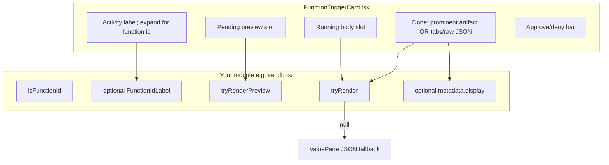

# Custom function components

How to add bespoke UI for `function-trigger` messages in the console chat, instead of the default request/response JSON panes.

To customize a trigger such as `cron` across registration, firing, and
retirement — source section, compact timeline display, or complete expanded
details — use [`custom-trigger-components.md`](custom-trigger-components.md)
and `host.triggerRenderers` instead. Do not match
`engine::register_trigger` as though each trigger type were a function family.

**Reference implementations:** `shell/ui/` (worker-owned file-change artifact), `browser/ui/` (worker-owned screenshots), and `src/components/chat/sandbox/` (first-party terminal cards).

**Definition of done:** A custom renderer is not complete until it ships with **both** dev surfaces below — static cards on **Examples** and at least one interactive **Playground** scenario. Do not merge UI-only changes without playground coverage.

---

## How it works today

Every tool invocation becomes a `FunctionTriggerMessage` (`src/types/chat.ts`). `FunctionTriggerCard.tsx` renders:

1. **Header** — status dot, the agent's short activity description (or a legacy function-id fallback), and duration. Expanding it reveals the concrete function id.
2. **Body** — depends on lifecycle and whether a custom renderer returned a node.
3. **Pending bar** — approve/deny (unchanged by custom renderers).

Default body = two `ValuePane`s (request + response) with `JsonHighlight`.

Custom renderers opt in by returning a React node from `tryRender` / `tryRenderPreview`. If they return `null`, the ordered registry falls through. A renderer may set `metadata: { display: true }` to keep a successful rich result visible while the raw call details remain collapsed.



Injected worker renderers register through `host.functionTriggers` and dispatch before first-party renderers. The host calls `tryRender*` only when `isMatch(functionId)` returns true; among matching renderers, the first non-null node wins, and presentation metadata is read from that same winning renderer.

---

## Message contract

```typescript
// src/types/chat.ts
interface FunctionTriggerMessage extends BaseMessage {
  role: 'function-trigger'
  functionId: string      // e.g. "sandbox::exec", "shell::run"
  description?: string    // short activity from agent_trigger; absent on history
  input: unknown
  output?: unknown
  durationMs?: number
  running?: boolean
  pendingApproval?: boolean
  functionCallId?: string // for approval::resolve
  sessionId?: string
}
```

| State | Flags | What the custom UI should do |
|-------|--------|------------------------------|
| Pending approval | `pendingApproval: true` | Show `tryRenderPreview` only; return `null` from `tryRender`. Keep approve/deny bar as-is. |
| Running | `running: true`, not pending | `tryRender` with `running` prop or equivalent; hide request JSON when you own the body. |
| Done | neither flag | `tryRender` for success/error. By default the card adds custom + **raw json** tabs; `metadata.display` promotes the custom result into the collapsed chat flow. |
| Failed | `output` set, parse as error | Return error UI from `tryRender` before success parsers (see sandbox `parseSandboxErrorDisplay`). |

Wire shapes come from the harness/engine. They are not normalized in the UI layer except inside your parsers.

---

## Payload shapes to plan for

### 1. Raw handler JSON

What the Rust/Python handler returns, e.g. sandbox `ExecResponse`:

```json
{ "stdout": "...", "stderr": "", "exit_code": 0, "duration_ms": 41 }
```

### 2. Harness agent envelope

Added by `workers/harness/src/turn-orchestrator/agent-trigger.ts` for many agent turns:

```json
{
  "content": [{ "type": "text", "text": "..." }],
  "details": { /* actual payload */ },
  "terminate": true
}
```

Always unwrap before Zod parsing. Sandbox helper:

```typescript
// sandbox/parsers.ts — unwrapEnvelope(value)
```

### 3. Structured sandbox errors (`SandboxErrorWire`)

Flat object inside `details` (or raw output):

```json
{
  "type": "exec_timeout",
  "code": "S200",
  "message": "...",
  "docs_url": "https://...",
  "retryable": true,
  "fix": { ... },
  "fix_note": "..."
}
```

### 4. Transport / gate / `function_error` wrapper

What you see when invocation fails before the handler body is parsed, e.g. `gate_unavailable`:

```json
{
  "error": {
    "kind": "function_error",
    "message": "trigger_failed: ... {\"code\":\"S220\",...}",
    "details": {
      "status": "denied",
      "denied_by": "gate_unavailable",
      "function_id": "sandbox::fs::write",
      "reason": "..."
    },
    "content": [{ "type": "text", "text": "..." }]
  }
}
```

Sandbox centralizes this in `parseSandboxErrorDisplay()` → `SandboxErrorView` (`ErrorView.tsx`). Reuse or mirror for your domain if the same translate layer is used.

---

## Recommended module layout

Mirror `sandbox/` for a new function family (example: `myfeature/`):

```
src/components/chat/myfeature/
  index.tsx           # dispatcher: isMyFeature, tryRender, tryRenderPreview, MyFeatureFunctionIdLabel
  parsers.ts          # Zod schemas + unwrapEnvelope + safeParseRequest/Response + error parsing
  format.ts           # display helpers (bytes, paths, durations) — optional
  ErrorView.tsx       # domain errors — optional if you reuse a shared error module
  SomeToolView.tsx    # one component per function_id (or grouped by shape)
  shared.tsx          # Chip, MetaRow, StatusPill — or import from sandbox/shared.tsx
  __tests__/
    parsers.test.ts   # envelope unwrap + every schema + error cases
```

### Dispatcher API (`index.tsx`)

Export a single object (same shape as `SandboxToolView`):

| Method | When called | Contract |
|--------|-------------|----------|
| `isMyFeature(functionId)` | Optional; FCM/registry routing | Explicit `Set` of ids — avoid broad regex. |
| `tryRender(message)` | Not pending; running or done | `ReactNode \| null`. Check errors first, then `switch (functionId)`. |
| `tryRenderPreview(message)` | `pendingApproval` | Compact approval UI; `null` → request JSON shown. |
| `MyFeatureFunctionIdLabel` | Header | Optional muted prefix (`myfeature::` + tail). |

Inside `tryRender`:

1. Return `null` if `!isMyFeature(message.functionId)` or `message.pendingApproval`.
2. Parse errors from **raw** `message.output` (before unwrap) if your errors sit outside `details`.
3. `const input = unwrapEnvelope(message.input)`.
4. `const output = message.output != null ? unwrapEnvelope(message.output) : undefined`.
5. `safeParseResponse(schema, rawOutput)` when the schema applies to wrapped output (sandbox pattern).

Per-tool views should accept `{ input, output?, running? }` and return `null` internally if parse fails (dispatcher already returned null for unknown ids).

### Parsers (`parsers.ts`)

- One Zod schema per request/response struct (non-strict `.object({...})` for forward compatibility).
- `safeParseRequest` / `safeParseResponse` that unwrap then parse.
- Document wire sources (Rust file paths) in comments like sandbox does.
- Export `SANDBOX_FUNCTION_IDS` equivalent: `MY_FEATURE_FUNCTION_IDS` as `as const` + `Set`.

### Views

- Reuse design tokens: `border-rule`, `bg-paper-2`, `text-ink`, `text-warn`, `font-mono` for technical chrome, `font-code` for source code, `Badge`, `Cell`, `EmptyState`.
- Shared terminal chrome: copy `sandbox/terminal/Terminal.tsx` + `AnsiOutput.tsx` for command-like tools.
- Code blocks: `CodeHighlight` from `src/lib/syntax.tsx` (or `sandbox/CodeHighlight.tsx`).
- Running state: same shell as done, body shows muted `executing…` (see `ExecView`).

---

## Checklist: add a new custom function family

### 1. Inventory function IDs

List every `function_id` the agent can call (from engine catalog, skills, or `functions-catalog.ts`). Add them to an explicit allowlist in `index.tsx`.

### 2. Define Zod schemas

Align with handler JSON in the worker/engine repo. Add tests with:

- Raw payload
- Harness-wrapped payload (`wrapHarness` helper like `sandbox-fixtures.ts`)
- Error/gate fixtures

### 3. Implement views

One renderer per tool (or per response shape). Include:

- Success path
- `running` prop
- Optional `*Preview` for approval (high-value for destructive or costly ops)

### 4. Register through injectable UI

Worker-owned UI is the default for new worker functions:

```tsx
import type { FunctionTriggerRenderer, Host } from '@iii-dev/console-ui'

const renderer: FunctionTriggerRenderer = {
  id: 'myfeature/page.js#result',
  isMatch: (functionId) => functionId === 'myfeature::do-thing',
  tryRender: (message) => renderResult(message),
  tryRenderRunning: (message) => renderRunning(message),
  tryRenderPreview: (message) => renderApprovalPreview(message),
  tryRenderDisplay: (message) => renderCompactReceipt(message),
  metadata: { display: true }, // only for results worth keeping inline
}

export default function setup(host: Host) {
  host.functionTriggers.register(renderer)
}
```

Register focused renderers before general family renderers. `display` is honored only when that renderer actually returns a non-null node, so an image renderer can fall through to a general error renderer without promoting the error card.

When `tryRenderDisplay` is present, the host uses that compact surface in the feed and keeps `tryRender` as its detail body. Set `metadata.displayAction: 'expand'` to make one continuous collapsible card: the display surface remains mounted as the card header while `tryRender` expands underneath it, followed by the host-owned raw JSON tab. The display surface must not render its own outer card or interactive controls in this mode; the host owns the surface, focus target, padding, and transition. Leave `displayAction` unset when the compact surface owns another action, such as opening a child session.

For artifacts that have a deeper worker-owned view, make a focused area a
real button and open the registered page through the host:

```tsx
<button
  onClick={() =>
    host.panels?.open({
      pageId: 'myfeature',
      context: { type: 'result', resultId },
    })
  }
>
  inspect result
</button>
```

The console reuses an already-open page or places it beside chat without
replacing an existing pane. The target page receives `panelContext` in its
`PageRenderProps`; react to `panelContext.id`, not only object identity, so a
second click on the same item still opens it. Keep the payload JSON-sized and
send opaque ids for content that the page can fetch lazily. The shell
file-change renderer is the reference: filename → exact snapshot diff, and
“View file” → Monaco editor.

### 5. Storybook stories (required)

Every component variant and streaming scenario lives in Storybook. Run
`pnpm storybook` in `console/web`. A new function renderer needs two kinds of
story:

| Kind | Where | Purpose |
|------|-------|---------|
| **Fixture story** | `src/components/chat/FunctionCallMessage.stories.tsx` | Static spec sheet — every variant visible at once, no send button. Best for pixel-polishing a single card (pending, running, done, errors). |
| **Playground story** | `src/stories/playground/*.stories.tsx` | Live chat driven by a `ChatBackend` scenario — exercises the streaming contract (`fcall-start` → `fcall-end`) and the event-log rail. Best for lifecycle and regression before a real backend. |

See [`PLAYGROUND.md`](../PLAYGROUND.md) for the `StreamEvent` contract.

#### 5a. Fixtures — one card per tool (required)

Create `src/stories/fixtures/myfeature-fixtures.ts` with a `base()` factory (copy `sandbox-fixtures.ts`). Export:

- One **done** fixture per `function_id` (mix envelope-wrapped and raw payloads).
- Extra fixtures for states your renderer cares about: **pending** (with `pendingApproval: true`), **running**, **error** / gate denial, edge cases (empty output, truncated grep, etc.).

Add a family gallery story in `src/components/chat/FunctionCallMessage.stories.tsx`:

```tsx
import { myfeatureFixtures } from '@/stories/fixtures/myfeature-fixtures'

export const MyFeatureFamily: Story = {
  name: 'myfeature family',
  render: () => <FamilyGallery fixtures={myfeatureFixtures} />,
}
```

Open Storybook → **Chat / FunctionCallMessage / myfeature family** and confirm the **terminal** tab (default) and **raw json** tab for each card.

**Sandbox reference:** `src/stories/fixtures/sandbox-fixtures.ts` + the `SandboxFamily` story in `FunctionCallMessage.stories.tsx`.

#### 5b. Playground — at least one scenario (required)

Add an interactive scenario under `src/stories/playground/scenarios/`. Every new function family needs **at least one** scenario registered in `scenarios/index.ts` so the **Playground** stories exercise it end-to-end.

1. **Create** `myfeature-hero.ts` (name as you like) using `makeBackend` + `streamFcall` from `scenarios/helpers.ts`:

```ts
import { makeBackend, streamAssistant, streamFcall, streamThought } from './helpers'
// Reuse wire payloads from the fixtures when possible:
import { sandboxExecDone } from '@/stories/fixtures/sandbox-fixtures'

export const myfeatureHero = makeBackend(
  'myfeature-hero',
  async function* (prompt, _mode, _model, opts) {
    const signal = opts?.signal
    yield* streamThought('calling myfeature…', { signal })
    yield* streamFcall({
      functionId: 'myfeature::do_thing',
      input: sandboxExecDone.input,   // or inline realistic JSON
      output: sandboxExecDone.output,
      waitMs: 700,
      signal,
    })
    yield* streamAssistant('done.', { signal })
  },
)
```

2. **Register** in `scenarios/index.ts` (the `group` decides which `Playground/*.stories.tsx` file surfaces it; add an export there if you introduce a new group):

```ts
import { myfeatureHero } from './myfeature-hero'

// Inside SCENARIOS:
{
  id: 'myfeature-hero',
  label: 'myfeature · hero',
  description: 'one myfeature:: call with realistic request/response payloads.',
  group: 'agent', // or add a new ScenarioGroup
  preferredMode: 'agent',
  backend: myfeatureHero,
},
```

3. **Verify:** `pnpm storybook` → open your scenario under **Playground** → send any message → confirm the custom card renders (not JSON-only) and the right-hand event log shows `fcall-start` / `fcall-end`.

**Coverage guidance:**

| Renderer feature | Fixture story | Playground scenario |
|------------------|---------------|---------------------|
| Success / done | per `function_id` | at least one `streamFcall` with success output |
| Pending approval | `pendingApproval: true` | `streamFcall({ pendingApproval: true, approvalWaitMs: … })` — see `pending-approval.ts` |
| Running shimmer | `running: true` | shorten `waitMs` and watch mid-flight (or dedicated scenario) |
| Error / gate | error fixture | `output: { error: … }` — see `error-on-fcall.ts` or `sandboxFsWriteGateError` payloads |

When you add a **new** `function_id` to an existing family, add a fixture (and a gallery story if it's a new family) **and** extend a Playground scenario (or add a focused scenario) so the stories still cover it.

**Sandbox gap:** the fixtures already list all 15 tools; the playground does not yet have a dedicated `sandbox::*` scenario — add `sandbox-exec.ts` (or similar) when touching sandbox as a template for others.

### 6. Tests

```bash
cd console/web
pnpm test -- src/components/chat/myfeature
pnpm typecheck
pnpm build
```

### 7. Lint touched files

```bash
pnpm exec biome check --write \
  src/components/chat/myfeature \
  src/components/chat/FunctionCallMessage.tsx \
  src/components/chat/FunctionCallMessage.stories.tsx \
  src/stories/fixtures/myfeature-fixtures.ts \
  src/stories/playground/scenarios/myfeature-hero.ts \
  src/stories/playground/scenarios/index.ts
```

### 8. Pre-merge smoke (required)

```bash
cd console/web && pnpm storybook
```

- **Chat / FunctionCallMessage** — scroll your new family gallery; toggle **terminal** / **raw json**.
- **Playground** — run your new scenario; approve a pending call if applicable.

---

## `FunctionCallMessage` body logic (reference)

Custom renderers interact with these flags (from `FunctionCallMessage.tsx`):

```tsx
const sandboxPreview = SandboxToolView.tryRenderPreview(message)
const sandboxTerminal = !pending ? SandboxToolView.tryRender(message) : null
const hasSandboxTerminal = sandboxTerminal != null

const showRequestPaneAbove =
  !(pending && sandboxPreview) &&
  !(running && hasSandboxTerminal) &&
  !(!pending && !running && hasSandboxTerminal)
```

| Case | Request pane above | Running slot | Done body |
|------|-------------------|--------------|-----------|
| Pending + preview | Hidden | — | — |
| Pending, no preview | Shown | — | — |
| Running + custom | Hidden | Custom | — |
| Running, no custom | Shown | Response JSON | — |
| Done + custom | Hidden | — | Tabs: custom + raw json |
| Done, no custom | Shown | — | Request + response JSON |

Approve/deny handlers are props on `FunctionCallMessage`; custom modules do not implement approval themselves.

---

## Scale beyond one family

The ordered registry already supports both runtime-injected and first-party families. Runtime registrations are fenced and prepended in registration order; first-party renderers follow; the raw JSON card is the final fallback. `firstRendered()` returns both the node and its owner so `metadata.display` cannot accidentally promote content produced by a later renderer.

Keep worker logic in its worker UI whenever it can ship with the function. Add a first-party renderer only for console-owned functions or when the worker cannot ship assets. A focused renderer may claim one result shape (for example an image), return `null` for every other shape, and sit before its general family renderer.

---

## Shared utilities you can reuse

| Utility | Location | Use for |
|---------|----------|---------|
| `unwrapEnvelope` | `sandbox/parsers.ts` | Harness `{ content, details, terminate }` |
| `parseSandboxErrorDisplay` | `sandbox/parsers.ts` | Only if your tools emit the same error shapes |
| `Chip`, `MetaRow`, `ActionLine` | `sandbox/shared.tsx` | Metadata rows |
| `Terminal`, `AnsiOutput` | `sandbox/terminal/` | Exec/run-style output |
| `JsonHighlight` / `CodeHighlight` | `src/lib/syntax.tsx` | JSON / code blocks |
| `wrapHarness` | `sandbox-fixtures.ts` | Test/fixture envelope |
| UI primitives | `src/components/ui/*` | `Badge`, `Button`, `Tabs`, `Cell`, `EmptyState` |

Consider extracting `unwrapEnvelope` and a generic `parseFunctionErrorDisplay` to `src/components/chat/function-plugins/` when a second family needs the same error wrappers.

---

## Backend / catalog alignment

- Function ids must match what the engine registers (`::` separator per AGENTS.md).
- UI catalog: `src/lib/functions-catalog.ts` and `use-functions-catalog.ts` (mentions, slash commands) are separate from renderers — update both if you want discoverability in the composer.
- Events → messages: `src/lib/backend/translate.ts` maps agent events to `FunctionCallMessage`; custom UI does not change translation, only display.

---

## Out of scope (by design)

- Streaming partial stdout into the card (sandbox exec is buffered upstream).
- Interactive terminal / PTY (`xterm.js`).
- Full ANSI color parsing in output (stdout/stderr two-tone only).
- Persisting terminal vs json tab choice across messages.
- Re-run or edit from the function card.

---

## Quick reference: sandbox files

| File | Role |
|------|------|
| `sandbox/index.tsx` | Dispatcher + `SandboxFunctionIdLabel` |
| `sandbox/parsers.ts` | Zod + envelope + errors |
| `sandbox/format.ts` | Formatting helpers |
| `sandbox/ErrorView.tsx` | `SandboxErrorView` / invocation errors |
| `sandbox/*View.tsx` | Per-tool UI |
| `sandbox/__tests__/parsers.test.ts` | Unit tests |
| `stories/fixtures/sandbox-fixtures.ts` | Fixture data (required) |
| `components/chat/FunctionCallMessage.stories.tsx` | Registers fixture gallery stories |
| `stories/playground/scenarios/*.ts` | Playground `ChatBackend` scenarios (required) |
| `stories/playground/scenarios/index.ts` | Scenario registry |
| `stories/playground/scenarios/helpers.ts` | `streamFcall`, `streamThought`, `makeBackend` |
| `PLAYGROUND.md` | Streaming contract for scenarios |
| `FunctionCallMessage.tsx` | Host integration |

Use this table as a copy-paste checklist when adding the next family. **Always** include the Examples + Playground rows before calling the work done.
