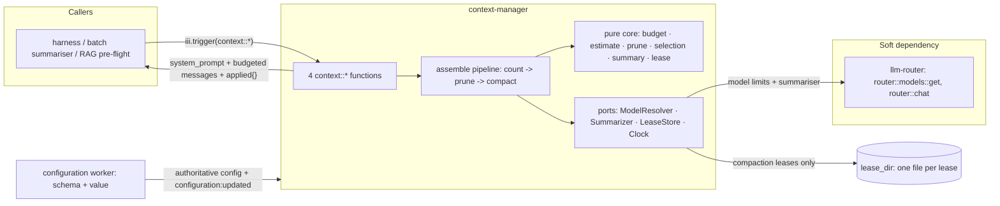

# context-manager architecture

Reference documentation for the `context-manager` worker — the stateless,
model-aware engine that turns a raw conversation history into a model-ready
context, specified in
[tech-specs/2026-06-agentic/context-manager.md](../../tech-specs/2026-06-agentic/context-manager.md).
These documents are written to be sufficient on their own: a reader (human or
LLM) should be able to maintain the worker or integrate against it without
opening the source.

## Document map

| Document | Audience | Read it when |
|---|---|---|
| [internals.md](internals.md) | Maintainers of this worker | You are changing context-manager itself: fixing the budget math, the prune/compaction pipeline, the lease protocol, the summariser adapter, or adding a function. |
| [integration.md](integration.md) | Authors of other workers / clients | You are building something that calls `context::*` — the harness pre-flight, a batch summariser, a cost-estimating gate, a RAG pipeline. This file is the handoff contract. |

The BDD suite under [../tests/features/](../tests/features) is the executable
companion to both: every behavioural claim made here is pinned by a scenario,
each annotated (`# Prevents:`) with the regression it guards against.

## The system in one paragraph

context-manager is a **pure transform over caller-supplied messages**. You
hand it an `AgentMessage[]` plus a target model; it returns a system prompt
and a budgeted `AgentMessage[]` that fits the model's usable token window.
It owns exactly three policies — token counting, function-result pruning, and
history compaction (LLM summarisation) — and nothing else. It is **stateless
with respect to conversation storage**: it never reads or writes a session,
never decides *when* to compact a live conversation, and never talks to a
provider directly. The only state it keeps is operational, not conversational:
short-lived compaction **leases** written as files under its own `lease_dir`
(the same on-disk strategy as `session-manager`), so two callers can't
summarise the same logical history at once. Summarisation
and model-limit lookups go through `llm-router` when installed; token counting
and pruning are fully standalone. Its own runtime configuration is registered
with and fetched from the `configuration` worker and hot-reloads on change
(except `lease_dir` / `summarizer_timeout_ms`, which are restart-required).
That deliberate statelessness is what makes
it reusable — a chat harness, a document summariser, a RAG pre-flight, or
another team's bespoke agent can all call `context::assemble` without adopting
`session-manager` or any particular storage model.

## The system in one diagram

## Vocabulary

| Term | Meaning |
|---|---|
| **Model-ready context** | The output of `context::assemble`: a `system_prompt` string plus an ordered `AgentMessage[]` that fits the model's `usable` budget, ready to hand to `router::chat`. |
| **`usable` budget** | The token ceiling one call may fill: `max(0, (input_limit ?? context_window - max_output_tokens) - reserved - thinking_budget)`. Model-adaptive, not a flat constant. |
| **`reserved`** | Headroom held back from the input budget for response framing; defaults to `min(20000, 10% of context_window)`, overridable per call. |
| **Prune** | The cheap first pass: replace verbose `function_result` outputs with `[output pruned: was ~N tokens]` placeholders. No LLM, no removal — content is rewritten in place. |
| **Compaction** | The expensive pass: summarise the **head** of the history into one Markdown summary via the summariser LLM, keeping a recent **tail** verbatim. |
| **Head / tail** | Compaction splits the history at a boundary: everything before it (the head) is summarised; everything from it on (the tail) is kept verbatim. |
| **Safe cut** | A boundary the tail may start at without orphaning a `function_result` from its `function_call`: a user or assistant message, never a result (see structural invariants). |
| **Summary anchor / round trip** | A prior summary passed back as `previous_summary`. The summariser *updates* it in place instead of starting over, so summaries converge instead of growing. The caller persists the summary; the worker never does. |
| **`tail_start_index`** | Index into the **request** `messages` array where the verbatim tail begins (`null` = everything was summarised). The worker never sees storage ids; the caller maps this onto its own ids. |
| **Compaction lease** | A `{ nonce, ts }` claim stored as a file under `lease_dir` (scope `context_lease`), keyed by `lease_key` (e.g. a session id) or a hash of the message set. Mutual exclusion so one logical history is summarised by one caller at a time; TTL-expiring so a crash never deadlocks it. |
| **`model_resolved`** | How limits were obtained: `inline` (caller supplied), `router` (`router::models::get`), or `fallback` (conservative 8192/1024 default). Echoed so a silent fallback is detectable. |
| **Estimator** | The token counter behind a trait. v1 ships the `chars/4` heuristic for every model; responses report `estimator: "heuristic"` so a future per-model tokenizer is a visible swap. |
| **`custom` message** | A `role: "custom"` transcript item (app-facing: UI markers, notices). It has no provider wire mapping, so `assemble` excludes it from the model-facing list and its token count — but `count-tokens` still counts what it is given. |
