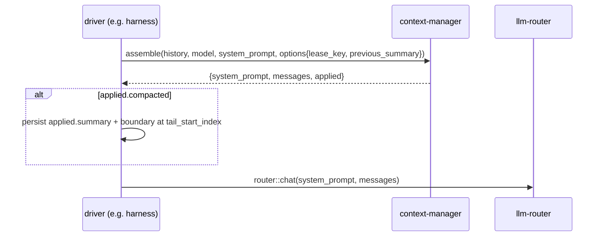

# Integrating with context-manager

The handoff contract for workers and clients that build on context-manager —
the harness pre-flight, batch summarisers, cost-estimating gates, RAG
pipelines, bespoke agents. It is self-contained: everything needed to integrate
is here, with the
[spec](../../tech-specs/2026-06-agentic/context-manager.md) as the design
rationale and [internals.md](internals.md) as the implementation deep-dive.

Contents: [mental model](#1-mental-model) · [conventions](#2-conventions) ·
[data types](#3-data-types) · [functions](#4-function-catalog) ·
[the compaction round trip](#5-the-compaction-round-trip) ·
[structural invariants](#6-structural-invariants-what-you-can-rely-on) ·
[errors](#7-error-contract) · [patterns](#8-canonical-patterns) ·
[dependencies & degraded modes](#9-dependencies-and-degraded-modes) ·
[boundaries](#10-boundaries) · [harness notes](#11-notes-for-the-harness)

## 1. Mental model

context-manager is a **pure function from `(messages, model)` to a model-ready
context**. You pass the full candidate history and a target model; it returns a
system prompt and a budgeted `AgentMessage[]` that fits the model's usable
token window, plus an `applied` report of what it did to get there (pruned,
compacted, neither). It holds no conversation state, so **you own everything
durable**: deciding *when* to call it, persisting any compaction summary it
produces, and storing the transcript itself.

Integration is always some subset of four moves:

1. **Fit a context** with `context::assemble` before a model call — the main
   entry point. It prunes and/or compacts as needed.
2. **Persist the round trip** when `applied.compacted` is true (store the
   summary + boundary, pass them back next time) so summarisation stays cheap
   and convergent.
3. **Estimate** with `context::count-tokens` to gate model choice or cost with
   no LLM and no `llm-router`.
4. **Use a single pass directly** — `context::prune` (no LLM) or
   `context::compact` (LLM) — when you want only that step, not the whole
   pipeline.

## 2. Conventions

- **Invocation**: every function is a **sync** `iii.trigger({ function_id,
  payload, timeout_ms })` call; responses are the JSON shapes in §4. Give
  `assemble`/`compact` a generous `timeout_ms` (they may make a summariser LLM
  call — default outer budget is 320s).
- **Model input**: functions that need limits take a `ModelInput`. Supply
  inline `limits` to stay fully standalone (no `llm-router` needed); supply
  only `id`/`provider` to have the worker resolve limits via
  `router::models::budget`. Resolution order: inline → router → conservative
  fallback (`8192`/`1024`); the response's `model_resolved` tells you which ran.
- **Tokens are estimates.** v1 uses a `chars/4` heuristic for every model
  (`estimator: "heuristic"`). Treat `token_count`/`tokens` as approximate and
  rely on the built-in `reserved` cushion rather than counting to the byte.
- **Timestamps** inside `AgentMessage` are caller-supplied integer ms since
  epoch. The worker reads them only incidentally — order is array order
  (oldest first), never timestamp.
- **Errors** are strings beginning with a stable code: `context/<snake>:
  message`. Match on the code substring. Only `assemble`/`compact` validation
  and unresolved-model throw; pipeline degradations do **not** error (§7).
- **Indices, not ids.** `tail_start_index` is an index into the `messages`
  array *you sent*. The worker never sees your storage ids; you map the index
  onto your own (§5).
- **Agent exposure is cost-gated, not secret-gated.** Every function is a pure
  transform of caller input — nothing to leak — but `assemble`/`compact` can
  spend a summariser call. Deny those two to agents in cost-sensitive
  deployments; `count-tokens`/`prune` are always safe (§9).

## 3. Data types

The cross-cutting agentic contracts (TypeScript notation; the wire is plain
JSON, byte-compatible with session-manager and llm-router):

```typescript
type Role = "user" | "assistant" | "function_result" | "custom";
type ThinkingLevel = "minimal" | "low" | "medium" | "high" | "xhigh";

type ContentBlock =
  | { type: "text"; text: string }
  | { type: "image"; mime: string; data: string }              // base64
  | { type: "thinking"; text: string; signature?: string }
  | { type: "function_call"; id: string; function_id: string; arguments: unknown }
  | { type: "function_result"; function_call_id: string; content: ContentBlock[]; is_error?: boolean };

type AgentMessage =
  | { role: "user"; content: ContentBlock[]; timestamp: number }
  | { role: "assistant"; content: ContentBlock[];
      stop_reason: "end" | "length" | "function_call" | "aborted" | "error";
      native_stop_reason?: string; error_message?: string;
      error_kind?: "auth_expired" | "rate_limited" | "context_overflow" | "transient" | "permanent";
      warnings?: string[]; usage?: Usage; model: string; provider: string; timestamp: number }
  | { role: "function_result"; function_call_id: string; function_id: string;
      content: ContentBlock[]; details: unknown; is_error: boolean; timestamp: number }
  | { role: "custom"; custom_type: string; content: ContentBlock[];
      display?: string; details?: unknown; timestamp: number };

// How you name the target model. Inline limits = standalone; id/provider = router lookup.
type ModelInput = {
  id: string;
  provider?: string;
  limits?: { context_window: number; max_output_tokens: number; input_limit?: number };
};
```

`role: "custom"` messages are app-facing transcript items (UI markers, system
notices, bookkeeping). They have **no provider wire mapping**, so `assemble`
drops them from the model-facing list and its token count — but `count-tokens`
still counts what you give it, including customs (use its `by_role.custom`
bucket to see or subtract that share).

## 4. Function catalog

All four are registered with JSON Schemas (`iii worker info context-manager` /
`get function info`); the shapes below are the contract. All are **sync**.

### `context::assemble` — build the model-ready context

The main entry point. Pipeline: count → (if over budget) prune function
outputs → (if still over) compact the head → return the budgeted list.

```typescript
{
  messages: AgentMessage[];        // full candidate history, oldest first (required)
  model: ModelInput;
  system_prompt?: string;          // base prompt; the summary is merged under it
  options?: {
    reserved_tokens?: number;      // override the default reserve
    tail_turns?: number;           // user+assistant pairs kept verbatim (default 2)
    allow_compaction?: boolean;    // default true
    allow_prune?: boolean;         // default true
    protected_functions?: string[];   // function_ids whose outputs are never pruned
    thinking_level?: ThinkingLevel;   // reserve the model's thinking budget for this tier
    lease_key?: string;            // compaction mutual-exclusion key (e.g. a session id)
    previous_summary?: string;     // persisted summary from a prior compaction (round trip)
  };
}
-> {
  system_prompt: string;           // base + "# Conversation summary" section when applicable
  messages: AgentMessage[];        // budgeted, ready for router::chat (no custom roles)
  token_count: number;             // estimated tokens of the returned context
  usable: number;                  // the budget it was fit into
  model_resolved: "inline" | "router" | "fallback";
  applied: {
    pruned: boolean; pruned_tokens: number;
    compacted: boolean;
    summary?: string;              // present iff compacted — PERSIST THIS (§5)
    tail_start_index?: number | null;  // index into REQUEST messages where the tail begins
    tokens_before?: number;        // estimated tokens of the summarised head
  };
}
```

Throws only: `context/invalid_request` (`messages is required`),
`context/model_unresolved` (`could not resolve model limits` — only when no
inline limits, no router, and `allow_fallback_limits` is off). Everything else
— busy lease, failed/absent summariser, disabled steps — is **best effort**:
the context still returns, possibly with `token_count > usable`.

### `context::count-tokens` — estimate usage

Pure and router-free; safe for cost-sensitive callers with no `llm-router`.

```typescript
{
  messages: AgentMessage[];        // required
  system_prompt?: string;          // counted on top of messages
  tools?: AgentFunction[];         // invocation schema(s), typically [agent_trigger]
  model: ModelInput;               // tokenizer selection (v1: always heuristic)
}
-> {
  tokens: number;                  // messages + system_prompt + tools
  by_role?: { user; assistant; function_result; custom };  // message buckets only
  estimator: "tokenizer" | "heuristic";
}
```

`tokens` equals the sum of `by_role` plus the system-prompt and tools tokens
(which belong to no role bucket). Counts customs, unlike `assemble`.

### `context::prune` — placeholder verbose function outputs

The cheap pass alone: rewrite verbose `function_result` outputs to
`[output pruned: was ~N tokens]`. No LLM, no state, no removal.

```typescript
{
  messages: AgentMessage[];        // required
  model?: ModelInput;              // only for token math; optional (heuristic needs none)
  options?: {
    protect_recent_tokens?: number;   // newest output tokens never pruned (default 40000)
    min_free_tokens?: number;         // skip the pass if it frees less (default 20000)
    max_output_chars?: number;        // outputs at/under this are not "verbose" (default 2000)
    protected_functions?: string[];   // function_ids never pruned
  };
}
-> { messages: AgentMessage[]; pruned_tokens; pruned_parts; scanned_parts }
```

The two most recent user turns are always exempt (a hard guard, independent of
the window). The pass is idempotent.

### `context::compact` — summarise the head, keep a tail

The expensive pass alone. Transient and storage-agnostic: it returns the
summary for *you* to persist; no session is touched. Most callers never call
this directly — `assemble` applies compaction inline.

```typescript
{
  messages: AgentMessage[];        // required
  model: ModelInput;
  options?: {
    tail_turns?: number;             // default 2
    previous_summary?: string;       // anchor so summaries converge instead of growing
    preserve_recent_tokens?: number; // override the adaptive verbatim-tail budget
    lease_key?: string;              // mutual-exclusion key; default: hash of the message set
  };
}
-> // discriminated on `status`:
  | { status: "ok"; summary: string; tail_start_index: number | null;
      tokens_before: number; tokens_after: number; used_prior_summary: boolean }
  | { status: "busy" }       // a compaction lease is held; retry later
  | { status: "empty" }      // nothing to compact (empty history / empty summary)
  | { status: "overflow" };  // summariser unavailable (no llm-router) or it failed
```

The summary follows a fixed Markdown template (Goal / Constraints & Preferences
/ Progress / Key Decisions / Actions Taken / Next Steps / Critical Context /
Relevant Files). With `previous_summary` it is **updated in place**, not
restarted. Requires `llm-router`; without it you get `overflow`.

## 5. The compaction round trip

The single most important integration contract. **context-manager never
persists a summary — you must, or every over-budget call re-summarises from
scratch** (one extra LLM call per request) and summaries never converge.

```mermaid
sequenceDiagram
  participant You as your worker
  participant CM as context::assemble
  participant Store as your store
  You->>CM: assemble(messages, model, system_prompt)
  CM-->>You: applied.compacted=true, summary, tail_start_index, tokens_before
  You->>Store: persist {summary, boundary = your_id_at(tail_start_index)}
  Note over You,Store: a later turn
  You->>CM: assemble(window_from_boundary, model, options.previous_summary=stored)
  CM-->>You: summary rendered into system_prompt; if over again, summary UPDATED
```

The contract, step by step:

1. When `applied.compacted` is true, **persist `applied.summary`** and whatever
   your storage maps `applied.tail_start_index` to. `tail_start_index` is an
   index into the `messages` array you sent (customs included); resolve it to
   your own id (e.g. the entry id at that position).
2. On later calls, pass **only the post-compaction window** as `messages` (the
   verbatim tail and everything after it) **plus** the stored summary as
   `options.previous_summary`.
3. `assemble` renders `previous_summary` into the returned `system_prompt`
   under a `# Conversation summary` heading. If compaction triggers again, the
   summariser **updates** that summary instead of starting over — so it
   converges instead of growing.

`tail_start_index` is `null` when everything was summarised (no verbatim tail).
A caller that skips step 1 stays correct but pays one summariser call per
over-budget request.

## 6. Structural invariants — what you can rely on

Whatever pruning or compaction does, the returned context is always
provider-legal. Build on these:

- **Call/result pairing is never split.** A `function_call` and its
  `function_result` always land on the same side of any boundary; the
  compaction tail only ever starts at a user/assistant turn boundary (never
  between a call and its result, never at a user message carrying an inline
  result block whose call sits earlier). Orphaned results — which providers
  reject — cannot appear.
- **Prune replaces, never removes.** A pruned output's content becomes a single
  `[output pruned: was ~N tokens]` text block; the message, its
  `function_call_id`, and the message ordering all survive. Message counts are
  stable across a prune.
- **`custom` messages never reach the model.** `assemble` excludes
  `role: "custom"` from the returned `messages` and from `token_count`. A huge
  custom entry can't trigger a phantom overflow, and customs never leak to a
  provider with no wire mapping for them.
- **`tail_start_index` indexes the request array** you sent (customs included),
  so it maps cleanly onto your storage even though the model-facing list
  dropped customs.

## 7. Error contract

| Code | Meaning / trigger | Functions |
|---|---|---|
| `context/invalid_request` | `messages` missing or `null` (`messages is required`); a `model` missing where required; malformed shapes serde can't coerce. | all |
| `context/model_unresolved` | No inline limits, router can't resolve, and `allow_fallback_limits` is off (`could not resolve model limits`). | assemble, compact, count-tokens |
| `context/state` | A backing lease filesystem write hard-failed (rare; lease problems usually degrade to `busy`). | compact, assemble |

**Not errors — degradations you must read, not catch:**

- `assemble` over budget with prune/compaction disabled, a busy lease, or an
  unavailable summariser → returns normally with `applied.compacted: false` and
  `token_count > usable`. Inspect `token_count` vs `usable` to know it didn't fit.
- `compact` → `{ status: "busy" | "empty" | "overflow" }` are normal outcomes,
  not thrown errors. `overflow` specifically means "compaction unavailable"
  (no `llm-router`, or the summariser failed) — treat it as such.
- Unknown **extra** request fields are tolerated (ignored), so additive API
  evolution never breaks older callers.

## 8. Canonical patterns

### Pre-flight before every model call (the driver loop)



Pass `options.lease_key` = your session id so concurrent turns of the *same*
session serialise their compaction; pass `previous_summary` from your last
persisted summary; send only the post-compaction window as `messages`.

### Standalone cost gate (no llm-router)

Call `context::count-tokens` with inline `model.limits` (or just an id — the
heuristic ignores it) to decide whether a cheaper/larger model is needed before
committing. Include the `agent_trigger` schema in `tools` so tool tokens count.
No LLM, no router, no state — works on a bare engine.

### Prune-only first pass

If you maintain your own compaction elsewhere and only want to reclaim verbose
tool output, call `context::prune` directly and persist the rewritten
`messages`. Idempotent, so re-running is safe.

### Direct compaction with explicit mutual exclusion

A batch summariser that isn't going through `assemble` calls `context::compact`
with an explicit `lease_key` (so parallel workers on the same logical input see
`busy` instead of double-summarising), handles the `ok | busy | empty |
overflow` union, and persists `summary` + `tail_start_index` itself.

## 9. Dependencies and degraded modes

| Dependency | Used for | Without it |
|---|---|---|
| `configuration` (required) | the worker's own runtime config: schema registration + the authoritative value, hot-reloaded on change | the worker **cannot boot** — `register`/`get` run at startup and a failure aborts it. Not a per-request dependency: once booted, `context::*` calls never touch it. |
| local filesystem (`lease_dir`) | compaction leases only | a filesystem error makes `compact`/`assemble` treat the lease as busy → compaction is skipped (best effort); `count-tokens`/`prune` unaffected. |
| `llm-router` (soft) | effective model-budget resolution (`router::models::budget`) + the summariser (`router::chat`) | Limits fall back to `8192`/`1024` (`model_resolved: "fallback"`) unless you pass inline `limits`; `compact` returns `overflow`; `assemble` can prune but not summarise. |

The fully standalone *request* path — inline `limits` + `count-tokens`/`prune`,
or `assemble` with compaction off — needs no `llm-router` and writes no lease
files (the `configuration` dependency is a one-time boot cost, not per call).
Cost note: only `assemble` and `compact` can trigger a summariser LLM call.

## 10. Boundaries

context-manager does **not**:

- store conversations — pass messages in, persist results yourself (or use
  [session-manager](../../session-manager/architecture/integration.md));
- decide *when* to compact a live session — that is your policy (a pre-flight,
  or the optional reactive trigger in §11);
- talk to LLM providers directly — summarisation goes through `llm-router`;
- guarantee exact token counts — v1 is a heuristic estimator (§2);
- implement long-term / vector memory — that belongs in a dedicated sibling
  worker (not in v1).

## 11. Notes for the harness

The integration the spec was designed around — context-manager replaces a
bespoke in-harness compaction side-car with a reusable worker.

- **Hot-path pre-flight.** On each turn, before calling `router::chat`, call
  `context::assemble` with the session's candidate history, the target model
  (id + provider so limits resolve through the router; or inline limits), the
  base `system_prompt`, `options.lease_key` = the session id, and
  `options.previous_summary` = the last persisted summary. Send the returned
  `system_prompt` + `messages` straight to the model.
- **Compaction persistence (the round trip, §5).** When `applied.compacted`,
  write a session bookkeeping record — the established pattern is a
  `session::append` with `custom: { custom_type: "compaction", data: { summary,
  tail_start_entry_id, ... } }`, mapping `applied.tail_start_index` onto the
  entry id at that position in the history you sent. On the next turn, read it
  back (`session::messages { include_custom: true }`, scan for the latest
  `compaction` entry), pass its `summary` as `previous_summary` and the
  messages from `tail_start_entry_id` onward as `messages`.
- **Why a lease.** Two harness instances (or a retried turn) on the same
  session must not double-summarise. The lease keyed on the session id makes
  the second caller skip compaction (`assemble`) or see `busy` (`compact`)
  without burning a model call. Crashed holders expire after `lease_ttl_secs`.
- **Optional reactive pre-warm.** To pre-warm or surface a token-usage metric
  off the hot path, bind a handler to `session::message-added` and call
  `context::count-tokens` (cheap, no LLM) there. This is opt-in and lives in
  the harness — context-manager binds no triggers and never reaches into a
  session itself, which is exactly what keeps it store-agnostic.
- **Agent exposure.** All functions are pure transforms (nothing to leak), but
  deny `context::assemble` and `context::compact` to in-run agents in
  cost-sensitive deployments — they can trigger a summariser call.
  `context::count-tokens` and `context::prune` are always safe.
- **Degraded engine.** With `llm-router` absent the harness still gets budgeted
  output: limits fall back (or use inline `limits`), prune runs, and an
  over-budget context returns visibly over (`token_count > usable`) instead of
  erroring the turn.
