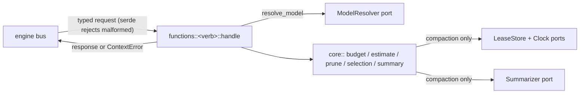
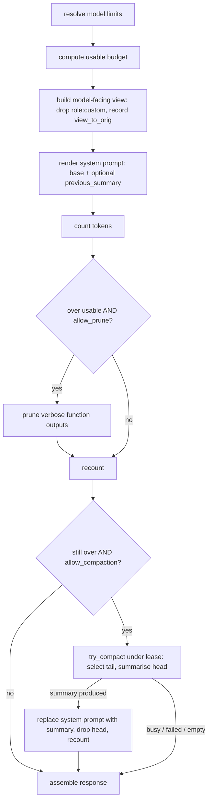

# context-manager internals

Maintainer documentation. Everything here describes the implementation as it
is; the consumer-facing contract lives in [integration.md](integration.md).
Spec of record:
[tech-specs/2026-06-agentic/context-manager.md](../../tech-specs/2026-06-agentic/context-manager.md).

## 1. Crate layout

One cargo crate, one `[[bin]]`, plus a `[lib]` so tests drive production code
in-process. The cut that keeps everything testable: **handlers are thin, the
`core` modules are pure logic with no I/O, and every outside dependency is a
port** wired to a production adapter in the binary and to a deterministic fake
in tests.

| Path | Responsibility |
|---|---|
| [src/main.rs](../src/main.rs) | Boot: CLI (`--config` seed, `--url`, `--manifest`), engine connect, **register the config schema (+ optional seed) with the `configuration` worker and fetch the authoritative value** (boot-fatal on failure), build adapters from it, `register_all`, then bind the `configuration` hot-reload trigger; Ctrl+C → `shutdown_async`. |
| [src/lib.rs](../src/lib.rs) | Module tree only. |
| [src/types.rs](../src/types.rs) | Wire contracts shared with the agentic family: `Role`, `ContentBlock` (5 variants), `AgentMessage` (4 roles), `ModelInput`, `ModelLimits`, `Model`, `ThinkingLevel`, `AgentFunction`. Serde renames keep the JSON byte-compatible with the TypeScript spec and session-manager's Rust copy. |
| [src/config.rs](../src/config.rs) | `WorkerConfig` (10 budget/prune/lease knobs incl. `lease_dir`, `~/`-expanded via `resolved_lease_dir`), each with a serde default; `deny_unknown_fields` so a typo'd key fails loudly. Also the JSON-Schema source (`json_schema`/`to_json`/`from_json`, derived `JsonSchema`) and the env-expanding seed parser (`from_file`/`from_yaml`); `boot_signature` names the one structural field (`lease_dir`). |
| [src/configuration.rs](../src/configuration.rs) | The `configuration` worker client: `register_config` (schema + seed), `fetch_config` (authoritative, env-expanded), the `ConfigCell` snapshot + `apply_config`, the `FsLeaseStore` rebuild-and-swap on a `lease_dir` change, and the `context::on-config-change` trigger handler. |
| [src/error.rs](../src/error.rs) | `ContextError` → `code: message` on the bus (`context/invalid_request`, `context/model_unresolved`, `context/state`). The two spec strings are kept verbatim. |
| [src/ports.rs](../src/ports.rs) | The four seams: `ModelResolver`, `Summarizer`, `LeaseStore`, `Clock`, plus the `Deps` struct every handler receives. |
| [src/manifest.rs](../src/manifest.rs) | `--manifest` JSON for the registry publish pipeline; `default_config` mirrors `WorkerConfig::default()` field-for-field (unit-tested). |
| [src/functions/mod.rs](../src/functions/mod.rs) | Function ids + descriptions, `resolve_model` (the spec's resolution order), the generic typed `register` helper, `register_all`, and the schema `catalog()` (golden-tested). |
| [src/functions/&lt;verb&gt;.rs](../src/functions) | One file per function: request/response structs (serde + `JsonSchema`, doc comments become schema descriptions) and a `pub async fn handle(deps, req)`. BDD calls these `handle` fns directly, so engine-free tests exercise the exact production path. |
| [src/core/budget.rs](../src/core/budget.rs) | `ResolvedModel`, the `usable` math, `default_reserved`, `preserve_recent_budget`, `fallback_model`. |
| [src/core/estimate.rs](../src/core/estimate.rs) | `Estimator` trait + `HeuristicEstimator` (`chars/4`), `estimator_for_model`, per-role tallies. |
| [src/core/prune.rs](../src/core/prune.rs) | The prune algorithm (newest-first scan, protected window, `min_free_tokens` guard, in-place placeholder rewrite). |
| [src/core/selection.rs](../src/core/selection.rs) | Turn partitioning and token-aware verbatim-tail selection with the safe-cut invariant. |
| [src/core/summary.rs](../src/core/summary.rs) | Summariser prompt construction (template, previous-summary anchoring), `strip_media`, and the `# Conversation summary` system-prompt rendering. |
| [src/core/lease.rs](../src/core/lease.rs) | Compaction lease acquire/release protocol + the default sha256 lease key. |
| [src/adapters/router.rs](../src/adapters/router.rs) | `RouterModelResolver` (`router::models::budget`) and `RouterSummarizer` (`router::chat` over an SDK channel). |
| [src/adapters/fs_lease.rs](../src/adapters/fs_lease.rs) | `FsLeaseStore`: one JSON file per lease key under `lease_dir/<scope>/`, a process-local `Mutex` cache, and atomic `tmp + rename` writes (session-manager's `FsStore` strategy). |
| [tests/](../tests) | Cucumber BDD (`tests/bdd.rs`, `harness = false`) + schema goldens + manifest subprocess test. See §13. |

## 2. Request lifecycle



- **Input validation is two-layered.** Serde shape validation at the boundary
  (unknown enum values, wrong types) fails before any logic runs; then the
  handler checks the one thing serde can't (`messages` present and non-null →
  else `context/invalid_request: messages is required`).
- **Handlers orchestrate; `core` decides.** A handler resolves the model,
  computes the budget, calls the pure `core` functions, and (for compaction)
  acquires/releases the lease and invokes the summariser port. No `core`
  module performs I/O.
- **`Deps` is the whole world.** `Deps { config, resolver, summarizer, leases,
  clock }` — every handler takes `&Deps`, so swapping the four ports for fakes
  reproduces the exact production code path without an engine.
- **Config is a hot-swappable snapshot.** `Deps.config` is a `ConfigCell`
  (`Arc<RwLock<Arc<WorkerConfig>>>`) sourced from the `configuration` worker;
  handlers call `deps.config().await` once per request. A `configuration:updated`
  trigger ([configuration.rs](../src/configuration.rs)) re-fetches and swaps it
  live for the per-call tuning knobs (including `summarizer_timeout_ms`, which
  the `RouterSummarizer` reads from the snapshot per call) and rebuilds + swaps
  the `FsLeaseStore` on a `lease_dir` change — no field requires a restart.

## 3. The assemble pipeline

`context::assemble` is the worker's reason to exist; the other three functions
are either steps of it or probes into it. The pipeline, all in
[functions/assemble.rs](../src/functions/assemble.rs):



Load-bearing details:

1. **Order is fixed: count → prune → compact.** Prune is cheap (no LLM) and
   often enough, so it runs first; compaction is the expensive fallback. Each
   step re-counts, and each is gated on *still being over budget*, so a context
   that already fits passes through byte-identical with `applied` all-false and
   no summariser cost (`assemble.feature` "under budget passes through
   untouched").
2. **The model-facing view excludes `role: "custom"`.** Custom messages have
   no provider wire mapping, so they are filtered out of `working` *before*
   counting (a huge custom entry must not trigger a phantom overflow) and never
   appear in the returned `messages`. `view_to_orig: Vec<usize>` records, for
   each surviving message, its index in the original request array — so
   `tail_start_index` can be reported against the **request** array the caller
   holds, customs included (`invariants.feature` "tail_start_index accounts for
   excluded custom messages").
3. **Degradation is best effort and visible, never an error.** A busy lease, a
   failed/unavailable summariser, or disabled steps all leave the turn alive:
   the response still returns, `applied.compacted` is false, and
   `token_count > usable` is the visible signal that the context didn't fit.
   `assemble` only throws for `messages is required` or `could not resolve
   model limits` (fallback disabled).
4. **`applied` is the audit trail.** `{ pruned, pruned_tokens, compacted,
   summary?, tail_start_index?, tokens_before? }` reports exactly what ran.
   `summary`/`tail_start_index`/`tokens_before` appear only when
   `compacted` — `tail_start_index` is `Some(Some(i))` for a real cut and
   `Some(None)` for "everything summarised", serialised as a number or `null`.
5. **The compaction lease key defaults to a hash of the *request* messages** —
   the same derivation `context::compact` uses — so a caller hitting both
   functions with the same history contends on the same claim.

## 4. Token budget model

[core/budget.rs](../src/core/budget.rs). The usable input budget is
model-adaptive:

```text
base   = input_limit ?? (context_window - max_output_tokens)
usable = max(0, base - reserved - thinking_budget)
```

- **All arithmetic saturates.** A model whose output budget exceeds its window,
  or a reserve larger than the base, clamps `usable` to 0 — never wraps around
  `u64` (`model_and_budget.feature` "a model smaller than its own output budget
  clamps to zero").
- **`reserved`** defaults to `default_reserved = min(reserved_tokens_cap,
  context_window * reserved_pct / 100)` = `min(20000, 10%)` with stock config.
  This scales the reserve down for small models (a flat 20k would eat a third
  of a 32k window) while capping it for huge ones. Overridable per call via
  `options.reserved_tokens`.
- **`thinking_budget`** is `thinking_budgets[thinking_level]` *only* when the
  caller passes `options.thinking_level` **and** the resolved model declares a
  budget for that tier; otherwise 0. Inline limits carry no budgets, so a
  thinking level is a no-op for standalone callers. This is how assemble leaves
  room for the reasoning tokens a thinking tier will consume.
- Worked: a 200k/8k model with defaults → `200000 - 8000 - 20000 = 172000`
  usable; a 32k/16k model → `32000 - 16000 - 3200 = 12800`; the conservative
  fallback (8192/1024) → `8192 - 1024 - 819 = 6349`.

`preserve_recent_budget(usable, override)` is the **separate** budget that caps
the verbatim tail during compaction: `clamp(usable / 4, 2000, 8000)`, or the
caller's `preserve_recent_tokens` verbatim. It is intentionally small — the
tail is "the last little bit kept raw", not a second copy of the window.

## 5. Token estimation

[core/estimate.rs](../src/core/estimate.rs). Estimation sits behind the
`Estimator` trait with three methods (`message`, `text`, `function`) and a
`kind()` the response echoes.

- **v1 ships one implementation: `HeuristicEstimator` = serialized-JSON
  `chars / 4`.** It counts the *full serialized message*, so structure and
  metadata weigh in roughly as they do on the wire, and it is deterministic and
  model-independent. `estimator_for_model` ignores the model id today and always
  returns the heuristic; `count-tokens` reports `estimator: "heuristic"`.
- The trait is the seam for a real per-model tokenizer later: slot it into
  `estimator_for_model`, return `EstimatorKind::Tokenizer`, and every count —
  budget math, prune sizing, tail selection — picks it up with no caller
  change. The reported `estimator` field makes the swap observable.
- `estimate_by_role` partitions a message set into `{ user, assistant,
  function_result, custom }`; the buckets sum exactly to the message total
  (`count_tokens.feature`), which is the contract that lets callers subtract
  the custom share.

## 6. Pruning

[core/prune.rs](../src/core/prune.rs). One pass, newest-to-oldest, that
rewrites verbose `function_result` outputs to `[output pruned: was ~N tokens]`
and **never removes anything** — the message, its `function_call_id`, and the
ordering all survive (the structural invariant providers depend on).

Eligibility, applied while scanning from the newest message backward:

1. **The two most recent user turns are always exempt** (`PROTECTED_USER_TURNS
   = 2`, a hard prior-art constant, not operator-tunable): the scan counts
   `user` messages and skips everything until it has passed two of them.
2. **Protected token window:** accumulate each scanned output's tokens into
   `window_tokens`; while `window_tokens <= protect_recent_tokens` the output
   is inside the newest window and kept. Because the scan is newest-first, the
   freshest outputs fill the window and push older ones out of it.
3. **`protected_functions`** (by `function_id`) are never pruned and never even
   counted as scanned.
4. **Verbosity threshold:** an output whose text is `<= max_output_chars` is
   not "verbose" — pruning it would free almost nothing — so it stays.
5. **`min_free_tokens` guard:** sum what the eligible outputs *would* free; if
   that total is below `min_free_tokens`, **nothing is rewritten at all**. A
   no-op beats a destroyed-but-still-over context. This guard fires before any
   mutation, so a skipped pass leaves `messages` untouched.

`PruneStats { pruned_tokens, pruned_parts, scanned_parts }` distinguishes
"examined" from "rewritten". The pass is idempotent: a second run sees only the
tiny placeholders, which are under `max_output_chars`, so nothing is verbose
(`prune.feature` "pruning twice is idempotent"). On the assemble path the same
`core::prune::prune` runs with config-derived params plus the call's
`protected_functions`.

## 7. Compaction — tail selection

[core/selection.rs](../src/core/selection.rs) decides the head/tail boundary;
it is pure and the most invariant-sensitive code in the worker.

- **Turns** partition the history: a turn starts at each `user` message and
  runs to the next one. Messages before the first user message belong to no
  turn and are always head material.
- **`select(messages, budget, tail_turns, estimator)`** keeps up to the last
  `tail_turns` whole turns that fit `budget`, newest-first; when a whole turn
  won't fit, it falls back to a **safe partial cut** inside that turn via
  `split_turn`. Everything before the kept tail is the head to summarise.
- **The safe-cut invariant** is the whole point. A `function_call` and its
  `function_result` must land on the same side of the boundary, or providers
  reject the orphaned result. So the tail may only *start* at:
  - an `assistant` message, or
  - a `user` message that carries **no inline `function_result` block**
    (Anthropic-style tool results travel inside user messages; a user message
    that opens with one has its call in the previous turn).

  A `function_result` message, or such a user message, is **not** a safe cut.
  When the newest turn starts unsafely, selection accumulates it and defers the
  boundary to an older safe turn, carrying the unsafe turn tail-side with its
  call (`selection.rs` tests + `invariants.feature`).
- `Selection { head_len, tail_start_index }`. `tail_start_index` is `None` when
  nothing could be safely kept verbatim (whole history is head); the handler
  maps a `Some(view_index)` back through `view_to_orig` before returning it.
- `tail_turns: 0` summarises everything (`tail_start_index: null`).

## 8. Compaction — summariser prompts and the round trip

[core/summary.rs](../src/core/summary.rs) builds what the summariser sees and
renders what the caller gets back.

- **`build_system_prompt(previous_summary)`** — instructs either "Create a new
  anchored summary" (no prior) or "Update the anchored summary below …"
  wrapping the prior in `<previous-summary>` tags (anchored). Either way it
  appends `SUMMARY_TEMPLATE`, the fixed Markdown structure (Goal / Constraints
  & Preferences / Progress {Done, In Progress, Blocked} / Key Decisions /
  Actions Taken / Next Steps / Critical Context / Relevant Files). Update mode
  is how summaries **converge instead of growing**.
- **`render_user_prompt(head)`** — the head messages inside a `<conversation>`
  block: text verbatim, `function_call`s as terse `[tool_call] <id> <args>`
  one-liners; other block kinds dropped.
- **`strip_media(head, max_output_chars)`** — a copy fed to the summariser with
  images replaced by `[image stripped]` everywhere and `function_result` text
  truncated to `max_output_chars` (+ `... [truncated]`). The original
  transcript the caller holds is never mutated. This keeps base64 blobs and
  one giant tool dump from dominating the summariser's input.
- **`render_system_prompt(base, summary)`** — what assemble returns: the base
  prompt, then a `# Conversation summary` section with the summary. Empty base
  → just the section; no summary → just the base.

The compaction round trip, the worker's only stateful-feeling contract (the
state is the *caller's*, not the worker's):

```mermaid
sequenceDiagram
  participant C as caller (e.g. harness)
  participant A as context::assemble
  participant Store as caller's store
  C->>A: assemble(messages, model)
  A->>A: over budget -> compact head
  A-->>C: applied.compacted, summary, tail_start_index
  C->>Store: persist summary + boundary (caller maps index -> own id)
  Note over C,Store: later turn
  C->>A: assemble(post-compaction window, previous_summary = stored summary)
  A->>A: render summary into system prompt; if over again, UPDATE the anchor
  A-->>C: new summary (converged), new tail_start_index
```

The worker **never persists**. A caller that skips persistence stays correct
but pays one summariser call per over-budget request, because every call
re-summarises from scratch (`assemble_round_trip.feature` "skipping persistence
costs one summariser call per request"). Persisting `summary` +
`tail_start_index` and passing them back as `previous_summary` + a trimmed
`messages` window is what makes it cheap and convergent.

## 9. Compaction leases and concurrency

[core/lease.rs](../src/core/lease.rs) over the `LeaseStore` port. The only
state the worker writes: a `{ nonce, ts }` claim per lease, stored as one JSON
file at `<lease_dir>/<scope>/<key>.json` (scope `context_lease`), keyed by
`options.lease_key` or `default_lease_key` (sha256 over the serialized message
set, separator byte between messages so `["ab"]` and `["a","b"]` never
collide). The key derivation is deliberately `sha2`, not a std hasher, so it is
**stable across processes and Rust versions** — two callers of the same logical
history always derive the same file.

Storage is the [`FsLeaseStore`](../src/adapters/fs_lease.rs) adapter, which
copies session-manager's `FsStore` strategy: a process-local `Mutex` cache plus
atomic `tmp + rename` writes. Atomicity is therefore **per-process** — the
single-writer-per-`lease_dir` assumption session-manager also makes — which is
sufficient for one context-manager instance. The protocol below holds within
that process: `swap` runs the whole read-modify-write under the cache mutex, so
concurrent acquirers serialise.

The protocol (ported from harness `runtime/lease.ts`):

- **TTL is enforced by readers.** A claim whose `ts` is older than `ttl_ms`
  reads as free, folding crash recovery into acquisition — a dead holder's
  lease simply expires (`lease_ttl_secs`, default 300). The boundary is strict:
  299999 ms old still wins, 300001 ms is taken over.
- **`acquire`**: read the key; if a live claim exists, return `None` (busy).
  Otherwise write a fresh `{ nonce, ts }` via the atomic **`swap`** and inspect
  the prior value it returns; if we clobbered a *still-live* claim (a racing
  acquirer beat us), restore it and bow out. Exactly one concurrent acquirer
  sees a free/expired prior and wins.
- **`release`** only clears the key **if it still holds our nonce** — a holder
  that lost the lease to TTL takeover must never wipe the new holder's claim.
- **Store failures read as busy, never as a win.** A `get`/`swap` error returns
  `None` (busy) so a filesystem outage can't let every contender summarise at
  once; a transient busy is retryable (`compact_lease.feature` "a state outage
  reads as busy, never as a win").

`compact` returns `status: "busy"` on a held lease; `assemble` silently skips
compaction (best effort) and leaves the holder's claim intact. The cache mutex
serialises acquirers within the process, and the per-history key keeps unrelated
histories from interfering; the worker is otherwise stateless.

## 10. Ports and adapters

The four ports in [ports.rs](../src/ports.rs), production adapters in
[adapters/](../src/adapters):

| Port | Production adapter | Backed by | Failure posture |
|---|---|---|---|
| `ModelResolver` | `RouterModelResolver` | `router::models::budget` (5s timeout; `models::get` compatibility fallback) | `Ok(None)` = router up but model unknown; `Err` = router absent/unreachable. Both → fallback when allowed. |
| `Summarizer` | `RouterSummarizer` | `router::chat` over an SDK channel | `Unavailable` (router not routable) vs `Failed` (provider/stream error) vs `Empty`. |
| `LeaseStore` | `FsLeaseStore` | one JSON file per key under `lease_dir` (atomic `tmp + rename`; process-local `Mutex` for `swap`) | Errors surface as busy via `core::lease`. |
| `Clock` | `SystemClock` | wall clock (ms since epoch) | — |

`RouterSummarizer` details worth knowing before touching it:

- It creates an SDK channel, passes `writer_ref` to `router::chat`, and reads
  the streamed `AssistantMessageEvent` frames. Frames may arrive as WS text
  (callback) or binary (`read_all`); it collects both because the router's
  framing is provider-defined.
- `extract_summary` folds frames: the terminal `done` event's message text
  wins; accumulated `text_delta`s are the fallback; a terminal `error` (or a
  `stop` with `stop_reason: "error"`) fails. Empty result → `SummarizeError::Empty`.
- `summarizer_timeout_ms` (default 320000) is the **outer** budget for the
  whole call and must exceed the router's own stream budget; `READER_DRAIN_MS`
  is a 2s grace for the socket to drain after the trigger returns.
- Unroutable detection is string-sniffing the error (`function_not_found` /
  `not found` / `no function`) → `Unavailable`, which `compact` maps to
  `status: "overflow"` with `error_kind: "permanent"` logged. This is the
  defined degraded mode when `llm-router` is absent.

`FsLeaseStore::swap` holds the cache `Mutex` across the whole read-modify-write:
it reads the current claim (replaying the key's file on a cold cache), writes the
new `{ nonce, ts }` atomically (`tmp + rename`), and returns the prior — so two
acquirers in the process serialise and exactly one sees a free/expired prior. A
missing file, or a file whose contents aren't a `{ nonce, ts }` record, reads as
`None` (free) — the same tolerant posture as the harness lease. All filesystem
I/O is synchronous and never crosses an `.await` while the guard is held.

## 11. Model resolution

`functions::resolve_model` implements the spec order exactly:

1. `input.limits` present → `ResolvedModel::from_inline` (`model_resolved:
   "inline"`); no router call. This is the standalone path.
2. else `router::models::budget(provider, id)`:
   - `Ok(Some(model))` → `from_router` (`"router"`), carrying the model's
     `thinking_budgets`.
   - `Ok(None)` (unknown) or `Err` (router down/absent) → fall through.
3. fallback: if `allow_fallback_limits` (default true), `fallback_model()`
   (8192/1024, `"fallback"`, logged with the reason). Else
   `ContextError::ModelUnresolved` → `context/model_unresolved: could not
   resolve model limits (...)`.

A dead router and an unknown model are deliberately indistinguishable to the
caller — both yield the same detectable `fallback`. Inline limits never carry
`thinking_budgets`, so inline callers can't accidentally pay a thinking tax.

## 12. Error model

`ContextError` (in [error.rs](../src/error.rs)) renders as `code: message`;
the code before the colon is the stable contract. One mapping point:
`From<ContextError> for IIIError` (always `IIIError::Handler`).

| Variant | Code | When |
|---|---|---|
| `InvalidRequest` | `context/invalid_request` | `messages` absent/null (`messages is required`); serde-survivable shape problems. |
| `ModelUnresolved` | `context/model_unresolved` | No inline limits, router can't resolve, fallback disabled (`could not resolve model limits`). |
| `State` | `context/state` | A filesystem call backing the lease failed (reserved; lease failures normally degrade to busy rather than throw). |

`messages is required` and `could not resolve model limits` are kept word-for-word
because callers match on them (`errors.feature`). Adding a variant means: add
the code, a `Display` test in `error.rs`, and an `errors.feature` scenario.

## 13. Configuration, boot, and the wire surface

Runtime config is **registered with and fetched from the `configuration`
worker** ([configuration.rs](../src/configuration.rs)); a `--config` YAML file
only SEEDS the first registration. The shape below (shipped defaults, also the
registered schema's `example`) is what `WorkerConfig::json_schema()` describes:

```yaml
reserved_tokens_cap: 20000     # default reserve = min(cap, reserved_pct% of context_window)
reserved_pct: 10
tail_turns: 2                  # user+assistant pairs kept verbatim by compaction
protect_recent_tokens: 40000   # newest function-output tokens never pruned
min_free_tokens: 20000         # skip pruning when it would free less
max_output_chars: 2000         # outputs at/under this are not "verbose"; also the summariser truncation cap
lease_ttl_secs: 300            # compaction mutual-exclusion lease TTL
allow_fallback_limits: true    # conservative 8192/1024 when limits can't resolve
summarizer_timeout_ms: 320000  # outer budget for one router::chat summariser call
```

Boot and reload rules (`main.rs` / `configuration.rs`):

- `configuration` is a **required boot dependency**: `register_config` then
  `fetch_config` run over the live connection, and a failure aborts startup. A
  missing stored value seeds defaults (or the `--config` seed); a `null` value
  reads as defaults.
- The config **hot-reloads — nothing requires a restart**: a
  `configuration:updated` trigger re-fetches the authoritative value and swaps
  the snapshot. `summarizer_timeout_ms` is read from the snapshot per call (the
  `RouterSummarizer` holds the `ConfigCell`); `lease_dir` is the one structural
  field — a change rebuilds the `FsLeaseStore` and swaps it in (a rebuild that
  fails keeps the previous store + config, last-good). The handler ignores its
  trigger payload and re-fetches, so a forged call can at most reload the
  already-stored value.
- A `--config` file is only a SEED for the first registration; an unparseable
  seed WARNS and is skipped (the authoritative value comes from the worker).
- Every config field is per-call-overridable where the spec allows
  (`reserved_tokens`, `tail_turns`, the prune thresholds, `lease_key`,
  `preserve_recent_tokens`); request options take precedence over config.
- `llm-router` is soft: the worker serves `count-tokens` and `prune` without it;
  only compaction and router-based model resolution degrade.

**The wire surface is golden-tested.** `functions::catalog()` returns each
function's id, description, and schemars-derived request/response schemas, in
registration order; `tests/schemas.rs` diffs them against
[tests/golden/schemas/](../tests/golden/schemas) (regenerate with
`UPDATE_GOLDENS=1`). `schema_of` mirrors iii-sdk's internal generator
(`SchemaSettings::draft07()`), so a golden pins exactly what `register_async`
emits. Keep `catalog()` in lockstep with `register_all`.

## 14. Determinism and testing

Everything a test needs to pin behaviour is injectable: the four ports
(`ModelResolver`, `Summarizer`, `LeaseStore`, `Clock`). The production binary
is one composition of them; the BDD world is another.

- **`tests/bdd.rs`** (cucumber, `harness = false`). Tags: `@pure` needs nothing
  (calls `handle` fns directly with fake ports — see `tests/common/world.rs`,
  `tests/common/fakes.rs`); `@engine` registers the production surface in-process
  against a live engine and soft-skips when none is reachable.
- The `@pure` world wires fake ports: a scriptable resolver (known models,
  unavailable, declared thinking budgets), a recording summariser (returns /
  fails / unavailable / empty, captures the prompts + model it ran on), an
  in-memory lease store (+ "foreign lease", "unavailable"), and a manually
  advanced `FakeClock` to drive TTL expiry.
- **`engine_roundtrip.feature`** is the proof that the registered wire surface
  matches the handlers: real triggers, production adapters, `llm-router` absent
  — i.e. the spec's degraded mode (limits fall back, prune/count work, compact
  overflows after a real filesystem lease acquire/release cycle).
- Unit tests live next to what they pin: budget math in `budget.rs`, the
  heuristic in `estimate.rs`, prune eligibility in `prune.rs`, the safe-cut
  matrix in `selection.rs`, prompt construction in `summary.rs`, lease key
  stability and TTL in `lease.rs`, frame folding in `adapters/router.rs`,
  config defaults in `config.rs`.
- Convention: every scenario carries a `# Prevents:` comment naming the
  regression it catches.

Verification commands (CI parity):

```bash
cargo fmt --all -- --check
cargo clippy --all-targets --all-features -- -D warnings
cargo test --all-features                       # @engine soft-skips without iii
cargo test --test bdd -- --tags @pure           # no engine required
UPDATE_GOLDENS=1 cargo test --test schemas      # regenerate wire-schema goldens
./target/debug/context-manager --manifest | jq .
```

## 15. Sharp edges and known limitations

- **The estimator is `chars/4`, not a real tokenizer.** Every budget decision,
  prune sizing, and tail fit is an *estimate*; `token_count` can differ from
  what the provider bills. The trait is ready for a per-model tokenizer; until
  then treat all counts as approximate and keep `reserved` as the cushion.
- **Compaction needs `llm-router`.** Without it, `compact` returns `overflow`
  and `assemble` can prune but not summarise — an over-budget context comes
  back over budget (visibly, via `token_count > usable`). Pure token/prune
  calls are unaffected.
- **One summariser call per over-budget request if the caller doesn't persist.**
  The round trip (§8) is the fix; skipping it is correct but not cheap.
- **`assemble`/`compact` can spend money.** They may trigger a summariser LLM
  call; `count-tokens` and `prune` never do. Deny the former two in
  cost-sensitive agent deployments (see [integration.md §9](integration.md)).
- **Lease key is content-derived by default.** Two callers compacting the
  *same* history contend even without a shared `lease_key`; conversely, a
  single logical session whose message set changes between calls gets a
  different default key, so pass an explicit `lease_key` (e.g. the session id)
  to serialise a live session's compactions.
- **No long-term / vector memory.** v1 compresses one history for one turn;
  durable cross-session memory belongs in a dedicated sibling worker (spec
  Boundaries).

## 16. How to extend

- **New function:** add `src/functions/<verb>.rs` with typed request/response
  (+ doc comments → schema descriptions) and a `pub async fn handle(deps,
  req)`; add the id/description consts, a `register(...)` line in
  `register_all`, and a `spec::<Req, Resp>(...)` line in `catalog()` (then
  regenerate the schema golden); add a dispatch arm in `tests/common/world.rs`
  and a feature file.
- **Real tokenizer:** implement `Estimator`, return `EstimatorKind::Tokenizer`,
  and key it off the model in `estimator_for_model`. Nothing else changes; the
  reported `estimator` field flips to `"tokenizer"` and pins the swap.
- **New budget/prune knob:** add a field to `WorkerConfig` (with a `default_*`
  fn and the `Default` impl), mirror it in `manifest.rs::default_config` (a
  unit test enforces parity), thread it through the relevant `core` params, and
  expose a per-call override in the function's `Options` if the spec allows it.
- **New port-backed dependency:** add a trait to `ports.rs`, a production
  adapter in `adapters/`, a field on `Deps`, a fake in `tests/common/fakes.rs`,
  and wiring in `main.rs`. Keep `core` pure — it should depend on the trait,
  never the adapter.
