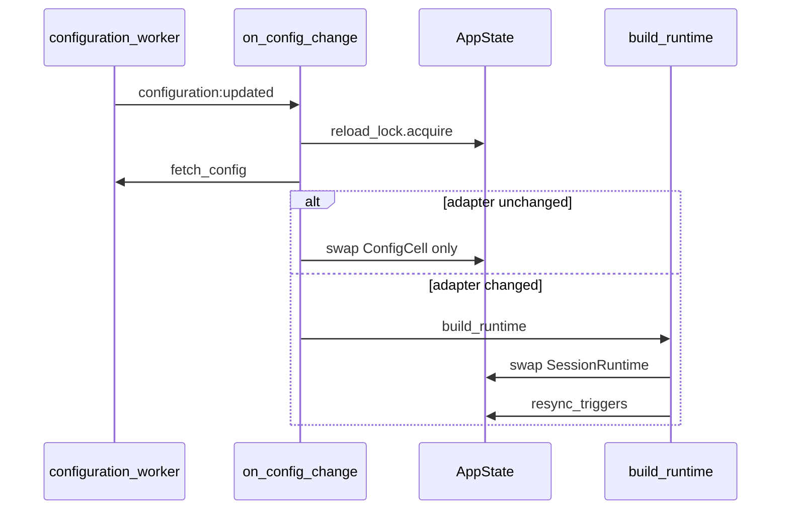

# Integrating a worker with the `configuration` worker

How to move a worker's runtime config off a static, committed `config.yaml` and
onto the built-in **`configuration`** worker: a schema-validated, reactive
registry that other workers and the operator console can read, validate, and
edit on a live bus.

This is the **advanced** alternative to the baseline static-config pattern in
[`binary-worker.md`](binary-worker.md) §5 Path A. Reach for it when config must
be observable, hot-reloadable, or shared. Reference implementations:
`session-manager`, `context-manager`, `approval-gate`, `shell`, `storage`,
`database`, `coder`.

## 1. What the `configuration` worker is

A server-side registry of named entries. Every entry has an id (e.g.
`session-manager`, `llm-router`), a human-readable name and description, a JSON
Schema describing the value shape, and a JSON value validated against that
schema. Workers call `configuration::register` once at startup to declare their
schema and `configuration::set` to publish values; consumers call
`configuration::get` / `configuration::list` to read, and bind a
`configuration` trigger to react to changes without polling.

The default `fs` adapter persists one YAML file per id under
`./data/configuration` and watches the directory, so manual edits surface as
`configuration:updated` events the same way SDK calls do. The worker is enabled
by default in the engine.

### When to use

- A worker is migrating its block out of a static `config.yaml` and wants a
  typed, observable surface other workers can read and validate against.
- Two workers need to agree on the same values without one polling the other.
- An operator should edit one place (a YAML file or the console) and have the
  change propagate to every subscriber without a restart.

### Boundaries

- Not a general-purpose key/value store — every entry needs a registered JSON
  Schema. Use `state` for free-form values.
- No partial updates: `set` always replaces the whole value. Build the new
  value client-side and ship it in one call.
- Schemas are not version-checked across re-registrations — re-registering with
  an incompatible schema replaces it. Coordinate migrations out-of-band.

## 2. Source of truth

After first boot, the **`configuration` worker** is the only authoritative
runtime config. Nothing in the worker repo is loaded by default at runtime.

| What | Role |
|------|------|
| `./data/configuration/<id>.yaml` | Persisted value (configuration worker fs adapter) |
| `WorkerConfig::default()` | Built-in defaults; registered as `initial_value` only when no stored value exists yet |
| `--config <path>` (CLI) | **Optional one-time seed** for `initial_value` on first registration; never overwrites an existing stored value |
| Console Configuration tab | Same store via `configuration::set` |
| Committed `<worker>/config.yaml` | **Do not ship** once integrated — omit from the repo |

Boot flow: `register_config` declares the schema (+ optional seed) →
`fetch_config` reads the authoritative, env-expanded value → the worker builds
its runtime from that. A failed register/fetch is **fatal** (required boot
dependency).

Optional `--config` behaviour (see [`session-manager/src/main.rs`](../../session-manager/src/main.rs)):

- Parse failure **warns** and falls through to no seed (the stored value or
  built-in default applies).
- Re-registration on every boot is safe: an existing stored value is preserved.

## 3. Function surface

All ids are kebab-case (`<worker>::<verb>`), per [`binary-worker.md`](binary-worker.md) §7:

- `configuration::register` — declare an id with name, description, JSON
  Schema, and an optional `initial_value`; idempotent re-registration replaces
  the schema/metadata but preserves any stored value.
- `configuration::set` — replace the value for a registered id; validates
  against the schema and emits `configuration:updated`.
- `configuration::get` — read one entry by id; expands `${VAR:default}`
  against live env unless `raw: true`.
- `configuration::list` — enumerate registered ids with name/description/schema
  (never the value).
- `configuration::schema` — read schema/name/description for one id.

`register` and `set` are the only mutators; reads are cache-backed and expand
`${VAR:default}` against the live process env on every call, so env changes
propagate without a restart.

## 4. The integration recipe (Rust binary)

### a. `src/config.rs` — make the config schema-able and splittable

Keep the `WorkerConfig` struct + `serde(default)` + `default_*()` +
`impl Default` from [`binary-worker.md`](binary-worker.md) §5 Path A, then add:

- Derive **`Serialize` + `JsonSchema`** (alongside `Deserialize`); keep
  `#[serde(deny_unknown_fields)]`.
- `from_yaml(&str)` / `from_file(&str)` — env-expand `${NAME}` against the
  process env, then parse. Used only for the optional `--config` seed path.
- `from_json(&Value)` — parse a value already env-expanded by the
  configuration worker (do **not** re-expand).
- `to_json(&self) -> Value` and `json_schema() -> Value` (a
  `schemars::schema_for!` with the shipped defaults attached as `example`).
- `boot_signature(&self) -> BootSignature` — a **comparison key** for the
  *structural* half of config (adapters, topology, trigger bindings; see §6). On
  reload: equal signature → cheap tuning-only snapshot swap; different signature
  → rebuild the affected adapter / re-bind the affected trigger and swap.
  **Hot-reload is the default** — refusing a change (restart required) is a
  last-resort exception that must be justified in the worker's docs (§6).

Path B workers do **not** need `load_config()` in the production boot path.

### b. `src/configuration.rs` — the integration module

Pick a **reload tier** (§6) and mirror the matching reference:

**Tier 1 — ConfigCell + targeted rebuild/re-bind** ([`context-manager/src/configuration.rs`](../../context-manager/src/configuration.rs), [`approval-gate/src/configuration.rs`](../../approval-gate/src/configuration.rs)):

- `pub type ConfigCell = Arc<RwLock<Arc<WorkerConfig>>>`
- `register_config(iii, seed)`, `fetch_config(iii)`
- `apply_config(cell, cfg)` — swap the snapshot; tuning knobs take effect on the
  next per-call read.
- On a **structural** change, rebuild + swap the one affected resource rather
  than refuse: `context-manager` rebuilds its `FsLeaseStore` on a `lease_dir`
  change; `approval-gate` re-binds its `harness::hook::pre-trigger` / `cron`
  bindings on a `hook` / `sweep_expression` change (register the new binding,
  then `unregister()` the old — a fail-safe overlap). Read `summarizer_timeout_ms`
  and other numeric knobs from the live snapshot per call so they need no rebuild.
- `register_config_trigger(iii, cell, <resource(s) to rebuild/re-bind>)`

**Tier 2 — Full runtime swap** ([`session-manager/src/configuration.rs`](../../session-manager/src/configuration.rs), [`shell/src/configuration.rs`](../../shell/src/configuration.rs)):

- `AppState { runtime: Arc<RwLock<SessionRuntime>>, ctx, reload_lock, reload_status }`
- `build_runtime(cfg, ctx) -> Result<SessionRuntime, String>` — pure wiring
  extracted from `main.rs`
- `apply_runtime(state, cfg)` / `reload_serialized` — fetch under lock, build,
  swap; last-good on failure
- Handlers read the live runtime per call (not captured at registration)
- Optional `<worker>::config-status` exposing `ReloadStatus` (mirror shell)
- **Post-reload resync** when subscribers reconcile from triggers
  ([`session-manager/src/resync.rs`](../../session-manager/src/resync.rs)):
  after an adapter swap, replay the new store's state through the local emitter
  so open views stay live without a refetch

Common to both tiers:

- `CONFIG_ID = "<worker>"`, `CONFIG_FN_ID = "<worker>::on-config-change"`, retry/backoff constants.
- `register_config(iii, seed)` — register `json_schema()`; install `seed` as
  `initial_value` when present, else seed `WorkerConfig::default()` only when no
  value is stored yet (safe to call every boot).
- `fetch_config(iii)` — read the authoritative, env-expanded value
  (`NOT_FOUND` ⇒ built-in default).
- `register_config_trigger` — register `<worker>::on-config-change` and bind a
  `configuration` trigger (see §5). Register it **exactly like `session-manager`**:
  a **typed** `RegisterFunction::new_async` over a small event struct
  (`OnConfigChangeEvent { id }`) returning a typed ack
  (`OnConfigChangeResponse { ok }`) — **never a `serde_json::Value` handler**
  ([`binary-worker.md`](binary-worker.md) §7 forbids untyped handlers, and this
  one is no exception just because it is internal). The handler **re-fetches**
  via `configuration::get` and ignores the trigger payload, so a direct call can
  never inject config. `session-manager`, `context-manager`, and `approval-gate`
  all follow this shape; register the handler here (not in `functions::register_all`),
  so it stays off the public `catalog()`.

### c. `src/main.rs` — boot order

**Tier 1 (ConfigCell-only):**

```text
1. parse CLI (--config optional seed only)
2. connect to the engine
3. register_config(seed)  +  fetch_config()        # required boot dependency
4. resolve adapters from the fetched config
5. build the ConfigCell; register functions
6. register_config_trigger                         # LAST
```

**Tier 2 (full runtime swap):**

```text
1. parse CLI (--config optional seed only)
2. connect
3. register_config(seed) + fetch_config()         # fatal
4. register trigger types (+ internal feeds if applicable)
5. build_runtime → AppState
6. register protocol handlers (mode-gated if applicable) + functions (read AppState per call)
7. register_config_trigger + config-status
```

`configuration` is a **required boot dependency**: a failed register/fetch
aborts startup. Bind the configuration trigger **last** so handlers close over
fully-built state.

### d. No shipped `config.yaml`

Integrated workers **omit** `config.yaml` from the repo. Defaults live in
`WorkerConfig::default()` and appear in `json_schema()` as the top-level
`example`.

Seeding options (pick one):

1. Built-in default on first `configuration::register` (when nothing stored).
2. Optional `--config <path>` one-time seed at first boot.
3. Operator `configuration::set` or edit of `./data/configuration/<id>.yaml`
   before the worker starts.

A local seed file for development may exist but should stay **uncommitted** or
live under docs/examples — it is not loaded by default at runtime.
`session-manager`, `context-manager`, and `approval-gate` ship **zero**
`config.yaml` — that is the canonical pattern. Some older workers (e.g. `coder`,
and `shell` / `storage` pending migration) still ship one; treat that as legacy,
not a precedent for new or freshly-migrated integrations.

### e. `iii-permissions.yaml` — deny reload hooks

Add defense-in-depth denies next to the existing storage/database/shell entries:

- `'!<worker>::on-config-change'` — must never be agent-callable. Required for
  **every** integrated worker (the live deny list includes `session::`,
  `context::`, `approval::`, `storage::`, `database::`, and `shell::`).
- `'!<worker>::config-status'` — only when the worker exposes one (Tier 2;
  precedent: `session-manager`, `shell`). Tier 1 ConfigCell-only workers
  (`context-manager`, `approval-gate`) do not register a `config-status`
  surface, so there is nothing to deny.

## 5. Reactive triggers

Bind a `configuration` trigger when a function should run on every
register/set/delete — including external `fs` edits and bridge-forwarded events:

```rust
iii.register_trigger(RegisterTriggerInput {
    trigger_type: "configuration".to_string(),
    function_id: "<worker>::on-config-change".to_string(),
    config: json!({
        "configuration_id": "<worker>",              // omit to receive every id
        "event_types": ["configuration:updated"],    // subset of registered|updated|deleted
    }),
    metadata: None,
})?;
```

Reads never fire triggers. If you only need the new value inside the same
function that wrote it, `configuration::set` already returns
`old_value` / `new_value` — bind a trigger only when a *different* component
should react.

## 6. Hot-reload tiers and outcomes

**Hot-reload is the default.** Every config field should take effect without a
restart: read numeric/string knobs from the live snapshot per call, rebuild and
swap cheap adapters, and re-bind triggers live (register the new binding, then
`unregister()` the old). A field may require a restart **only** when it
genuinely cannot be rebound or rebuilt safely at runtime — a rare exception that
must be called out explicitly in the worker's README/architecture docs. The
workers below have **no** restart-required fields.

### Reload tiers by worker

| Worker | Tier | Structural hot reload |
|--------|------|-----------------------|
| `context-manager` | ConfigCell + rebuild | `lease_dir` rebuilds the `FsLeaseStore`; `summarizer_timeout_ms` + other knobs read per call |
| `approval-gate` | ConfigCell + re-bind | `hook` / `sweep_expression` re-bind the harness-hook / cron triggers live; timeouts + approval defaults read per call |
| `storage` | partial runtime | topology frozen; connection settings reload |
| `shell`, `database` | full runtime swap | yes |
| **`session-manager`** | full runtime + **resync** | yes (fs/bridge, `data_dir`, bridge `url`/`timeout_ms`) |



### Outcomes on `configuration:updated`

1. **Applied** — the live runtime reflects the fetched config.
2. **Tuning-only reload** — boot signature unchanged; `ConfigCell` swap only
   (Tier 1, or Tier 2 list-limit fields).
3. **Structural reload** — boot signature changed; rebuild the affected adapter
   (`build_runtime` / `FsLeaseStore`) or re-bind the affected trigger, then swap
   (+ resync when subscribers reconcile from triggers).
4. **Rejected** — a rebuild **failed** (e.g. an unbuildable adapter config); the
   previous runtime/snapshot is kept (last-good). This is a failure path, not a
   "restart required" design choice; Tier 2 surfaces it via
   `<worker>::config-status` (`last_outcome: rejected`, `last_error`, cumulative
   `rejected_reloads`).

Always keep the previous runtime/snapshot on any failure path; never serve a
half-applied config. Reloads are serialized (`reload_lock`) and re-fetch inside
the lock so overlapping events converge to the latest authoritative value.

### Operator risks (Tier 2 + resync)

- Changing `data_dir` or bridge `url` switches backing storage immediately; **no
  data migration**.
- fs→bridge on an instance acting as **main** for other bridges breaks attached
  bridged instances.
- Large stores may emit a brief trigger burst on resync (acceptable for rare
  operator config changes).

## 7. Checklist

- [ ] `WorkerConfig` derives `Serialize` + `JsonSchema`; has
      `from_yaml`/`from_file`/`from_json`/`to_json`/`json_schema`/`boot_signature`.
- [ ] **No committed `config.yaml`**; `WorkerConfig::default()` seeds first boot.
- [ ] `src/configuration.rs` implements the chosen reload tier (Tier 1:
      `ConfigCell` + targeted rebuild/re-bind; Tier 2: `AppState` +
      `build_runtime` + `reload_serialized` + optional resync).
- [ ] **Every field hot-reloads** (per-call read / rebuild+swap / live trigger
      re-bind). No field is "restart required" unless it genuinely cannot be
      hot-applied — and any such exception is documented in the worker's docs.
- [ ] `main.rs`: connect → register+fetch (fatal) → build runtime → register
      functions → bind configuration trigger (+ `config-status` for Tier 2) last.
- [ ] `<worker>::on-config-change` is a **typed** `RegisterFunction::new_async`
      (event struct → ack struct, never a `Value` handler) that **re-fetches**
      via `configuration::get`, registered in `configuration.rs` (off the public
      `catalog()`) — exactly like `session-manager` / `context-manager` /
      `approval-gate`.
- [ ] `'!<worker>::on-config-change'` denied in `iii-permissions.yaml` (always);
      `'!<worker>::config-status'` denied too when the worker exposes one (Tier 2).
- [ ] README "Configuration" section documents the id, reload tier, persistence
      path, and operator risks.
- [ ] Unit tests cover `boot_signature` (tuning-only vs structural change), JSON
      round-trip, and the structural-change path (adapter rebuild / trigger
      re-bind; Tier 2 also: rejected reload keeps runtime / resync emits
      triggers); they run engine-free in CI.
