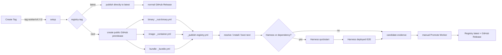

# Worker release

**Sources of truth:**
[`.github/workflows/create-tag.yml`](../../.github/workflows/create-tag.yml),
[`.github/workflows/release.yml`](../../.github/workflows/release.yml),
[`.github/workflows/release-lsp-vscode.yml`](../../.github/workflows/release-lsp-vscode.yml),
[`.github/workflows/_rust-binary.yml`](../../.github/workflows/_rust-binary.yml),
[`.github/workflows/_container.yml`](../../.github/workflows/_container.yml),
[`.github/workflows/_bundle.yml`](../../.github/workflows/_bundle.yml),
[`.github/workflows/_publish-registry.yml`](../../.github/workflows/_publish-registry.yml),
[`.github/workflows/_candidate-smoke.yml`](../../.github/workflows/_candidate-smoke.yml),
[`.github/workflows/promote-worker.yml`](../../.github/workflows/promote-worker.yml),
[`.github/scripts/parse_release_tag.py`](../../.github/scripts/parse_release_tag.py).
On conflict, the workflow wins — update this doc.

Operational SOP for cutting a worker version, monitoring the pipeline, and
verifying registry publish. One-time wiring is in [`new-worker.md`](new-worker.md) §6.

## Prerequisites

- **Branch:** Create Tag requires `main` (preflight enforces it).
- **Access:** GitHub Actions on this repo; org secrets configured (do not paste
  values):
  - `III_CI_APP_ID` / `III_CI_APP_PRIVATE_KEY` — bot commit + tag push in Create Tag
  - `WORKERS_REGISTRY_API_KEY` — publish, skills, and Registry tag promotion
- **Worker wired:** `create-tag.yml` options + `release.yml` tag pattern (see
  [`new-worker.md`](new-worker.md) §6).
- **Local green:** lint + tests for the worker; Rust binary: `--manifest` JSON valid.

## Standard release (happy path)

### 1. Create Tag

Actions → **Create Tag**:

| Input | Meaning |
|---|---|
| Worker | Folder name (must be in workflow options) |
| Bump | `patch` / `minor` / `major` |
| Registry channel | `next` (default: validate and promote manually) or `latest` (publish directly) |
| Experimental | Checkbox. Marks the worker experimental in the registry — see [Experimental releases](#experimental-releases) |

The workflow:

1. Bumps version in the worker manifest (`Cargo.toml`, `package.json`, …).
2. Commits `chore(<worker>): bump to vX.Y.Z` to `main`.
3. Creates and pushes an **annotated** tag `<worker>/vX.Y.Z` with
   the selected `registry-tag` and `experimental: <true|false>` in the tag
   message.

Choose `next` for the staged candidate flow. Choose `latest` for a worker that
does not need candidate validation and manual promotion; that release publishes
directly to the Registry `latest` channel.

### 2. Release pipeline

Tag push triggers **Release** (`release.yml`):



| Stage | Job | Output |
|---|---|---|
| setup | Parse tag + `iii.worker.yaml`; detect web bundle / smoke opt-out | worker, version, deploy, targets, … |
| create-release | Public GitHub prerelease for `next`, normal Release for `latest` | Release page and downloadable assets |
| binary-build | `_rust-binary.yml` | Per-target `.tar.gz` / `.zip` + `.sha256` on the Release |
| container-build | `_container.yml` | Multi-arch image at `ghcr.io/<owner>/<worker>` |
| bundle-build | `_bundle.yml` | `<worker>.tar.gz` + `.sha256` on the Release |
| publish | `_publish-registry.yml` | Registry manifest + optional skills upload |
| candidate-smoke | Resolve `next`, install it, boot it, and verify the exact lock/interface | Published-artifact evidence |
| candidate-ready | Fold required gate results into one immutable artifact | `release-candidate-<worker>-<version>` |

`deploy` from `iii.worker.yaml` selects exactly one build job.

### 3. What publish does

[`_publish-registry.yml`](../../.github/workflows/_publish-registry.yml):

1. Boots a clean `iii` engine (`workers: []`).
2. Starts the **released artifact** (mode from `manifest_version.py deploy-mode`):
   - `release-binary` — downloads Linux gnu tarball from the GitHub Release
   - `release-bundle` — extracts `<worker>.tar.gz`, runs `node ./index.mjs`
   - `iii-add` — `iii worker add ./<worker>` (non-binary/bundle deploys with `runtime`/`scripts.start`, e.g. image workers)
   - `cargo-run` — `cargo run` from source (remaining Rust workers)
3. Uses `config.collect.yaml` when present (sidecar-free boot).
4. Collects function + trigger interface (120 s timeout); asserts non-empty.
5. Resolves release assets and normalized manifest `tags` into `payload.json`.
6. `POST /publish` to `https://api.workers.iii.dev`.
7. `POST /w/<worker>/skills` when `skills/*.md` exist (skipped when absent).

Workers with `interface_smoke: false` skip the entire publish job.

### 4. Candidate gates

Staged releases (`registry-tag: next`) resolve and install `worker@next`, check
the expected version in `iii.lock`, and verify the registered interface.
Harness and its mandatory dependencies additionally run the published
quickstart and deployed E2E in the same Release run. Those gates use the stable
CLI and stable baseline stack, then replace the released worker with
`worker@<exact-version>`.

`interface_smoke: false` workers remain GitHub-only releases and do not enter
the staged Registry flow.

### 5. Direct latest releases

When Create Tag is run with `registry-tag: latest`, the Release workflow
publishes directly to Registry `latest`, skips candidate gates and the
**Promote Worker** workflow, and creates a normal GitHub Release for a stable
version. This path is intended for workers that do not need the staged
candidate lifecycle.

### 6. Promote to latest

After `candidate-ready` passes, run Actions → **Promote Worker** from `main` and
enter the worker. Version and Release run id are optional: a promotion always
ships the candidate behind `next`, so the workflow resolves the version from
the Registry and locates the Release run from the resulting tag. Fill them in
only for the repair paths — retrying an interrupted promotion after `next`
already moved on, or pointing at a dispatched Release re-run (whose run is not
findable by tag). The workflow:

1. Downloads and validates the candidate evidence and Git tag commit.
2. Confirms `next` still points to the exact candidate.
3. Moves the Registry `latest` tag with source and destination preconditions.
4. For image workers, moves `ghcr.io/<owner>/<worker>:latest` to the immutable
   version digest.
5. Converts the existing GitHub prerelease to a normal release without changing
   the repository-global GitHub Latest release.
6. Posts the final Slack announcement.

Registry, GitHub Release, and GHCR promotion operations are idempotent. If one
of those later steps fails, rerun the same promotion to repair the remaining
state. A rerun after Slack already accepted the root message can repeat the
announcement, so inspect `#worker-releases` before retrying a Slack-only
failure.

### 7. Registry tag semantics

| Channel | Typical use |
|---|---|
| `latest` | Stable worker channel, updated directly or by manual promotion |
| `next` | Current candidate created by the release pipeline |

After promotion, `next` and `latest` may point to the same immutable version.
The next staged release moves only `next`. The annotated Git tag records the
initial Registry tag; Create Tag defaults to `next`, but can select `latest` for
a direct release.

## Experimental releases

Tick **Experimental** on Create Tag to mark the worker unstable in the
registry. It is a badge and nothing else — the version publishes to the
selected channel, installs normally, and resolves normally. Promotion does not
clear the badge.

It travels the same way the channel does: `experimental: true` in the
annotated tag message, read by `parse_release_tag.py`, forwarded through
`release.yml` to the publish payload. Anything but the literal `true` — a
missing line, a lightweight tag, a typo — publishes as stable.

**Leave it unticked once the worker settles.** Publishing a later release
without the flag clears the badge. Registry tag promotion and experimental
maturity are independent states.

For what the registry does with the flag, see
[`EXPERIMENTAL_WORKERS.md`](https://github.com/iii-hq/registry/blob/main/docs/EXPERIMENTAL_WORKERS.md)
in the registry repo.

## Variants

### Re-run a failed release

Actions → **Release** → `workflow_dispatch` → enter the existing tag
(e.g. `session-manager/v0.1.0`). No new tag or version bump needed.
Concurrency group `release-${{ github.ref }}` serializes per tag.
Duplicate `POST /publish` responses are accepted only when the exact version
already exists and the requested Registry tag still points to it.

### Prerelease

Create Tag cannot produce prerelease suffixes. Push a manual **annotated** tag:

```text
<worker>/vX.Y.Z-beta.1
```

With tag message including `registry-tag: next`. Marks the GitHub Release as
prerelease; still builds, publishes, and runs candidate gates, but cannot be
promoted by **Promote Worker** until a stable `MAJOR.MINOR.PATCH` is released.

### Alpha release from a feature branch

Actions → **Alpha Release** → choose the worker and select the feature branch
in **Use workflow from**. The workflow refuses `main`, derives the next
`<worker>/vX.Y.Z-alpha.N` version from the branch manifest and existing alpha
tags, then creates an ephemeral commit reachable only from that annotated tag.
It never pushes the selected branch or `main`.

The tag annotation always contains `registry-tag: next`; alpha releases cannot
publish to `latest`. The regular **Release** workflow runs from that tag and
creates a GitHub prerelease, release assets, and the registry entry on `next`.

### Dry run

Tag shape: `<worker>/vX.Y.Z-dry-run.1` (parsed by `parse_release_tag.py`).

- Runs the full build matrix
- Skips GitHub Release asset upload and registry publish
- Useful to validate a new worker's pipeline before `v0.1.0`

### Skills-only update

Actions → **Publish worker skills** — worker must be in
`ALLOWED_WORKERS` ([`parse_publish_workers_input.py`](../../.github/scripts/parse_publish_workers_input.py)).
No version bump; updates skill markdown on the registry channel you pick.

### LSP VS Code extension

`lsp-vscode` uses
[`release-lsp-vscode.yml`](../../.github/workflows/release-lsp-vscode.yml)
(VS Code extension packaging, separate tag pattern `lsp-vscode/v*`). The
Marketplace/OpenVSX package name remains `iii-lsp`.

The extension release workflow packages the VSIX once and then publishes it via
separate jobs:

| Job | External side effect |
|---|---|
| `publish-vscode` | Publishes the VSIX to VS Code Marketplace |
| `publish-openvsx` | Publishes the same VSIX to OpenVSX |
| `github-release` | Uploads the VSIX to the GitHub Release |

If only one target fails, do **not** create another version bump. Either use
GitHub Actions "Re-run failed jobs" for the same run, or dispatch **Release LSP
VS Code** manually with the existing tag and the failed target:

| Input | Example |
|---|---|
| `tag` | `lsp-vscode/v0.2.7` |
| `publish_target` | `openvsx`, `vscode-marketplace`, or `github-release` |

Use `publish_target=all` only for the first publish attempt or when all targets
are known to be safe to run again.

### Pre-bumped manifest

If a merged PR already set the manifest version (e.g. a breaking change
that names its own release), use Create Tag with **Bump = none**: it
releases the manifest version as-is, skips the bump commit, and still
refuses existing tags.

## Troubleshooting

| Symptom | Likely cause | Fix |
|---|---|---|
| Tag pushed, nothing ran | Missing `'<worker>/v*'` in `release.yml` | Add pattern (§6 in `new-worker.md`); dispatch Release manually meanwhile |
| setup fails | Invalid tag shape or bad `iii.worker.yaml` | Tag must match `worker/vVERSION`; `deploy` must be `binary`\|`image`\|`bundle` |
| binary-build fails on one target | Cross-compile issue | Consider `targets:` subset in `iii.worker.yaml` (`shell` is POSIX-only); other targets still upload (`fail-fast: false`) |
| interface collection times out | Worker crashes on clean runner (#104 class) | Ship `config.collect.yaml`; check `iii-engine.log`, `worker-<name>.log` in the job |
| Worker exits before collection | Missing parent dir, sidecar, bad default path | Same as above; reproduce locally with no `data/` dir |
| artifact resolution 404 | Build job didn't upload for that target | Check GitHub Release assets for the tag |
| publish HTTP non-200 | Registry rejection or bad payload | Response body printed in job log; verify `WORKERS_REGISTRY_API_KEY` |
| publish skipped entirely | `interface_smoke: false` | Expected for stdio/discovery-only workers |
| promotion evidence rejected | Wrong run/worker/version, failed gate, or prerelease semver | Use the candidate's successful Release run and exact stable version |
| promotion returns `409` | `next` advanced or `latest` changed concurrently | Do not promote the stale candidate; inspect the current Registry tags |

On failure, publish dumps `iii-engine.log` and `worker-<worker>.log` (last 200 lines).

## Rollback

There is **no unpublish**. Recovery:

1. Fix the issue on `main`.
2. Cut a new patch via Create Tag; use `next` for a staged replacement or
   `latest` for a direct replacement.
3. Validate and manually promote the replacement when using `next`.

GitHub Release assets for the bad version remain (immutable history).

## Post-release verification

On a clean host:

```bash
iii worker add <name>
iii worker info <name>
```

Confirm:

- Version matches the tag you cut.
- Function and trigger types match expectations.
- GitHub Release has complete assets (per-target archives + `.sha256` for
  binary/bundle deploys).

## Announce & organize

Slack announcement is automatic: a successful candidate posts `🧪` with its
`next` status, while **Promote Worker** posts the final `🚀 ... promoted to
@latest` message. `SLACK_BOT_TOKEN` is org-level (the same
bot as the iii engine release pipeline); the bot must be invited to
`#worker-releases`. The GitHub release-notes body is posted as a thread
reply under the announcement. Ticket association rides on PR titles —
`(MOT-##) type: description` — enforced by the `PR Linear Check` workflow
(`no-ticket` label for bump/typo/CI-only PRs).

After a release session — any number of tags — run `/release-sync` in Claude
Code from the repo root. Same-day tags form one **wave** = one Linear
document on team iii (`Release YYYY-MM-DD`) holding the combined
per-worker note, with shipped `MOT-###` issues carrying a
`release · YYYY-MM-DD` label. Catch-up
semantics: tags released without running the skill are picked up on the
next run. Conventions and setup checklist:
[Release workflow — workers](https://linear.app/motia/document/release-workflow-workers-a3240a17967f).
