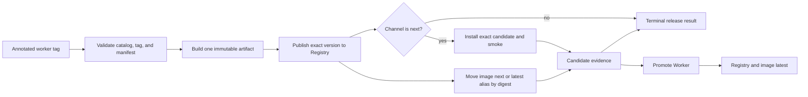

# Worker release

The worker release pipeline is an executor for manual operators and Release
Control. Both use the same version rules, immutable evidence, and repair paths.

**Sources of truth:**
[`.github/release-workers.yaml`](../../.github/release-workers.yaml),
[`create-tag.yml`](../../.github/workflows/create-tag.yml),
[`release.yml`](../../.github/workflows/release.yml),
[`promote-worker.yml`](../../.github/workflows/promote-worker.yml),
[`repair-worker-release.yml`](../../.github/workflows/repair-worker-release.yml),
[`manifest_version.py`](../../.github/scripts/manifest_version.py), and
[`parse_release_tag.py`](../../.github/scripts/parse_release_tag.py).
On conflict, those files win; update this SOP in the same change.

## Release contract

The standard pipeline accepts a worker slug from
`.github/release-workers.yaml`. GitHub renders the input as text because Actions
cannot populate a choice dynamically; the workflow rejects slugs outside the
catalog. `lsp-vscode` is cataloged but routes to its specialized workflow.

Release versions use this deliberately small grammar:

```text
MAJOR.MINOR.PATCH[-experimental|-alpha|-beta]
```

Numbered or arbitrary prerelease suffixes and build metadata are rejected. The
maturity ladder is `experimental -> alpha -> beta -> stable`. At the same
version core, a release may advance or skip a maturity but may not repeat or
move backwards. Once a stable tag exists for a core, no prerelease can be
created for that core.

The Registry's `experimental` flag is a separate worker badge. For example,
`0.2.0-beta` may have `experimental: false`, while a stable `0.2.0` may still
have `experimental: true`.

Every v2 annotated Git tag carries the durable execution identity:

```text
worker: shell
version: 0.2.0-beta
release-contract: 2
operation-id: <Release Control operation or github:<run-id>>
step-id: <operation step or create-tag>
source-sha: <previewed main SHA or unknown>
maturity: beta
registry-tag: next
experimental: false
```

Legacy v1 tags and candidate evidence remain readable during the staged
migration. All newly created tags and evidence use contract v2.

## Prerequisites

- Dispatch **Create Tag** from `main`.
- Configure `III_CI_APP_ID`, `III_CI_APP_PRIVATE_KEY`, and
  `WORKERS_REGISTRY_API_KEY` as repository or organization secrets.
- Add the worker to `.github/release-workers.yaml`; see
  [`new-worker.md`](new-worker.md#6-release-wiring-one-time-per-worker).
- Run the worker's lint and test suite before creating a release.

## Create a release

Actions -> **Create Tag** accepts:

| Input | Meaning |
|---|---|
| `worker` | Cataloged worker slug |
| `bump` | `patch`, `minor`, `major`, or `none` |
| `target_version` | Optional exact version; overrides `bump` and `suffix` |
| `suffix` | `none`, `experimental`, `alpha`, or `beta` |
| `registry_tag` | `next` for a candidate, `latest` for a direct release |
| `experimental` | Independent Registry badge |
| `operation_id`, `step_id` | Optional Release Control correlation IDs |
| `expected_current_version` | Optional compare-and-swap guard for the manifest |
| `source_sha` | Optional preview SHA; the worker path must still match it |

The workflow resolves the new version before mutating the repository. Examples
from manifest version `0.1.0`:

| Intent | Result |
|---|---|
| `patch` + `none` | `0.1.1` |
| `minor` + `alpha` | `0.2.0-alpha` |
| `none` + `beta` | `0.1.0-beta` |
| exact `1.0.0-experimental` | `1.0.0-experimental` |

An exact target is authoritative. Release Control should send
`expected_current_version` and `source_sha` from its preview so a stale plan
fails before a version commit is written.

The workflow validates tag history, updates the manifest and Cargo lock when
needed, pushes the version commit to `main`, then creates the annotated
`<worker>/v<version>` tag. A concurrent push is retried once only when the
selected worker did not change. A matching existing tag is treated as an
idempotent result.

Experimental, alpha, beta, and stable versions may publish directly to `latest`
when the worker allows it. Harness cannot publish directly to `latest`; it must
pass the candidate and deployed-E2E gates before promotion. Any worker may use
`next` for candidate validation.

## Release pipeline

Pushing a standard worker tag triggers **Release**:



`deploy` in `iii.worker.yaml` selects exactly one build path:

| Deploy | Build output |
|---|---|
| `binary` | Per-target archive and checksum attached to the GitHub Release |
| `bundle` | Worker bundle and checksum attached to the GitHub Release |
| `image` | Immutable `ghcr.io/<owner>/<worker>:<version>` plus its digest |

The publish job boots the released artifact, captures its typed function and
trigger interface, builds the Registry payload, publishes the exact version,
and uploads skills when present. Workers with `interface_smoke: false` remain
GitHub-only releases and skip Registry gates.

For image workers, the mutable `next` or `latest` alias moves only after the
Registry publish succeeds. The alias source is the immutable digest emitted by
the build, and the workflow verifies the version reference, digest, and final
alias resolve to the same manifest.

### Candidate evidence

A `next` release must resolve and install the exact candidate, verify the lock
and registered interface, and write
`release-candidate-<worker>-<version>/release-candidate.json`. Schema v2 binds
the original Release run, evidence-producing run, run attempt, tag SHA, source
SHA, operation identity, maturity, gate results, and image digest.

Harness dependencies do not implicitly run the Harness suite. They can be
released and promoted independently like other workers. Harness itself needs a
separate successful **Harness E2E deployed** run before promotion.

Every Release run also attempts to upload
`release-result-<run-id>/release-result.json`. It classifies the terminal state
as `succeeded`, `partial`, or `failed`, records the last durable phase and all
job outcomes. Workflows do not send operator notifications; Release Control
projects successful terminal evidence to Slack without coupling delivery to
publication state.

## Promote a candidate

After candidate evidence is ready, dispatch **Promote Worker** from `main`.
Normally only `worker` is needed: the workflow resolves `next`, locates the
Release run, and downloads its evidence. `version`, `release_run_id`, and
`candidate_evidence_run_id` are explicit overrides for repaired evidence or an
interrupted promotion after `next` moved.

Promotion performs these guarded, idempotent changes:

1. Validate the candidate artifact, evidence-producing run attempt, and current
   Git tag SHA.
2. Require the release version grammar and confirm Registry `next` still points
   to the candidate.
3. For Harness, validate a deployed-E2E evidence artifact tied to the same
   release and E2E run attempt. `e2e_run_id` can be supplied or auto-located.
4. Move Registry `latest` with source and destination preconditions.
5. For images, move GHCR `latest` from the recorded immutable digest.
6. Convert a stable candidate's GitHub prerelease to a normal release. An
   experimental, alpha, or beta release remains marked as a GitHub prerelease.
   Neither path changes the repository-global GitHub Latest release.

The terminal `promotion-<worker>-<version>` artifact records `succeeded`,
`partial`, or `failed` plus each external surface. Release Control is the
approval boundary; the workflow does not add a second GitHub Environment
approval.

## Run deployed Harness E2E

Dispatch **Harness E2E deployed** with the candidate worker, exact version,
release tag and Release run id. The suite installs the requested Registry
state and verifies the exact release worker version. It always emits
`harness-e2e-evidence-<worker>-<version>`; a failed suite produces evidence with
`e2e_ready: false` and then fails the gate.

Only a Harness promotion requires this artifact. Releasing a Harness dependency
does not couple that worker's promotion to Harness E2E.

## Repair an interrupted release

Do not create a replacement version solely because a later external side
effect failed. Dispatch **Repair worker release** with the exact worker,
version, original Release run id, and one explicit action:

| Action | Purpose |
|---|---|
| `verify` | Verify Registry, GitHub Release, and image alias state |
| `candidate-smoke` | Repeat the exact `next` smoke and emit new candidate evidence |
| `container-alias` | Reconcile only the selected `next` or `latest` image alias |
| `github-release` | Create or reconcile GitHub prerelease/release state |

Use `channel=original` for the tag's original channel. Select `next` or
`latest` only when repairing a known partial candidate, direct release, or
promotion. Repair validates the catalog, tag manifest, original run and
available evidence before acting, and writes a terminal
`release-repair-<worker>-<version>-<run-id>` artifact.

The workflow never rewrites a version or Git tag. Registry versions and GitHub
Release assets remain immutable history.

## Prerelease from a feature branch

Actions -> **Prerelease from branch** can cut `experimental`, `alpha`, or
`beta` from a non-`main` branch. It writes the chosen version to an ephemeral
commit reachable only through the annotated tag, pushes no branch, fixes the
channel to `next`, and dispatches the standard Release workflow.

Use an exact prerelease target when advancing maturity at the same version core.
There are no `.1`, `.2`, or other numbered suffixes.

## Specialized and legacy variants

### LSP VS Code extension

`lsp-vscode` uses
[`release-lsp-vscode.yml`](../../.github/workflows/release-lsp-vscode.yml).
Package and publish targets remain independent; retry a failed target with the
same existing tag instead of creating another version.

### Skills-only update

Actions -> **Publish worker skills** updates skill Markdown without a version
bump. Its narrower `ALLOWED_WORKERS` list applies only to that out-of-band
operation, not to the release catalog.

### Legacy dry run

Contract-v1 tags shaped `<worker>/vX.Y.Z-dry-run.N` still run builds while
skipping GitHub Release and Registry mutation. Contract v2 does not create new
dry-run versions; validate changes through CI or a branch prerelease.

## Troubleshooting

| Symptom | Likely cause | Action |
|---|---|---|
| Create Tag rejects worker | Slug absent from the catalog | Add it to `.github/release-workers.yaml` and run catalog validation |
| Version rejected | Invalid grammar, backward maturity, or stable core already tagged | Choose a forward version or maturity |
| Source/version guard fails | Release Control preview is stale | Refresh the plan; do not bypass the guard blindly |
| Setup rejects a tag | Annotation, catalog, or manifest version mismatch | Inspect the annotated tag and tagged manifest |
| Registry publish fails | Interface boot, schema, payload, or Registry error | Inspect `iii-engine.log`, worker log, and response body |
| Image alias fails after Registry success | GHCR digest/alias reconciliation failed | Run repair action `container-alias` for the same version |
| Candidate evidence is rejected | Wrong worker/version/run attempt/tag SHA or a failed gate | Use the exact successful Release or repair evidence run |
| Harness promotion lacks E2E | No green deployed evidence for that release | Dispatch Harness E2E deployed with the exact release identity |
| Promotion becomes partial | Registry changed but a later surface failed | Repair the failed `latest` surface; do not cut another version |
| Slack delivery failed | Release Control could not project successful evidence | Check its Slack bot configuration and durable notification outbox; delivery retries automatically |

## Roll forward and verify

There is no unpublish. For a defective artifact, fix `main`, release a new patch
to `next`, validate it, and promote it. Do not move immutable version tags.

On a clean host:

```bash
iii worker add <name>
iii worker info <name>
```

Confirm the resolved version, published function/trigger interface, GitHub
Release assets, and — for images — the expected channel digest.

Release Control owns Slack communication in `#worker-releases`. It creates one
root message for the immutable Release run, updates that root when the candidate
reaches `latest`, and keeps lifecycle checkpoints in the same thread. Ticket
association rides on PR titles (`(MOT-##) type: description`) or the `no-ticket`
label for changes that do not belong to a Linear issue.
