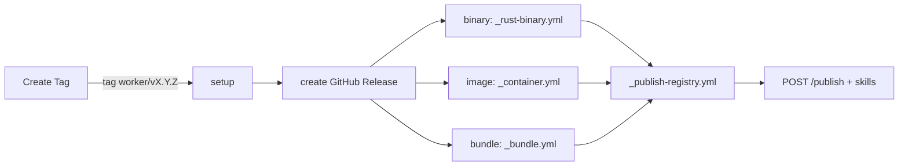

# Worker release

**Sources of truth:**
[`.github/workflows/create-tag.yml`](../../.github/workflows/create-tag.yml),
[`.github/workflows/release.yml`](../../.github/workflows/release.yml),
[`.github/workflows/release-lsp-vscode.yml`](../../.github/workflows/release-lsp-vscode.yml),
[`.github/workflows/_rust-binary.yml`](../../.github/workflows/_rust-binary.yml),
[`.github/workflows/_container.yml`](../../.github/workflows/_container.yml),
[`.github/workflows/_bundle.yml`](../../.github/workflows/_bundle.yml),
[`.github/workflows/_publish-registry.yml`](../../.github/workflows/_publish-registry.yml),
[`.github/scripts/parse_release_tag.py`](../../.github/scripts/parse_release_tag.py).
On conflict, the workflow wins — update this doc.

Operational SOP for cutting a worker version, monitoring the pipeline, and
verifying registry publish. One-time wiring is in [`new-worker.md`](new-worker.md) §6.

## Prerequisites

- **Branch:** Create Tag requires `main` (preflight enforces it).
- **Access:** GitHub Actions on this repo; org secrets configured (do not paste
  values):
  - `III_CI_APP_ID` / `III_CI_APP_PRIVATE_KEY` — bot commit + tag push in Create Tag
  - `WORKERS_REGISTRY_API_KEY` — `POST /publish` and `POST /w/<worker>/skills`
- **Worker wired:** `create-tag.yml` options + `release.yml` tag pattern (see
  [`new-worker.md`](new-worker.md) §6).
- **Local green:** lint + tests for the worker; Rust binary: `--manifest` JSON valid.

## Standard release (happy path)

### 1. Create Tag

Actions → **Create Tag**:

| Input | Meaning |
|---|---|
| Worker | Folder name (must be in workflow options) |
| Bump | `patch` / `minor` / `major` / `none` — picks the base version |
| Suffix | `none` / `alpha` / `beta` / `rc` / `stable` — pre-release line on that base |
| Registry tag | `latest` / `next` / `experimental` — channel the version publishes to |

**Suffix and Registry tag are independent axes.** The suffix lives in the
version (`1.2.3-rc.1`); the channel is where that version is published
(`@next`). Any combination is valid — a release is `<version>@<channel>`, e.g.
`1.2.3-rc.1@next`. See [Version suffixes](#version-suffixes) and
[Registry tag semantics](#4-registry-tag-semantics).

The workflow:

1. Bumps version in the worker manifest (`Cargo.toml`, `package.json`, …).
2. Commits `chore(<worker>): bump to vX.Y.Z` to `main`.
3. Creates and pushes an **annotated** tag `<worker>/vX.Y.Z` with
   `registry-tag: <latest|next|experimental>` in the tag message.

### 2. Release pipeline

Tag push triggers **Release** (`release.yml`):



| Stage | Job | Output |
|---|---|---|
| setup | Parse tag + `iii.worker.yaml`; detect web bundle / smoke opt-out | worker, version, deploy, targets, … |
| create-release | GitHub Release shell | Release page for the tag |
| binary-build | `_rust-binary.yml` | Per-target `.tar.gz` / `.zip` + `.sha256` on the Release |
| container-build | `_container.yml` | Multi-arch image at `ghcr.io/<owner>/<worker>` |
| bundle-build | `_bundle.yml` | `<worker>.tar.gz` + `.sha256` on the Release |
| publish | `_publish-registry.yml` | Registry manifest + optional skills upload |

`deploy` from `iii.worker.yaml` selects exactly one build job.

### 3. What publish does

[`_publish-registry.yml`](../../.github/workflows/_publish-registry.yml):

1. Boots a clean `iii` engine (`workers: []`).
2. Starts the **released artifact** (mode from `manifest_version.py deploy-mode`):
   - `release-binary` — downloads Linux gnu tarball from the GitHub Release
   - `release-bundle` — extracts `<worker>.tar.gz`, runs `node ./index.mjs`
   - `iii-add` — `iii worker add ./<worker>` (non-binary/bundle deploys with `runtime`/`scripts.start`, e.g. image workers)
   - `cargo-run` — `cargo run` from source (remaining Rust workers)
3. Uses `config.collect.yaml` when present (sidecar-free boot).
4. Collects function + trigger interface (120 s timeout); asserts non-empty.
5. Resolves release assets and normalized manifest `tags` into `payload.json`.
6. `POST /publish` to `https://api.workers.iii.dev`.
7. `POST /w/<worker>/skills` when `skills/*.md` exist (skipped when absent).

Workers with `interface_smoke: false` skip the entire publish job.

### 4. Registry tag semantics

A channel is *where a version is published*, written `<worker>@<channel>`.

| Channel | Typical use |
|---|---|
| `latest` | Default; what most `iii worker add` installs resolve |
| `next` | Upcoming release; safer for a first publish |
| `experimental` | Throwaway / spike work not intended for promotion |

A worker version carries **at most one** channel, and a worker has at most one
version per channel. Publishing moves the channel: the previous holder loses it
(`clearTagOnWorker` in the registry), so channels are reassigned on each release.

The channel is stored in the **annotated tag message** (`registry-tag:`).
`release.yml` refetches the annotated tag for this reason. Lightweight tags
lose the channel and default to `latest`. `parse_release_tag.py` rejects any
value outside the table above, so a typo fails the release instead of creating
a dead channel that nothing resolves.

> **Note:** installs resolve `latest` only. `next` and `experimental` are
> published and queryable by tag through the registry API, but
> `iii worker add <worker>@next` needs resolver support in `iii-hq/registry`
> before it works.

### Version suffixes

A suffix is *what the version is*, written into the version itself. It is
orthogonal to the channel — pick both independently.

| Suffix | Result from `1.2.3` | Meaning |
|---|---|---|
| `none` | `1.2.4` | Stable release (default) |
| `alpha` | `1.2.4-alpha.1` | Earliest, expected to break |
| `beta` | `1.2.4-beta.1` | Feature-complete but unstable |
| `rc` | `1.2.4-rc.1` | Release candidate |
| `stable` | `1.2.3` | Promote a pre-release to its base, no bump |

The counter is derived from existing git tags, so re-running Create Tag with
the same worker, base and suffix advances it (`-rc.1` → `-rc.2`) instead of
colliding. Each suffix line advances independently at the same base.

Bump and suffix compose: **Bump** picks the base version, **Suffix** decides
whether that base ships as a pre-release. `Bump: none` keeps the current base,
which is how you iterate a pre-release without walking the version forward.

A typical `rc` cycle, all on `@next`, then promoted:

```text
Bump: patch  Suffix: rc      Tag: next     ->  1.2.4-rc.1@next
Bump: none   Suffix: rc      Tag: next     ->  1.2.4-rc.2@next
Bump: none   Suffix: stable  Tag: latest   ->  1.2.4@latest
```

Pre-release versions are marked as prereleases on the GitHub Release and are
skipped by the registry resolver's semver matching, so a `^1.2.0` dependency
never silently resolves to `1.2.4-rc.2`.

## Variants

### Re-run a failed release

Actions → **Release** → `workflow_dispatch` → enter the existing tag
(e.g. `session-manager/v0.1.0`). No new tag or version bump needed.
Concurrency group `release-${{ github.ref }}` serializes per tag.

### Prerelease

Use Create Tag's **Suffix** input — see [Version suffixes](#version-suffixes).

To cut one by hand instead, push an **annotated** tag shaped
`<worker>/vX.Y.Z-beta.1` with `registry-tag: <channel>` in the message. Either
way the GitHub Release is marked prerelease and still builds and publishes
(unless `interface_smoke: false`). A hand-pushed tag must carry the `.N`
counter — `parse_release_tag.py` detects prereleases as `-<word>.<number>`.

### Dry run

Tag shape: `<worker>/vX.Y.Z-dry-run.1` (parsed by `parse_release_tag.py`).

- Runs the full build matrix
- Skips GitHub Release asset upload and registry publish
- Useful to validate a new worker's pipeline before `v0.1.0`

### Skills-only update

Actions → **Publish worker skills** — worker must be in
`ALLOWED_WORKERS` ([`parse_publish_workers_input.py`](../../.github/scripts/parse_publish_workers_input.py)).
No version bump; updates skill markdown on the registry channel you pick.

### LSP VS Code extension

`lsp-vscode` uses
[`release-lsp-vscode.yml`](../../.github/workflows/release-lsp-vscode.yml)
(VS Code extension packaging, separate tag pattern `lsp-vscode/v*`). The
Marketplace/OpenVSX package name remains `iii-lsp`.

The extension release workflow packages the VSIX once and then publishes it via
separate jobs:

| Job | External side effect |
|---|---|
| `publish-vscode` | Publishes the VSIX to VS Code Marketplace |
| `publish-openvsx` | Publishes the same VSIX to OpenVSX |
| `github-release` | Uploads the VSIX to the GitHub Release |

If only one target fails, do **not** create another version bump. Either use
GitHub Actions "Re-run failed jobs" for the same run, or dispatch **Release LSP
VS Code** manually with the existing tag and the failed target:

| Input | Example |
|---|---|
| `tag` | `lsp-vscode/v0.2.7` |
| `publish_target` | `openvsx`, `vscode-marketplace`, or `github-release` |

Use `publish_target=all` only for the first publish attempt or when all targets
are known to be safe to run again.

### Pre-bumped manifest

If a merged PR already set the manifest version (e.g. a breaking change
that names its own release), use Create Tag with **Bump = none**: it
releases the manifest version as-is, skips the bump commit, and still
refuses existing tags.

## Troubleshooting

| Symptom | Likely cause | Fix |
|---|---|---|
| Tag pushed, nothing ran | Missing `'<worker>/v*'` in `release.yml` | Add pattern (§6 in `new-worker.md`); dispatch Release manually meanwhile |
| setup fails | Invalid tag shape or bad `iii.worker.yaml` | Tag must match `worker/vVERSION`; `deploy` must be `binary`\|`image`\|`bundle` |
| binary-build fails on one target | Cross-compile issue | Consider `targets:` subset in `iii.worker.yaml` (`shell` is POSIX-only); other targets still upload (`fail-fast: false`) |
| interface collection times out | Worker crashes on clean runner (#104 class) | Ship `config.collect.yaml`; check `iii-engine.log`, `worker-<name>.log` in the job |
| Worker exits before collection | Missing parent dir, sidecar, bad default path | Same as above; reproduce locally with no `data/` dir |
| artifact resolution 404 | Build job didn't upload for that target | Check GitHub Release assets for the tag |
| publish HTTP non-200 | Registry rejection or bad payload | Response body printed in job log; verify `WORKERS_REGISTRY_API_KEY` |
| publish skipped entirely | `interface_smoke: false` | Expected for stdio/discovery-only workers |

On failure, publish dumps `iii-engine.log` and `worker-<worker>.log` (last 200 lines).

## Rollback

There is **no unpublish**. Recovery:

1. Fix the issue on `main`.
2. Cut a new patch via Create Tag (registry `latest` moves forward).
3. When uncertain, cut an `rc` suffix on the `next` channel first, then
   promote with `Suffix: stable` / `Tag: latest`.

GitHub Release assets for the bad version remain (immutable history).

## Post-release verification

On a clean host:

```bash
iii worker add <name>
iii worker info <name>
```

Confirm:

- Version matches the tag you cut.
- Function and trigger types match expectations.
- GitHub Release has complete assets (per-target archives + `.sha256` for
  binary/bundle deploys).

## Announce & organize

Slack announcement is automatic: the terminal `announce` job in
`release.yml` posts `🚀 <worker> vX.Y.Z` to `#worker-releases` for every
successful non-dry-run release. `SLACK_BOT_TOKEN` is org-level (the same
bot as the iii engine release pipeline); the bot must be invited to
`#worker-releases`. The GitHub release-notes body is posted as a thread
reply under the announcement. Ticket association rides on PR titles —
`(MOT-##) type: description` — enforced by the `PR Linear Check` workflow
(`no-ticket` label for bump/typo/CI-only PRs).

After a release session — any number of tags — run `/release-sync` in Claude
Code from the repo root. Same-day tags form one **wave** = one Linear
document on team iii (`Release YYYY-MM-DD`) holding the combined
per-worker note, with shipped `MOT-###` issues carrying a
`release · YYYY-MM-DD` label. Catch-up
semantics: tags released without running the skill are picked up on the
next run. Conventions and setup checklist:
[Release workflow — workers](https://linear.app/motia/document/release-workflow-workers-a3240a17967f).
