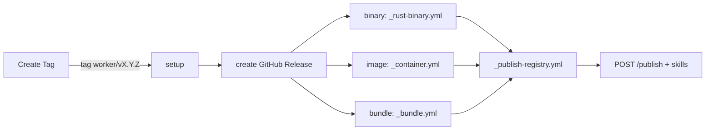

# Worker release

**Sources of truth:**
[`.github/workflows/create-tag.yml`](../../.github/workflows/create-tag.yml),
[`.github/workflows/release.yml`](../../.github/workflows/release.yml),
[`.github/workflows/_rust-binary.yml`](../../.github/workflows/_rust-binary.yml),
[`.github/workflows/_container.yml`](../../.github/workflows/_container.yml),
[`.github/workflows/_bundle.yml`](../../.github/workflows/_bundle.yml),
[`.github/workflows/_publish-registry.yml`](../../.github/workflows/_publish-registry.yml),
[`.github/scripts/parse_release_tag.py`](../../.github/scripts/parse_release_tag.py).
On conflict, the workflow wins — update this doc.

Operational SOP for cutting a worker version, monitoring the pipeline, and
verifying registry publish. One-time wiring is in [`new-worker.md`](new-worker.md) §6.

## Prerequisites

- **Branch:** Create Tag requires `main` (preflight enforces it).
- **Access:** GitHub Actions on this repo; org secrets configured (do not paste
  values):
  - `III_CI_APP_ID` / `III_CI_APP_PRIVATE_KEY` — bot commit + tag push in Create Tag
  - `WORKERS_REGISTRY_API_KEY` — `POST /publish` and `POST /w/<worker>/skills`
- **Worker wired:** `create-tag.yml` options + `release.yml` tag pattern (see
  [`new-worker.md`](new-worker.md) §6).
- **Local green:** lint + tests for the worker; Rust binary: `--manifest` JSON valid.

## Standard release (happy path)

### 1. Create Tag

Actions → **Create Tag**:

| Input | Meaning |
|---|---|
| Worker | Folder name (must be in workflow options) |
| Bump | `patch` / `minor` / `major` |
| Registry tag | `latest` or `next` — channel for `iii worker add` resolution |

The workflow:

1. Bumps version in the worker manifest (`Cargo.toml`, `package.json`, …).
2. Commits `chore(<worker>): bump to vX.Y.Z` to `main`.
3. Creates and pushes an **annotated** tag `<worker>/vX.Y.Z` with
   `registry-tag: <latest|next>` in the tag message.

### 2. Release pipeline

Tag push triggers **Release** (`release.yml`):



| Stage | Job | Output |
|---|---|---|
| setup | Parse tag + `iii.worker.yaml`; detect web bundle / smoke opt-out | worker, version, deploy, targets, … |
| create-release | GitHub Release shell | Release page for the tag |
| binary-build | `_rust-binary.yml` | Per-target `.tar.gz` / `.zip` + `.sha256` on the Release |
| container-build | `_container.yml` | Multi-arch image at `ghcr.io/<owner>/<worker>` |
| bundle-build | `_bundle.yml` | `<worker>.tar.gz` + `.sha256` on the Release |
| publish | `_publish-registry.yml` | Registry manifest + optional skills upload |

`deploy` from `iii.worker.yaml` selects exactly one build job.

### 3. What publish does

[`_publish-registry.yml`](../../.github/workflows/_publish-registry.yml):

1. Boots a clean `iii` engine (`workers: []`).
2. Starts the **released artifact** (mode from `manifest_version.py deploy-mode`):
   - `release-binary` — downloads Linux gnu tarball from the GitHub Release
   - `release-bundle` — extracts `<worker>.tar.gz`, runs `node ./index.mjs`
   - `iii-add` — `iii worker add ./<worker>` (non-binary/bundle deploys with `runtime`/`scripts.start`, e.g. image workers)
   - `cargo-run` — `cargo run` from source (remaining Rust workers)
3. Uses `config.collect.yaml` when present (sidecar-free boot).
4. Collects function + trigger interface (120 s timeout); asserts non-empty.
5. Resolves release assets into `payload.json`.
6. `POST /publish` to `https://api.workers.iii.dev`.
7. `POST /w/<worker>/skills` when `skills/*.md` exist (skipped when absent).

Workers with `interface_smoke: false` skip the entire publish job.

### 4. Registry tag semantics

| Channel | Typical use |
|---|---|
| `latest` | Default; what most `iii worker add` installs resolve |
| `next` | Pre-release / risky channel; safer for first publish |

The channel is stored in the **annotated tag message** (`registry-tag:`).
`release.yml` refetches the annotated tag for this reason. Lightweight tags
lose the channel and default to `latest`.

## Variants

### Re-run a failed release

Actions → **Release** → `workflow_dispatch` → enter the existing tag
(e.g. `session-manager/v0.1.0`). No new tag or version bump needed.
Concurrency group `release-${{ github.ref }}` serializes per tag.

### Prerelease

Create Tag cannot produce prerelease suffixes. Push a manual **annotated** tag:

```text
<worker>/vX.Y.Z-beta.1
```

With tag message including `registry-tag: next`. Marks the GitHub Release as
prerelease; still builds and publishes (unless `interface_smoke: false`).

### Dry run

Tag shape: `<worker>/vX.Y.Z-dry-run.1` (parsed by `parse_release_tag.py`).

- Runs the full build matrix
- Skips GitHub Release asset upload and registry publish
- Useful to validate a new worker's pipeline before `v0.1.0`

### Skills-only update

Actions → **Publish worker skills** — worker must be in
`ALLOWED_WORKERS` ([`parse_publish_workers_input.py`](../../.github/scripts/parse_publish_workers_input.py)).
No version bump; updates skill markdown on the registry channel you pick.

### Not via this pipeline

`iii-lsp-vscode` uses [`release-lsp.yml`](../../.github/workflows/release-lsp.yml)
(VS Code extension packaging, separate tag pattern `iii-lsp-vscode/v*`).

## Troubleshooting

| Symptom | Likely cause | Fix |
|---|---|---|
| Tag pushed, nothing ran | Missing `'<worker>/v*'` in `release.yml` | Add pattern (§6 in `new-worker.md`); dispatch Release manually meanwhile |
| setup fails | Invalid tag shape or bad `iii.worker.yaml` | Tag must match `worker/vVERSION`; `deploy` must be `binary`\|`image`\|`bundle` |
| binary-build fails on one target | Cross-compile issue | Consider `targets:` subset in `iii.worker.yaml` (`shell` is POSIX-only); other targets still upload (`fail-fast: false`) |
| interface collection times out | Worker crashes on clean runner (#104 class) | Ship `config.collect.yaml`; check `iii-engine.log`, `worker-<name>.log` in the job |
| Worker exits before collection | Missing parent dir, sidecar, bad default path | Same as above; reproduce locally with no `data/` dir |
| artifact resolution 404 | Build job didn't upload for that target | Check GitHub Release assets for the tag |
| publish HTTP non-200 | Registry rejection or bad payload | Response body printed in job log; verify `WORKERS_REGISTRY_API_KEY` |
| publish skipped entirely | `interface_smoke: false` | Expected for stdio/discovery-only workers |

On failure, publish dumps `iii-engine.log` and `worker-<worker>.log` (last 200 lines).

## Rollback

There is **no unpublish**. Recovery:

1. Fix the issue on `main`.
2. Cut a new patch via Create Tag (registry `latest` moves forward).
3. Use `registry-tag: next` when uncertain before promoting to `latest`.

GitHub Release assets for the bad version remain (immutable history).

## Post-release verification

On a clean host:

```bash
iii worker add <name>
iii worker info <name>
```

Confirm:

- Version matches the tag you cut.
- Function and trigger types match expectations.
- GitHub Release has complete assets (per-target archives + `.sha256` for
  binary/bundle deploys).
