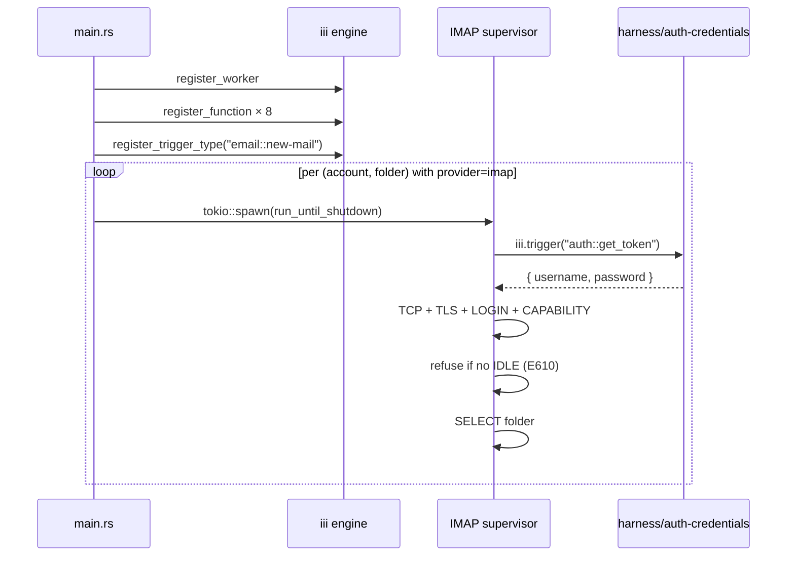
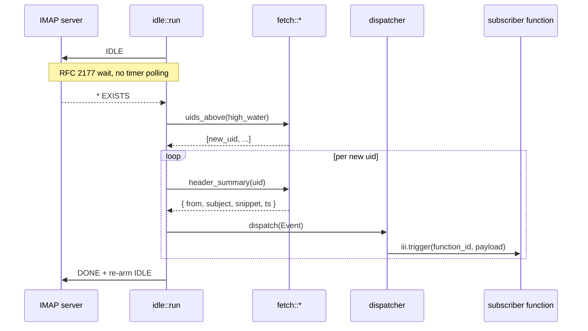
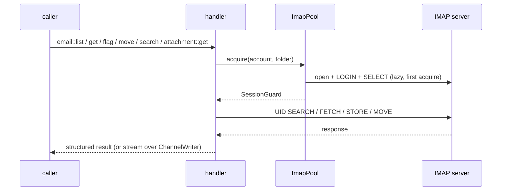

# email — architecture

Design notes for `iii-hq/workers/email`. Borrows the persistent-connection
+ trigger-type-with-dispatcher shape from `storage` and the
`ChannelWriter` streaming response shape from `mcp`.

## Boundaries

- **Owns** — SMTP transport, IMAP connections, the `email::*` function
  registry, the `email::new-mail` trigger type, and its dispatcher.
- **Does not own** — credentials (delegated to `harness/auth-credentials`
  under provider key `email::<account>`), account ↔ transport binding for
  non-config-driven flows, OAuth redirect flow (follow-up PR), attachment
  persistence (callers route to `storage` if they need it).
- **Refuses** — silently degrading IMAP `IDLE` to polling. If the server
  doesn't advertise `IDLE`, `open_and_select` returns `E610` and the
  supervisor keeps reconnect-backing-off so the failure stays visible in
  observability instead of becoming a hidden poll loop.

## Process layout

One process per worker. `main.rs` registers the 8 functions + 1 trigger
type, then spawns one persistent `IMAP+IDLE` supervisor task per
`(account, folder)` configured with `provider: imap`. Read functions
(`list`/`get`/`search`/`flag`/`move`/`attachment::get`) borrow an
on-demand session from `ImapPool` — separate from the supervisor's
session so the half-duplex IMAP socket is never shared.

### Boot

### IDLE push → fan-out

### Read function path (on-demand pool)

## Module map

| Module | Purpose |
|---|---|
| `config` | YAML config: accounts + transports + limits |
| `manifest` | `--manifest` output for the registry pipeline |
| `handlers::*` | Public `email::*` function registry |
| `provider::smtp` | `lettre` transport: MIME builder, STARTTLS, plain |
| `provider::imap::connection` | TCP + TLS, login, capability check, supervisor loop |
| `provider::imap::idle` | RFC 2177 IDLE loop, EXISTS push → dispatcher |
| `provider::imap::fetch` | `UID FETCH` helpers: header summary, full body, streamed part bytes |
| `provider::imap::reconnect` | Event-driven exponential backoff between connect attempts |
| `provider::imap::mod` (`ImapPool`) | `DashMap<(account, folder), Arc<Mutex<Option<Session>>>>` |
| `triggers::registry` | `(account, folder) → Vec<Subscriber>`, indexed by instance id |
| `triggers::dispatcher` | `EngineDispatcher` — fan-out via `iii.trigger` per subscriber |
| `triggers::new_mail` | `TriggerHandler<email::new-mail>` registers / unregisters subscribers |

## Real-time invariants

- One persistent TLS+IMAP connection per `(account, folder)`, parked in
  `IDLE`. Zero `tokio::time::interval` calls in the IDLE path.
- The only `sleep` in the lifecycle is `reconnect::backoff` between
  connect *attempts*. Reconnect is triggered by socket close events, not
  by a timer.
- The 29-minute `wait_with_timeout` inside `idle::run` is the RFC 2177
  IDLE refresh, not application-level polling — the wait returns the
  instant the server pushes data.
- `email::search` and `email::attachment::get` write to a `ChannelWriter`
  as IMAP returns matches / body bytes — no in-memory buffering.
- `dispatcher.dispatch` is called from the IDLE task synchronously after
  the new UID is fetched; subscriber fan-out happens on the same task,
  bounded by `handler_timeout_ms`.

## Roadmap

| PR | Adds | Status |
|---|---|---|
| 1 | SMTP send + IMAP read + IDLE push + `email::new-mail` trigger type | **this PR** |
| 2 | Stream-source attachment send (closes the `E699` path) | next |
| 3 | Gmail OAuth + Pub/Sub push (push, not poll) | follow-up |
| 4 | Microsoft Graph + change-notification webhooks | follow-up |
| 5 | JMAP adapter (Fastmail native push) | follow-up |
| 6 | `email::draft::save/send`, `email::reply`, `email::forward` shortcuts | follow-up |
