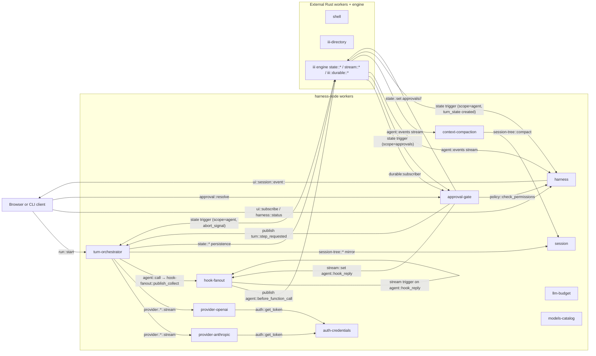
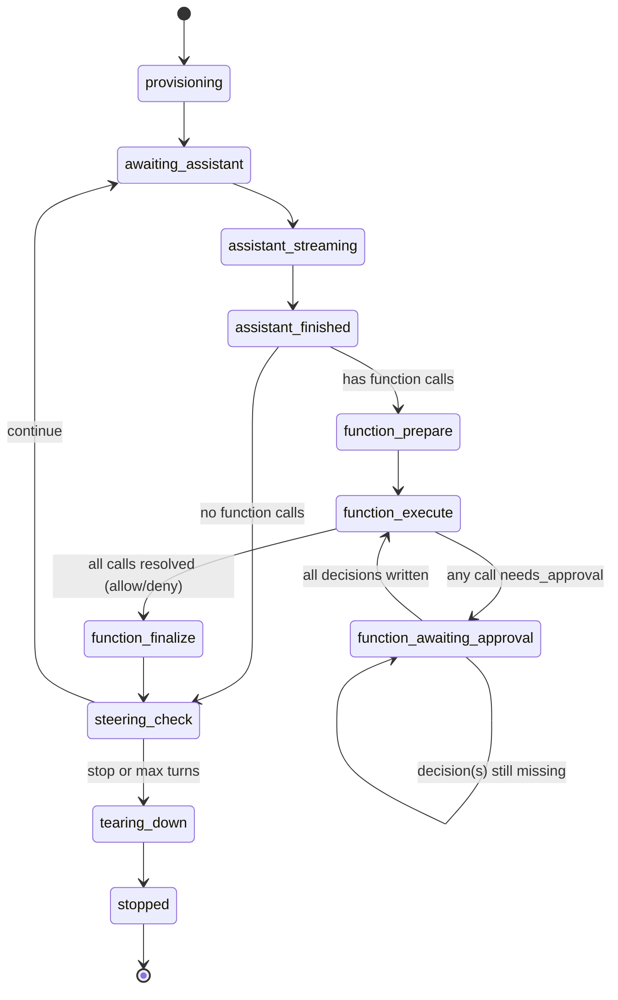
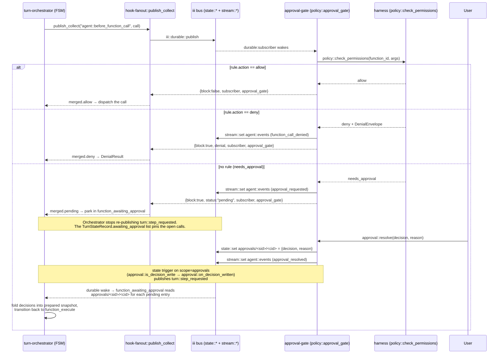
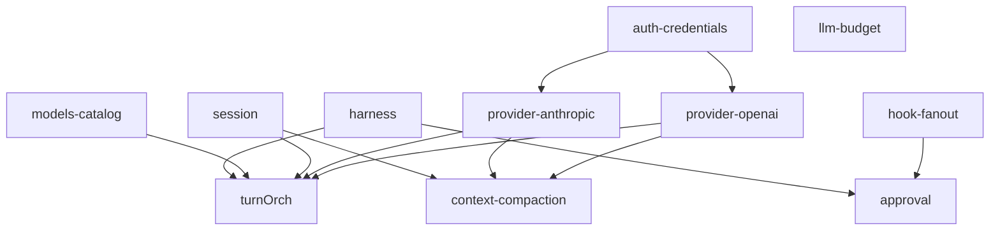

# harness-node architecture

`harness-node` is the Node/TypeScript port of the iii harness stack. It ships
as one pnpm package containing 11 workers (one folder per worker, one feature
per file) plus a shared `runtime/` SDK helper layer and a `types/` wire-type
mirror of `harness/crates/harness-types`. Each worker is independently runnable
as `pnpm dev:<worker>` (development) or `iii-<worker>` (production binary);
[src/index.ts](harness-node/src/index.ts) is the composite entry-point that
spins every worker up in a single process by reusing each worker's
`register()` callback unchanged.

The Rust workers `shell`, `iii-directory`, and the engine's `state::*` /
`stream::*` / `iii::durable::*` primitives are NOT ported. `harness-node`
talks to them over the iii bus exactly the same way it talks to its own
workers.

## Worker catalogue

| Worker | Folder | Role | Doc |
|---|---|---|---|
| harness | [src/harness/](harness-node/src/harness/) | Meta-worker; loads `iii-permissions.yaml`, exposes `harness::*` / `policy::check_permissions` / `ui::*`, spins up `agent::events` fan-out. | [workers/harness.md](harness-node/docs/workers/harness.md) |
| turn-orchestrator | [src/turn-orchestrator/](harness-node/src/turn-orchestrator/) | Durable FSM driving each agent turn; chokepoint dispatcher for `agent::call`. | [workers/turn-orchestrator.md](harness-node/docs/workers/turn-orchestrator.md) |
| approval-gate | [src/approval-gate/](harness-node/src/approval-gate/) | Hook subscriber on `agent::before_function_call`; consults policy and pauses for user resolution. | [workers/approval-gate.md](harness-node/docs/workers/approval-gate.md) |
| session | [src/session/](harness-node/src/session/) | Branching session storage (`session-tree::*`) plus per-session inbox queues (`session-inbox::*`). | [workers/session.md](harness-node/docs/workers/session.md) |
| llm-budget | [src/llm-budget/](harness-node/src/llm-budget/) | Workspace + agent LLM spend caps with alerts, forecast, period rollover. | [workers/llm-budget.md](harness-node/docs/workers/llm-budget.md) |
| hook-fanout | [src/hook-fanout/](harness-node/src/hook-fanout/) | Generic publish-and-collect primitive over a stream topic. | [workers/hook-fanout.md](harness-node/docs/workers/hook-fanout.md) |
| auth-credentials | [src/auth-credentials/](harness-node/src/auth-credentials/) | File-backed multi-provider credential store. | [workers/auth-credentials.md](harness-node/docs/workers/auth-credentials.md) |
| models-catalog | [src/models-catalog/](harness-node/src/models-catalog/) | Static model-capability catalogue (state-first, embedded fallback). | [workers/models-catalog.md](harness-node/docs/workers/models-catalog.md) |
| provider-anthropic | [src/provider-anthropic/](harness-node/src/provider-anthropic/) | Anthropic Messages API SSE → channel writer. | [workers/provider-anthropic.md](harness-node/docs/workers/provider-anthropic.md) |
| provider-openai | [src/provider-openai/](harness-node/src/provider-openai/) | OpenAI Chat Completions SSE → channel writer. | [workers/provider-openai.md](harness-node/docs/workers/provider-openai.md) |
| context-compaction | [src/context-compaction/](harness-node/src/context-compaction/) | Optional `agent::events` side-car that compacts session history when running token count crosses a threshold. | [workers/context-compaction.md](harness-node/docs/workers/context-compaction.md) |

## System diagram

## Turn FSM

[src/turn-orchestrator/state.ts](harness-node/src/turn-orchestrator/state.ts)
defines an 11-state durable FSM. Every transition is driven by the
`turn::step` durable subscriber, which is woken by a publish to the
`turn::step_requested` topic — either by the orchestrator itself
(re-publish at the end of a step), by the approval-gate's
`approvals` state trigger (when a human decision lands), or by the
orchestrator's own `abort_signal` state trigger.

## Approval flow

The gate replies synchronously to every `agent::before_function_call`
event — `allow`, `deny`, or `pending`. There is no in-gate polling;
resume is driven by a `state` trigger on the `approvals` scope. The
orchestrator parks the turn in `function_awaiting_approval` until that
trigger fires and re-publishes `turn::step_requested`.

Fail-closed: if `iii::durable::publish` errors or no subscriber replies,
`hook-fanout::publish_collect` returns `publish_failed: true` and
`consultBefore` denies the call with a `gate_unavailable` envelope.

Abort: `router::abort` writes `session/<sid>/abort_signal = true` (waking
the orchestrator through its own `agent`-scope state trigger) and, if the
turn is paused on approvals, also writes one
`{decision: 'aborted', reason: 'session_aborted'}` record per pending
call so the approvals state trigger releases the parked step.

## Kernel deny list

[iii-permissions.yaml](iii-permissions.yaml) at the workspace root is the
single source of truth for what an in-run agent can call. The harness loads
it at boot and watches for changes via `chokidar`. Rules are scanned
top-to-bottom; first match wins. Kernel rules below are shipped by default
and protect the gate / state surface.

| Rule id | Function | Action | Why |
|---|---|---|---|
| `kernel/no-self-approve` | `approval::resolve` | deny | An agent must not flip its own pending approval. |
| `kernel/no-self-policy` | `policy::check_permissions` | deny | Don't let the model trace or precompute its own gate decision. |
| `kernel/no-self-policy-gate` | `policy::approval_gate` | deny | Same as above, for the subscriber. |
| `kernel/no-self-hook` | `hook-fanout::publish_collect` | deny | The hook primitive is operator-only. |
| `kernel/no-state-set` | `state::set` | deny | Use a worker function; never raw state writes. |
| `kernel/no-state-update` | `state::update` | deny | Same. |
| `kernel/no-state-delete` | `state::delete` | deny | Same. |
| `kernel/no-stream-set` | `stream::set` | deny | Bypasses the agent loop. |
| `kernel/no-durable-publish` | `iii::durable::publish` | deny | Bypasses the durable hook plane. |
| `kernel/no-auth-set` | `auth::set_token` | deny | Token plumbing is operator-only. |
| `kernel/no-auth-delete` | `auth::delete_token` | deny | Same. |
| `kernel/no-oauth-anthropic-login` | `oauth::anthropic::login` | deny | Same. |
| `kernel/no-oauth-openai-login` | `oauth::openai-codex::login` | deny | Same. |
| `kernel/no-self-run-start` | `run::start` | deny | No re-entrant runs. |
| `kernel/no-self-run-start-and-wait` | `run::start_and_wait` | deny | Same. |
| `kernel/no-router-stream-assistant` | `router::stream_assistant` | deny | Routing internal. |
| `kernel/no-router-abort` | `router::abort` | deny | Routing internal. |

Bare-string allow rules: `harness::status`, `state::get`, `state::list`,
`models::list`, `models::get`, `models::supports`, `auth::get_token`,
`auth::list_providers`, `auth::status`, `oauth::anthropic::status`,
`oauth::openai-codex::status`, the `directory::engine::*` introspection
surface, and the `directory::skills::*` and `directory::prompts::*`
lookups.

## Shared modules

| Folder | Purpose |
|---|---|
| [src/runtime/](harness-node/src/runtime/) | Cross-worker SDK helpers. `worker.ts` parses CLI flags and bootstraps an SDK connection; `config.ts` loads `config.yaml`; `state.ts` / `stream.ts` wrap the iii engine's state/stream surface; `ids.ts` mints UUID-like ids; `otel.ts` provides a pino logger and OTel stub; `handler.ts` exposes `unwrapBody` / `requireString`. |
| [src/types/](harness-node/src/types/) | Wire types that mirror `harness/crates/harness-types/src/*.rs`. `agent-event.ts`, `agent-message.ts`, `content.ts`, `function.ts`, `stream-event.ts`, `thinking.ts`, `provider.ts`, plus `wire.ts` for envelope helpers. |

## Boot ordering & dependencies

The composite entry-point [src/index.ts](harness-node/src/index.ts) spins
workers up in this order so each dependency is already on the bus before its
dependants register:

Edges are extracted from each worker's `iii.worker.yaml` `dependencies:`
block.

## Configuration

All workers honour `--url` / `III_URL` (engine WebSocket) and `--config`
(YAML config file; defaults to `./config.yaml`). The shipped
[config.yaml](harness-node/config.yaml) contains the per-worker sub-sections;
each worker reads only the fields it cares about and ignores the rest. The
harness worker additionally watches the path in `permissions_path` (default
`./iii-permissions.yaml`, symlinked to the workspace-root file) and reloads
the policy on change.
