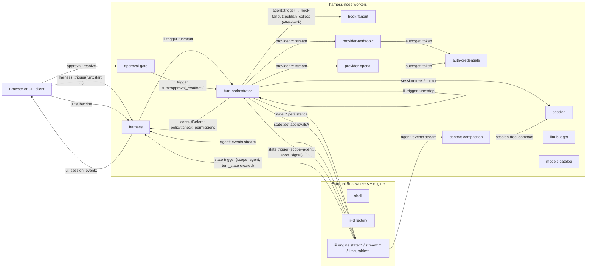
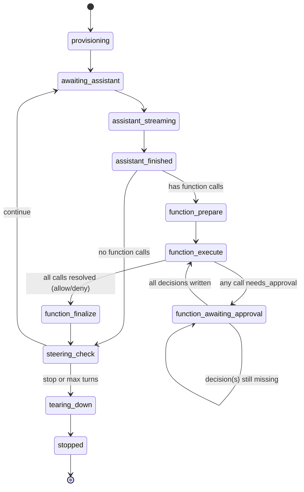
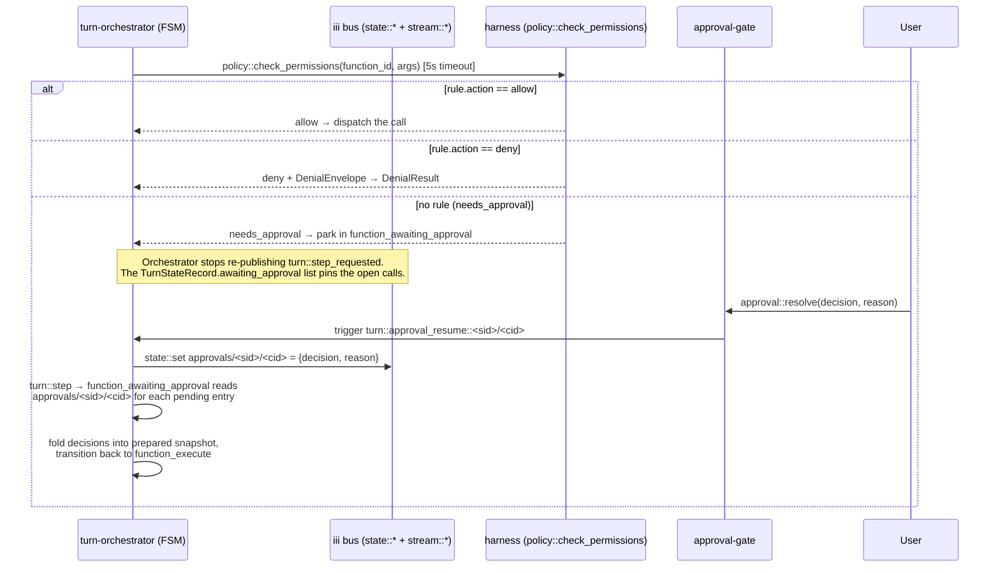
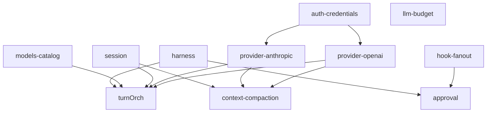
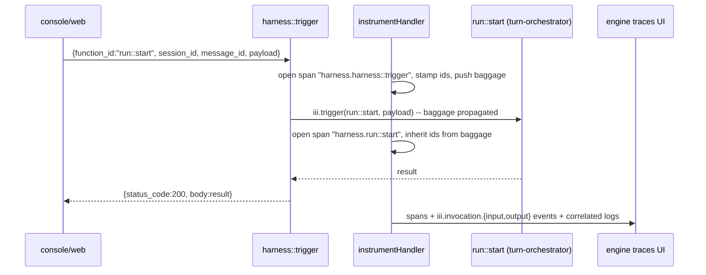

# harness-node architecture

`harness-node` is the Node/TypeScript port of the iii harness stack. It ships
as one pnpm package containing 11 workers (one folder per worker, one feature
per file) plus a shared `runtime/` SDK helper layer and a `types/` wire-type
mirror of `harness/crates/harness-types`. Each worker is independently runnable
as `pnpm dev:<worker>` (development) or `iii-<worker>` (production binary);
[src/index.ts](harness-node/src/index.ts) is the composite entry-point that
spins every worker up in a single process by reusing each worker's
`register()` callback unchanged.

The Rust workers `shell`, `iii-directory`, and the engine's `state::*` /
`stream::*` / `iii::durable::*` primitives are NOT ported. `harness-node`
talks to them over the iii bus exactly the same way it talks to its own
workers.

## Worker catalogue

| Worker | Folder | Role | Doc |
|---|---|---|---|
| harness | [src/harness/](harness-node/src/harness/) | Meta-worker; loads `iii-permissions.yaml`, exposes `harness::trigger` (WS ingestion bridge — see [Telemetry & trace correlation](#telemetry--trace-correlation)) / `policy::check_permissions` / `ui::*`, spins up `agent::events` fan-out. | [workers/harness.md](harness-node/docs/workers/harness.md) |
| turn-orchestrator | [src/turn-orchestrator/](harness-node/src/turn-orchestrator/) | Durable FSM driving each agent turn; chokepoint dispatcher for `agent::trigger`. | [workers/turn-orchestrator.md](harness-node/docs/workers/turn-orchestrator.md) |
| approval-gate | [src/approval-gate/](harness-node/src/approval-gate/) | Registers `approval::resolve` and shared approval wire schemas; routes decisions to per-call `turn::approval_resume` fns owned by the turn-orchestrator. | [workers/approval-gate.md](harness-node/docs/workers/approval-gate.md) |
| session | [src/session/](harness-node/src/session/) | Branching session storage (`session-tree::*`) plus per-session inbox queues (`session-inbox::*`). | [workers/session.md](harness-node/docs/workers/session.md) |
| llm-budget | [src/llm-budget/](harness-node/src/llm-budget/) | Workspace + agent LLM spend caps with alerts, forecast, period rollover. | [workers/llm-budget.md](harness-node/docs/workers/llm-budget.md) |
| hook-fanout | [src/hook-fanout/](harness-node/src/hook-fanout/) | Generic publish-and-collect primitive over a stream topic. | [workers/hook-fanout.md](harness-node/docs/workers/hook-fanout.md) |
| auth-credentials | [src/auth-credentials/](harness-node/src/auth-credentials/) | File-backed multi-provider credential store. | [workers/auth-credentials.md](harness-node/docs/workers/auth-credentials.md) |
| models-catalog | [src/models-catalog/](harness-node/src/models-catalog/) | Static model-capability catalogue (state-first, embedded fallback). | [workers/models-catalog.md](harness-node/docs/workers/models-catalog.md) |
| provider-anthropic | [src/provider-anthropic/](harness-node/src/provider-anthropic/) | Anthropic Messages API SSE → channel writer. | [workers/provider-anthropic.md](harness-node/docs/workers/provider-anthropic.md) |
| provider-openai | [src/provider-openai/](harness-node/src/provider-openai/) | OpenAI Chat Completions SSE → channel writer. | [workers/provider-openai.md](harness-node/docs/workers/provider-openai.md) |
| context-compaction | [src/context-compaction/](harness-node/src/context-compaction/) | Optional `agent::events` side-car that compacts session history when running token count crosses a threshold. | [workers/context-compaction.md](harness-node/docs/workers/context-compaction.md) |

## System diagram

## Turn FSM

[src/turn-orchestrator/state.ts](harness-node/src/turn-orchestrator/state.ts)
defines an 11-state durable FSM. Every transition is driven by the
`turn::step` durable subscriber, which is woken by a publish to the
`turn::step_requested` topic — either by the orchestrator itself
(re-publish at the end of a step), by a per-call
`turn::approval_resume` handler (when a human decision or abort lands), or by
the orchestrator's own `abort_signal` state trigger.

## Approval flow

The orchestrator consults `policy::check_permissions` directly inside
`consultBefore` — `allow`, `deny`, or `pending`. There is no hook fanout on
the before path. The orchestrator parks the turn in `function_awaiting_approval`,
registers a `turn::approval_resume` function per pending call, and waits until
`approval::resolve` (or abort) triggers that function, which persists the
decision and invokes `turn::step`.

Fail-closed: policy unreachable (transport error or 5 s timeout) →
`consultBefore` denies the call with a `gate_unavailable` envelope.

Abort: `router::abort` writes `session/<sid>/abort_signal = true` (waking
the orchestrator through its own `agent`-scope state trigger) and, if the
turn is paused on approvals, triggers each registered
`turn::approval_resume` function with `{decision: 'aborted'}`.

## Kernel deny list

[iii-permissions.yaml](iii-permissions.yaml) at the workspace root is the
single source of truth for what an in-run agent can call. The harness loads
it at boot and watches for changes via `chokidar`. Rules are scanned
top-to-bottom; first match wins. Kernel rules below are shipped by default
and protect the gate / state surface.

Deny shorthands (`!function_id` in the YAML): `approval::resolve`,
`policy::check_permissions`, `hook-fanout::publish_collect`, `state::set`,
`state::update`, `state::delete`, `stream::set`, `iii::durable::publish`,
`auth::set_token`, `auth::delete_token`, `oauth::anthropic::login`,
`oauth::openai-codex::login`, `run::start`, `run::start_and_wait`,
`router::stream_assistant`, `router::abort`.

Bare-string allow rules: `state::get`, `state::list`,
`models::list`, `models::get`, `models::supports`, `auth::get_token`,
`auth::list_providers`, `auth::status`, `oauth::anthropic::status`,
`oauth::openai-codex::status`, the `directory::engine::*` introspection
surface, and the `directory::skills::*` and `directory::prompts::*`
lookups.

## Shared modules

| Folder | Purpose |
|---|---|
| [src/runtime/](harness-node/src/runtime/) | Cross-worker SDK helpers. `worker.ts` parses CLI flags, bootstraps an SDK connection, and wraps it in a `Proxy` so every `registerFunction` is auto-instrumented (see [Telemetry & trace correlation](#telemetry--trace-correlation)); `config.ts` loads `config.yaml`; `state.ts` / `stream.ts` wrap the iii engine's state/stream surface; `ids.ts` mints UUID-like ids; `otel.ts` wires `iii-sdk` OTel via `initHarnessOtel`, exposes `instrumentHandler` (per-call span + baggage propagation), and bridges every pino log to an OTel log auto-correlated to the active span; `handler.ts` exposes `unwrapBody` / `requireString`. |
| [src/types/](harness-node/src/types/) | Wire types that mirror `harness/crates/harness-types/src/*.rs`. `agent-event.ts`, `agent-message.ts`, `content.ts`, `function.ts`, `stream-event.ts`, `thinking.ts`, `provider.ts`, plus `wire.ts` for envelope helpers. |

## Boot ordering & dependencies

The composite entry-point [src/index.ts](harness-node/src/index.ts) spins
workers up in this order so each dependency is already on the bus before its
dependants register:

Edges are extracted from each worker's `iii.worker.yaml` `dependencies:`
block.

## Telemetry & trace correlation

Every harness-node function is automatically instrumented with an OTel span
tagged with `iii.session.id` / `iii.message.id` / `iii.function.id`. This is
what the engine's `engine::traces::group_by` reads to populate "Group by
Session" / "Group by Message" / "Group by Function" in the traces UI; without
the IDs on every span, those groupings return empty.

**The single chokepoint.** [src/runtime/worker.ts](harness-node/src/runtime/worker.ts)
calls `initHarnessOtel(serviceName, engineWsUrl)` before opening the SDK,
then wraps the `ISdk` in a `Proxy` that intercepts `registerFunction(id,
handler, opts)`. The local function handler is replaced with
`instrumentHandler(id, handler)` before being passed through to the real
SDK. HTTP invocation configs (objects, not functions) pass through
unchanged because there is no local handler to wrap. No per-worker
`register.ts` knows or needs to know that this is happening, so no future
worker can accidentally skip the wrap.

**What `instrumentHandler` does per call.** See
[src/runtime/otel.ts](harness-node/src/runtime/otel.ts). On every
invocation it opens a `harness.<function_id>` SERVER span, extracts
`session_id` / `message_id` from the input body (with baggage fallback
for nested calls so a downstream `iii.trigger` inherits the IDs of its
parent), stamps the three `iii.*` attributes onto the span, and runs the
handler inside an OTel context that pushes those IDs as baggage. It also
records three lifecycle events that populate the EVENTS tab in the
traces UI:

- `iii.invocation.input` — redacted + truncated input JSON.
- `iii.invocation.output` — redacted + truncated result JSON (or
  `{error: ...}` on failure).
- `exception` — standard OTel event, only on throw, so the ERRORS tab
  picks the failure up.

Payload capture is gated on the `III_DISABLE_TRACE_PAYLOADS` env var
(matches the Rust `iii-sdk` semantics — set to `1` or `true` to suppress
payloads while keeping spans).

**Why baggage matters.** The engine relies on per-span attributes for
grouping, but only the outermost handler call sees the
`session_id`/`message_id` in its body. Pushing them as baggage means
every nested `iii.trigger` span (e.g. `harness.run::start` →
`harness.provider::anthropic::stream`) inherits the IDs automatically
via the iii-sdk's `BaggageSpanProcessor`. No manual plumbing per
call-site.

**Log bridge.** Pino keeps writing to stderr (devs still see logs in their
terminal during `pnpm dev:<worker>`). On top of that, every
`logger.info/warn/error` also emits an OTel log via `iii-sdk/telemetry`'s
`getLogger()`, which auto-correlates the log to the currently active
span. This is what populates the LOGS tab in the traces UI for every
harness-node span. When `initHarnessOtel` failed to boot (e.g.
`OTEL_ENABLED=false`), the OTel side is a quiet no-op and pino continues
to write to stderr unchanged.

**`harness::trigger` as the WS ingestion bridge.** Browser-originated
requests hit `harness::trigger` (see
[src/harness/trigger.ts](harness-node/src/harness/trigger.ts)), NOT
`run::start` directly. The wrapping `instrumentHandler` reads
`session_id`/`message_id` from the outer body and seeds baggage; the
handler then forwards to `iii.trigger` with the inner `function_id` /
`payload`. This is the symmetric counterpart of the Rust harness bridge
(`workers/harness/src/lib.rs:103-159`; legacy bus id `harness::call`) and
means the span tree looks the same regardless of whether the request
landed on a Rust or Node deployment.

## Configuration

All workers honour `--url` / `III_URL` (engine WebSocket) and `--config`
(YAML config file; defaults to `./config.yaml`). The shipped
[config.yaml](harness-node/config.yaml) contains the per-worker sub-sections;
each worker reads only the fields it cares about and ignores the rest. The
harness worker additionally watches the path in `permissions_path` (default
`./iii-permissions.yaml`, symlinked to the workspace-root file) and reloads
the policy on change.
