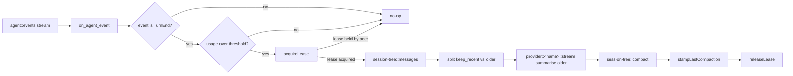

# context-compaction

Out-of-band session-history compactor. Subscribes to
`agent::events::TurnEnd`, summarises older turns via
`provider::<name>::stream`, and writes a session-tree Compaction entry so
the next turn reads a compressed transcript.

## Purpose

`context-compaction` is the only worker in the bundle whose registered
function is purely internal — it has no operator-facing bus surface,
only a stream-subscriber side-car. It watches `agent::events` for
`TurnEnd` frames; if the running token usage (`input + output +
cache_read`, excluding `cache_write`) crosses the configured threshold,
it acquires a per-session single-writer lease, asks `session-tree` for
the active path, splits off the last `COMPACT_KEEP_RECENT_TURNS`
messages, summarises the older prefix via the configured provider's
streaming function, and appends a `Compaction` entry through
`session-tree::compact`. The lease prevents two compactor instances
racing on the same session; a non-CAS nonce-and-readback pattern
implements the lease since the engine's `state::*` has no compare-and-set.

This worker is optional. If you don't run it, sessions keep their full
transcript forever.

## Registered functions

- `context-compaction::on_agent_event` — Internal: subscribes to `agent::events`; triggers session compaction on `TurnEnd` when running tokens exceed the configured threshold.

## Triggers

- Stream subscriber on `agent::events` → `context-compaction::on_agent_event`. Registered in [src/context-compaction/register.ts](harness-node/src/context-compaction/register.ts).

The handler short-circuits unless the event is a `TurnEnd` carrying a
`usage` object whose `input + output + cache_read` total meets the
threshold from `COMPACT_TRIGGER_TOKENS` (default 60 000).

## State keys

All keys live under iii state scope `agent`:

| Key shape | Purpose |
|---|---|
| `session/<sid>/compaction_lease` | `{ nonce, ts }` — held for `LEASE_TTL_SECS = 300`. Acquired by writing a unique nonce and reading it back; the first writer whose nonce survives the readback wins. |
| `session/<sid>/last_compaction_at` | Wall-clock ms timestamp of the most recent successful compaction. Stamped by `stampLastCompaction`. |

## Pipeline

The summariser model defaults to `anthropic` / `claude-haiku-4-5`; the
prompt template lives at
[src/context-compaction/prompts/compaction.txt](harness-node/src/context-compaction/prompts/compaction.txt).

## Configuration

Env-driven (read by
[src/context-compaction/config.ts](harness-node/src/context-compaction/config.ts);
this worker reads no fields from `config.yaml`):

| Env var | Default | Purpose |
|---|---|---|
| `COMPACT_TRIGGER_TOKENS` | `60000` | Running-tokens threshold that arms compaction on `TurnEnd`. |
| `COMPACT_KEEP_RECENT_TURNS` | `3` | Number of trailing turns kept verbatim; older messages get summarised. |
| `COMPACT_SUMMARIZER_PROVIDER` | `anthropic` | `anthropic` or `openai` — picks which `provider::*::stream` runs the summary. |
| `COMPACT_SUMMARIZER_MODEL` | `claude-haiku-4-5` | Model id passed to the provider stream. |

## Dependencies

From
[src/context-compaction/iii.worker.yaml](harness-node/src/context-compaction/iii.worker.yaml):
`session ^0.2.0`, `provider-anthropic ^0.2.0`, `provider-openai ^0.2.0`.

## Source layout

| File | Purpose |
|---|---|
| [src/context-compaction/main.ts](harness-node/src/context-compaction/main.ts) | Binary entry point (`iii-context-compaction`). |
| [src/context-compaction/register.ts](harness-node/src/context-compaction/register.ts) | Registers the internal handler + the `agent::events` stream subscriber. |
| [src/context-compaction/config.ts](harness-node/src/context-compaction/config.ts) | Reads `COMPACT_*` env vars. |
| [src/context-compaction/handler.ts](harness-node/src/context-compaction/handler.ts) | Envelope decoding: `extractEventPayload`, `turnEndUsage`, `usageTotal`. |
| [src/context-compaction/threshold.ts](harness-node/src/context-compaction/threshold.ts) | `shouldCompact(total_tokens)`. |
| [src/context-compaction/lease.ts](harness-node/src/context-compaction/lease.ts) | `acquireLease` / `releaseLease` (nonce-and-readback) + `stampLastCompaction`. |
| [src/context-compaction/summarize.ts](harness-node/src/context-compaction/summarize.ts) | `summarizeAndAppend`: load → split → summarise → `session-tree::compact`. |
| [src/context-compaction/stream-collect.ts](harness-node/src/context-compaction/stream-collect.ts) | Helper that drives `provider::<name>::stream` via an in-process channel and collects the final `AssistantMessage`. |
| [src/context-compaction/prompts/compaction.txt](harness-node/src/context-compaction/prompts/compaction.txt) | System prompt the summariser runs against. |
| [src/context-compaction/iii.worker.yaml](harness-node/src/context-compaction/iii.worker.yaml) | Worker manifest. |
