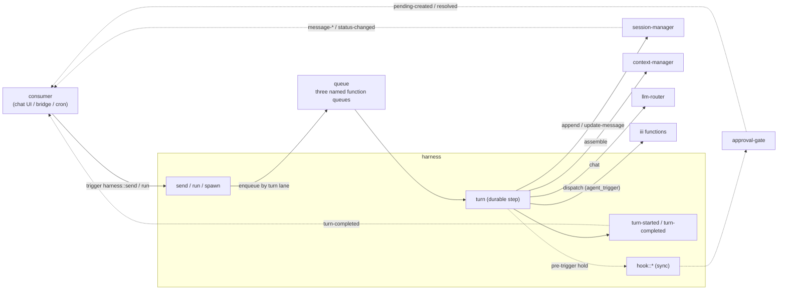

# harness architecture

Reference documentation for the `harness` worker — the durable, resumable
agent turn loop specified in
[tech-specs/2026-06-agentic/harness.md](../../tech-specs/2026-06-agentic/harness.md).
These documents are written to be sufficient on their own: a reader (human or
LLM) should be able to integrate against the harness without opening the
source. The golden schemas under
[../tests/golden/schemas/](../tests/golden/schemas) are the wire truth; this
prose explains how to use them.

## Document map

| Document | Audience | Read it when |
|---|---|---|
| [integration.md](integration.md) | Authors of consumers / siblings | You are building something on top of the harness — a chat UI, a Telegram / WhatsApp / Slack bridge, a cron or webhook worker, an event-driven agent loop, a notification sibling. This file is the handoff contract. |

The worker [README](../README.md) is the operator how-to (install, config,
quickstart). The spec
[harness.md](../../tech-specs/2026-06-agentic/harness.md) is the design of
record — deeper on the loop mechanics (durability, idempotency, steering,
hooks) than the integration contract needs to be.

## The system in one paragraph

The harness is the thin worker that wires the other three into an agent loop:
take an incoming message, persist it, assemble a context, stream a completion,
run any function calls the model requests, and repeat until the turn stops —
all as durable, queued steps so a crash or restart resumes mid-turn. At boot it
provisions independent root (`harness-turn`), sub-agent (`harness-subagent`),
and reactive (`harness-reactive`) named function queues through the standalone
`queue` worker; consumers do not configure them. It owns sequencing and
nothing else.
Consumers are deliberately thin: they **kick off**
a turn (`harness::send` / `harness::run`), **render** the conversation by
binding `session-manager`'s transcript events, and **react** to boundaries
(`harness::turn-completed`) and human-gated calls (approval-gate's
`approval::*` triggers). There is no `agent::events` firehose — the transcript
is the stream, and turn lifecycle rides discrete triggers.

## The system in one diagram

## Vocabulary

| Term | Meaning |
|---|---|
| **Turn** | One run of the loop for a session: one or more generate steps until the model stops, with a coarse `TurnStatus` (`running` / `awaiting_functions` / `completed` / `cancelled` / `failed`). |
| **Step** | One durable `harness::turn` iteration: assemble → generate → dispatch. Continuations enqueue back to the lane frozen on the turn record. |
| **Turn lane** | Root, sub-agent, or reactive workload class. Each maps to its own standard queue with concurrency 10, so one class cannot consume another class's capacity. |
| **Steering / merge** | A `harness::send` for a session that already has a running turn folds the new message into it instead of starting a second turn (the response carries `merged: true`). |
| **Dispatch policy** | The fail-closed `options.functions.allow` / `deny` globs deciding which functions the model may call. Absent or empty `allow` → a plain chat loop. |
| **Exposure mode** | How allowed functions reach the model: one generic `agent_trigger` schema (default) or one schema per allowed function (`native`). |
| **Output contract** | The turn's deliverable: free `text` (default) or `json` validated against a schema; the result rides `harness::turn-completed` and `harness::run`. |
| **Hook** | A synchronous extension point (`harness::hook::*`) a sibling binds to veto / hold / mutate in-path. Hook *logic* lives in the sibling, never the harness. |
| **Pending / parked** | A dispatch that cannot resolve inline (a sub-agent, or an approval hold) checkpoints `pending`; the turn parks and `harness::function::resolve` resumes it later. |
| **Sub-agent** | A child turn in a child session, started by `harness::spawn` from a parent turn; its completion resolves the parent's parked call. |
