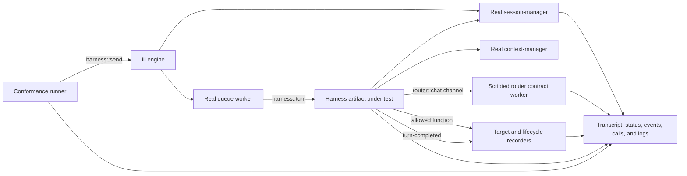

# Harness conformance E2E architecture

> Status: proposed architecture; implementation has not started.
>
> Last reviewed: 2026-07-14.
>
> Decision source: July 14 development sync. Where the discussion left
> alternatives open, this document gives precedence to Mike's concrete
> implementation direction.

Harness conformance is the deterministic regression track for the harness. It
proves that a checkout or release artifact still obeys the public turn
protocol, durability rules, and lifecycle contracts without asking a real
model to make decisions.

This is not a second evaluation product. Conformance and real-model quality
belong to the same evaluation program, but they have different execution
profiles and release policies. They may share fixtures, scenario vocabulary,
and report schemas; they must not share a nondeterministic pass/fail oracle.

## Decision summary

The first implementation will follow these decisions:

1. Conformance lives in this repository under `harness/evals/conformance`.
2. A small Rust runner supervises isolated subprocesses and drives scenarios.
3. The iii engine, queue delivery, harness binary, session persistence, context
   assembly, channels, and lifecycle events are real.
4. A scripted test worker replaces the `router::*` model boundary and emits the
   production streaming contract deterministically.
5. Every scenario enters through `harness::send` or another documented consumer
   entry point. Tests do not seed `harness_turn` or call continuation internals.
6. Code assertions over durable, consumer-visible outputs decide pass or fail.
7. Missing infrastructure, timeouts, process crashes, and malformed evidence
   fail the run. A gating run has no skip path.
8. The first slice contains streamed text and exactly-once function execution.
9. Hooks and runtime validation functions are features the suite can test; they
   are not the runner's general extension or grading API.
10. The same scenario definitions will eventually support local checkout and
    release-artifact targets, but the local target is the first implementation.
11. The first version uses existing public harness and iii functions and
    triggers. It does not add a test-only API to the engine or harness core.
12. Router fixtures may be hand-authored or captured from a real provider run
    and replayed as a sanitized, versioned cassette. Replay, never live capture,
    is the deterministic gate.

## Relationship to agent quality

Conformance answers a narrower question than the agent-quality track:

| Track | Question | Model boundary | Primary result |
|---|---|---|---|
| Harness conformance | Did the harness preserve its public contracts and invariants? | Scripted and deterministic | Pass or fail by invariant |
| Agent quality | Can a pinned real model complete representative workflows, and did quality regress? | Real provider model | Reliability, quality, latency, tokens, and cost |

The meeting direction to implement the evaluation as a worker or worker set
applies to the second, real-model agent-quality suite. It does not replace the
small deterministic Rust supervisor selected for conformance.

A conformance failure should identify a harness or environment defect without
provider variance. An agent-quality failure may come from the model, prompt,
tool catalog, harness, or external dependency and therefore requires a
different report and repetition policy.

The two tracks can exercise the same workflow. For example, a fan-out scenario
can use a scripted sequence to prove parent/child durability in conformance and
a real model to measure whether a system prompt discovers the same pattern in
agent quality. The deterministic invariant definitions may be shared; the
subject and pass policy are different.

### Placement in the test taxonomy

The meeting used terms such as "unitish" and "mocked E2E" for this suite. To
avoid ambiguity, the repository should use this four-layer taxonomy:

| Layer | Boundary | Internal calls allowed? | Model boundary |
|---|---|---:|---|
| Unit | One module or pure contract | Yes | None or in-process fake |
| Integration | Multiple harness components | Yes, when useful | Fake or scripted |
| Conformance E2E | Public consumer entry point through the real engine, queue, harness, persistence, and lifecycle | No for the normal path | Scripted or replayed router |
| Agent-quality E2E | Same public workflow plus a production provider path | No for the normal path | Real model |

Conformance is therefore E2E by system boundary even though the model is
controlled. "Mock-server E2E" is an acceptable descriptive alias; it must not
be reported as a unit test.

## Goals

The conformance suite should:

- detect regressions in the public harness request path;
- prove persistence and exactly-once effects across queued turn steps;
- exercise the production iii routing and streaming boundaries;
- verify terminal state through more than one independent observable surface;
- produce enough evidence to diagnose the first failing invariant;
- run without model credentials or internet access after required artifacts
  are available;
- execute the same scenarios against a checkout and, later, a selected release;
- remain deterministic enough that repeated failures reproduce locally.

## Non-goals

Conformance does not:

- evaluate whether a system prompt is helpful or a model made a good choice;
- compare providers, models, reasoning settings, tokens, or cost;
- require a browser or the console for core turn-protocol scenarios;
- use a model grader, screenshot similarity, or human review as an oracle;
- assert one internal trajectory when several satisfy the public contract;
- inspect private `harness_turn` state as the normal pass/fail mechanism;
- hide failures behind automatic retries;
- provide the user-facing runtime validation-function product;
- become a generic workflow engine or a monolithic collection of product rules;
- require new test-only engine or harness behavior;
- generalize record/replay for every iii worker before the harness use case is
  proven.

## System under test

The system boundary begins at an external iii function call and ends at durable,
consumer-visible state.



### Real and controlled components

| Component | Mode | Why |
|---|---|---|
| iii engine and WebSocket routing | Real | Function dispatch, trigger delivery, channels, and worker lifecycle are part of the boundary |
| Configuration, state, stream, and pubsub services | Real engine services | Harness startup and durable behavior depend on their real contracts |
| Queue worker | Real | FIFO grouping, enqueue, redelivery, and worker delivery are harness invariants |
| Session manager | Real | Transcript and session status are primary durable oracles |
| Context manager | Real by default | The default bundle path should be exercised; absence is a separate fallback scenario |
| Harness | Selected checkout or release binary | This is the primary artifact under test |
| Router/model boundary | Scripted worker | Exact generations and stream frames must be reproducible |
| Target functions and event handlers | Deterministic recorder worker | Invocation count, arguments, order, and lifecycle payloads must be observable |
| Console and browser | Absent by default | They are not required to prove the core harness protocol |

The scripted worker replaces the model-facing `router::*` functions, not the iii
engine route or channel protocol. It must implement every router function the
scenario needs, including `router::chat`, `router::system_prompt::get`, model
capability lookups, and `router::abort` when cancellation is exercised.

A later compatibility profile may run the real `llm-router` with a scripted
provider. That profile tests more cross-worker behavior but is not required for
the first harness-owned conformance slice.

## Component responsibilities

### Stack supervisor

The supervisor owns process lifecycle only. It:

- allocates a run id, temporary directories, and loopback ports;
- materializes a pinned engine configuration;
- starts the engine and required real worker binaries;
- detects early process exit without waiting for a scenario timeout;
- terminates every child and removes or retains artifacts according to policy;
- never decides a domain invariant by parsing human log text.

### Readiness probe

Readiness is contract-based, not sleep-based. The probe waits with a deadline
until the engine reports every required function and trigger type. At minimum it
must prove that:

- engine discovery is callable;
- session, context, queue, and scripted router surfaces are registered;
- `harness::send` and `harness::status` are callable;
- `harness::turn-completed` is a registered trigger type;
- `engine::queue::list_topics` contains the harness-owned `harness-turn` queue,
  proving queue provisioning completed before a scenario begins.

Failure to become ready is a setup error with the missing surfaces and process
logs attached. It is never a passing skip.

### Scripted router worker

The scripted router consumes a versioned scenario script. Each expected
generation declares:

- the ordinal call number;
- required request properties such as model, messages, tools, and response
  format;
- the ordered stream frames to emit;
- the terminal acknowledgement or injected error;
- optional deterministic delays or synchronization barriers.

Every `router::chat` call consumes exactly one scripted generation. The worker
fails the scenario when a call is unexpected, an expectation does not match, a
scripted generation is unused, or an extra generation occurs.

Scripts describe wire behavior rather than calling harness internals. The
worker writes through the supplied channel reference and uses the production
event vocabulary: start and delta frames, usage when relevant, stop, and one
terminal `done` or `error` frame.

### Authored fixtures and record/replay cassettes

The scripted worker accepts two fixture sources:

1. **Authored scripts** describe precise success, error, timeout, redelivery,
   and synchronization cases that may be difficult or expensive to obtain from
   a provider.
2. **Recorded cassettes** capture a successful or intentionally failing real
   `router::chat` exchange once, sanitize it, and replay the ordered response
   frames through the same scripted worker.

The capture tool records the exact router request, ordered stream chunks,
terminal acknowledgement, provider/model metadata, and the relevant protocol
versions. Before a cassette can be committed it must remove credentials,
personal data, nondeterministic identifiers, and provider-only metadata that is
not part of the contract. The sanitized content receives a digest and a schema
version.

Capture is a developer workflow and is never the pull-request oracle. Gating
runs consume committed cassettes without network access. Exact wall-clock
timing is preserved only when timing is the invariant; ordinary replays use
ordered frames plus explicit barriers or relative delays. Streaming order and
terminal behavior are always preserved.

Record/replay complements authored adversarial fixtures; it does not replace
them. The implementation should solve the harness boundary first. A reusable
iii-wide capture library can be extracted later once this format has real
usage.

### Recorder worker

The recorder worker exposes deterministic target functions and event handlers.
It records raw payloads with a monotonic receive sequence and the scenario run
id. It provides separate logs for:

- allowed target-function invocations;
- forbidden target invocations, which must remain empty;
- `harness::turn-started` and `harness::turn-completed` deliveries;
- hook calls for scenarios where a hook contract is the subject;
- test synchronization barriers, such as holding a stream open for steering.

Recorder control functions are runner-only and must never be included in the
subject's allowed function catalog.

### Scenario driver

The driver configures the router and recorders, binds lifecycle handlers before
sending work, invokes the public entry point, waits on bounded conditions, and
collects evidence. It does not call `harness::turn`,
`harness::function::trigger`, or `harness::function::resolve` unless that
specific public function is itself the subject of a scenario.

### Invariant grader

The grader uses code assertions over structured evidence. Each assertion
records:

- a stable invariant id;
- the expected condition;
- the observed value or evidence reference;
- pass or fail;
- a concise diagnostic.

Traces and logs support diagnosis. They are pass/fail oracles only for a
scenario whose contract explicitly concerns trace shape or emitted telemetry.

## Execution lifecycle

Each scenario follows the same phases:

1. **Allocate:** create `run_id`, temporary storage, ports, deadlines, and an
   artifact directory.
2. **Boot:** start the engine, real dependencies, scripted workers, and harness
   artifact.
3. **Probe:** wait for all required functions and trigger types.
4. **Arm:** load the router script, reset recorders, and bind lifecycle handlers.
5. **Send:** call `harness::send` with the scenario request.
6. **Await:** wait for a matching terminal event and confirm terminal durable
   state through `harness::status`.
7. **Collect:** read the complete transcript, target calls, router calls,
   lifecycle events, status, process state, and available traces.
8. **Grade:** evaluate every invariant without mutating the subject.
9. **Report:** write machine-readable results and a concise console summary.
10. **Teardown:** stop children, retain failure artifacts, and clean successful
    temporary state.

The terminal event is a notification, not the only source of truth. Trigger
delivery is at-least-once and unordered, so the runner accepts identical
duplicate completion deliveries but fails on conflicting terminal payloads. It
also confirms the final result through `harness::status` and the transcript.

## Isolation and determinism

The first implementation favors isolation over startup speed:

- each scenario receives a fresh engine and durable data directory;
- every session, recorder, function id, idempotency key, and artifact is scoped
  by `run_id`;
- scenarios run serially until shared-stack cleanup is proven reliable;
- all ports are dynamically allocated on loopback;
- network model access is disabled and no provider key is required;
- engine and worker artifact versions are recorded in the report;
- timeouts, queue settings, router scripts, and configuration are versioned;
- timestamps and generated ids are normalized only in reports, never before
  assertions that depend on identity.

When startup becomes material, the suite may reuse a stack within an isolated
shard. That optimization requires explicit reset contracts and a test proving
that one scenario cannot observe another's sessions, registrations, state, or
events.

Resilience scenarios that intentionally restart or crash a process always own
their stack. They record the injected boundary and fault seed so the schedule
can be reproduced.

## Public-path rule

A scenario is conformance E2E only when it:

- begins with `harness::send` for an ordinary turn, or another currently
  implemented public entry point when that entry point is itself under test;
- lets the real queue invoke `harness::turn`;
- observes results through public functions, events, and durable transcript;
- does not seed private harness records;
- does not call an internal continuation to advance the normal turn;
- fails loudly when a required component is unavailable.

Tests that seed `harness_turn` or call continuation functions directly remain
valuable integration tests. They belong in the lower-level test suite and must
not be reported as public-path conformance.

## Oracles

Conformance combines several independent observable surfaces:

| Oracle | What it proves |
|---|---|
| `harness::send` response | Request acceptance, session/turn identity, steering, queueing, and deduplication flags |
| `session::messages` | Durable roles, order, content, ids, function results, and absence of duplicate entries |
| `harness::status` | Terminal status, result, pending calls, child references, queue state, and retry counters |
| Target recorder | Invocation count, arguments, order, and forbidden side effects |
| Router recorder | Generation count and the messages/tools visible to each generation |
| Lifecycle recorder | Started/completed delivery and consistency of duplicate events |
| Process supervisor | Unexpected worker exit and shutdown behavior |
| Traces and logs | Diagnostic context, unless telemetry is the explicit contract under test |

No single oracle is sufficient. For example, a completion event does not prove
that the transcript was persisted correctly, and a final transcript does not
prove that a target function executed only once.

Private state may be captured after a failure for diagnosis, but it must not be
required to decide an ordinary public-contract scenario.

## Scenario definition

Scenarios are code-driven with versioned data fixtures. A scenario definition
contains:

- stable id and description;
- required stack profile;
- public request payload;
- scripted router generations;
- target and lifecycle recorder configuration;
- deadlines and optional synchronization barriers;
- invariant ids and assertion parameters.

The first version does not need a general-purpose workflow DSL. Declarative
fixtures should cover router frames and expected payload data, while Rust owns
process supervision, waiting, evidence collection, and typed assertions. A
shared manifest schema can be extracted only when the real-model track needs to
consume the same scenario metadata.

## Failure model

Every scenario produces exactly one terminal classification:

| Classification | Meaning |
|---|---|
| `pass` | Every required invariant passed |
| `setup_error` | A required artifact, process, function, trigger, or configuration was unavailable |
| `contract_failure` | Structured evidence contradicts one or more invariants |
| `timeout` | A bounded readiness or scenario condition did not become true |
| `process_crash` | A required process exited before teardown |
| `runner_error` | The runner or fixture was malformed and could not grade the subject |

Only `pass` is green. Conformance has no `inconclusive` result and no automatic
retry that converts red to green. A diagnostic rerun is a separate attempt and
the original result remains visible.

## Proposed repository structure

The conformance runner is a separate executable package for dependency and CI
isolation, but remains part of the same harness evaluation project:

```text
harness/
  architecture/
    conformance-e2e.md
  evals/
    shared/
      schemas/
    conformance/
      Cargo.toml
      src/
        main.rs
        stack.rs
        readiness.rs
        scripted_router.rs
        recorder.rs
        scenario.rs
        grader.rs
        artifacts.rs
      scenarios/
        streamed-text/
        exactly-once-function/
      fixtures/
        authored/
        recorded/
      capture/
        sanitize.rs
        cassette.rs
      baselines/
  Makefile
```

Generated run output belongs under `target/conformance/<run_id>/` and is not
committed:

```text
target/conformance/<run_id>/
  result.json
  stack.json
  logs/
  scenarios/<scenario_id>/
    request.json
    send-response.json
    transcript.json
    status.json
    router-calls.json
    cassette.json
    target-calls.json
    lifecycle-events.json
    invariants.json
```

CI uploads the directory on failure. Successful runs retain the compact result
and may discard verbose process logs.

## First implementation slice

### C-E2E-001: streamed text reaches durable completion

The scripted router emits multiple text deltas followed by one terminal
assistant message.

Required invariants:

- `harness::send` returns accepted session and turn ids;
- exactly one user message is durable;
- exactly one assistant entry contains the assembled final text;
- partial updates do not create duplicate assistant entries;
- `harness::status` reaches `completed` with no pending calls or queued message;
- at least one matching completion event arrives;
- duplicate completion deliveries, if any, do not conflict;
- every scripted router generation was consumed exactly once.

### C-E2E-002: function call executes exactly once

The first scripted generation requests one allowed recorder function. The
second generation observes its result and returns final text.

Required invariants:

- the target receives the expected arguments exactly once;
- one function-result message is durable;
- the second router request contains that function result;
- the final assistant message and status are terminal and durable;
- no unresolved call checkpoint is exposed by `harness::status`;
- the turn emits no conflicting completion result;
- exactly two scripted generations are consumed.

These scenarios cover the entry point, session creation, queue, stream,
transcript update, dispatch, continuation, and completion paths. Both must be
stable before the suite expands.

The next delivery step captures and sanitizes one known real-provider exchange,
replays it offline through the same scripted router, and then runs the suite in
non-gating CI to measure startup, diagnostics, and flake rate.

## Expansion order

Add scenarios by invariant rather than by source file:

| Phase | Area | Scenario | Core invariant |
|---|---|---|---|
| 1 | Dispatch policy | Requested target is not allowed | Target is never invoked and a durable denied result reaches the next generation |
| 1 | Idempotency | Repeat `harness::send` with one idempotency key | Original ids are returned and no duplicate user entry or turn is created |
| 1 | Router failure | Emit permanent and transient stream errors | Retry/resume behavior and terminal classification match the contract |
| 1 | Structured output | Emit valid and invalid results | Validation uses the documented bounded retry/failure contract |
| 2 | Steering | Send while a stream is held open | The new message participates exactly once in the active turn |
| 2 | Hooks | Mutate, veto, hold, time out, and fail at each hook point | Ordering and fail policy match the documented hook contracts |
| 2 | Approval | Resolve a protected call as allow and deny | Target executes once after allow and never after deny |
| 2 | Sub-agents | Complete children in different orders | Parent resolves each pending call once and never completes early |
| 2 | Cancellation | Stop a parent with active work | Streams and descendants stop and terminal state is consistent |
| 3 | Redelivery | Redeliver current and stale queued steps | Transcript entries and side effects remain exactly once |
| 3 | Restart | Restart at named durable boundaries | Work resumes or terminates according to the persisted contract |
| 3 | Dynamic registration | Add a target while harness is running | Discovery updates without duplicate registration or stale tool schemas |
| 3 | Runtime validation | Validator fails once and then passes | Completion-driven continuation is bounded and independently verifiable |
| 3 | Lifecycle trace | Complete a fast turn while recorders are already bound | The terminal trace and lifecycle payload remain observable even when no UI can render the intermediate phase |

Console reconnect and browser behavior require their own stack profile. They
may reuse the same runner and report format, but they are not prerequisites for
the core harness conformance gate.

Fast lifecycle phases are asserted from events, status, transcript, and traces.
Whether a console happens to render a transient phase is a separate console
E2E concern, not a harness conformance oracle.

## Hooks and validation functions

The meeting sometimes used "hook" as a general term for lifecycle callbacks.
In the current harness contract these are different mechanisms:

- `harness::hook::*` functions are synchronous, in-path extension points;
- `harness::turn-completed` is an asynchronous lifecycle trigger and is the
  normal boundary for after-turn validation.

The runner does not use `harness::hook::*` as its general assertion API. Hooks
are synchronous in-path policy points, so a hook scenario registers a
deterministic sibling, exercises the hook, and grades the resulting public
behavior.

The first conformance slice also does not depend on the proposed runtime
validation-function protocol. When that product capability exists, the suite
will add scenarios that prove:

- a validation function can bind to durable turn completion;
- a failed validation result can start one bounded follow-up turn;
- redelivered completion or validation events do not duplicate work;
- loop limits stop a validator that never passes;
- an independent recorder detects the final durable outcome.

In those scenarios the validation function is part of the system under test.
The conformance grader remains independent code so a defect in the validation
function cannot mark itself as passing.

## Local and CI entry points

The planned local entry point is:

```bash
make -C harness conformance-e2e
```

The Make target should build or locate the required binaries, invoke the runner
with explicit artifact paths, and return the runner exit code. The runner itself
must not download workers or models during a test.

The CI job should:

1. build the harness and required support-worker artifacts;
2. install or select a pinned iii engine artifact;
3. run conformance with strict no-skip behavior;
4. publish the compact result for every run;
5. upload complete artifacts and logs on failure.

Initially the job runs on harness-related pull requests without becoming a
required gate. Promotion to a required check happens only after startup,
diagnostics, runtime, and repeat-run flake rate are measured over an agreed
observation window.

The release profile later supplies a released harness artifact and pinned
released dependencies to the same runner. It must not fork scenario logic from
the checkout profile.

## Metrics and policy

Conformance reports correctness and stability, not model quality:

- pass or fail for every invariant;
- failure classification;
- setup and scenario duration;
- p50 and p95 duration across a suite run history;
- repeated-run flake rate;
- skipped scenario count, which must be zero for gating runs;
- engine, harness, support-worker, configuration, and fixture versions;
- fault boundary and seed for resilience scenarios.

`pass@k` is not the primary conformance metric. A deterministic contract should
pass on the first attempt and on every repeated attempt. Repetition measures
flake and race sensitivity; it does not grant retries to obtain a green result.

Performance thresholds should not gate the first slice. Establish stable
runtime measurements first, then declare latency budgets before using them to
classify a regression.

## Acceptance criteria for the architecture prototype

The first prototype is complete when:

- both initial scenarios traverse `harness::send` through real queue delivery;
- neither scenario reads or writes private harness state;
- a deliberate duplicate-dispatch defect fails the exactly-once invariant;
- a deliberate streaming/finalization defect fails the transcript or terminal
  invariant;
- an absent engine, queue, session manager, or harness artifact returns a
  non-zero setup error rather than a skip;
- one sanitized real-provider cassette replays offline through the scripted
  router contract;
- no scenario requires a test-only engine or harness API;
- a failed run retains structured evidence and child-process logs;
- repeated successful runs require no model key and produce the same invariant
  results.

## Open implementation decisions

The architecture leaves these details for the prototype to measure:

- the exact pinned engine acquisition mechanism in CI;
- the cassette schema, sanitization rules, and capture command;
- the minimal trace export path that gives useful diagnostics without making
  traces a required oracle;
- the observation window and flake threshold required before the CI job becomes
  a mandatory pull-request gate;
- when subprocess startup cost justifies isolated stack reuse or a container
  profile.

These decisions must not weaken the public-path, deterministic-oracle,
isolation, or fail-loudly requirements.

## Related repository material

- [Harness agent-quality E2E architecture](agent-quality.md)
- [Harness architecture overview](README.md)
- [Harness design specification](../../tech-specs/2026-06-agentic/harness.md)
- [`harness::send` implementation](../src/functions/send.rs)
- [Durable turn loop](../src/turn_loop.rs)
- [Harness queue provisioning](../src/queue.rs)
- [Turn lifecycle events](../src/events.rs)
- [Router streaming event vocabulary](../src/types/event.rs)
- [Hook contracts](../src/hooks/mod.rs)
- [Harness CI workflow](../../.github/workflows/ci.yml)
