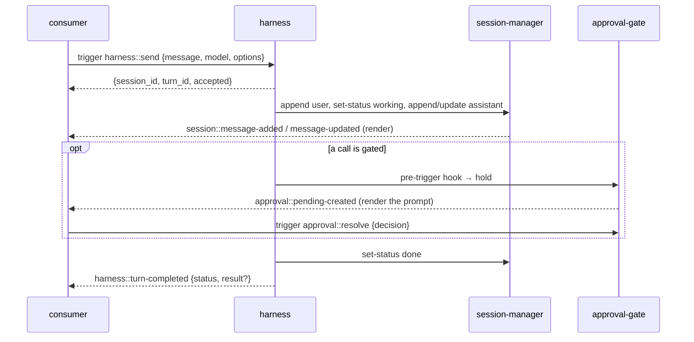
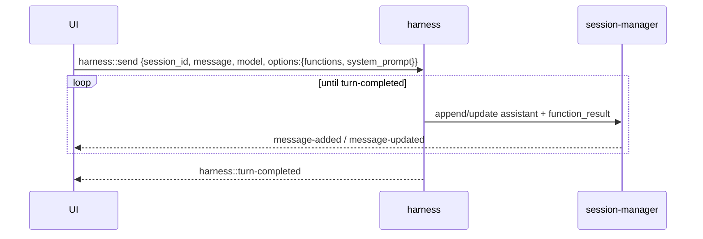
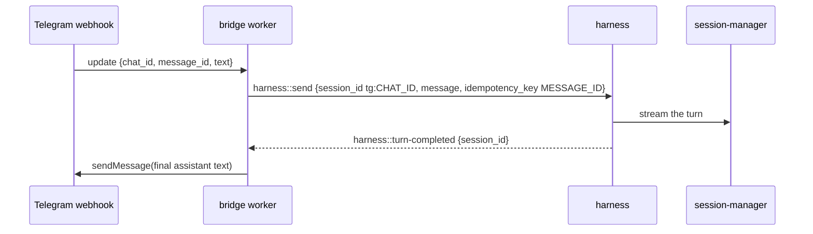
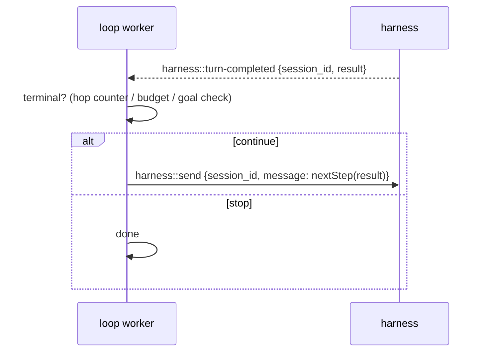

# Integrating with harness

The handoff contract for workers and clients that build a front end on the
harness — chat UIs, Telegram / WhatsApp / Slack bridges, cron and webhook
workers, event-driven agent loops, notification siblings. It is self-contained:
everything needed to integrate is here, with the
[spec](../../tech-specs/2026-06-agentic/harness.md) as the design rationale and
the golden schemas under [../tests/golden/schemas/](../tests/golden/schemas) as
the wire truth.

Contents: [mental model](#1-mental-model) ·
[prerequisites](#2-prerequisites--topology) · [conventions](#3-conventions) ·
[functions](#4-function-catalog) · [what to bind](#5-reactive-integration--what-to-bind) ·
[patterns](#6-canonical-consumer-patterns) ·
[send cookbook](#7-harnesssend-request-cookbook) · [approvals](#8-approvals) ·
[compaction](#9-compaction) · [hooks](#10-hooks-sibling-workers-only) ·
[errors & recovery](#11-errors-stop-and-recovery) ·
[boundaries](#12-boundaries--anti-patterns) ·
[reference consumer](#13-console-as-reference-implementation)

## 1. Mental model

The harness is the durable turn loop; **a consumer is thin**. Every integration
is the same triangle:

1. **Kick off** a turn with [`harness::send`](#harnesssend) (fire-and-return)
   or [`harness::run`](#harnessrun) (held open until the turn ends, returns the
   result).
2. **Render** the conversation by binding `session-manager`'s transcript
   events (`session::message-added` / `message-updated` / `status-changed`) and
   reconciling by `revision`. The harness streams the assistant message into
   the session as it generates; you watch the session, not the harness.
3. **React** to turn boundaries (`harness::turn-completed`) and human-gated
   calls (approval-gate's `approval::pending-created` / `pending-resolved`).



**There is no `agent::events` stream.** That was the turn-orchestrator era. The
transcript *is* the stream. Do not poll `harness::status` for transcript
content — it is a point-in-time turn-state read for recovery and guards, not a
render feed.

## 2. Prerequisites & topology

The harness depends on three siblings; install the ones your loop needs:

| Worker | Role | Without it |
|---|---|---|
| [`session-manager`](../../session-manager) | Transcript store + change feed (required) | The loop has nowhere to persist or stream. |
| [`llm-router`](../../llm-router) | Generation + the model catalog (required) | No `router::chat`; nothing to generate. |
| [`context-manager`](../../context-manager) | Token budgeting + compaction (soft) | The harness sends raw history (no compaction). |
| [`approval-gate`](../../approval-gate) | Human-in-the-loop gate (optional) | No `pre-trigger` hold; calls run un-gated under the allow policy. |

The harness enqueues turn steps on the engine's built-in `default` queue,
provided by `iii-queue` (see [`engine.config.yaml`](../engine.config.yaml)).
Per-session ordering is enforced in-process via session locks, not by the queue.

**State** the harness keeps (you never touch it directly): `harness_turn/<session_id>`
(the turn record) and `harness_idem/<idempotency_key>` (webhook dedupe, TTL-bound).

## 3. Conventions

- **Invocation is always a trigger.** In the iii ecosystem every bus call is a
  *trigger*: `iii.trigger({ function_id, payload, timeout_ms })` from a worker,
  `client.trigger(functionId, payload)` from the browser SDK. There is no
  separate "call" verb.
- **Wire ids are kebab-case** in every multi-word segment: `harness::turn-completed`,
  `harness::hook::pre-trigger`, `harness::sweep-pending`, `harness::on-config-change`.
  Single-word verbs stay bare (`harness::send`, `harness::run`, `harness::stop`,
  `harness::status`, `harness::spawn`).
- **Ids** are opaque strings: sessions you supply (`harness::send` `session_id`)
  or the harness mints (`s_<uuid>` / `t_<uuid>`). Entry ids are deterministic
  within a turn (see [§7 idempotency](#7-harnesssend-request-cookbook)).
- **Errors** are strings beginning with a stable code: `harness/<code>: message`
  (e.g. `harness/invalid_message_role`). Match on the code substring.
- **Dispatch is deny-by-default.** A send with no `options.functions.allow` is a
  plain chat loop — every model-requested call is refused. Allow globs per send;
  the harness's [`iii-permissions.yaml`](../iii-permissions.yaml) and the
  approval-gate remain the safety floor.

## 4. Function catalog

Consumer-facing functions (full request/response in the linked golden schema):

| Function | Trigger it to | Notes |
|---|---|---|
| `harness::send` | Start (or steer) a turn; return immediately | The entry point. [`harness.send.json`](../tests/golden/schemas/harness.send.json) |
| `harness::run` | Call an agent like a function: held open until the turn ends, returns the result | Same seed path as send + an output contract. [`harness.run.json`](../tests/golden/schemas/harness.run.json) |
| `harness::stop` | Cancel the session's in-flight turn | Sets the abort flag + `router::abort`. [`harness.stop.json`](../tests/golden/schemas/harness.stop.json) |
| `harness::status` | Read a point-in-time turn state (recovery, guards) | Returns `null` when no turn ever ran. **Not a render feed.** [`harness.status.json`](../tests/golden/schemas/harness.status.json) |
| `harness::spawn` | Start a sub-agent in a child session | Usually called *by the model* through `agent_trigger`, not by consumers. [`harness.spawn.json`](../tests/golden/schemas/harness.spawn.json) |

**Internal — never trigger directly** (the harness drives these): `harness::turn`
(the durable loop step), `harness::function::trigger` / `harness::function::resolve`
(dispatch + parked-call settle), `harness::sweep-pending` (cron), and
`harness::on-config-change` (hot-reload). They forge call ids, parked results,
and turn progress; calling them out of band corrupts the turn record.

## 5. Reactive integration — what to bind

Bind with the standard two-step pattern: register a handler function, then
`registerTrigger` of that type pointed at it. Delivery is fire-and-forget,
at-least-once, and unordered — reconcile by `revision` (transcript) or treat the
trigger as an edge to act on.

| Trigger | Bind for | Config filter |
|---|---|---|
| `session::message-added` / `message-updated` | Live transcript: assistant text, thinking, function-call blocks, function results | `{ session_id }` |
| `session::status-changed` | Spinner / composer state (`working` / `done` / `error`) | `{}` or tenancy `metadata` |
| `harness::turn-completed` | Turn outcomes: toasts on failure, auto-titling, chaining, result delivery | `{ session_id?, parent_session_id? }` |
| `harness::turn-started` | Optional observability (a turn began) | same as completed |
| `approval::pending-created` / `pending-resolved` | Human-in-the-loop prompts (see [§8](#8-approvals)) | `{ session_id?, metadata? }` |

`harness::turn-completed` payload: `{ session_id, turn_id, status, result?, result_error?, reason?, timestamp, parent? }`
where `status` is `completed` | `cancelled` | `failed`. `harness::turn-started`:
`{ session_id, turn_id, timestamp, parent? }`.

```ts
// Two-step binding (browser SDK shape):
const off = client.on('iii::myapp::turn_done', (evt) => onTurnDone(evt))
client.registerTrigger({
  type: 'harness::turn-completed',
  function_id: `iii::myapp::turn_done::${client.browserId}`,
  config: { session_id: sessionId },
})
```

**Reconnect recovery.** Nothing replays automatically. After a reconnect or a
fresh attach to a live session, re-seed from reads: `harness::status` for the
coarse turn state, and `approval::list-pending { session_id }` to rebuild any
held-call prompts. Then resume binding the triggers above.

## 6. Canonical consumer patterns

### Interactive chat UI

`send` → render from session events → approval triggers for holds →
`turn-completed` ends the turn. This is exactly what the console does (see
[§13](#13-console-as-reference-implementation) and the use-case walkthrough in
[`tech-specs/.../ConsolePage.tsx`](../../tech-specs/2026-06-agentic/presentation/src/pages/ConsolePage.tsx)).



### Messaging bridge (Telegram / WhatsApp / Slack)

Map each chat to a **stable `session_id`** (e.g. `tg:<chat_id>`). Use the
update/message id as the `idempotency_key` so webhook redeliveries dedupe.
Stamp tenancy in `session.metadata` (the field session triggers and
`approval::list-pending` filter on). Reply by binding `harness::turn-completed`
and pushing the final assistant message back to the channel; for long turns,
also push intermediate assistant text from `session::message-updated`.



A reply that arrives while the turn is still running is **steering**: send it the
same way and the harness folds it into the running turn (`merged: true`) — no
"busy" error, no second turn.

### Held-open RPC (`harness::run`)

When the caller wants the turn's result inline — a backend classifier, a
structured extraction, an agent-as-a-function — use `harness::run` with an
[output contract](#7-harnesssend-request-cookbook). The trigger stays open until
the turn ends and returns `{ status, result, ... }`. Give it a generous
`timeout_ms`.

### Event-driven loop (chaining turns)

Bind `harness::turn-completed`; in the handler, decide whether to start the next
hop with `harness::send` / `harness::run`. **The loop guard is yours:**
`max_turns` bounds one turn, not a chain. Carry a hop counter in
`session.metadata`, lean on a budget sibling, or check a terminal condition in
the handler — otherwise completed → send → completed is an infinite loop.



### Arbitrary inbound events → an agent

Two supported paths:

- **Preferred:** translate the event into a `harness::send` (a sensor reading, a
  cron tick, a GitHub webhook → a user-or-custom message). Merge/steering and
  durability are handled for you — a send into a running turn folds in, a send
  into an idle session kicks a fresh turn.
- **Opt-in steering bridge:** if messages already land via raw `session::append`
  (some other writer owns the transcript), register *your own* handler bound to
  `session::message-added` `{ roles: ["user"] }` that checks `harness::status`
  and calls `harness::send` when no turn is running (the spec calls this the
  `on-steering` pattern; the harness ships no such function — you bind it). Prefer
  routing through `harness::send` directly where you can: its merge path
  double-checks the turn record after appending and closes the read/complete
  race this bridge has between `harness::status` and `harness::send`.

### Sub-agent observer

To watch children a turn spawns via `harness::spawn`, bind
`harness::turn-completed` with `config: { parent_session_id: <parent> }`. Each
child turn's completion (and its `parent` linkage) lets a dashboard render the
spawn tree without polling.

## 7. `harness::send` request cookbook

Shapes mirror [`harness.send.json`](../tests/golden/schemas/harness.send.json).
Minimal:

```json
{ "message": "Summarise the repo README", "model": "claude-sonnet-4", "provider": "anthropic" }
```

Full options:

```jsonc
{
  "session_id": "tg:42",                  // omit to create a new session
  "message": "Refactor the auth module",  // string sugar, or a full AgentMessage (role user|custom)
  "model": "claude-sonnet-4",
  "provider": "anthropic",
  "idempotency_key": "tg-update-9981",     // repeated key → original {session_id,turn_id}, appends nothing
  "session": {                             // applied only when this send creates/ensures the session
    "title": "auth refactor",
    "metadata": { "owner": "u_1", "chat_id": 42 }   // tenancy: session triggers + list filter on it
  },
  "options": {
    "mode": "agent",                       // plan | ask | agent — prepends a mode paragraph
    "system_prompt": "…",                  // optional override; omit for the built-in identity prompt
    "max_turns": 16,
    "thinking_level": "medium",            // minimal | low | medium | high | xhigh
    "functions": { "allow": ["shell::*", "coder::*"], "deny": ["shell::rm"], "expose": "agent_trigger" },
    "output": { "type": "json", "schema": { "type": "object", "required": ["category"] } },
    "metadata": { "trace": "abc" }         // tracing passthrough
  }
}
```

Response: `{ session_id, turn_id, accepted, merged?, deduplicated? }`.

- **Steering** — `merged: true` means the message folded into a running turn.
  This is success, not an error; do not start a second turn.
- **Dedupe** — `deduplicated: true` means the `idempotency_key` matched an
  earlier send; nothing was appended.
- **Deterministic user entry id** — when `idempotency_key` is set, the harness
  derives the user entry id `e_idem_<sanitized key>`. A consumer that optimistically
  renders the user message can predict that id so the `message-added` snapshot
  reconciles in place (the console does exactly this — see
  [§13](#13-console-as-reference-implementation)).

## 8. Approvals

The harness ships the *mechanics* of a human gate (a `pre-trigger` hook that can
*hold* a call, and `harness::function::resolve` to release it). The **policy,
the decision RPCs, the inbox, and the notification triggers live in the
[approval-gate](../../approval-gate) sibling** — see its
[integration contract](../../approval-gate/architecture/integration.md).

For a consumer that means:

- Bind `approval::pending-created` / `approval::pending-resolved` (scoped by
  `session_id` or tenancy `metadata`) to render and clear prompts.
- Resolve with `approval::resolve { session_id, function_call_id, decision }`.
- Catch up after a reconnect with `approval::list-pending { session_id }`.
- **Never** trigger `harness::function::resolve` yourself — that is the gate's
  private channel to the parked turn. The released call's result arrives in the
  transcript like any other `function_result`.

## 9. Compaction

`context-manager` is stateless; **the caller owns when to compact and persisting
the result**. During a turn the harness does this automatically (it reads the
latest compaction entry, calls `context::assemble`, and on compaction appends a
`custom_type: "compaction"` session entry). A consumer offering a manual
`/compact` follows the same round trip:

1. Guard: `harness::status` — refuse while a turn is active.
2. Read the transcript (`session::messages`).
3. `context::compact { messages, model, options:{ lease_key: session_id } }`.
4. On `ok`, append a `compaction` custom entry whose `data` carries
   `{ summary, tail_start_entry_id, tokens_before }` — the same shape the harness
   writes, so the next turn's assemble anchors on it.

See [context-manager integration](../../context-manager/architecture/integration.md)
for the compaction round trip in full.

## 10. Hooks (sibling workers only)

The five `harness::hook::*` types (`pre-turn`, `pre-generate`, `post-generate`,
`pre-trigger`, `post-trigger`) are **synchronous** extension points: binding one
puts your function in-path, and the harness acts on its return value
(veto / hold / mutate) under a per-binding timeout and `on_error` policy.

Consumers do **not** bind hooks. They are for operator-trusted *policy siblings*
— approval-gate binds `pre-trigger`, a redactor binds `post-trigger`, a budget
worker binds `post-generate`. Hook *logic* always lives in the sibling. See
[harness.md § Hooks](../../tech-specs/2026-06-agentic/harness.md) for the
contract and chain semantics before building one.

## 11. Errors, stop, and recovery

- **Stop a turn:** `harness::stop { session_id }` (omit `turn_id` for the current
  turn). It sets an abort flag the next step checks and calls `router::abort` on
  any live stream; the partial assistant message finalises with
  `stop_reason: "aborted"` and the turn ends `cancelled`.
- **Failure surfaces three ways:** the session flips to `status: error` (with a
  short reason), `harness::turn-completed` carries `status: "failed"` +
  `result_error`, and the assistant message (if any) carries the error. Render
  whichever your UI already watches; they agree.
- **Recovery playbook** (reconnect / fresh attach): `harness::status` for coarse
  state, `approval::list-pending` for held calls, `session::messages` to hydrate
  the transcript. Then bind the live triggers (§5). Nothing replays on its own.

## 12. Boundaries & anti-patterns

- **Do not trigger internal functions** (`harness::turn`,
  `harness::function::trigger` / `resolve`, `harness::sweep-pending`,
  `harness::on-config-change`). They corrupt the turn record out of band.
- **Do not append user messages with `session::append`** when `harness::send` is
  available — the send merge path double-checks the running turn and closes a
  steering race; a raw append needs the steering bridge from [§6](#6-canonical-consumer-patterns)
  to be safe.
- **Do not expect `agent::events`** or a `started: false` busy signal. The
  transcript is the stream; a concurrent send merges (steering) rather than
  rejecting.
- **An in-run agent cannot start turns.** `harness::send` / `run` / `turn` /
  `stop` and the dispatch internals are denied to the model by
  [`iii-permissions.yaml`](../iii-permissions.yaml); `harness::spawn` is the only
  model-reachable way to start new turns, and it self-enforces depth / fan-out /
  policy subsetting.
- **Terminology:** it is always *trigger* for a bus invocation — never *call*
  (except domain nouns like "function call").

## 13. Console as reference implementation

The [console](../../console) chat backend is a worked TypeScript consumer of
this contract:

| Concern | File |
|---|---|
| `harness::send` / `stop` / `status` wire helpers | [`console/web/src/lib/backend/harness-send.ts`](../../console/web/src/lib/backend/harness-send.ts) |
| Per-mode + identity system prompt | Built into the harness (`harness/src/prompt/`); pass `options.mode` and omit `options.system_prompt` for the default |
| `harness::turn-completed` subscription | [`console/web/src/lib/backend/turn-events-live.ts`](../../console/web/src/lib/backend/turn-events-live.ts) |
| `approval::pending-*` subscription + `list-pending` catch-up | [`console/web/src/lib/backend/approval-events-live.ts`](../../console/web/src/lib/backend/approval-events-live.ts) |
| Kickoff loop + recovery + `/compact` | [`console/web/src/lib/backend/real.ts`](../../console/web/src/lib/backend/real.ts) |
| Trigger payloads → UI stream events | [`console/web/src/lib/backend/translate.ts`](../../console/web/src/lib/backend/translate.ts) |

It renders the transcript entirely from `session-manager` events (see
[session-manager integration](../../session-manager/architecture/integration.md)),
surfaces approvals from the gate's triggers, and ends each turn on
`harness::turn-completed` — the triangle in [§1](#1-mental-model).
