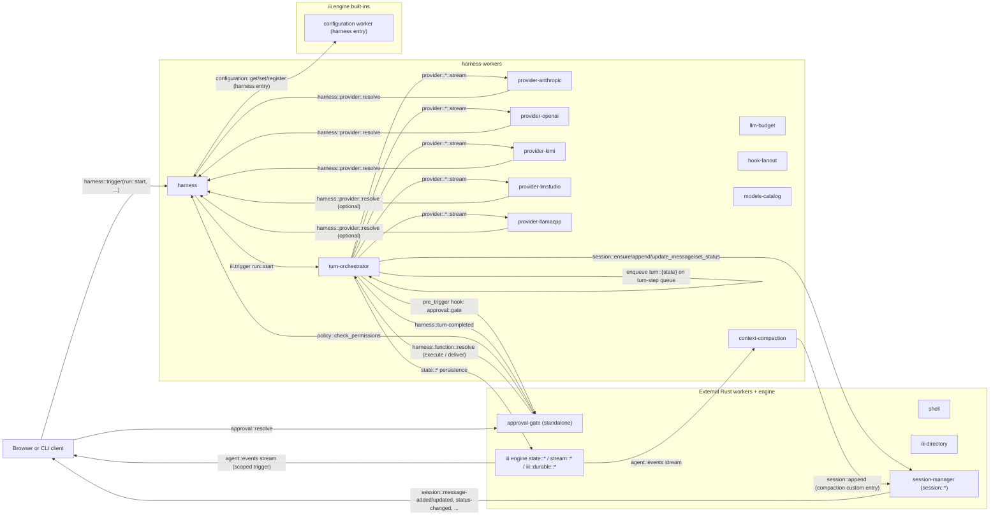
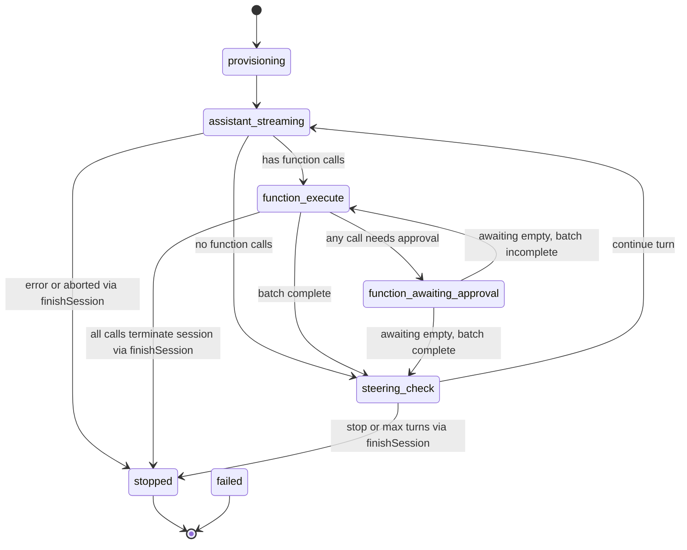
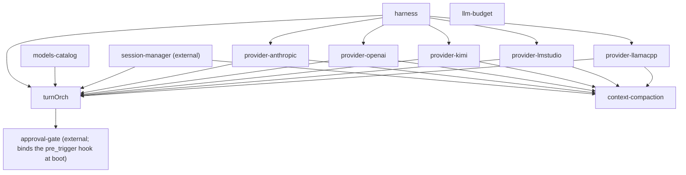
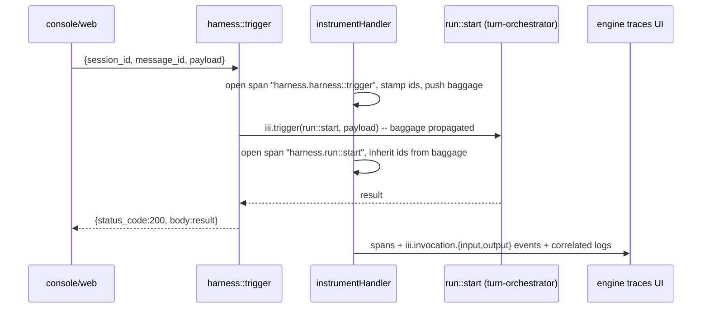

# harness architecture

`harness` is the Node/TypeScript port of the iii harness stack. It ships
as one pnpm package containing 14 workers (one folder per worker, one feature
per file) plus a shared `runtime/` SDK helper layer and a `types/` wire-type
mirror of `harness/crates/harness-types`. Each worker is independently runnable
as `pnpm dev:<worker>` (development) or `iii-<worker>` (production binary);
[src/index.ts](harness/src/index.ts) is the composite entry-point that
spins every worker up in a single process by reusing each worker's
`register()` callback unchanged.

The Rust workers `shell`, `iii-directory`, `session-manager`, and the
engine's `state::*` / `stream::*` / `iii::durable::*` primitives are NOT
ported. `harness` talks to them over the iii bus exactly the same way it
talks to its own workers. Conversation transcripts live in the external
[session-manager](../../session-manager/architecture/integration.md) worker
(`session::*` functions + six trigger types); the harness is the **driver**:
it ensures sessions, appends user/assistant/function_result messages with
deterministic idempotent entry ids, streams assistant content via
`session::update_message`, writes compaction records as
`custom_type: "compaction"` entries, and flips session status around runs
(`working` → `done`/`error`).

## Worker catalogue

| Worker | Folder | Role | Doc |
|---|---|---|---|
| harness | [src/harness/](harness/src/harness/) | Meta-worker; loads `iii-permissions.yaml`, exposes `harness::trigger` (WS ingestion bridge — see [Telemetry & trace correlation](#telemetry--trace-correlation)) / `policy::check_permissions` / `ui::*` / `harness::provider::{register,resolve,list}`. Owns the provider registry + the `harness` entry in the `configuration` worker (credentials, settings, permissions — see [storage.md](harness/docs/storage.md)). | [workers/harness.md](harness/docs/workers/harness.md) |
| turn-orchestrator | [src/turn-orchestrator/](harness/src/turn-orchestrator/) | Durable FSM driving each agent turn; `triggerWithHook` pre_trigger hook chokepoint; owns `harness::function::resolve` and the `harness::hook::pre-trigger` / `harness::turn-completed` trigger types. | [workers/turn-orchestrator.md](harness/docs/workers/turn-orchestrator.md) |
| approval-gate (external) | [approval-gate/ (repo root)](../../approval-gate/) | Standalone Rust worker: approval policy, pending inbox, decision RPCs. Binds `approval::gate` to the harness's pre_trigger hook and settles holds via `harness::function::resolve`. | [workers/approval-gate.md](harness/docs/workers/approval-gate.md) |
| llm-budget | [src/llm-budget/](harness/src/llm-budget/) | Workspace + agent LLM spend caps with alerts, forecast, period rollover. | [workers/llm-budget.md](harness/docs/workers/llm-budget.md) |
| hook-fanout | [src/hook-fanout/](harness/src/hook-fanout/) | Generic publish-and-collect primitive over a stream topic. | [workers/hook-fanout.md](harness/docs/workers/hook-fanout.md) |
| models-catalog | [src/models-catalog/](harness/src/models-catalog/) | Model-capability catalogue in iii state (provider-registered only; no embedded seed or fallback), refreshed by `provider::<name>::refresh_models`. | [workers/models-catalog.md](harness/docs/workers/models-catalog.md) |
| provider-anthropic | [src/provider-anthropic/](harness/src/provider-anthropic/) | Anthropic Messages API SSE → channel writer. | [workers/provider-anthropic.md](harness/docs/workers/provider-anthropic.md) |
| provider-openai | [src/provider-openai/](harness/src/provider-openai/) | OpenAI Chat Completions SSE → channel writer. | [workers/provider-openai.md](harness/docs/workers/provider-openai.md) |
| provider-kimi | [src/provider-kimi/](harness/src/provider-kimi/) | Kimi Chat Completions SSE → channel writer. | [workers/provider-kimi.md](harness/docs/workers/provider-kimi.md) |
| provider-lmstudio | [src/provider-lmstudio/](harness/src/provider-lmstudio/) | LM Studio (localhost) Chat Completions SSE → channel writer. | [workers/provider-lmstudio.md](harness/docs/workers/provider-lmstudio.md) |
| provider-llamacpp | [src/provider-llamacpp/](harness/src/provider-llamacpp/) | llama.cpp `llama-server` (localhost) Chat Completions SSE → channel writer. | [workers/provider-llamacpp.md](harness/docs/workers/provider-llamacpp.md) |
| context-compaction | [src/context-compaction/](harness/src/context-compaction/) | Optional `agent::turn_end` side-car that compacts session history when running token count crosses a threshold. | [workers/context-compaction.md](harness/docs/workers/context-compaction.md) |

To add a new LLM provider worker, see the
[authoring a provider](harness/docs/workers/authoring-a-provider.md) guide.

## System diagram



## Turn FSM

[src/turn-orchestrator/state.ts](harness/src/turn-orchestrator/state.ts)
defines a 7-state durable FSM. Each state is a registered `turn::{state}`
function executed via `runTransition` and enqueued onto the `turn-step` FIFO
queue from `saveRecord` ([store.ts](harness/src/turn-orchestrator/state-runtime/store.ts)).
`saveRecord` calls `shouldWakeStep` then enqueues `turn::{newState}` when the persisted state
transitions to a stepable state. Paused sessions are woken by
`harness::function::resolve`, which persists a `function_resolutions` row and
enqueues `turn::function_awaiting_approval` directly.



`failed` is a terminal state set by `runTransition` when a handler throws
unexpectedly (unless it opts into queue retry via `TransientError`).

## Approval flow

The orchestrator consults the `harness::hook::pre-trigger` chain inside
`triggerWithHook` — bound hooks (the standalone approval-gate's
`approval::gate`) answer `continue`, `deny`, or `hold`. The approval policy
itself (permission modes, allow-lists, `policy::check_permissions` fallback)
lives in the gate worker; see
[tech-specs/2026-06-agentic/approval-gate.md](../../tech-specs/2026-06-agentic/approval-gate.md).
The orchestrator parks the turn in `function_awaiting_approval` when any
call in the batch is held, then resumes as each parked call receives
`harness::function::resolve` (`execute` releases it, `deliver` answers it
without executing; decisions may arrive independently and out of batch
order). Each resolve persists a `function_resolutions` row (deleted after
consumption) and enqueues `turn::function_awaiting_approval`.

### Parallel batch during `function_execute`

When the assistant message contains multiple tool calls, `runBatch` does not
stop at the first `pending`. For each call in assistant tool order:

- already in `work.executed` or listed in `awaiting_approval[]` → skip
- hook `continue` (or inline hook `deny`) → trigger, checkpoint, emit
  `function_execution_end`
- hook `hold` → emit `function_execution_start`, append the call
  to `awaiting_approval[]`, **continue** remaining siblings

After the loop: if any call is still awaiting approval, transition to
`function_awaiting_approval`; otherwise finalize the batch or re-enter
`function_execute` when the batch is incomplete but nothing is parked.

Example batch A, B, C: A → pending, B → allow (executes immediately), C →
pending → `awaiting_approval = [A, C]`, B recorded in `work.executed`, turn
parked until A and C are resolved.

### Durability and reload

| Surface | Location | Role |
|---|---|---|
| Open approvals | `turn_state/<session_id>` → `awaiting_approval[]` | Which calls are parked and their args |
| Decisions | `function_resolutions/<session_id>/<function_call_id>` | Written by `harness::function::resolve`; consumed (and deleted) on each wake |
| Pending inbox | approval-gate worker (`approval::list-pending`) | Cross-session human-attention index, owned by the gate |
| UI mirror | `turn_state_changed` on `agent::events` | Console shows pending modals from `TurnStateView.awaiting_approval` |
| Reload | `turn::get_state` | One-shot lean view after refresh (no direct iii state reads) |

A page refresh does not lose pending approvals as long as iii state persists.
Operators can still approve from the console after reload; each
`harness::function::resolve` enqueues the parked turn step directly while
the worker is running.

### Resume semantics

- Decisions may arrive in any order (e.g. resolve call C before call A).
- On `execute`, the parked call runs with `skipStart: true` — the
  `function_execution_start` event was already emitted when the call first
  returned `pending`.
- A duplicate `harness::function::resolve` for the same call answers
  `{resolved: false}` once it settled; resolved entries are pruned
  idempotently so execution is not doubled.

```mermaid
sequenceDiagram
  participant Turn as turn-orchestrator (FSM)
  participant Gate as approval-gate (standalone)
  participant Harness as harness (policy::check_permissions)
  participant User

  Note over Turn: function_execute: runBatch walks all tool calls.<br/>held calls append to awaiting_approval[];<br/>allowed siblings execute in the same pass.

  Turn->>Gate: pre_trigger hook approval::gate (HookInput)
  alt gate allows (mode / allow-lists / yaml allow)
    Gate-->>Turn: continue → trigger the call
  else gate denies
    Gate-->>Turn: deny + reason → error FunctionResult
  else needs a human
    Gate-->>Turn: hold + pending_timeout_ms → append to awaiting_approval[], continue batch
    Note over Turn: When the batch pass finishes with any awaiting calls,<br/>saveRecord parks in function_awaiting_approval<br/>(one post-persist scan wake).
    User->>Gate: approval::resolve(decision, reason)
    Gate->>Turn: harness::function::resolve (execute | deliver)
    Turn->>Turn: persist function_resolutions row,<br/>enqueue turn::function_awaiting_approval
    Turn->>Turn: settle that call immediately (skipStart),<br/>delete the row, remove it from awaiting_approval[]
    alt more calls still awaiting
      Turn->>Turn: stay in function_awaiting_approval
    else awaiting empty and batch incomplete
      Turn->>Turn: transition to function_execute
    else awaiting empty and batch complete
      Turn->>Turn: finalizeBatch → steering_check / stopped
    end
  end
```

Fail-closed: a bound hook unreachable (transport error or its `timeout_ms`)
→ the chain denies the call with a `gate_unavailable` envelope. Note the
gate consults `policy::check_permissions` itself as its yaml fallback; the
orchestrator no longer calls policy directly.

## Kernel deny list

[iii-permissions.yaml](iii-permissions.yaml) at the workspace root is the
single source of truth for what an in-run agent can call. The harness loads
it at boot and watches for changes via `chokidar`. Rules are scanned
top-to-bottom; first match wins. Kernel rules below are shipped by default
and protect the gate / state surface.

Deny shorthands (`!function_id` in the YAML): `approval::resolve`,
`policy::check_permissions`, `hook-fanout::publish_collect`, `state::set`,
`state::update`, `state::delete`, `stream::set`, `iii::durable::publish`,
`harness::provider::resolve`, `harness::provider::register`,
`configuration::get`, `configuration::set`, `configuration::register`,
`oauth::anthropic::login`, `oauth::openai-codex::login`, `run::start`,
`router::stream_assistant`, every session-manager mutation
(`session::create/ensure/set_meta/set_status/delete/append/append_many/update_message/fork/set_active_leaf`),
and the raw store protocol `session::store::*`. The
`harness::provider::resolve` and `configuration::*` denials keep an in-run
agent from reading the plaintext api keys stored in the `harness`
configuration entry; the `session::*` denials keep an in-run agent from
rewriting its own transcript (integration.md §2: deny-by-default).

Bare-string allow rules: `state::get`, `state::list`,
`models::list`, `models::get`, `models::supports`,
`oauth::anthropic::status`, `oauth::openai-codex::status`, the
read-only `engine::*` introspection surface (`engine::functions::*`,
`engine::triggers::*`, `engine::workers::*`,
`engine::registered-triggers::*`), `worker::list`, the registry
catalogue reads (`directory::registry::workers::list` / `::info`),
the read-only `coder::*` surface (`info`, `read-file`, `search`,
`list-folder`, `tree`), and `web::fetch` (size/timeout caps and
server-side SSRF protection make it allowable; it is load-bearing
for the system prompt's SDK-reference gate and HTTP-trigger
verification). Mutating `worker::*` ops (`add`, `start`, `stop`,
`remove`, `clear`) and mutating `coder::*` ops (`create-file`,
`update-file`, `move`, `delete-file`) stay approval-gated.

A function pattern may use `*` to match any substring
(`compileFunctionMatcher` in
[policy/compile.ts](harness/src/harness/policy/compile.ts)). A pattern with
no `*` matches by exact id; a pattern containing `*` compiles to an anchored
regex (`^…$`) where `*` becomes `.*` and every other regex metacharacter is
escaped — so `*` is the only wildcard. This unlocks namespace-scoped rules
(in both the bare-string and `!`-deny forms):

- `shell::*` — any function under the `shell` namespace.
- `*::list` — any worker's `::list` leaf (end-anchored: `models::listing`
  does not match).
- `"*"` — catch-all; first match still wins, so place it last.
- `"!state::*"` — deny the whole `state` namespace.

Globs compose with arg constraints: a globbed `function` and its
`matches:` / `equals:` constraints AND together. Globs are anchored, so a
namespace deny protects the exact prefix only — `!shell::*` does not cover
`Xshell::exec`.

## Shared modules

| Folder | Purpose |
|---|---|
| [src/runtime/](harness/src/runtime/) | Cross-worker SDK helpers. `worker.ts` parses CLI flags, bootstraps an SDK connection, and wraps it in a `Proxy` so every `registerFunction` is auto-instrumented (see [Telemetry & trace correlation](#telemetry--trace-correlation)); `config.ts` loads `config.yaml`; `state.ts` / `stream.ts` wrap the iii engine's state/stream surface; `ids.ts` mints UUID-like ids; `otel.ts` wires `iii-sdk` OTel via `initHarnessOtel`, exposes `instrumentHandler` (per-call span + baggage propagation), and bridges every pino log to an OTel log auto-correlated to the active span; `handler.ts` exposes `unwrapBody` / `requireString`. |
| [src/types/](harness/src/types/) | Wire types that mirror `harness/crates/harness-types/src/*.rs`. `agent-event.ts`, `agent-message.ts`, `content.ts`, `function.ts`, `stream-event.ts`, `thinking.ts`, `provider.ts`, plus `wire.ts` for envelope helpers. |

## Boot ordering & dependencies

The composite entry-point [src/index.ts](harness/src/index.ts) spins
workers up in this order so each dependency is already on the bus before its
dependants register:



Edges are extracted from each worker's `iii.worker.yaml` `dependencies:`
block.

## Telemetry & trace correlation

Every harness function is automatically instrumented with an OTel span
tagged with `iii.session.id` / `iii.message.id` / `iii.function.id`. This is
what the engine's `engine::traces::group_by` reads to populate "Group by
Session" / "Group by Message" / "Group by Function" in the traces UI; without
the IDs on every span, those groupings return empty.

**The single chokepoint.** [src/runtime/worker.ts](harness/src/runtime/worker.ts)
calls `initHarnessOtel(serviceName, engineWsUrl)` before opening the SDK,
then wraps the `ISdk` in a `Proxy` that intercepts `registerFunction(id,
handler, opts)`. The local function handler is replaced with
`instrumentHandler(id, handler)` before being passed through to the real
SDK. HTTP invocation configs (objects, not functions) pass through
unchanged because there is no local handler to wrap. No per-worker
`register.ts` knows or needs to know that this is happening, so no future
worker can accidentally skip the wrap.

**What `instrumentHandler` does per call.** See
[src/runtime/otel.ts](harness/src/runtime/otel.ts). On every
invocation it opens a `harness.<function_id>` SERVER span, extracts
`session_id` / `message_id` from the input body (with baggage fallback
for nested calls so a downstream `iii.trigger` inherits the IDs of its
parent), stamps the three `iii.*` attributes onto the span, and runs the
handler inside an OTel context that pushes those IDs as baggage. It also
records three lifecycle events that populate the EVENTS tab in the
traces UI:

- `iii.invocation.input` — redacted + truncated input JSON.
- `iii.invocation.output` — redacted + truncated result JSON (or
  `{error: ...}` on failure).
- `exception` — standard OTel event, only on throw, so the ERRORS tab
  picks the failure up.

Payload capture is gated on the `III_DISABLE_TRACE_PAYLOADS` env var
(matches the Rust `iii-sdk` semantics — set to `1` or `true` to suppress
payloads while keeping spans).

**Why baggage matters.** The engine relies on per-span attributes for
grouping, but only the outermost handler call sees the
`session_id`/`message_id` in its body. Pushing them as baggage means
every nested `iii.trigger` span (e.g. `harness.run::start` →
`harness.provider::anthropic::stream`) inherits the IDs automatically
via the iii-sdk's `BaggageSpanProcessor`. No manual plumbing per
call-site.

**Log bridge.** Pino keeps writing to stderr (devs still see logs in their
terminal during `pnpm dev:<worker>`). On top of that, every
`logger.info/warn/error` also emits an OTel log via `iii-sdk/telemetry`'s
`getLogger()`, which auto-correlates the log to the currently active
span. This is what populates the LOGS tab in the traces UI for every
harness span. When `initHarnessOtel` failed to boot (e.g.
`OTEL_ENABLED=false`), the OTel side is a quiet no-op and pino continues
to write to stderr unchanged.

**`harness::trigger` as the WS ingestion bridge.** Browser-originated
requests hit `harness::trigger` (see
[src/harness/trigger.ts](harness/src/harness/trigger.ts)), NOT
`run::start` directly. The request body is `{session_id?, message_id?,
payload}` with a flat `run::start` payload; the wrapping
`instrumentHandler` reads `session_id`/`message_id` from the outer body and
seeds baggage, then the handler forwards `payload` to `run::start` (the
target function id is fixed, not client-supplied). Going through this hop
seeds the baggage before the nested `run::start` span opens, so the span
tree carries the session/message ids end-to-end.



## Configuration

All workers honour `--url` / `III_URL` (engine WebSocket) and `--config`
(YAML config file; defaults to `./config.yaml`). The shipped
[config.yaml](harness/config.yaml) contains the per-worker sub-sections;
each worker reads only the fields it cares about and ignores the rest. The
harness worker additionally watches the path in `permissions_path` (default
`./iii-permissions.yaml`, symlinked to the workspace-root file) and reloads
the policy on change.
