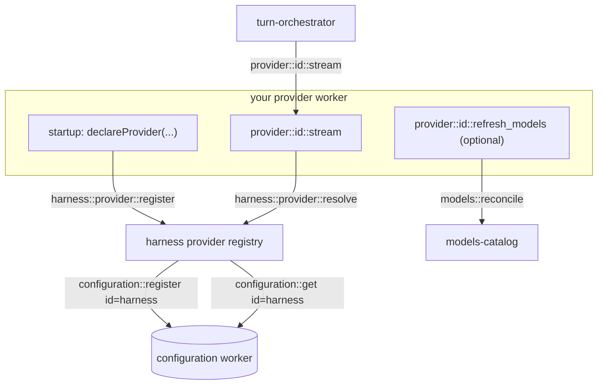

# Authoring a provider

How to add a new LLM provider worker to the harness. A provider is a small
worker that bridges one upstream API (OpenAI, Anthropic, a local server, a
gateway) onto the iii bus. The harness owns credentials, settings, routing,
and the model catalog; a provider only has to stream a turn and declare
itself.

## What a provider is responsible for



A provider must:

1. Register `provider::<id>::stream` (and, optionally, the legacy
   `provider::<id>::complete`). The orchestrator calls `stream`.
2. Self-declare to the harness registry at startup with `declareProvider(...)`.
   This contributes the provider's slice (`api_key`, `api_url`, `max_tokens`,
   ...) to the dynamic `harness` configuration entry.
3. Resolve its credential + settings at request time with
   `resolveProvider(...)` — never read keys from disk or env directly.
4. (Optional) Register `provider::<id>::refresh_models` to pull the upstream
   model list into the catalog so the picker shows live models.

Credentials, the permission mode, and per-provider settings all live in the
single `harness` entry of the built-in `configuration` worker — see
[storage.md](harness/docs/storage.md). Models come exclusively from provider
registration — see [models-catalog.md](harness/docs/workers/models-catalog.md).

Most new providers speak the OpenAI Chat Completions wire format; the
fastest path is to copy [provider-openai](harness/docs/workers/provider-openai.md)
or [provider-kimi](harness/docs/workers/provider-kimi.md). For an
Anthropic-Messages-style API, copy
[provider-anthropic](harness/docs/workers/provider-anthropic.md).

## Step 1 — Scaffold the folder

Create `harness/src/provider-<id>/` with the canonical files (an
OpenAI-compatible provider shown):

| File | Purpose |
|---|---|
| `main.ts` | Standalone binary entry point (`iii-provider-<id>`). |
| `register.ts` | Wires the handlers, self-declares, kicks off startup discovery. |
| `config.ts` | Loads the `provider_<id>` config.yaml section (defaults). |
| `types.ts` | `ChatCompletionsConfig` + `configFromCredential` builder. |
| `auth.ts` | `PROVIDER_ID` + `buildConfig` (calls `resolveProvider`). |
| `stream-fn.ts` | `provider::<id>::stream` handler. |
| `stream.ts` | Async generator: build request body, fetch SSE, yield events. |
| `sse.ts` / `wire-messages.ts` | SSE parsing + `AgentMessage[]` -> upstream payload. |
| `complete.ts` | (optional) legacy `provider::<id>::complete` drain-and-return. |
| `discover.ts` + `refresh-fn.ts` | (optional) upstream `/v1/models` -> `models::reconcile`. |
| `iii.worker.yaml` | Worker manifest. |

## Step 2 — `config.ts` (defaults)

Read the `provider_<id>` section of `config.yaml`. These values become the
provider's declared defaults (the fallback when the operator hasn't set an
override in the `harness` configuration entry).

```ts
import { getNumber, getSection, getString } from '../runtime/config.js';

export type WorkerConfig = {
  default_max_tokens: number;
  default_api_url: string;
};

export const DEFAULT_API_URL = 'https://api.example.com/v1/chat/completions';

export function loadWorkerConfig(cfg: Record<string, unknown>): WorkerConfig {
  const section = getSection(cfg, 'provider_foo');
  return {
    default_max_tokens: getNumber(section, 'default_max_tokens', 8192),
    default_api_url: getString(section, 'default_api_url', DEFAULT_API_URL),
  };
}
```

## Step 3 — `auth.ts` (resolve credential + settings)

Export a `PROVIDER_ID` and a `buildConfig` that asks the harness for the
resolved credential + settings in one call. The `Credential` type lives in
[runtime/provider-resolve.ts](harness/src/runtime/provider-resolve.ts).

```ts
import type { ISdk } from '../runtime/iii.js';
import { resolveProvider } from '../runtime/provider-resolve.js';
import type { WorkerConfig } from './config.js';
import { type ChatCompletionsConfig, configFromCredential } from './types.js';

export const PROVIDER_ID = 'foo';

export async function buildConfig(
  iii: ISdk,
  worker: WorkerConfig,
  model: string,
): Promise<ChatCompletionsConfig> {
  const resolved = await resolveProvider(iii, PROVIDER_ID);
  if (!resolved.credential) {
    throw new Error(
      'harness::provider::resolve returned no credential for provider `foo` ' +
        '(set an api key in the harness configuration or FOO_API_KEY)',
    );
  }
  const apiUrl = resolved.api_url ?? worker.default_api_url;
  const maxTokens = resolved.max_tokens ?? worker.default_max_tokens;
  return configFromCredential(apiUrl, PROVIDER_ID, model, resolved.credential, maxTokens);
}
```

`resolveProvider` returns `{ configured, source, credential, api_url, max_tokens }`.
`credential` is `null` when neither a stored `api_key` nor the declared env
var is set — cloud providers should throw (as above); **local** providers
(localhost servers that need no auth) should tolerate `null` and fall back to
a synthetic/loopback key (see
[provider-lmstudio](harness/docs/workers/provider-lmstudio.md)).

## Step 4 — `stream-fn.ts` (the stream contract)

The orchestrator opens a channel and calls `provider::<id>::stream` with a
[`ProviderStreamInput`](harness/src/types/provider.ts): `{ writer_ref,
system_prompt, model, messages, tools }`. The iii-sdk hydrates `writer_ref`
into a live `ChannelWriter` before your handler runs. Write each
`AssistantMessageEvent` as a JSON text message, then `close()`.

```ts
import type { ChannelWriter } from 'iii-sdk';
import type { ISdk } from '../runtime/iii.js';
import { logger } from '../runtime/otel.js';
import type { AgentMessage } from '../types/agent-message.js';
import {
  ProviderStreamInputJsonSchema,
  ProviderStreamOutputJsonSchema,
  ProviderStreamRuntimeInputSchema,
} from '../types/provider.js';
import { isTerminal } from '../types/stream-event.js';
import { buildConfig } from './auth.js';
import type { WorkerConfig } from './config.js';
import { streamFoo } from './stream.js';

export const FUNCTION_ID = 'provider::foo::stream';

export function register(iii: ISdk, worker: WorkerConfig): void {
  iii.registerFunction(
    FUNCTION_ID,
    async (raw: unknown) => {
      const input = ProviderStreamRuntimeInputSchema.parse(raw);
      const writer = input.writer_ref as ChannelWriter;
      const cfg = await buildConfig(iii, worker, input.model);
      try {
        for await (const ev of streamFoo({
          cfg,
          system_prompt: input.system_prompt ?? '',
          messages: input.messages as AgentMessage[],
          tools: input.tools as import('../types/function.js').AgentFunction[],
        })) {
          writer.sendMessage(JSON.stringify(ev));
          if (isTerminal(ev)) break;
        }
      } catch (err) {
        logger.warn('provider::foo::stream failed mid-flight', { err: String(err) });
      } finally {
        try {
          writer.close();
        } catch {}
      }
      return { ok: true };
    },
    {
      description: 'Stream a single assistant turn from Foo into the caller-supplied channel.',
      request_format: ProviderStreamInputJsonSchema as Record<string, unknown>,
      response_format: ProviderStreamOutputJsonSchema as Record<string, unknown>,
    },
  );
}
```

For an OpenAI-compatible upstream, copy `stream.ts` / `sse.ts` /
`wire-messages.ts` from `provider-openai` and only change the defaults +
`PROVIDER_ID`. The terminal event is `Done` or `Error` (see `isTerminal`);
the orchestrator reads the deltas off the channel.

## Step 5 — `register.ts` (declare + wire)

```ts
import { loadConfig } from '../runtime/config.js';
import type { ISdk } from '../runtime/iii.js';
import { logger } from '../runtime/otel.js';
import { declareProvider } from '../runtime/provider-resolve.js';
import { PROVIDER_ID } from './auth.js';
import { register as registerComplete } from './complete.js';
import { loadWorkerConfig } from './config.js';
import { discoverAndRegister } from './discover.js';
import { register as registerRefresh } from './refresh-fn.js';
import { register as registerStream } from './stream-fn.js';

export async function register(iii: ISdk, ctx: { configPath: string }): Promise<void> {
  const cfg = await loadConfig(ctx.configPath);
  const worker = loadWorkerConfig(cfg);
  registerStream(iii, worker);
  registerComplete(iii, worker); // optional
  registerRefresh(iii, worker); // optional

  // Self-declare into the dynamic harness configuration schema.
  void declareProvider(iii, {
    id: PROVIDER_ID,
    display_name: 'foo',
    credential_env_var: 'FOO_API_KEY',
    defaults: {
      api_url: worker.default_api_url,
      max_tokens: worker.default_max_tokens,
    },
    supports_model_listing: true, // only if you implement refresh_models
  });

  // Optional: pull the live model list at startup (deferred so a slow
  // upstream never blocks boot).
  setImmediate(() => {
    discoverAndRegister(iii, worker).catch((err) => {
      logger.warn('foo startup discovery threw', { err: String(err) });
    });
  });
}
```

### The declaration

`declareProvider` sends a `ProviderDeclaration` to `harness::provider::register`:

| Field | Required | Meaning |
|---|---|---|
| `id` | yes | Provider id; also the `provider::<id>::*` prefix and the key under `providers` in the harness config. |
| `display_name` | no | Human label (defaults to `id`). |
| `credential_env_var` | no | Env var the registry falls back to when no `api_key` is configured (e.g. `FOO_API_KEY`). |
| `defaults` | no | `{ api_url, max_tokens, ... }` — seeds the JSON Schema defaults and the `resolveProvider` fallback. |
| `config_schema` | no | A custom JSON Schema for this provider's config object. Omit to get the standard `{ api_key (password), api_url, max_tokens }` schema derived from `defaults`. |
| `supports_model_listing` | no | `true` if you register `provider::<id>::refresh_models` (drives the console refresh + gear). |

The registry composes every declared provider into one JSON Schema and
(re-)registers the `harness` configuration entry, so the editable shape grows
automatically — no central list to edit. See
[harness/src/harness/providers/registry.ts](harness/src/harness/providers/registry.ts).

## Step 6 — Optional: live model discovery

Cloud providers expose `/v1/models`. Mirror the existing cloud `discover.ts`
using the shared helpers in
[runtime/models-discovery.ts](harness/src/runtime/models-discovery.ts)
(`deriveModelsUrl`, `fetchModelsJson`, `enrichModel`, `registerModels`):

```ts
export async function discoverAndRegister(iii: ISdk, worker: WorkerConfig): Promise<string[]> {
  const resolved = await resolveProvider(iii, PROVIDER_ID).catch(() => null);
  const cred = resolved?.credential ?? null;
  if (!cred) return []; // no key -> nothing to list
  const key = cred.type === 'api_key' ? cred.key : cred.access_token;
  const url = deriveModelsUrl(resolved?.api_url ?? worker.default_api_url);
  const json = await fetchModelsJson(url, { Authorization: `Bearer ${key}` });
  if (!json) return [];
  const models = parseStubs(json).map((stub) =>
    enrichModel({ provider: PROVIDER_ID, api: 'openai-completions', stub, defaultContextWindow: 128_000 }),
  );
  return registerModels(iii, models);
}
```

Then expose it as a bus function in `refresh-fn.ts`:

```ts
export const FUNCTION_ID = 'provider::foo::refresh_models';

export function register(iii: ISdk, worker: WorkerConfig): void {
  iii.registerFunction(
    FUNCTION_ID,
    async () => ({ registered: await discoverAndRegister(iii, worker).catch(() => []) }),
    { description: 'Re-pull the Foo model list and register each into the iii models catalog.' },
  );
}
```

Upstream `/v1/models` exposes little metadata, so discovered models get a
per-provider default context window + `supports_tools` (other capability
flags default off). That is intentional — the catalog is provider-sourced.

## Step 7 — `main.ts` and `iii.worker.yaml`

`main.ts` is the standalone binary (mirror any existing provider's
`main.ts`). `iii.worker.yaml` declares the manifest — depend on the
`configuration` worker (it backs the harness registry):

```yaml
iii: v1
name: provider-foo
language: node
deploy: binary
manifest: package.json
bin: iii-provider-foo
description: Foo Chat Completions streaming provider; exposes provider::foo::stream and provider::foo::complete on the iii bus.

runtime:
  kind: node

scripts:
  install: pnpm install
  start: node ./dist/provider-foo/main.js --config ./config.yaml

dependencies:
  configuration: "^0.11.0"
```

## Step 8 — Wire into the composite + routing

These three edits make the provider actually reachable:

1. **Composite** — add a `WORKERS` entry in
   [harness/src/index.ts](harness/src/index.ts):

   ```ts
   {
     name: 'provider-foo',
     description: 'Foo Chat Completions streaming provider (provider::foo::stream + ::complete).',
     register: (iii, ctx) => registerProviderFoo(iii, ctx),
   },
   ```

   Then add a `dev:provider-foo` script and an `iii-provider-foo` bin to
   [harness/package.json](harness/package.json). The
   `tests/composite-manifest.test.ts` guard fails if any folder with a
   `main.ts` is missing its `WORKERS` entry, dev script, or bin.

2. **Routing** — add the provider to
   [turn-orchestrator/provider-router.ts](harness/src/turn-orchestrator/provider-router.ts):
   extend the `RouteDecision` union, return it from `decide()` when
   `provider === 'foo'` (plus any model-name heuristic), and map it to
   `provider::foo::stream` in `targetFunctionId()`. Without this the
   orchestrator can't route a `run::start` to your provider.

3. **Defaults** — add a `provider_foo` block to
   [harness/config.yaml](harness/config.yaml) (`default_api_url`,
   `default_max_tokens`).

## How it surfaces

- **Configuration**: the `harness` configuration entry gains a
  `providers.foo` object (`api_key`, `api_url`, `max_tokens`). Operators edit
  it through the console Configuration tab's schema-driven form; the
  `api_key` field renders masked (`format: password`).
- **Console model picker**: the provider appears automatically via
  `harness::provider::list`. Its registered models show in the dropdown; when
  it is present but unconfigured it shows with a gear that opens the harness
  configuration. No console code change is needed for the live backend — only
  the dev/mock fallback in `console/web/src/components/providers/provider-registry.ts`
  (`ACTIVE_PROVIDERS` / `PROVIDER_DEFAULTS`) is static.
- **Permissions**: `harness::provider::resolve` (and `configuration::*`) are
  denied to in-run agents in [iii-permissions.yaml](iii-permissions.yaml) so a
  credential can't be exfiltrated through `agent_trigger`. Provider workers
  call it directly (worker-to-worker calls bypass the gate).

## Checklist

- [ ] `provider-<id>/` folder with `config.ts`, `auth.ts`, `stream-fn.ts`, `stream.ts`, `register.ts`, `main.ts`, `iii.worker.yaml`.
- [ ] `register.ts` calls `declareProvider({ id, credential_env_var, defaults, supports_model_listing })`.
- [ ] `auth.ts` `buildConfig` uses `resolveProvider` (throws for cloud when no credential; tolerant for local).
- [ ] `stream-fn.ts` registers `provider::<id>::stream` and honors the `ProviderStreamInput` channel-writer contract.
- [ ] (Optional) `discover.ts` + `refresh-fn.ts` register `provider::<id>::refresh_models` and set `supports_model_listing: true`.
- [ ] `index.ts` WORKERS entry + `dev:provider-<id>` script + `iii-provider-<id>` bin.
- [ ] `provider-router.ts` updated (`RouteDecision`, `decide`, `targetFunctionId`).
- [ ] `config.yaml` `provider_<id>` defaults.
- [ ] `pnpm test` (composite-manifest guard) + `pnpm build:bundle` green.
