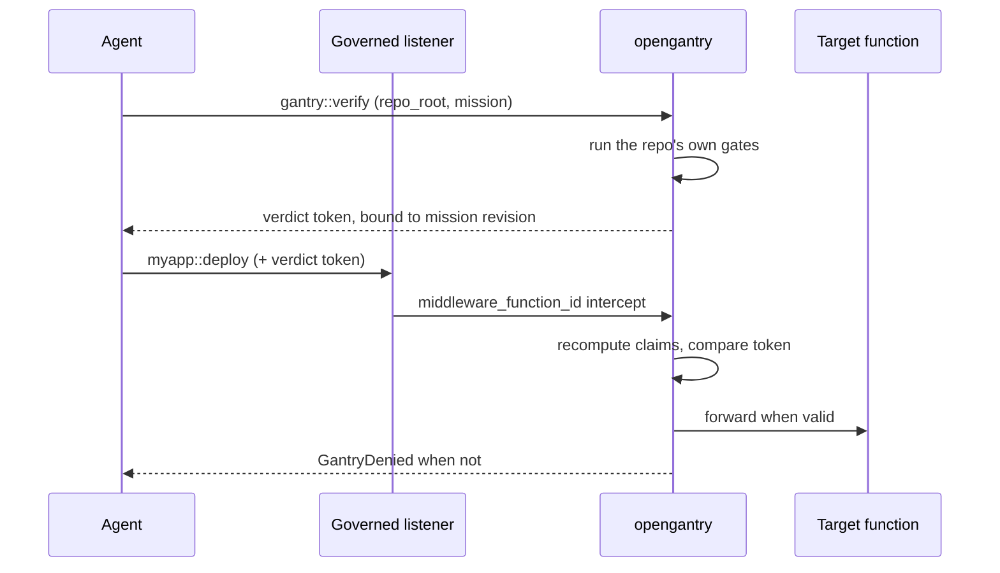

# opengantry

iii can already run an agent unattended. It cannot yet let one **ship** unattended — any agent on the bus can call a merge, deploy, or publish function.

- **`approval-gate`** holds what a human should decide.
- **`opengantry`** blocks what a machine can already prove is unsafe.

The proof is the repo's own gates: the build and test commands that already exist, plus a declared edit scope. Pass them and you get a signed verdict token bound to that exact mission revision; edit the work order afterwards and the token stops matching.

**Net effect:** unattended agents, without accepting an unattended `git push`.

## How it works

1. Agent calls `gantry::verify` with an absolute `repo_root` and active mission — OpenGantry runs the repo's gate command and mints a verdict token.
2. Agent calls a promote-class function on a governed listener with that token in `context` or `payload`.
3. `gantry::middleware` recomputes verdict claims at promote time and forwards the call only when the token matches the current mission revision. Otherwise it throws `GantryDenied` (fail-closed).



## Install

```bash
iii worker add opengantry
```

## Skills

```bash
npx skills add iii-hq/workers --skill opengantry
```

## Quickstart

From zero to a fail-closed promote on the governed port:

```bash
iii worker add opengantry
iii   # starts the engine + worker
```

Add the governed listener block from [Configuration](#configuration) to `~/.iii/config.yaml`, restart `iii`, then call any promote-class function on the governed port:

```js
import { registerWorker } from 'iii-sdk';

const iii = registerWorker('ws://127.0.0.1:49135', { workerName: 'demo' });

const result = await iii.trigger({
  function_id: 'myapp::deploy',
  payload: { branch: 'main' },
  context: {
    msn_id: 'MSN-0001',
    worktree_path: '/path/to/repo',
  },
});

console.log(result);
```

Without a verdict token from `gantry::verify`, middleware throws `GantryDenied` (fail-closed).

Initialize OpenGantry in the repo you want governed (`gantry init`), run `gantry::verify` for the active mission, then retry the promote call with the verdict token in `context` or `payload`.

## Configuration

Wire `gantry::middleware` and the RBAC registration hooks on your governed listener in `~/.iii/config.yaml`. Replace `session::auth` with your IdP worker.

```yaml
workers:
  - name: opengantry
  - name: iii-worker-manager
    config:
      host: 0.0.0.0
      port: 49135
      middleware_function_id: gantry::middleware
      rbac:
        auth_function_id: session::auth
        on_function_registration_function_id: gantry::on-function-registration
        on_trigger_registration_function_id: gantry::on-trigger-registration
        on_trigger_type_registration_function_id: gantry::on-trigger-type-registration
```

`worktree_path` / `repo_root` in trigger context must be absolute. Leases persist at `<repo>/.gitagent/leases.json`.

`gantry::verify` runs kernel `verifyMission` only — the repo's declared `gate_command` and mission scope, not a separate scanner.
