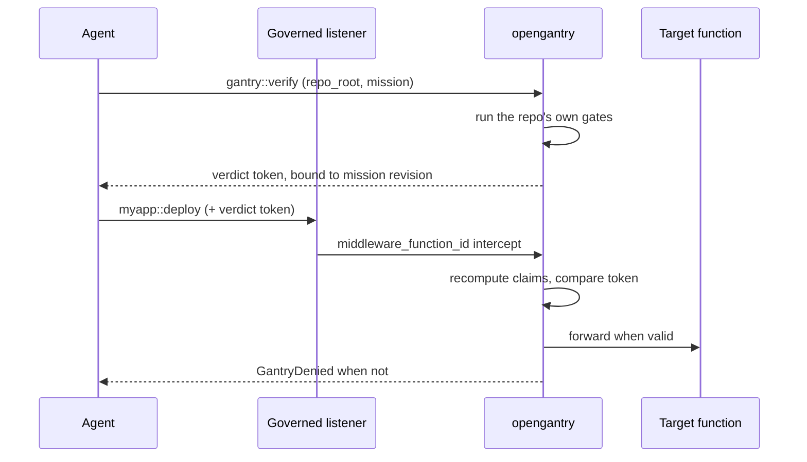

# opengantry

iii can already run an agent unattended. It cannot yet let one ship unattended. Any agent on the bus can call a merge, deploy, or publish function.

- `approval-gate` holds what a human should decide.
- `opengantry` blocks what a machine can already prove is unsafe.

The proof is the repo's own gates: the build and test commands that already exist, plus a declared edit scope. Pass them and you get a signed verdict token bound to that exact mission revision. Edit the work order afterwards and the token stops matching.

**Net effect:** unattended agents, without accepting an unattended `git push`.

This worker is the hot path only. It runs OpenGantry kernel `verifyMission` and gates promote-class calls on a governed listener. It does not admit sessions (`session::auth` is your IdP), hold for a human (`approval-gate`), or push git. It never writes `.gitagent/` law. Planner commits missions on the host.

## How it works

1. Agent calls `gantry::verify` with an absolute `repo_root` and active mission. OpenGantry runs the repo's gate command and mints a verdict token.
2. Agent calls a promote-class function on a governed listener with that token in `context` or `payload`.
3. `gantry::middleware` recomputes verdict claims at promote time and forwards the call only when the token matches the current mission revision. Otherwise it throws `GantryDenied` (fail-closed).



Promote-class is a kernel match on the function id. Suffixes `::promote`, `::deploy`, `::merge`, `::publish`, `::apply`, and `::push` require a token. Other calls still go through middleware (lease + mission scope when bound) but do not need a verdict.

## Functions

| Function | Role |
|----------|------|
| `gantry::verify` | Kernel `verifyMission`. A pass binds the mission onto the lease. |
| `gantry::middleware` | Governed-port gate. Recomputes claims from disk; never trusts the token's own payload. |
| `gantry::on-function-registration` | Blocks `gantry::` / `opengantry::` squatting and reserved suffixes `::verify` / `::attest` / `::promote`. |
| `gantry::on-trigger-registration` | Blocks triggers bound into the `gantry::` namespace. |
| `gantry::on-trigger-type-registration` | Always denied. Agents must not register trigger types on the governed port. |
| `gantry::verdict` | Trigger type emitted when verify completes. |

## Practices this worker follows

These are the rules the code is written to. A missing `.gitagent` does not unlock promote.

**Fail closed.** Promote without a matching token throws `GantryDenied`. A corrupted lease file throws. A missing `forwardTrigger` throws at boot. Middleware never silently forwards a promote-class call.

**Recompute, do not trust.** At promote time the kernel rebuilds expected claims from the mission file on disk, then HMAC-checks the token against that. Changing the mission after verify invalidates the token even if the agent still holds it.

**Absolute paths only.** Middleware needs `context.worktree_path` or `context.repo_root`. `gantry::verify` needs an absolute `repo_root`. There is no `process.cwd()` fallback, so a sandboxed worker that cannot see the host repo fails instead of verifying the wrong tree.

**Kernel verify only.** `gantry::verify` is `verifyMission`: the mission's `gate_command` and scope. It is not a second architecture scanner. Put structural lint in CI before this worker runs.

**Leases are durable and exclusive.** State lives at `<repo>/.gitagent/leases.json` (mode `0600`), with an exclusive file lock around each mutation. A dirty lineage (`dirty_rewritten`) refuses promote until re-verify. If every session drops while a promote is in flight, the lease tombstones instead of staying `promoting`.

**Bounded in-process caches.** Lease stores and governance bundles are capped LRU maps. Governance is keyed by repo + mission path and invalidated when file mtime or size changes, so a rewritten mission is not served from a stale bundle.

**Verify coalesces.** Identical in-flight `gantry::verify` calls share one kernel run. A full coalescer returns `GXT_VERIFY_SATURATED` rather than starting a 33rd gate.

**Registration is reserved.** Other workers cannot register `gantry::` / `opengantry::` functions, bind triggers into `gantry::`, or register trigger types on the governed listener. Suffixes `::verify`, `::attest`, and `::promote` are reserved bus-wide so a sibling cannot mint a fake gate.

**The worker process is not Planner.** It does not write missions, manifests, or `gantry init` output. Bootstrap `.gitagent` on the host, then commit missions through the Planner workflow.

**iii worker contract.** Every `registerFunction` passes `request_format` and `response_format`. Payload and context schemas `.passthrough()` extra adopter fields. The request envelope stays strict. Bundle deploy, no `scripts.setup` / `scripts.install`.

## Install

```bash
iii worker add opengantry
```

## Skills

```bash
npx skills add iii-hq/workers --skill opengantry
```

## Recommended stack

OpenGantry is the machine gate. It does not replace the rest of the governed port — install the siblings that already solve adjacent problems instead of reimplementing them.

| Worker | Role in the blessed stack |
|--------|---------------------------|
| `opengantry` | `gantry::verify` + `gantry::middleware` — cryptographic promote gate |
| `approval-gate` | Human-held judgement on promote-class calls (`approval::gate`) |
| `worktree` + `shell` | Canonical promote target (`worktree::land` runs rebase, test gate, atomic CAS) |
| `rbac-proxy` | **Preferred public door** — same middleware + registration-hook contract, out-of-process |
| Your IdP worker | `session::auth` on the governed listener |

**Canonical ship pipeline:** `worktree::create` → agent work → `gantry::verify` → `worktree::land` (with verdict token). Do not write a custom `myapp::deploy` when `worktree::land` or `github::*` already fits.

### Tier 1 — local dev (engine listener)

Wire middleware and RBAC hooks directly on `iii-worker-manager`:

```yaml
workers:
  - name: opengantry
  - name: approval-gate
  - name: worktree
  - name: shell
  - name: iii-worker-manager
    config:
      host: 0.0.0.0
      port: 49135
      middleware_function_id: gantry::middleware
      rbac:
        auth_function_id: session::auth
        on_function_registration_function_id: gantry::on-function-registration
        on_trigger_registration_function_id: gantry::on-trigger-registration
        on_trigger_type_registration_function_id: gantry::on-trigger-type-registration
```

### Tier 2 — preferred production (rbac-proxy as public door)

Keep the engine listener internal (no `rbac` block on it). Point agents at `rbac-proxy`, which runs the identical middleware + hook contract out-of-process:

```yaml
workers:
  - name: opengantry
  - name: approval-gate
  - name: worktree
  - name: shell
  - name: rbac-proxy
    config:
      host: 0.0.0.0
      port: 49200
      engine_url: ws://127.0.0.1:49134
      middleware_function_id: gantry::middleware
      rbac:
        auth_function_id: session::auth
        on_function_registration_function_id: gantry::on-function-registration
        on_trigger_registration_function_id: gantry::on-trigger-registration
        on_trigger_type_registration_function_id: gantry::on-trigger-type-registration
  - name: iii-worker-manager
    config:
      host: 127.0.0.1
      port: 49134
```

### Pairing with approval-gate

Machine gate first, human hold second:

1. `approval::gate` (`pre_trigger`) evaluates session mode and rules — can **hold** promote-class calls for a human.
2. `gantry::middleware` recomputes verdict claims and forwards only when the token matches.

Recommended `approval-gate` rules (seed into the `approval-gate` configuration entry):

```jsonc
{
  "default_mode": "manual",
  "rules": [
    "!approval::*",
    { "function": "*::deploy", "action": "hold" },
    { "function": "*::merge", "action": "hold" },
    { "function": "*::publish", "action": "hold" },
    { "function": "*::apply", "action": "hold" },
    { "function": "*::push", "action": "hold" },
    { "function": "*::promote", "action": "hold" }
  ]
}
```

Tune `action` to `allow` per session mode once you trust unattended promote on specific functions.

### Why leases are not `state::`

Leases live at `<repo>/.gitagent/leases.json` (mode `0600`), not in the bus-shared `state` worker. That is intentional: lease state is part of the security model for a governed repo — it must be colocated with the mission, exclusive-locked, and fail-closed on corruption. A shared KV any worker can write would break those guarantees.

### `gantry::verdict` trigger

After every `gantry::verify` completes (pass or fail), the worker fans out a best-effort event to every binding on the `gantry::verdict` trigger type:

```json
{
  "status": "passed",
  "error_code": null,
  "repo_root": "/path/to/repo",
  "msn_id": "MSN-0001",
  "mission_rel_path": ".gitagent/missions/MSN-0001.yaml"
}
```

Subscribe a sibling function (audit log, Slack notifier, console inbox) via `registerTrigger` on `gantry::verdict`. A failing subscriber never fails verify.

## Quickstart

From zero to a fail-closed land on the governed port:

```bash
iii worker add opengantry approval-gate worktree shell
iii   # starts the engine + workers
```

Add the governed listener block from [Recommended stack](#recommended-stack) to `~/.iii/config.yaml`, restart `iii`, then run the canonical pipeline:

```js
import { registerWorker } from 'iii-sdk';

const iii = registerWorker('ws://127.0.0.1:49135', { workerName: 'demo' });

// 1. Mint an isolated worktree for the agent.
const wt = await iii.trigger({
  function_id: 'worktree::create',
  payload: { repo_root: '/path/to/repo', branch: 'gxt/msn-0001' },
});

// 2. Agent works in wt.path, then verify the active mission.
const verify = await iii.trigger({
  function_id: 'gantry::verify',
  payload: {
    repo_root: '/path/to/repo',
    msn_id: 'MSN-0001',
    mission_rel_path: '.gitagent/missions/MSN-0001.yaml',
  },
});

// 3. Land with the verdict token (promote-class — middleware gates this).
const land = await iii.trigger({
  function_id: 'worktree::land',
  payload: { worktree_id: wt.id },
  context: {
    msn_id: 'MSN-0001',
    worktree_path: '/path/to/repo',
    verdict_token: verify.verdict_token,
  },
});
```

Without a verdict token from `gantry::verify`, middleware throws `GantryDenied` (fail-closed).

Initialize OpenGantry in the repo you want governed (`gantry init`), run `gantry::verify` for the active mission, then retry the land call with the verdict token in `context` or `payload`.

A sandboxed `iii worker add` worker only mounts its own folder. `gantry::verify` against a host repo needs a host-started worker that can see that absolute path.

## Configuration

For local dev, use the Tier 1 block in [Recommended stack](#recommended-stack). For production, prefer Tier 2 (`rbac-proxy`). Replace `session::auth` with your IdP worker.

Legacy single-listener block (equivalent to Tier 1):

```yaml
workers:
  - name: opengantry
  - name: iii-worker-manager
    config:
      host: 0.0.0.0
      port: 49135
      middleware_function_id: gantry::middleware
      rbac:
        auth_function_id: session::auth
        on_function_registration_function_id: gantry::on-function-registration
        on_trigger_registration_function_id: gantry::on-trigger-registration
        on_trigger_type_registration_function_id: gantry::on-trigger-type-registration
```

`worktree_path` / `repo_root` in trigger context must be absolute. Leases persist at `<repo>/.gitagent/leases.json`. Override with `GANTRY_III_LEASE_STORE` only if the path still resolves under that repo's `.gitagent/`. Verdict HMAC keys default to `<repo>/.config/gantry/pepper-keyring.json` (`GANTRY_VERDICT_KEYRING` to override).

## Source map

Start at `src/index.js`, then `src/middleware.js` and `src/verify.js`. Tests in `tests/` use `createGantryRuntime` with a fake `forwardTrigger`.

| File | Why it exists |
|------|----------------|
| `src/index.js` | Boot. Static `iii-sdk` import, registers the five functions, injects `forwardTrigger`. |
| `src/runtime.js` | Composition root. Builds deps once. Refuses to start without `forwardTrigger`. |
| `src/middleware.js` | Hot-path policy. Lease, verdict, scope, then forward. |
| `src/verify.js` | `gantry::verify` handler, coalescer, post-pass lease bind. |
| `src/verdict.js` | Recompute claims + HMAC. Maps kernel errors to `GantryDenied`. |
| `src/lease-store.js` | File-locked `leases.json`. Fail-closed on corrupt JSON. |
| `src/stores.js` | Bounded LRU for lease stores and governance bundles. |
| `src/registration-hooks.js` | Reserved prefix / suffix predicates and RBAC hook handlers. |
| `src/verdict-events.js` | `gantry::verdict` trigger fan-out after verify completes. |
| `src/repo-path.js` | Absolute repo resolution. Lease-path jail under `.gitagent/`. |
| `src/formats.js` | Zod → JSON Schema for `registerFunction`. |
| `src/denied.js` | `GantryDenied`. Throw so iii records `InvocationResult.error`. |

## Credits

Originally contributed by [@jeger-at](https://github.com/jeger-at).
