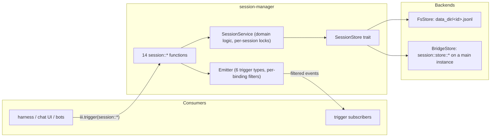

# session-manager architecture

Reference documentation for the `session-manager` worker — the durable,
reactive, branching store for conversations specified in
[tech-specs/2026-06-agentic/session-manager.md](../../tech-specs/2026-06-agentic/session-manager.md).
These documents are written to be sufficient on their own: a reader (human or
LLM) should be able to maintain the worker or integrate against it without
opening the source.

## Document map

| Document | Audience | Read it when |
|---|---|---|
| [internals.md](internals.md) | Maintainers of this worker | You are changing session-manager itself: fixing a bug, adding a function, adding a storage backend, touching the event pipeline. |
| [integration.md](integration.md) | Authors of other workers / clients | You are building something that calls `session::*` or subscribes to its events — the harness, a chat UI, a bot bridge, a dashboard. This file is the handoff contract. |

The BDD suite under [../tests/features/](../tests/features) is the executable
companion to both: every behavioural claim made here is pinned by a scenario,
each annotated with the regression it prevents.

## The system in one paragraph

session-manager is a **pure storage + notification surface** for
conversations. A session is an append-only log of typed message entries
(user / assistant / function_result / custom) linked by a parent chain that
supports branching and copy-on-fork, plus a small metadata record (title,
description, coarse status, app-defined metadata). Fourteen `session::*`
functions mutate and read it; six custom trigger types announce every
mutation so consumers render live without polling. It runs no agent logic,
calls no LLMs, and binds no triggers of its own. Storage is pluggable behind
one trait: a filesystem backend (one JSONL file per session) or a bridge
backend that defers storage — and event fan-out — to a *main* session-manager
on another iii instance, so many instances can share one durable store and
every instance's subscribers see every mutation.

## The system in one diagram

## Vocabulary

| Term | Meaning |
|---|---|
| **Session** | One conversation: a `SessionMeta` record plus a set of entries. |
| **Entry** | One stored item, `kind: "message"` (a transcript message) or `kind: "custom"` (bookkeeping, e.g. a compaction record). Entries carry `id`, `parent_id`, `timestamp`, `revision`, optional `origin`. |
| **Parent chain** | Each entry points at its parent. **The chain is the transcript order** — never timestamps, never insertion order. |
| **Active leaf** | The entry the current conversation path ends at. Appends chain from it and move it. Stored per session. |
| **Active path** | Walk from the active leaf to the root, reversed (oldest first). What `session::messages` returns. |
| **Revision** | Per-entry monotonic counter, starts at 0, +1 per content update. Consumers reconcile streamed snapshots last-write-wins by revision. |
| **Branch** | Appending under a non-leaf parent (or after `session::set_active_leaf`) creates a sibling chain. Abandoned branches stay readable. |
| **Fork** | Copy-on-fork: the root→entry path is copied into a *new session* with fresh entry ids. Fully independent afterwards. |
| **Main instance** | An fs-backend instance that owns durable storage and is the single event fan-out point in a bridge topology. |
| **Bridged instance** | A `backend: bridge` instance: runs all domain logic locally, stores through the main, publishes its events to the main, and receives every participant's events back through a relay. |
| **Envelope** | `EventEnvelope { trigger_type, payload, session_metadata }` — the wire form events travel in between instances, carrying session metadata so tenancy filters work at every edge. |
