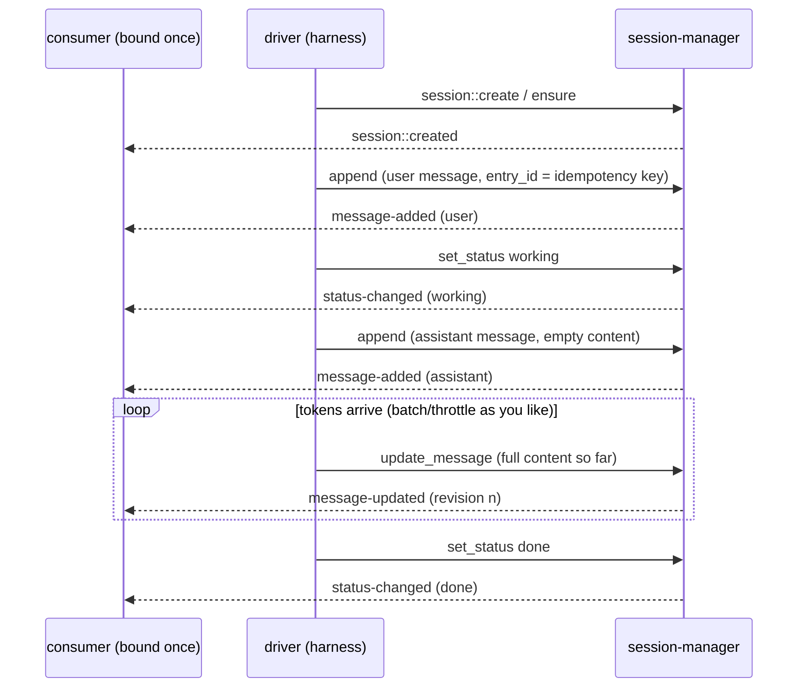
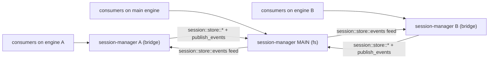

# Integrating with session-manager

The handoff contract for workers and clients that build on session-manager —
the harness, chat UIs, bot bridges, dashboards, titling/cleanup workers. It is
self-contained: everything needed to integrate is here, with the
[spec](../../tech-specs/2026-06-agentic/session-manager.md) as the design
rationale and [internals.md](internals.md) as the implementation deep-dive.

Contents: [mental model](#1-mental-model) ·
[conventions](#2-conventions) · [data types](#3-data-types) ·
[functions](#4-function-catalog) · [events](#5-reactive-integration) ·
[errors](#6-error-contract) · [patterns](#7-canonical-patterns) ·
[topologies](#8-deployment-topologies) · [boundaries](#9-boundaries) ·
[harness notes](#10-notes-for-the-harness)

## 1. Mental model

session-manager is the conversation database plus its change feed. You write
typed messages into an append-only, branchable log and read them back in
order; every mutation fires a trigger-type event you can bind to with
per-binding filters, so UIs render live without polling and without a
separate publish call. It stores and notifies — nothing else. The driver
(typically the harness) owns the loop: it appends messages, streams updates
into them, and flips the session status around turns.

Integration is always some subset of the same triangle:

1. **Write** through `session::*` mutations (create/ensure, append, update,
   set_status, ...).
2. **Render** by binding handlers to the six trigger types and reconciling
   by `revision` + parent chain.
3. **Read back** (`messages`, `get`, `list`) for initial load, recovery, or
   non-streaming consumers.

## 2. Conventions

- **Invocation**: every function is a sync `iii.trigger({ function_id,
  payload, timeout_ms })` call; responses are the JSON shapes below.
- **Ids** are opaque strings assigned by the worker (`s_<uuid>`,
  `e_<uuid>`) unless you supply them (`ensure` session ids, `append`
  entry ids).
- **Timestamps** are integer milliseconds since epoch. Message timestamps
  (inside `AgentMessage`) are caller-supplied; entry/meta/event timestamps
  are worker-assigned. Never sort by them — order is the parent chain.
- **Errors** are strings beginning with a stable code: `session/<snake>:
  message`. Match on the code substring (the SDK may prefix transport
  framing). Reads (`get`, `get_message`) return `null` instead of erroring
  for unknown ids.
- **Pagination**: `limit` (operator-configurable; defaults: 50 when omitted,
  hard cap 500) + opaque `cursor`. Re-send the same filters/order with a
  cursor; a list cursor used with a different `order` is rejected
  (`session/invalid_cursor`).
- **Agent exposure is deny-by-default.** An in-run agent that can write here
  can rewrite its own transcript. Deny every mutation, all of
  `session::store::*`, and expose reads only in single-tenant deployments.

## 3. Data types

Exactly the spec's cross-cutting contracts (TypeScript notation; the wire is
plain JSON):

```typescript
type Role = "user" | "assistant" | "function_result" | "custom";
type SessionStatus = "idle" | "working" | "done" | "error";

type ContentBlock =
  | { type: "text"; text: string }
  | { type: "image"; mime: string; data: string }              // base64
  | { type: "thinking"; text: string; signature?: string }
  | { type: "function_call"; id: string; function_id: string; arguments: unknown }
  | { type: "function_result"; function_call_id: string; content: ContentBlock[]; is_error?: boolean };

type AgentMessage =
  | { role: "user"; content: ContentBlock[]; timestamp: number }
  | { role: "assistant"; content: ContentBlock[];
      stop_reason: "end" | "length" | "function_call" | "aborted" | "error";
      native_stop_reason?: string; error_message?: string;
      error_kind?: "auth_expired" | "rate_limited" | "context_overflow" | "transient" | "permanent";
      warnings?: string[]; usage?: Usage; model: string; provider: string; timestamp: number }
  | { role: "function_result"; function_call_id: string; function_id: string;
      content: ContentBlock[]; details: unknown; is_error: boolean; timestamp: number }
  | { role: "custom"; custom_type: string; content: ContentBlock[];
      display?: string; details?: unknown; timestamp: number };

type SessionEntry =                       // what get_message returns
  | { kind: "message"; id: string; parent_id: string | null; timestamp: number;
      revision: number; origin?: Record<string, unknown>; message: AgentMessage }
  | { kind: "custom";  id: string; parent_id: string | null; timestamp: number;
      revision: number; origin?: Record<string, unknown>; custom_type: string; data: unknown };

type SessionMeta = {
  session_id: string; title: string; description: string;
  status: SessionStatus; status_reason?: string;
  metadata?: Record<string, unknown>;     // app-defined; THE tenancy hook
  forked_from?: string;                   // set on sessions created by fork
  created_at: number; updated_at: number;
  message_count: number;                  // kind:"message" entries only
};
```

Two different "custom" things — don't conflate them:

- A **custom message** (`role: "custom"` inside a `kind: "message"` entry) is
  a transcript item, rendered in order (system notices, UI markers).
- A **custom entry** (`kind: "custom"`) is bookkeeping *about* the
  conversation (e.g. the harness's compaction record); it is invisible to
  `session::messages` unless `include_custom` is set, never counted in
  `message_count`, and never matches a `roles` filter.

## 4. Function catalog

All functions are registered with JSON Schemas (`iii worker info
session-manager` / `get function info`); the shapes below are the contract.

### Lifecycle

```typescript
// session::create — new session at status "idle". Fires session::created.
{ title?, description?, metadata? } -> { session_id, meta: SessionMeta }

// session::ensure — idempotently ensure a caller-chosen id exists.
// Creates (and fires session::created) only when missing; otherwise a pure
// read: created=false, title/description/metadata are NOT applied.
{ session_id, title?, description?, metadata? } -> { session_id, meta, created: boolean }

// session::get — null when unknown.
{ session_id } -> { meta } | null

// session::list — pagination + filters.
{ limit?, cursor?, status?, metadata?, order? } -> { sessions: SessionMeta[], next_cursor? }
//   order: "created_asc" | "created_desc" | "updated_desc" (default)
//   metadata: subset-equality against SessionMeta.metadata (every given key must match)

// session::set_meta — supplied fields replace; metadata replaces WHOLESALE.
// Fires session::meta-updated (all-fields-absent request is a silent no-op).
{ session_id, title?, description?, metadata? } -> { meta }

// session::set_status — fires session::status-changed; SAME status = no-op,
// no event (even with a different reason). reason stored only with "error",
// cleared on any other status.
{ session_id, status, reason? } -> { status, previous_status }

// session::delete — removes meta + entries + leaf. Fires session::deleted.
// Unknown id => { deleted: false }, no event. Forks of this session survive.
{ session_id } -> { deleted: boolean }
```

### Messages

```typescript
// session::append — append ONE entry. Exactly one of `message` / `custom`.
// Parent defaults to the active leaf; appending ALWAYS moves the leaf to the
// new entry (also with an explicit parent_id — that starts a branch).
// IDEMPOTENT on entry_id: an existing id returns the existing entry, fires
// nothing, moves nothing. Fires session::message-added.
{ session_id, message?: AgentMessage, custom?: { custom_type, data },
  parent_id?, entry_id?, origin? }
  -> { entry_id, parent_id: string | null, timestamp }

// session::append_many — ordered batch, chained; one message-added per
// entry, in order. NOT idempotent. Empty batch => session/empty_batch.
{ session_id, messages: AgentMessage[], parent_id?, origin? }
  -> { entry_ids: string[], last_entry_id }

// session::update_message — replace content (streaming deltas / edits).
// Each success increments revision (echoed on the event). With
// expected_revision set, a mismatch writes nothing, fires nothing, and
// returns { updated: false, revision: current }. details only for
// function_result / custom roles. Message entries only; entry timestamp
// never changes.
{ session_id, entry_id, content: ContentBlock[], details?, expected_revision?, origin? }
  -> { updated: boolean, revision }

// session::messages — the active path, oldest first (the parent chain IS
// the order). from_entry_id returns the chain root -> that entry instead.
// roles narrows to matching message roles (and drops custom entries even
// with include_custom). include_custom interleaves kind:"custom" entries at
// their path position.
{ session_id, limit?, cursor?, roles?, from_entry_id?, include_custom? }
  -> { messages: [{ entry_id, message?: AgentMessage,
                    custom?: { custom_type, data } }], next_cursor? }

// session::get_message — null when session or entry is unknown.
{ session_id, entry_id } -> { entry: SessionEntry } | null
```

### Branching

```typescript
// session::fork — copy-on-fork: copies the root -> entry_id path (custom
// entries included) into a NEW session with fresh entry ids, structure
// preserved, revisions reset to 0, source metadata copied, forked_from set,
// active leaf = the copy of entry_id. Fully independent afterwards. Fires
// session::created (with forked_from). title defaults to the source's.
{ session_id, entry_id, title? } -> { session_id, meta }

// session::set_active_leaf — branch switch: the active path now ends here;
// subsequent appends chain from it. No event (the spec'd exception).
{ session_id, entry_id } -> { active_leaf }
```

## 5. Reactive integration

### The six trigger types

Bind with the standard two-step pattern — register a handler function, then
register a trigger of the type with a `config` filter:

```typescript
iii.registerFunction("ui::on_message_updated", async (evt) => render(evt));
iii.registerTrigger({
  type: "session::message-updated",
  function_id: "ui::on_message_updated",
  config: { session_id: "s_123", roles: ["assistant"] },
});
```

| Trigger type | Fires when | Config filters | Payload |
|---|---|---|---|
| `session::created` | create / ensure-created / fork | `metadata?` | `{ session_id, title, description, status, forked_from?, created_at }` |
| `session::message-added` | an entry was appended | `session_id?`, `roles?`, `metadata?` | `{ session_id, entry_id, parent_id, message?, custom?, origin?, timestamp }` |
| `session::message-updated` | a message's content changed | `session_id?`, `roles?`, `metadata?` | `{ session_id, entry_id, message, revision, origin?, timestamp }` |
| `session::status-changed` | status actually changed | `session_id?`, `metadata?` | `{ session_id, status, previous_status, status_reason?, timestamp }` |
| `session::meta-updated` | title/description/metadata changed | `session_id?`, `metadata?` | `{ session_id, title, description, metadata?, timestamp }` |
| `session::deleted` | session removed | `session_id?`, `metadata?` | `{ session_id, timestamp }` |

Filter semantics (all supplied filters must hold — AND):

- `session_id` — exact match.
- `roles` — the event's message role must be in the list. Custom *entries*
  have no role and never match; `roles: ["custom"]` matches custom
  *messages* only.
- `metadata` — subset-equality against the session's `metadata` (deep JSON
  equality per key). The tenancy filter: bind `{ metadata: { owner: "u_1" } }`
  and you only ever see that owner's sessions — including `deleted` events
  (evaluated against the metadata as of deletion) and `meta-updated` events
  (evaluated against the post-update metadata).
- **Malformed configs are rejected at registration** (unknown keys, `roles`
  on status events, `session_id` on `created`, invalid role values). If your
  binding registered, your filter is live.

### Delivery semantics — what you must build for

- **At-least-once, unordered, fire-and-forget.** Never rely on arrival
  order or exactly-once.
- Reconcile **message content** by `revision`: events carry full message
  snapshots; keep the highest revision per `entry_id`, drop the rest.
- Reconcile **transcript order** by `parent_id` chains (or just re-fetch
  `session::messages`), never by event arrival or timestamps.
- Events are best-effort: a delivered mutation is durable even if its event
  is lost. Recovery is always a read-back (`messages` + `get`), then resume
  live updates.
- `origin` is echoed verbatim from the writer (`{ turn_id: ... }` from the
  harness) — use it to correlate events to the work that caused them.

## 6. Error contract

| Code | Meaning / typical trigger |
|---|---|
| `session/not_found` | Unknown `session_id` on any mutation or path-read. |
| `session/entry_not_found` | Unknown `entry_id` (`update_message`, `fork`, `set_active_leaf`, `messages.from_entry_id`). |
| `session/parent_not_found` | Explicit `parent_id` does not exist in the session. |
| `session/invalid_entry_kind` | `update_message` on a `kind:"custom"` entry. |
| `session/details_not_supported` | `details` supplied for a role without details (user/assistant). |
| `session/empty_batch` | `append_many` with `[]`. |
| `session/invalid_cursor` | Malformed cursor, cursor for a different order, or cursor entry no longer on the requested path. |
| `session/invalid_request` | Shape violations beyond serde (e.g. both/neither of `message`/`custom`; empty `ensure` id). |
| `session/storage` | Backend failure (disk error; bridge main unreachable). Retryable. |

Not errors: `get` / `get_message` return `null` for unknown ids;
`update_message` revision mismatch returns `{ updated: false, revision }`;
`delete` of an unknown session returns `{ deleted: false }`.

## 7. Canonical patterns

### Streaming a turn (the driver loop)



The consumer renders the growing assistant message from `message-updated`
snapshots (highest revision wins) and drives its spinner purely from
`status-changed`.

### Surviving redelivery (durable writers)

If your write path can run twice (queue retries, webhook redelivery), use
`session::append` with a deterministic `entry_id` (e.g.
`"<turn_id>-user"`, a platform update id). Replays return the original
entry and fire nothing — no duplicate transcript rows, no duplicate events.
`append_many` is *not* idempotent; avoid it on redeliverable paths. For
concurrent edits to one entry, use `expected_revision` and treat
`updated: false` as "re-read and retry".

### Multi-tenancy

Put the tenancy keys in `metadata` at create/ensure time
(`{ owner, channel, ... }`), filter `session::list` and every trigger
binding with the same keys, and remember `set_meta` **replaces** metadata —
writers must send the full object, not a delta.

### Branching and what-if exploration

Same-session alternative: `set_active_leaf` to an earlier entry, then append
— a sibling branch becomes the active path; the old branch stays readable
(`messages.from_entry_id` shows any branch). Cross-session alternative:
`fork` at an entry for a fully independent copy (UIs can group by
`forked_from`). Deleting the source never touches forks.

### Bookkeeping records (the compaction pattern)

Persist non-message state on the path as custom entries:
`append { custom: { custom_type: "compaction", data: { summary, tail_start_entry_id, ... } } }`.
Read them back with `messages { include_custom: true }` and scan for the
latest record of your type. They don't pollute `message_count`, role
filters, or default reads.

## 8. Deployment topologies

**Single instance (`backend: fs`)** — the default. One worker, one
`data_dir`, one JSONL file per session. Everything in §4–§7 applies as-is.

**Bridge (`backend: bridge`)** — several iii instances share one
conversation store:



What integrators must know (the API does not change):

- Call your **local** `session::*` functions and bind your **local** trigger
  types, regardless of topology. Identical surface everywhere.
- The main is the single fan-out point: a mutation made on any instance
  reaches **every** instance's subscribers (originator included) exactly
  once, with each instance applying its own binding filters. A bridged
  originator's own subscribers hear events after the round trip through the
  main — same at-least-once contract, slightly higher latency.
- If the main is unreachable, bridged **mutations fail** with
  `session/storage` (reads too). Treat as retryable.
- `session::store::*` (the raw protocol the bridge rides on, fs-mode
  instances only) is deployment plumbing: never call it from app code, and
  deny it to agents — it bypasses every invariant (idempotency, counts,
  events).

## 9. Boundaries

session-manager does **not**:

- run agent logic, call LLMs, or build context (context-manager's job);
- compact or summarise history (it stores the compaction *record*, written
  by the harness);
- export/render transcripts;
- authenticate callers or enforce tenancy — `metadata` is a filtering hook;
  access control lives in deployment permissions;
- cascade deletes to forks or sub-agent child sessions (walk
  `forked_from` / your own linkage metadata if you need that);
- guarantee event delivery — durable state is the store; events are the
  live view.

## 10. Notes for the harness

The integration the spec was designed around:

- **Turn loop**: `ensure`/`create` → append user message (idempotent
  `entry_id` from your durable step id) → `set_status working` → append empty
  assistant message → `update_message` per delta batch → append
  `function_result` messages as calls resolve → `set_status done` /
  `error` + `reason`. Set `origin: { turn_id }` on every append/update so
  consumers can stitch events to turns.
- **Redelivered steps are safe** only via `append` + `entry_id` (§7). That
  idempotency is the contract your durability model leans on.
- **Context loading**: `messages { include_custom: true }` and scan for the
  latest `custom_type: "compaction"` entry to find the summary + tail start;
  message entries from there onward are the candidate window.
- **Sub-agent linkage** is a metadata convention, not API:
  `metadata: { parent_session_id, parent_turn_id, function_call_id, depth }`
  on the child session; reconstruct the tree with `list { metadata }`
  filters; render a child live by binding `message-updated` with that
  metadata filter.
- **Status is yours**: only the driver flips it; same-status calls are
  no-ops, so blind `set_status working` at turn start is safe.
- **Agent exposure**: deny all mutations and `session::store::*` to in-run
  agents; reads are tenancy-sensitive (see the spec's Agent exposure table).
