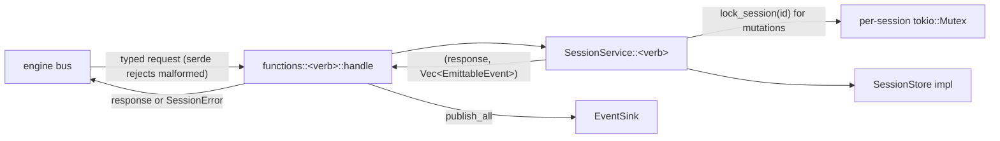
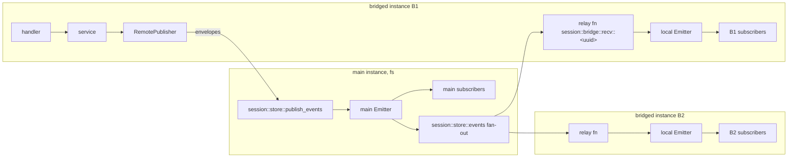

# session-manager internals

Maintainer documentation. Everything here describes the implementation as it
is; the consumer-facing contract lives in [integration.md](integration.md).
Spec of record: [tech-specs/2026-06-agentic/session-manager.md](../../tech-specs/2026-06-agentic/session-manager.md).

## 1. Crate layout

One cargo crate, one `[[bin]]`, plus a `[lib]` so tests drive production code
in-process.

| Path | Responsibility |
|---|---|
| [src/main.rs](../src/main.rs) | Boot: CLI (`--config`, `--url`, `--manifest`), config load, backend resolution (**fatal** on invalid `backend_config`), engine connection, registration order, Ctrl+C shutdown (both connections in bridge mode). |
| [src/config.rs](../src/config.rs) | `WorkerConfig { backend, backend_config, default_list_limit, max_list_limit }`. `backend_config` is raw JSON resolved by `resolve_backend()` into `Backend::Fs(FsBackendConfig)` / `Backend::Bridge(BridgeBackendConfig)` (both `deny_unknown_fields`). `~/` expansion for `data_dir`. |
| [src/manifest.rs](../src/manifest.rs) | `--manifest` JSON for the registry publish pipeline; `default_config` mirrors `WorkerConfig::default()`. |
| [src/types.rs](../src/types.rs) | Wire contracts: `Role`, `ContentBlock` (5 variants), `AgentMessage` (4 roles), `SessionEntry` (message/custom envelope), `SessionMeta`, `SessionStatus`, `CustomPayload`, `metadata_matches` (subset-equality helper). All serde + `schemars::JsonSchema`; serde tags keep the JSON byte-compatible with the spec's TypeScript. |
| [src/error.rs](../src/error.rs) | `SessionError` — every variant renders as `code: message` with a stable `session/*` code; `From<SessionError> for IIIError` puts that string on the bus. |
| [src/store/mod.rs](../src/store/mod.rs) | `SessionStore` trait (11 methods) + `StoreError` (maps to `session/storage`). |
| [src/store/fs.rs](../src/store/fs.rs) | Filesystem backend (JSONL per session). |
| [src/store/bridge.rs](../src/store/bridge.rs) | Bridge backend (defers to a main instance's `session::store::*`). |
| [src/service.rs](../src/service.rs) | **All domain logic.** Per-session locks, id/clock injection, cursors, active-path walks, fork copying. Returns `(response, Vec<EmittableEvent>)` — never emits itself. |
| [src/events.rs](../src/events.rs) | The six public trigger types, binding-config parsing + filters, `Emitter`, `EventEnvelope`, `EventSink` (`Emitter` / `RemotePublisher`), the internal `session::store::events` feed, `attach_bridge_relay`. |
| [src/functions/mod.rs](../src/functions/mod.rs) | `Deps { service, sink }`, generic typed registration helper, `register_all` (14 functions). |
| [src/functions/<verb>.rs](../src/functions) | One file per function: request/response structs (serde + JsonSchema, doc comments become schema descriptions) and a thin `pub async fn handle(deps, req)` = service call + `sink.publish_all(events)`. |
| [src/functions/store_protocol.rs](../src/functions/store_protocol.rs) | The internal `session::store::*` protocol (11 raw store functions + `publish_events`), served in fs mode only. |
| [tests/](../tests) | Cucumber BDD (`tests/bdd.rs`, `harness = false`) + `tests/manifest.rs` subprocess test. See §10. |

Layering rule that keeps everything testable: **handlers are thin, the service
is pure domain logic over the store trait, and emission happens at the edge
through a sink.** The service never knows whether it is talking to a local
disk or a remote main, and never knows who receives events.

## 2. Request lifecycle



- Input validation is two-layered: serde shape validation at the boundary
  (wrong types / unknown enum values fail before any logic), then business
  validation in the service (`session/not_found`, `session/parent_not_found`, ...).
- The service returns events; the handler publishes them **after** the
  mutation succeeded. Event delivery is fire-and-forget — a failed delivery
  never fails the mutation.

## 3. Domain model and hard invariants

State per session (logical model, independent of backend):

- `SessionMeta` — `session_id`, `title`, `description`, `status`
  (idle/working/done/error), optional `status_reason`, optional app `metadata`
  (the tenancy hook), optional `forked_from`, `created_at`, `updated_at`,
  `message_count`.
- Entries — `SessionEntry::Message { id, parent_id, timestamp, revision, origin, message }`
  or `SessionEntry::Custom { ..., custom_type, data }`.
- Active leaf — entry id the active path ends at.

Invariants the service maintains (each is pinned by BDD scenarios; breaking
one is a regression even if all types still line up):

1. **The parent chain is the order.** `session::messages` walks leaf→root and
   reverses. Timestamps are informational only.
2. **Appends move the active leaf** — always, including appends with an
   explicit `parent_id` (that is how a branch becomes the active path).
3. **Idempotent append:** appending an `entry_id` that already exists is a
   complete no-op — returns the existing entry's `(entry_id, parent_id,
   timestamp)`, fires nothing, does **not** move the leaf, does not bump
   `message_count`. This is what makes the harness's redelivered queue steps
   safe.
4. **`message_count` counts `kind: "message"` entries only.** Custom entries
   are bookkeeping and never counted.
5. **Revisions are per-entry monotonic from 0**; only `update_message`
   increments them. `expected_revision` mismatch writes nothing, fires
   nothing, returns `{ updated: false, revision }`.
6. **Entry timestamps never change after creation** (they anchor history);
   event timestamps are the mutation time. `meta.updated_at` bumps on every
   mutation of the session.
7. **`set_status` is spec-strict:** same status ⇒ no write, no event — even if
   the `reason` differs. `status_reason` is stored only with `error` and
   cleared by any other status.
8. **`set_meta` replaces `metadata` wholesale** when supplied (it is the
   tenancy hook; merging would leak stale keys). An all-`None` request is a
   silent no-op.
9. **Fork is copy-on-fork:** the root→`entry_id` path (including custom
   entries) is copied with fresh ids, structure preserved, revisions reset to
   0, original timestamps kept, source `metadata` copied (tenancy follows),
   `forked_from` set, new active leaf = copy of the fork point. After the
   fork the two sessions share nothing — deleting one never affects the other.
10. **Delete removes everything** (entries, leaf pointer, meta) and is a
    `{ deleted: false }` no-op without an event for unknown ids. The
    `session::deleted` event's metadata filter is evaluated against the meta
    **as of deletion** (the row is already gone when the event lands).
11. **Reads return null, mutations throw.** `get` / `get_message` return
    `null` for unknown ids; every mutating function and path-read
    (`messages`, `fork`, `set_active_leaf`, ...) rejects with `session/not_found`
    / `session/entry_not_found`.
12. **Exactly one of `message` / `custom` per append.** Custom-entry appends
    fire `session::message_added` with a `custom` field instead of `message`,
    and never match a `roles` filter.

Cursors (both `list` and `messages`): opaque base64(JSON). The list cursor
embeds `(order_tag, sort_key, session_id)` and is **bound to the order it was
issued for** (`session/invalid_cursor` on mismatch); ties break by id so
pagination is gapless under identical timestamps. The messages cursor is the
last returned entry id, resolved against the (filtered) active path. Limits
clamp to `[1, max_list_limit]`, default `default_list_limit`.

## 4. Concurrency and determinism

- **Per-session async locks** (`Mutex<HashMap<session_id, Arc<tokio::Mutex<()>>>>`
  in the service): every mutation takes the session's lock, so
  read-modify-write invariants (leaf, counts, revisions, idempotency checks)
  hold. Reads take no lock. Lock entries are never removed (a few dozen bytes
  per touched session per process lifetime) — removing them would allow two
  waiters to serialize on different locks.
- **Single-writer assumption:** one session-manager instance is the only
  writer of its store. In bridge topologies the *main* is the storage owner
  but each bridged instance serializes only its own sessions — deployments
  must not point two writers at the same sessions concurrently (last-write-wins
  at the store level, `expected_revision` is the consumer-visible guard).
- **Injected `IdGen` + `Clock`** (`service.rs` traits): production uses
  `s_<uuid>` / `e_<uuid>` and system time; tests inject sequential ids
  (`s_001`, `e_001`, ...) and a manually-advanced clock so feature files
  assert exact values. Any new service logic must get time/ids from these,
  never from `SystemTime`/`Uuid` directly.

## 5. Storage layer

### 5.1 The trait

`SessionStore` is deliberately dumb — store/fetch only, no ordering or
counting rules:

```text
get_meta / put_meta / delete_meta / list_metas
get_entry / put_entry / list_entries / delete_entries
get_active_leaf / set_active_leaf / delete_active_leaf
```

`list_*` return values carry their identity inline (`meta.session_id`,
`entry.id`) — no backend is required to return keys. `StoreError` surfaces to
callers as `session/storage`.

### 5.2 FsStore (default)

One append-only JSONL file per session:
`<data_dir>/<encoded_session_id>.jsonl`.

Record per line, discriminated by `type`:

```json
{"type":"meta","meta":{ ...SessionMeta }}
{"type":"entry","entry":{ ...SessionEntry }}
{"type":"leaf","entry_id":"e_..."}
```

- **Append-only writes.** Every mutation appends one line — meta rewrites,
  entry writes *and* updates (full snapshot at the new revision), leaf moves.
  Replay is last-wins per key (last meta, last record per entry id, last
  leaf). Streaming a long reply therefore appends one entry record per
  update; there is **no compaction** today (see §11).
- **Deletes rewrite or remove.** `delete_entries` / `delete_active_leaf` /
  `delete_meta` (the service calls all three when deleting a session) rewrite
  the file from the live snapshot via tmp-file + rename; when the session
  state becomes empty the file is removed.
- **Lazy write-through cache.** `Mutex<HashMap<session_id, LoadedSession>>`;
  a session's file is replayed on first access, then kept in sync by writes.
  Coherent because of the single-writer + per-session-lock model. A restart
  is just an empty cache — replay rebuilds identical state (pinned by
  `persistence.feature`'s restart scenarios and fs unit tests).
- **Filename encoding.** `[A-Za-z0-9._-]` pass through; every other byte
  becomes `%XX`. Session ids are caller-supplied via `session::ensure`, so
  this both keeps filenames portable and blocks path traversal
  (`../escape/...` cannot leave `data_dir`). `decode_session_id` is the
  strict inverse; undecodable filenames in `data_dir` are skipped with a
  warning.
- **Crash tolerance.** A truncated trailing line (crash mid-append) and any
  malformed line are warn-and-skipped on replay; one corrupt row never takes
  down the session or `list_metas`.
- `list_metas` = read dir, load every session, collect metas (O(total data)
  on first call; cached afterwards).

### 5.3 BridgeStore

Implements the same trait by calling the **main** instance's
`session::store::*` functions over a dedicated SDK connection
(`backend_config.url`), one `trigger` per trait method with
`backend_config.timeout_ms`. Failures (unreachable main, malformed replies)
map to `StoreError` → `session/storage`; the bridged mutation fails cleanly.
The bridged instance never caches — the main's store (and its cache) is the
source of truth.

### 5.4 The store protocol (`session::store::*`, fs mode only)

Twelve functions registered by `store_protocol::register_store_protocol`:
the 11 trait methods 1:1 (`get_meta`, `put_meta`, `delete_meta`,
`list_metas`, `get_entry`, `put_entry`, `list_entries`, `delete_entries`,
`get_active_leaf`, `set_active_leaf`, `delete_active_leaf`) plus
`publish_events` (§6.3). They bypass all domain logic by design — they are
deployment plumbing for bridges, not an app API. Bridge-mode instances never
serve them (a bridge forwarding to itself would recurse; boot also warns when
`backend_config.url` equals the local `--url`). Deployments must deny them to
agents.

## 6. Event pipeline

### 6.1 Types, configs, filters

Six public trigger types, registered **before** the functions (handlers
capture the subscriber sets): `session::created`, `session::message_added`,
`session::message_updated`, `session::status_changed`,
`session::meta_updated`, `session::deleted`.

Per-binding config structs are typed and `deny_unknown_fields` — a typo'd
filter key is rejected at registration, never silently ignored:

| Trigger types | Config struct | Fields |
|---|---|---|
| `created` | `CreatedBindingConfig` | `metadata?` |
| `message_added`, `message_updated` | `MessageBindingConfig` | `session_id?`, `roles?`, `metadata?` |
| `status_changed`, `meta_updated`, `deleted` | `SessionBindingConfig` | `session_id?`, `metadata?` |

Filter evaluation is the pure function `binding_matches(filter, ctx)`:
`session_id` equality AND `roles` membership (a `kind:"custom"` entry has no
role and never matches a roles filter) AND `metadata` subset-equality against
the session's metadata (deep JSON equality per key; empty filter map is
vacuous; non-empty filter never matches a session without metadata). The
`meta_updated` filter sees the **post-update** metadata; the `deleted` filter
sees the **as-of-deletion** metadata.

### 6.2 Emitter and sinks

Handlers publish through `EventSink::publish_all(&[EmittableEvent])`, where
`EmittableEvent = { event: SessionEvent, session_metadata }` (the metadata
snapshot filters evaluate against — payloads do not carry it).

- **fs mode** — the sink is the `Emitter`: for each event, (a) snapshot the
  type's bindings, evaluate filters, deliver the spec payload to each match
  via `EventDeliverer` (production: `iii.trigger(function_id, payload,
  TriggerAction::Void)`, log-and-swallow failures); (b) wrap the event in an
  `EventEnvelope` and deliver it to every subscriber of the internal
  `session::store::events` feed (§6.3).
- **bridge mode** — the sink is `RemotePublisher`: serialize the mutation's
  events into envelopes and make **one** `session::store::publish_events`
  call to the main. Log-and-continue on failure (the mutation already
  succeeded; this is the same best-effort stance as `Void` fan-out — see §11).

`EventDeliverer` is a trait so tests substitute a recorder for the bus.

### 6.3 Cross-instance propagation



- The main registers the internal trigger type `session::store::events`
  (unfiltered subscriber set, `BridgeSubscribers`; payload = envelope). Each
  bridged instance, at boot (`attach_bridge_relay`), registers a uniquely
  named relay function on the **main's** bus
  (`session::bridge::recv::<uuid>` — unique so multiple bridges never
  collide) and binds it to that feed.
- `publish_events` ingests envelopes through the main `Emitter` pipeline —
  so they reach the main's local subscribers **and** every attached bridge,
  the originator included.
- The relay handler re-emits each envelope through the bridged instance's
  **local** `Emitter` only (its bridge set is empty by construction) — it
  never re-publishes, so there are no echo loops.
- **Single-path rule:** a bridged instance never emits locally at mutation
  time. Its own subscribers hear events via main fan-out → relay like every
  other instance. One canonical path, no dedup logic, identical payloads
  everywhere; cost is one extra fire-and-forget hop for the originator.
- The envelope carries `session_metadata`, so each instance evaluates its own
  bindings' tenancy filters locally with full fidelity.

### 6.4 Restart behaviour

The engine **replays existing trigger registrations to a re-registering
trigger-type owner**. Consequences: the main's six public subscriber sets and
its `session::store::events` set rebuild automatically when the main worker
restarts; a bridged instance's local sets likewise rebuild from its local
engine. The bridge's own registrations *on the main* (relay function +
trigger) live in the main engine's registry; if the **main engine** itself
restarts, re-attachment depends on the SDK reconnect re-registering — treat
bridge re-attachment after a main-engine restart as best-effort and restart
bridged instances to force a clean re-attach.

## 7. Configuration and boot

```yaml
backend: fs | bridge
backend_config:            # shape depends on backend
  data_dir: ~/.iii/data/session-manager   # fs (default shown)
  # url: ws://main:49134                  # bridge (required)
  # timeout_ms: 5000                      # bridge (default 5000)
default_list_limit: 50
max_list_limit: 500
```

Boot rules (see `main.rs` header for the full sequence):

- Missing/unreadable config file ⇒ warn + full defaults (scaffold-standard).
- **Invalid `backend_config` ⇒ fatal.** A misconfigured bridge must never
  silently fall back to writing a local fs store.
- Registration order matters: six public trigger types → backend-specific
  pieces (fs: store-events feed + store protocol; bridge: remote connection,
  relay, publisher) → the 14 functions.
- Shutdown awaits `shutdown_async` on the local connection and, in bridge
  mode, the remote one as well.

## 8. Error model

`SessionError` variants render as `code: message`; the code is the stable
contract (see [integration.md §6](integration.md)). Mapping happens once, in
`From<SessionError> for IIIError` (always `IIIError::Handler`). Codes:
`session/not_found`, `session/entry_not_found`, `session/parent_not_found`,
`session/invalid_entry_kind`, `session/details_not_supported`,
`session/empty_batch`, `session/invalid_cursor`, `session/invalid_request`,
`session/storage`. Adding a variant means: add the code, a `Display` test in
`error.rs`, and an `errors.feature` scenario.

## 9. Determinism hooks recap

Everything a test needs to pin exact behaviour is injectable: `IdGen`,
`Clock`, `SessionStore`, `EventDeliverer`, `EventSink`. The production binary
is one specific composition of those; the BDD world is another.

## 10. Testing architecture

- **`tests/bdd.rs`** (cucumber, `harness = false`, scenarios serialized).
  Tags: `@pure` needs nothing; `@engine` soft-skips without a reachable
  engine (connect-or-skip `OnceCell` in `tests/common/engine.rs`,
  `III_ENGINE_WS_URL` override).
- **@pure stack** (`tests/common/world.rs`): per-scenario production stack —
  real handlers/service/emitter — over a real `FsStore` in a tempdir, with
  `SeqIds` + `FakeClock` and a recording deliverer. Feature files assert
  exact ids (`e_001`), timestamps, on-disk files, and deliveries.
  `reopen_fs()` swaps in a fresh store over the same dir = restart
  simulation.
- **@engine stack** (`tests/common/workers.rs`): registers the production
  fs-mode surface in-process against a live engine once per test binary
  (`Shared { data_dir }` exposes the JSONL dir for readback steps).
  `tests/common/bridge.rs` builds bridged-instance stacks (BridgeStore +
  RemotePublisher + relay + local emitter-with-recorder) against the same
  engine — that is how `engine_bridge.feature` proves the propagation matrix
  (B1 mutation → B1/B2/main subscribers exactly once, filters at each edge)
  on a single engine.
- Unit tests live next to what they pin: fs replay/encoding/truncation in
  `store/fs.rs`, envelope roundtrip + fan-out in `events.rs`, cursor codecs
  in `service.rs`, config resolution in `config.rs`, unreachable-main mapping
  in `store/bridge.rs`.
- Conventions: every scenario asserts the full observable contract (response
  + events fired *and not fired* + state readback) and carries a
  `# Prevents:` comment naming the regression it catches. Gherkin gotcha: a
  feature description line must never *start* with the word "Scenario" — the
  parser reads it as a keyword.

Verification commands (CI parity):

```bash
cargo fmt --all -- --check
cargo clippy --all-targets --all-features -- -D warnings
cargo test --all-features          # @engine soft-skips without iii
cargo test --test bdd -- --tags @engine   # with a running engine
./target/debug/session-manager --manifest | jq .
```

## 11. Sharp edges and known limitations

- **No JSONL compaction.** Heavy streaming appends one full entry snapshot
  per update; files grow until the session is deleted (deletes rewrite). If
  this bites, add compaction on load (rewrite when live records ≪ lines) —
  the tmp+rename machinery already exists in `persist_snapshot`.
- **`session::list` is O(all sessions)** — full meta scan + in-memory sort
  per call. Fine for thousands of sessions; an index is a backend concern if
  it ever isn't.
- **Best-effort event window in bridge mode:** if the mutation succeeds but
  `publish_events` fails (main died in between), those events are lost
  (logged). Same class of guarantee as `Void` fan-out; consumers already must
  tolerate at-least-once/unordered, so the recovery is a read-back.
- **Bridge re-attachment after a main-engine restart** is best-effort (§6.4).
- **Lock-map growth:** one entry per session touched per process lifetime,
  by design (never freed).
- **`session::store::*` is a god-mode surface** — raw writes bypass all
  invariants in §3. It exists for bridges only; keep it denied to agents and
  out of app code paths.

## 12. How to extend

- **New function:** new `src/functions/<verb>.rs` with typed request/response
  (+ doc comments), a service method returning
  `(response, Vec<EmittableEvent>)`, a `handle` wrapper, one `register(...)`
  line in `register_all`, a dispatch arm in `tests/common/world.rs`, and a
  feature file. If it mutates, take the session lock and decide which event
  it fires (every mutation has an event — `set_active_leaf` is the one
  spec'd exception).
- **New storage backend:** implement `SessionStore` (store/fetch only — no
  ordering/counting logic), add a `BackendKind` + typed config struct
  (`deny_unknown_fields`) + `resolve_backend` arm + `main.rs` wiring. Decide
  whether it is *authoritative* (serves the store protocol + events feed,
  like fs) or *deferring* (like bridge). Reuse `persistence.feature`'s
  restart scenarios as the acceptance bar.
- **New trigger type:** add the const + `EventKind` variant + payload struct
  + config struct, register it in `register_trigger_types`, extend
  `EventEnvelope::to_emittable`, and cover the filter matrix in
  `event_filtering.feature`. Remember envelopes must round-trip it
  (`envelope_roundtrip_preserves_event_and_metadata` test).
