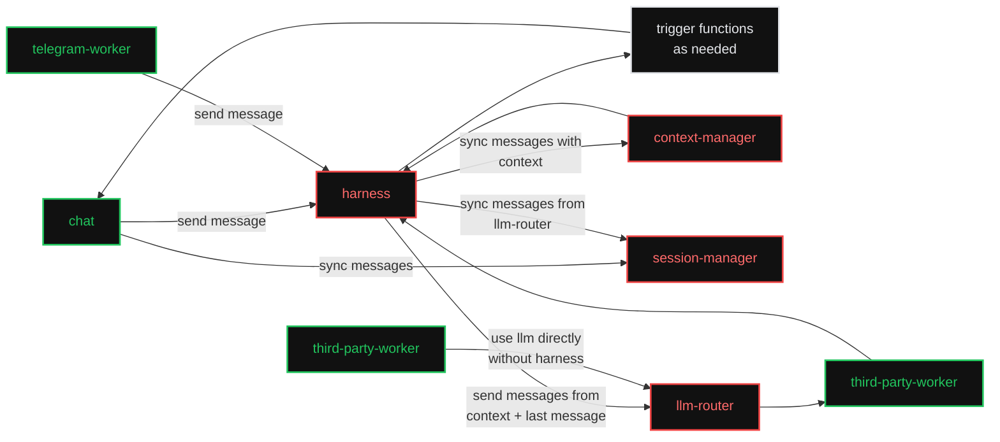

# Agentic Workers

A set of small, composable [iii](https://workers.iii.dev/) workers that, together, make up an
agentic chat backend — and, taken individually, each solve one problem well enough to be used on
their own.

The design splits the classic "agent harness" monolith into four standalone workers that talk to
each other only over the iii bus (functions, triggers, channels). Consumers (a web chat, a Telegram
bridge, any third-party worker) compose them however they need: the full loop through the `harness`,
or a single worker like `llm-router` directly.

## The overall architecture



### How to read the diagram

- **Green** (`chat`, `telegram-worker`, `third-party-worker`) are *example consumers*. They are not
  part of this spec; they show who calls in and how. Any worker or client can take their place.
- **Red** (`context-manager`, `session-manager`, `llm-router`, `harness`) are the four workers this
  spec defines. Each is **standalone**: installable and useful on its own, with no hard dependency on
  the other three.
- **White** (`trigger functions as needed`) is the **iii substrate itself**. "Tools" are just
  registered iii functions; the harness invokes them with `iii.trigger(...)` and discovers them from
  the live engine registry (`engine::functions::list`). There is no separate "tools" worker.

## The four workers

| Worker | One-line role | Standalone value | Spec |
|---|---|---|---|
| [context-manager](context-manager.md) | Turn raw history + a model into a model-ready context (prune, summarise, fit the window). | Context-window management for any AI feature, not just this harness. | [context-manager.md](context-manager.md) |
| [session-manager](session-manager.md) | Durable, reactive, branching store of typed conversation entries. | A real-time conversation store any app can subscribe to. | [session-manager.md](session-manager.md) |
| [llm-router](llm-router.md) | One front door + a provider protocol in front of every LLM provider. | Call any model/provider through one stable surface, with or without an agent loop. | [llm-router.md](llm-router.md) |
| [harness](harness.md) | A thin durable turn loop that wires the other three together. | The "assemble the agent" worker; deliberately minimal. | [harness.md](harness.md) |

A consumer can install just one of these. `llm-router` on its own gives you provider-agnostic
completions. `session-manager` on its own gives you a reactive chat store. `harness` is the only
worker that depends on the other three — and even those dependencies are soft (it degrades to a
plain LLM loop without `context-manager`).

## Design principles

1. **Standalone first.** Every red worker is independently installable (`iii worker add <name>`) and
   has a coherent purpose by itself. Cross-worker calls are explicit `iii.trigger` calls, never
   in-process coupling.
2. **The harness is thin.** `harness` only sequences the other three plus tool dispatch. Anything
   that grows real logic — approval gating, spend budgets, compaction *scheduling*, multi-agent
   handoff, hook fan-out — becomes its own sibling worker rather than bloating the harness. See
   [harness.md § Out of scope](harness.md#out-of-scope-future-sibling-workers).
3. **`llm-router` is consumer-agnostic.** It never assumes a harness, a session, or a UI. It streams
   into a caller-supplied channel and returns. That is what lets a `third-party-worker` "use llm
   directly without harness".
4. **`context-manager` does not own storage.** It operates on message arrays passed in and returns
   results; the caller persists them. This keeps it reusable by any harness or AI feature.
5. **`session-manager` is the single reactive surface.** Consumers bind to its triggers (new session,
   new message, message content updated, status changed) and render live — they never poll and never
   need to know about the provider or the loop.

## Conventions

### Function ids

`<worker-prefix>::<verb>` or `<worker-prefix>::<namespace>::<verb>`. The prefixes are:

- `context::*` — context-manager
- `session::*` — session-manager
- `router::*` — llm-router (plus the `provider::<id>::*` protocol it defines for provider workers)
- `harness::*` — harness

### Invocation modes

Every function is invoked through one of the three iii modes (see `iii-core-primitives`):

- **Sync** — `trigger({ function_id, payload })`: the caller needs the result (most reads, and
  `router::chat` which streams over a channel while the call is open).
- **Void** — `TriggerAction.Void()`: fire-and-forget side effects (e.g. notifications or metrics).
- **Enqueue** — `TriggerAction.Enqueue({ queue })`: durable async work with retry (the harness turn
  loop steps).

Each function's spec states its expected mode.

### Reactive pattern

Workers expose reactivity in two shapes, and each worker spec separates them:

- **Trigger types emitted** — a custom trigger type *this* worker registers so *other* workers/clients
  can bind handlers to its events (e.g. `session::message_added`). Binding is always the two-step
  pattern:

```typescript
iii.registerFunction("my-worker::on-message-added", handler);
iii.registerTrigger({
  type: "session::message_added",
  function_id: "my-worker::on-message-added",
  config: { session_id: "s_123" }, // optional filters
});
```

- **Triggers bound** — event sources *this* worker subscribes to (engine `state` / `stream` /
  `subscribe` / `cron`, or another worker's trigger type).

## Cross-cutting contracts

These types are defined once here and referenced by every worker spec. They are grounded in the
field-proven shapes from the existing `harness/` package (`harness/src/types/*.ts`) so the design
maps cleanly onto a real implementation.

### Content blocks

The atomic units of message content. A message's `content` is an ordered array of these.

```typescript
type TextContent     = { type: "text"; text: string };
type ImageContent    = { type: "image"; mime: string; data: string }; // base64
type ThinkingContent = { type: "thinking"; text: string; signature?: string };
type FunctionCallContent = {
  type: "function_call";
  id: string;            // unique per call, echoed by the result
  function_id: string;   // the iii function id to invoke
  arguments: unknown;    // model-produced args (JSON)
};
type FunctionResultContent = {
  type: "function_result";
  function_call_id: string;
  content: ContentBlock[];
  is_error?: boolean;
};

type ContentBlock =
  | TextContent
  | ImageContent
  | ThinkingContent
  | FunctionCallContent
  | FunctionResultContent;
```

### Messages (the "many message types")

The canonical transcript message union. Owned by [session-manager](session-manager.md); consumed by
`context-manager`, `llm-router`, and `harness`.

```typescript
type Role = "user" | "assistant" | "function_result" | "custom";

type UserMessage = {
  role: "user";
  content: ContentBlock[];
  timestamp: number;
};

type AssistantMessage = {
  role: "assistant";
  content: ContentBlock[];
  stop_reason: StopReason;
  error_message?: string | null;
  error_kind?: ErrorKind | null;
  usage?: Usage | null;
  model: string;
  provider: string;
  timestamp: number;
};

type FunctionResultMessage = {
  role: "function_result";
  function_call_id: string;
  function_id: string;
  content: ContentBlock[];
  details: unknown;
  is_error: boolean;
  timestamp: number;
};

// Escape hatch for app-specific entries (system notices, UI markers, attachments, …)
type CustomMessage = {
  role: "custom";
  custom_type: string;       // app-defined discriminator
  content: ContentBlock[];
  display?: string;
  details?: unknown;
  timestamp: number;
};

type AgentMessage =
  | UserMessage
  | AssistantMessage
  | FunctionResultMessage
  | CustomMessage;
```

### Session entries

How `session-manager` stores messages: each `AgentMessage` is wrapped in an entry envelope that gives
it identity, ordering, and a parent link (used for forking). Apps that need to persist non-message
items (system notices, UI markers, attachments) use the `custom` kind.

```typescript
type SessionEntry =
  | { kind: "message"; id: string; parent_id: string | null; timestamp: number; message: AgentMessage }
  | { kind: "custom";  id: string; parent_id: string | null; timestamp: number; custom_type: string; data: unknown };
```

### Streaming events

The discriminated union providers stream over an iii channel, relayed verbatim by `llm-router` and
the `harness`. Non-terminal frames carry a `partial` accumulator; `done`/`error` carry the final
assembled message. `done` and `error` are terminal.

```typescript
type StopReason = "end" | "length" | "function_call" | "aborted" | "error";
type ErrorKind  = "auth_expired" | "rate_limited" | "context_overflow" | "transient" | "permanent";
type Usage = {
  input?: number; output?: number;
  cache_read?: number; cache_write?: number;
  cost_usd?: number;
};

type AssistantMessageEvent =
  | { type: "start";             partial: AssistantMessage }
  | { type: "text_start";        partial: AssistantMessage }
  | { type: "text_delta";        partial: AssistantMessage; delta: string }
  | { type: "text_end";          partial: AssistantMessage }
  | { type: "thinking_start";    partial: AssistantMessage }
  | { type: "thinking_delta";    partial: AssistantMessage; delta: string }
  | { type: "thinking_end";      partial: AssistantMessage }
  | { type: "functioncall_start";partial: AssistantMessage }
  | { type: "functioncall_delta";partial: AssistantMessage; delta: string }
  | { type: "functioncall_end";  partial: AssistantMessage }
  | { type: "usage";             usage: Usage }
  | { type: "stop";              stop_reason: StopReason; error_message?: string; error_kind?: ErrorKind }
  | { type: "done";              message: AssistantMessage }   // terminal
  | { type: "error";             error: AssistantMessage };    // terminal
```

### Model descriptor

The capability record `llm-router` serves and every worker reads to make budget/feature decisions.

```typescript
type Capability =
  | "thinking" | "thinking:low" | "thinking:medium" | "thinking:high" | "thinking:xhigh"
  | "tools" | "vision" | "cache";

type Model = {
  id: string;                 // e.g. "claude-sonnet-4"
  provider: string;           // e.g. "anthropic"
  display_name?: string;
  context_window: number;     // total tokens
  max_output_tokens: number;
  input_limit?: number;       // usable input budget if distinct from context_window
  supports_thinking?: boolean;
  supports_xhigh?: boolean;
  supports_tools?: boolean;
  supports_vision?: boolean;
  supports_cache?: boolean;
  thinking_budgets?: Record<string, number>;
  pricing?: { input?: number; output?: number; cache_read?: number; cache_write?: number };
};
```

### Tool schema

How a tool (any iii function) is advertised to a model. The harness builds this list from the engine
registry; `llm-router` passes it through to providers.

```typescript
type AgentFunction = {
  name: string;            // the iii function_id, exposed to the model as the tool name
  description: string;
  parameters: unknown;     // JSON Schema of the arguments
  label?: string;
  execution_mode?: "parallel" | "sequential";
};
```

### Channel reference

The wire shape of a streaming channel endpoint. The iii SDK hydrates a `write` ref into a live
`ChannelWriter` and a `read` ref into a `ChannelReader` before the handler runs.

```typescript
type StreamChannelRef = {
  channel_id: string;
  access_key: string;
  direction: "read" | "write";
};
```

### Credential

What `router::provider::resolve` returns to a provider worker. Secrets never transit agent-visible
surfaces (see [llm-router.md § Security](llm-router.md#security)).

```typescript
type Credential =
  | { type: "api_key"; key: string }
  | { type: "oauth";   access_token: string; refresh_token?: string; expires_at?: number };
```

## Spec index

- [context-manager.md](context-manager.md)
- [session-manager.md](session-manager.md)
- [llm-router.md](llm-router.md)
- [harness.md](harness.md)

## Prior art

The existing [`harness/`](../../harness) package in this repo implements the same problem space as a
"thick" stack of 15 workers (`turn-orchestrator`, `session`, `context-compaction`, `models-catalog`,
`provider-*`, `approval-gate`, `llm-budget`, `hook-fanout`, …). This spec is a greenfield
consolidation of that experience into four standalone workers; it borrows the proven wire types and
streaming contract but is not bound to the current package's structure.
