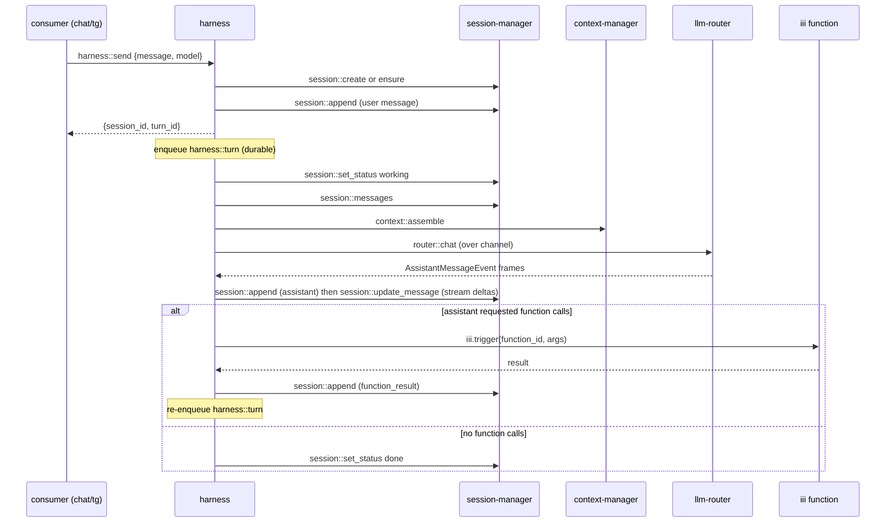

# harness

Worker prefix: `harness::*`

## Definition

`harness` is the thin worker that wires the other three into an agent loop. It owns sequencing and
nothing else: take an incoming message, persist it, assemble a context, stream a completion, persist
the result, execute any function calls, and repeat until the turn stops.

It is deliberately minimal. The rule of thumb: **if a concern grows real logic, it becomes its own
worker** rather than living in the harness. Approval gating, spend budgets, compaction *scheduling*,
hook fan-out, and multi-agent handoff are all out of scope here — they are siblings the harness can
call or that can subscribe around it (see [Out of scope](#out-of-scope-future-sibling-workers)).

The harness is the only worker in this spec that depends on the other three, and even those are soft:
without `context-manager` it sends raw history; without function dispatch it is a plain chat loop. It
needs `session-manager` (to persist/stream) and `llm-router` (to generate).

## What it wires



## The loop

`harness::send` is the entry point; it ensures the session, persists the user message, and enqueues
the first `harness::turn` step, then returns immediately. The loop runs as durable enqueued steps so a
crash or restart resumes mid-turn. One `harness::turn` step does:

1. Mark working: `session::set_status working` (first step of a turn).
2. Load active path: `session::messages`.
3. Assemble context: `context::assemble` (skipped if `context-manager` absent -> raw messages + base
   system prompt). Attach the single `agent_trigger` invocation schema to the router request (see
   [Functions (the white box)](#functions-the-white-box)); function discovery is runtime — the model
   calls `engine::functions::list` / `engine::functions::info` through `agent_trigger`.
4. Generate: open a channel, call `router::chat`; `session::append` an assistant message, then
   `session::update_message` as deltas arrive (each fires `session::message_updated`). Deltas may be
   batched to throttle update frequency; the final update writes the complete `AssistantMessage`.
5. If the message has `function_call` content: unwrap each `agent_trigger` call, dispatch via
   `harness::function::dispatch`, append each `function_result`, then re-enqueue `harness::turn` to
   let the model react.
6. Else, steering check: re-read `session::messages` for any user message appended after this turn
   started (see [Triggers](#triggers)); if present, continue with another generate step; otherwise
   mark the turn `completed`, `session::set_status done`, and stop.

A `max_turns` guard caps runaway loops (turn ends `completed` with a synthetic notice). Cancellation
is cooperative: `harness::stop` sets an abort flag the next step checks, records `TurnStatus`
`cancelled`, then sets `session::set_status done`.

The harness maps the turn lifecycle onto the session's coarse status: `working` while a turn is
running or awaiting functions, `done` once it ends (`completed`, `cancelled`, or `failed`). The
internal `TurnStatus` (below) is finer-grained and stays inside the harness; consumers watch the
session status for idle/working/done, and call `harness::status` when they need to distinguish
completion from cancellation.

## Functions (the white box)

Functions are not a harness feature — they are the **iii substrate**. Any registered iii function is
callable; the harness **does not** map registry entries into provider tool schemas.

The harness:

- Attaches **one** invocation schema (`agent_trigger`) to each `router::chat` request so the model
  can trigger any allowed function via `{ function, payload }`.
- On `function_call` content: unwraps `agent_trigger` → target `function_id` + `payload`, enforces
  allow/deny policy (see `harness::send` options or an approval sibling in v1), dispatches via
  `iii.trigger({ function_id, payload })` through `harness::function::dispatch`, and captures the
  result as a `function_result` message.

`engine::functions::list` is how the **model** discovers what's callable — by triggering it through
`agent_trigger` at runtime — not how the harness builds a schema list at turn start.

A function can do anything an iii function can, including calling back to the consumer (the diagram's
`funcs -> chat` edge) — that is the function's own behaviour, not the harness's.

Terminology: see [README.md § Terminology](README.md#terminology).

## Registered functions

- `harness::send` — Entry point: persist the incoming message and kick off a turn; returns fast.
- `harness::turn` — Internal durable loop step (enqueued); not called directly by consumers.
- `harness::function::dispatch` — Internal: unwrap an `agent_trigger` call and invoke the target iii
  function; capture its result.
- `harness::stop` — Request cancellation of an in-flight turn.
- `harness::status` — Read the current turn status for a session.

## Triggers

### Trigger types emitted

None. The harness drives itself through the durable queue (an invocation mode, not a trigger) and
relies on `session-manager` for consumer-facing reactivity.

### Triggers bound

- **Optional** `harness::on_steering` — bind to [`session::message_added`](session-manager.md#trigger-types-emitted)
  so a user message that arrives mid-turn is folded into the running turn rather than dropped. If a
  turn is already running, the loop's steering check (step 6) picks the new message up on its own; if
  none is running, the handler kicks a fresh turn:

```typescript
iii.registerFunction("harness::on_steering", async (evt) => {
  if (evt.message.role !== "user") return;
  const status = await iii.trigger({
    function_id: "harness::status",
    payload: { session_id: evt.session_id },
  });
  if (
    !status ||
    status.status === "completed" ||
    status.status === "cancelled" ||
    status.status === "failed"
  ) {
    await iii.trigger({
      function_id: "harness::send",
      payload: { session_id: evt.session_id, message: evt.message, model: "<model>" },
    });
  }
  // else: a turn is running; its steering check re-reads session::messages and folds this in.
});

iii.registerTrigger({
  type: "session::message_added",
  function_id: "harness::on_steering",
  config: { roles: ["user"] },
});
```

This is opt-in; the default harness has no bound triggers.

---

## API Reference

Shared types (`AgentMessage`, `ContentBlock`, `AssistantMessage`, `AgentFunction`) are defined in
[README.md § Cross-cutting contracts](README.md#cross-cutting-contracts).

```typescript
type TurnStatus =
  | "running"              // generating or between durable steps
  | "awaiting_functions"   // dispatching function calls / collecting results
  | "completed"            // turn finished normally (incl. max_turns cap)
  | "cancelled"            // harness::stop observed
  | "failed";              // unexpected error; turn record carries reason
```

### `harness::send`

Accept an incoming message, ensure the session, append the user message, and enqueue the first turn
step. Returns before the turn runs.

- Invocation: **sync** (kicks an async/enqueued loop)

Request:

```typescript
type SendRequest = {
  session_id?: string;            // omit to create a new session
  message: AgentMessage | string; // string is sugar for a user text message
  model: string;
  provider?: string;
  options?: {
    system_prompt?: string;
    max_turns?: number;           // default 16
    thinking_level?: string;
    functions?: {
      allow?: string[];           // function_id globs the agent may dispatch to (e.g. "shell::*")
      deny?: string[];
    };
    metadata?: Record<string, unknown>; // tracing passthrough (session_id/message_id propagate)
  };
};
```

Response:

```typescript
type SendResponse = {
  session_id: string;
  turn_id: string;     // identifies this loop invocation
  accepted: true;
};
```

Example:

```jsonc
// request
{ "message": "Summarise the repo README", "model": "claude-sonnet-4", "provider": "anthropic",
  "options": { "functions": { "allow": ["shell::*", "fs::*"] } } }
// response
{ "session_id": "s_7a1", "turn_id": "t_001", "accepted": true }
```

### `harness::turn`

Internal durable loop step. Documented for completeness; consumers do not call it. Enqueued onto a
FIFO `harness-turn` queue; each run advances one step of [the loop](#the-loop).

- Invocation: **enqueue** (`TriggerAction.Enqueue({ queue: "harness-turn" })`)

```typescript
type TurnStepPayload = {
  session_id: string;
  turn_id: string;
  step: number;          // monotonic; guards against stale/duplicate dequeues
};
type TurnStepResult = {
  session_id: string;
  status: TurnStatus;
  next_step?: number;    // present while the loop continues
};
```

Failure handling: an unexpected throw marks the turn `failed` and appends a `custom`
(`custom_type: "error"`) entry so the UI sees the reason. A step may opt into queue retry/backoff for
transient provider errors instead of failing the turn.

### `harness::function::dispatch`

Invoke a single iii function and return a normalised result. The loop unwraps `agent_trigger` before
calling this; it can also be called directly with an already-unwrapped target `function_id` +
`arguments`.

- Invocation: **sync**

```typescript
type FunctionDispatchRequest = {
  session_id: string;
  call: {
    id: string;            // function_call id, echoed into the result
    function_id: string;   // the iii function to invoke
    arguments: unknown;
  };
};
type FunctionDispatchResponse = {
  function_call_id: string;
  function_id: string;
  content: ContentBlock[]; // function output, normalised to content blocks
  is_error: boolean;
  details?: unknown;
  duration_ms: number;
};
```

The harness performs no approval check here in v1; gating is delegated to an optional approval sibling
that can wrap or precede dispatch (see [Out of scope](#out-of-scope-future-sibling-workers)).

### `harness::stop`

Request cancellation. Sets an abort flag the next `harness::turn` step observes; an in-flight provider
stream is closed best-effort. The turn record transitions to `cancelled` before `session::set_status
done`.

- Invocation: **sync**

```typescript
type StopRequest = { session_id: string; turn_id?: string }; // turn_id omitted = current turn
type StopResponse = { stopping: boolean };
```

### `harness::status`

- Invocation: **sync**

```typescript
type StatusRequest = { session_id: string };
type StatusResponse = {
  session_id: string;
  turn_id: string | null;
  status: TurnStatus;
  step: number;
  turn_count: number;
  max_turns: number;
  pending_function_calls: string[];   // function_call ids awaiting results
} | null;                          // null for unknown sessions
```

---

## State

| Scope | Key | Value | Purpose |
|---|---|---|---|
| `harness_turn` | `<session_id>` | turn record `{ turn_id, status, step, turn_count, abort? }` | Loop progress; survives restart. |

Transcript truth lives in [session-manager](session-manager.md); the harness keeps only loop
bookkeeping.

## Dependencies

- `session-manager` (`session::*`) — persist messages, stream content via `session::update_message`,
  and set status. Required.
- `llm-router` (`router::chat`) — generation. Required.
- `context-manager` (`context::assemble`) — context budgeting. Soft; degrades to raw history.
- `iii-queue` — the durable `harness-turn` loop.
- iii engine `iii.trigger` — function dispatch (`agent_trigger` unwrap → target function).

## Out of scope (future sibling workers)

Kept out to preserve thinness; each is a clean add-on that wraps the loop or subscribes to its events:

- **approval-gate** — intercept `harness::function::dispatch` (or a pre-dispatch hook) to allow / deny /
  hold function calls against a policy; resume via a state trigger.
- **llm-budget** — track spend from `router` usage and cap per workspace/agent.
- **context-scheduler** — decide *when* to compact (the optional reactive trigger in
  [context-manager](context-manager.md#triggers)); the harness only compacts inline on overflow.
- **hook-fanout** — publish-and-collect lifecycle hooks around turns and function dispatch.
- **multi-agent / orchestrator** — agent-to-agent handoff via queues; the harness runs one agent
  loop.

If any of these needs to sit *inside* the critical path, prefer a pre/post hook function id the
harness calls (config-driven) over embedding the logic.

## Boundaries

- Does **not** store the transcript, build context, or talk to providers itself — it calls the other
  three.
- Does **not** gate approvals, meter cost, or schedule compaction in v1.
- Does **not** define functions — functions are the iii substrate; the harness only exposes the
  `agent_trigger` invocation surface and dispatches what the model requests.
