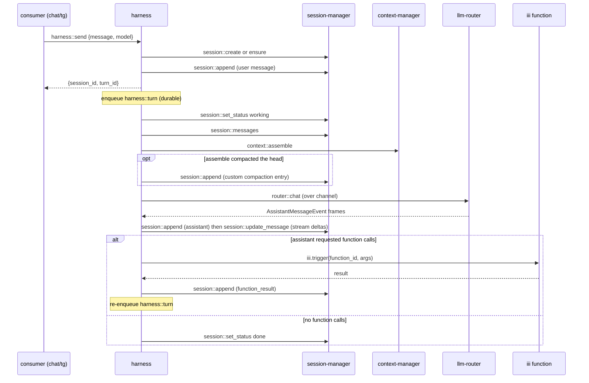

# harness

Worker prefix: `harness::*`

## Definition

`harness` is the thin worker that wires the other three into an agent loop. It owns sequencing and
nothing else: take an incoming message, persist it, assemble a context, stream a completion, persist
the result, execute any function calls, and repeat until the turn stops.

It is deliberately minimal. The rule of thumb: **if a concern grows real logic, it becomes its own
worker** rather than living in the harness. Approval gating, spend budgets, compaction *scheduling*,
hook fan-out, and multi-agent handoff are all out of scope here — they are siblings the harness can
call or that can subscribe around it (see [Out of scope](#out-of-scope-future-sibling-workers)).

The harness is the only worker in this spec that depends on the other three, and even those are soft:
without `context-manager` it sends raw history; without function dispatch it is a plain chat loop. It
needs `session-manager` (to persist/stream) and `llm-router` (to generate).

## What it wires



## The loop

`harness::send` is the entry point; it ensures the session, persists the user message, and enqueues
the first `harness::turn` step, then returns immediately — or merges into a turn that is already
running (see [Concurrency & steering](#concurrency--steering)). The loop runs as durable enqueued
steps so a crash or restart resumes mid-turn (see
[Durability & idempotency](#durability--idempotency)). Every `session::append` /
`session::update_message` the loop issues carries `origin: { turn_id }`, so session events are
attributable to a turn. One `harness::turn` step does:

1. Mark working: `session::set_status working` (first step of a turn).
2. Load active path: `session::messages` with `include_custom: true` (custom entries carry the
   compaction record, below).
3. Assemble context: read the latest compaction entry (if any) on the active path, reduce the
   candidate window to it, and call `context::assemble` with `previous_summary` set (see
   [Compaction persistence](#compaction-persistence)); skipped if `context-manager` absent -> raw
   messages + base system prompt. If the response reports `applied.compacted`, persist the new
   summary (same section). Attach the single `agent_trigger` invocation schema to the router request
   (see [Functions (the white box)](#functions-the-white-box)); function discovery is runtime — the
   model calls `engine::functions::list` / `engine::functions::info` through `agent_trigger`.
4. Generate: open a channel, call `router::chat` with `request_id = <turn_id>:<step>` (recorded on
   the turn record as `stream_request_id` for [`harness::stop`](#harnessstop)); `session::append` an
   assistant message, then `session::update_message` as deltas arrive (each fires
   `session::message_updated`). Deltas may be batched to throttle update frequency; the final update
   writes the complete `AssistantMessage`.
5. If the message has `function_call` content: unwrap each `agent_trigger` call, dispatch via
   `harness::function::dispatch` sequentially in content order (the `agent_trigger` schema declares
   `execution_mode: "sequential"`), append each `function_result` — checkpointing per call (see
   [Durability & idempotency](#durability--idempotency)) — then re-enqueue `harness::turn` to let
   the model react.
6. Else, steering check: re-read `session::messages` for user-role entries after the turn record's
   `watermark_entry_id` (see [Concurrency & steering](#concurrency--steering)); if present, continue
   with another generate step; otherwise mark the turn `completed`, `session::set_status done`, and
   stop.

A `max_turns` guard caps runaway loops (turn ends `completed` with a synthetic notice). Cancellation
is cooperative *between* steps and explicit *during* generation: `harness::stop` sets an abort flag
the next step checks, and when a stream is in flight it also calls
[`router::abort`](llm-router.md#routerabort) with the `stream_request_id` recorded on the turn
record. The generate step then finalises the partial assistant message (`stop_reason: "aborted"`),
records `TurnStatus` `cancelled`, and sets `session::set_status done`.

The harness maps the turn lifecycle onto the session's coarse status: `working` while a turn is
running or awaiting functions, `done` when it ends `completed` or `cancelled`, and `error` (with a
short `reason`) when it ends `failed`. The internal `TurnStatus` (below) is finer-grained and stays
inside the harness; consumers watch the session status, and call `harness::status` when they need to
distinguish completion from cancellation.

## Compaction persistence

`context-manager` is stateless — if nobody persists its compaction output, every turn past the
budget re-summarises the whole head (one extra LLM call per turn) and summaries never converge. The
harness is the caller, so the harness persists:

- When `context::assemble` returns `applied.compacted: true`, the harness appends a `custom` session
  entry — `{ custom_type: "compaction", data: { summary, tail_start_entry_id, tokens_before } }` —
  mapping `applied.tail_start_index` onto the entry id of the loaded active path.
- At the start of every assemble (loop step 3), the harness scans the loaded path for the **latest**
  compaction entry. When present, the candidate window passed to `context::assemble` is only the
  messages from `tail_start_entry_id` onward (compaction entries themselves are never sent), with
  `options.previous_summary` set to the stored summary so a re-compaction updates it in place.
- `options.lease_key` is always the `session_id`, so concurrent compactions of one session are
  mutually excluded across workers.

Result: one summarisation per overflow, amortised — not one per turn. The durable transcript is
untouched; the compaction entry is loop bookkeeping the harness owns (see
[context-manager.md § The compaction round trip](context-manager.md#the-compaction-round-trip)).

## Durability & idempotency

The `harness-turn` queue is **at-least-once**: any step may be redelivered after a crash, and every
step must tolerate it. The rules:

- **Stale-step guard.** Each dequeue compares `payload.step` to the turn record's current `step`; a
  lower step is acked and dropped. The guard only catches *old* steps — redelivery of the *current*
  step while it is still executing is indistinguishable from a resume, so the queue's
  visibility/processing timeout MUST exceed the worst-case step duration (which the router's stream
  idle timeout bounds — see
  [llm-router.md § Stream liveness](llm-router.md#stream-liveness-and-cancellation)).
- **Deterministic entry ids.** Every entry a step writes uses a deterministic id supplied via
  `session::append`'s `entry_id` (idempotent: appending an existing id is a no-op). The assistant
  message of a generate step is `e_<turn_id>_<step>_assistant`; a `function_result` is
  `e_<turn_id>_<function_call_id>`. A redelivered step therefore writes into the same entries
  instead of duplicating them: if the deterministic assistant entry already exists, the resumed
  generate step streams into it via `session::update_message` rather than appending a second
  message — a crash never yields two assistant messages.
- **Per-call checkpoints.** The turn record carries
  `calls: Record<function_call_id, { state: "dispatched" | "done"; entry_id?: string }>`. The
  dispatch loop checkpoints `dispatched` *before* invoking the target function and `done` *after*
  the `function_result` entry is appended. On redelivery: `done` calls are skipped; a call found
  `dispatched` but not `done` is **not re-invoked** — the side effect may or may not have happened,
  so the harness appends a synthetic `function_result` with `is_error: true`
  (`"interrupted: executed at most once, result unknown (restart during execution)"`) and lets the
  model decide whether to retry. Step delivery is at-least-once; function side effects are
  at-most-once.
- **Status writes** (`session::set_status`, turn record transitions) are naturally idempotent —
  re-setting the same value is a no-op and fires no event.

## Concurrency & steering

One turn per session, enforced at the entry point:

- **Turn CAS.** `harness::send` seeds the turn record with an atomic check-and-set: it creates a new
  turn only if no record exists or the existing record is terminal (`completed` / `cancelled` /
  `failed`). Two concurrent sends create exactly one turn — the loser of the CAS takes the merge
  path.
- **Merge path.** If a turn is already `running` / `awaiting_functions`, `harness::send` only
  appends the user message and returns the running turn's id with `merged: true`. The running loop's
  steering check folds the message in. A merged send never changes the running turn's `model`,
  `system_prompt`, or `functions` policy — per-send options are stored on the turn record when the
  turn is created and apply unchanged until it ends.
- **Steering watermark.** The turn record stores `watermark_entry_id` — the active-path leaf
  observed when the latest generate step assembled its context. The steering check (loop step 6)
  asks `session::messages` for user-role entries **after the watermark**; if any exist it continues
  with another generate step (advancing the watermark), otherwise the turn completes. "Arrived after
  this turn started" is defined by entry position, never wall-clock time.

## Functions (the white box)

Functions are not a harness feature — they are the **iii substrate**. Any registered iii function is
callable; the harness **does not** map registry entries into provider tool schemas.

The harness:

- Attaches **one** invocation schema (`agent_trigger`) to each `router::chat` request so the model
  can trigger any allowed function via `{ function, payload }`.
- On `function_call` content: unwraps `agent_trigger` → target `function_id` + `payload`, enforces
  the dispatch policy below, dispatches via `iii.trigger({ function_id, payload })` through
  `harness::function::dispatch`, and captures the result as a `function_result` message.

The dispatch policy is **fail-closed**: a call is dispatched only if the target matches an `allow`
glob and no `deny` glob (see `harness::send` options). When `options.functions` is omitted entirely,
every call is denied with an `is_error` function_result explaining the policy — a default install is
a plain chat loop until functions are explicitly allowed, or until an approval sibling upgrades "no
match" from deny to a held approval (see
[Out of scope](#out-of-scope-future-sibling-workers)).

`engine::functions::list` is how the **model** discovers what's callable — by triggering it through
`agent_trigger` at runtime — not how the harness builds a schema list at turn start. The harness
post-filters `engine::functions::list` / `engine::functions::info` results through the same
allow/deny globs before folding them into the `function_result`, so the model only discovers
functions it can actually call.

A function can do anything an iii function can, including calling back to the consumer (the diagram's
`funcs -> chat` edge) — that is the function's own behaviour, not the harness's.

Terminology: see [README.md § Terminology](README.md#terminology).

## Registered functions

- `harness::send` — Entry point: persist the incoming message and kick off a turn; returns fast.
- `harness::turn` — Internal durable loop step (enqueued); not called directly by consumers.
- `harness::function::dispatch` — Internal: unwrap an `agent_trigger` call and invoke the target iii
  function; capture its result.
- `harness::stop` — Request cancellation of an in-flight turn.
- `harness::status` — Read the current turn status for a session.

## Agent exposure

Deny-by-default for in-run agents (see [README § Security model](README.md#security-model)):

- **Deny:** `harness::send` — self-invocation: a model that can start turns can fork unbounded loops
  outside any `max_turns` guard (the prior deployment denies `run::start` for the same reason);
  `harness::turn` (internal); `harness::function::dispatch` (forged call ids, policy re-entry);
  `harness::stop`.
- **Safe:** `harness::status` (read-only).

## Triggers

### Trigger types emitted

None. The harness drives itself through the durable queue (an invocation mode, not a trigger) and
relies on `session-manager` for consumer-facing reactivity.

### Triggers bound

- **Optional** `harness::on_steering` — bind to [`session::message_added`](session-manager.md#trigger-types-emitted)
  so a user message that arrives mid-turn is folded into the running turn rather than dropped. If a
  turn is already running, the loop's steering check (step 6) picks the new message up on its own; if
  none is running, the handler kicks a fresh turn:

```typescript
iii.registerFunction("harness::on_steering", async (evt) => {
  if (evt.message.role !== "user") return;
  const status = await iii.trigger({
    function_id: "harness::status",
    payload: { session_id: evt.session_id },
  });
  if (
    !status ||
    status.status === "completed" ||
    status.status === "cancelled" ||
    status.status === "failed"
  ) {
    // model/options for the fresh turn come from app config — a merged send ignores them anyway.
    await iii.trigger({
      function_id: "harness::send",
      payload: { session_id: evt.session_id, message: evt.message, model: "<model>" },
    });
  }
  // else: a turn is running; its steering check (watermark) folds this message in.
});

iii.registerTrigger({
  type: "session::message_added",
  function_id: "harness::on_steering",
  config: { roles: ["user"] },
});
```

This is opt-in; the default harness has no bound triggers.

---

## API Reference

Shared types (`AgentMessage`, `ContentBlock`, `AssistantMessage`, `AgentFunction`, `ThinkingLevel`)
are defined in [README.md § Cross-cutting contracts](README.md#cross-cutting-contracts).

```typescript
type TurnStatus =
  | "running"              // generating or between durable steps
  | "awaiting_functions"   // dispatching function calls / collecting results
  | "completed"            // turn finished normally (incl. max_turns cap)
  | "cancelled"            // harness::stop observed
  | "failed";              // unexpected error; turn record carries reason
```

### `harness::send`

Accept an incoming message, ensure the session, append the user message, and enqueue the first turn
step. Returns before the turn runs. If a turn is already running for the session, the message is
appended and folded into it instead — no second turn starts (see
[Concurrency & steering](#concurrency--steering)).

- Invocation: **sync** (kicks an async/enqueued loop)

Request:

```typescript
type SendRequest = {
  session_id?: string;            // omit to create a new session
  message: AgentMessage | string; // string is sugar for a user text message;
                                  // role must be "user" or "custom" (else harness/invalid_message_role)
  model: string;
  provider?: string;
  options?: {
    system_prompt?: string;
    max_turns?: number;           // default 16
    thinking_level?: ThinkingLevel;
    functions?: {
      allow?: string[];           // function_id globs the agent may dispatch to (e.g. "shell::*")
      deny?: string[];
    };
    metadata?: Record<string, unknown>; // tracing passthrough (session_id/message_id propagate)
  };
};
```

Response:

```typescript
type SendResponse = {
  session_id: string;
  turn_id: string;     // the new turn — or the running turn when merged
  accepted: true;
  merged?: boolean;    // true when folded into an in-flight turn (steering)
};
```

Example:

```jsonc
// request
{ "message": "Summarise the repo README", "model": "claude-sonnet-4", "provider": "anthropic",
  "options": { "functions": { "allow": ["shell::*", "fs::*"] } } }
// response
{ "session_id": "s_7a1", "turn_id": "t_001", "accepted": true }
```

### `harness::turn`

Internal durable loop step. Documented for completeness; consumers do not call it. Enqueued onto the
`harness-turn` queue (FIFO per session, parallel across sessions — see
[Dependencies](#dependencies)); each run advances one step of [the loop](#the-loop).

- Invocation: **enqueue** (`TriggerAction.Enqueue({ queue: "harness-turn" })`)

```typescript
type TurnStepPayload = {
  session_id: string;
  turn_id: string;
  step: number;          // monotonic; guards against stale/duplicate dequeues
};
type TurnStepResult = {
  session_id: string;
  status: TurnStatus;
  next_step?: number;    // present while the loop continues
};
```

Failure handling: an unexpected throw marks the turn `failed`, appends a `custom`
(`custom_type: "error"`) entry so the UI sees the reason, and sets `session::set_status error` with
a short `reason`. A step may opt into queue retry/backoff for transient provider errors instead of
failing the turn (subject to [Durability & idempotency](#durability--idempotency)).

### `harness::function::dispatch`

Invoke a single iii function and return a normalised result. The loop unwraps `agent_trigger` before
calling this; it can also be called directly with an already-unwrapped target `function_id` +
`arguments`.

- Invocation: **sync**

```typescript
type FunctionDispatchRequest = {
  session_id: string;
  call: {
    id: string;            // function_call id, echoed into the result
    function_id: string;   // the iii function to invoke
    arguments: unknown;
  };
};
type FunctionDispatchResponse = {
  function_call_id: string;
  function_id: string;
  content: ContentBlock[]; // function output, normalised to content blocks
  is_error: boolean;
  details?: unknown;
  duration_ms: number;
};
```

v1 enforces the fail-closed allow/deny globs only — there is no *hold* state. Approval-with-hold
(park the call, resume on a decision) is delegated to an optional approval sibling that can wrap or
precede dispatch (see [Out of scope](#out-of-scope-future-sibling-workers)).

### `harness::stop`

Request cancellation. Sets an abort flag the next `harness::turn` step observes, and aborts an
in-flight stream via [`router::abort`](llm-router.md#routerabort) using the `stream_request_id` on
the turn record. The turn record transitions to `cancelled` before `session::set_status done`.

- Invocation: **sync**

```typescript
type StopRequest = { session_id: string; turn_id?: string }; // turn_id omitted = current turn
type StopResponse = { stopping: boolean };
```

### `harness::status`

- Invocation: **sync**

```typescript
type StatusRequest = { session_id: string };
type StatusResponse = {
  session_id: string;
  turn_id: string | null;
  status: TurnStatus;
  step: number;
  turn_count: number;
  max_turns: number;
  pending_function_calls: string[];   // function_call ids awaiting results
} | null;                          // null for unknown sessions
```

---

## State

| Scope | Key | Value | Purpose |
|---|---|---|---|
| `harness_turn` | `<session_id>` | turn record `{ turn_id, status, step, turn_count, abort?, watermark_entry_id?, stream_request_id?, options, calls }` | Loop progress, per-send options, per-call checkpoints, steering watermark; survives restart. Seeded by CAS from `harness::send` (see [Concurrency & steering](#concurrency--steering)). |

Transcript truth lives in [session-manager](session-manager.md); the harness keeps only loop
bookkeeping.

## Dependencies

- `session-manager` (`session::*`) — persist messages, stream content via `session::update_message`,
  and set status. Required.
- `llm-router` (`router::chat`) — generation. Required.
- `context-manager` (`context::assemble`) — context budgeting. Soft; degrades to raw history.
- `iii-queue` — the durable `harness-turn` loop. The queue MUST provide per-session ordering with
  cross-session parallelism (partition by `session_id`); a single global FIFO would head-of-line
  block every session behind one long stream step.
- iii engine `iii.trigger` — function dispatch (`agent_trigger` unwrap → target function).

## Out of scope (future sibling workers)

Kept out to preserve thinness; each is a clean add-on that wraps the loop or subscribes to its events:

- **approval-gate** — intercept `harness::function::dispatch` (or a pre-dispatch hook) to allow / deny /
  hold function calls against a policy; resume via a state trigger.
- **llm-budget** — track spend from `router` usage and cap per workspace/agent.
- **context-scheduler** — decide *when* to compact (the optional reactive trigger in
  [context-manager](context-manager.md#triggers)); the harness only compacts inline on overflow.
- **hook-fanout** — publish-and-collect lifecycle hooks around turns and function dispatch.
- **multi-agent / orchestrator** — agent-to-agent handoff via queues; the harness runs one agent
  loop.

If any of these needs to sit *inside* the critical path, prefer a pre/post hook function id the
harness calls (config-driven) over embedding the logic.

## Boundaries

- Does **not** store the transcript, build context, or talk to providers itself — it calls the other
  three.
- Does **not** gate approvals, meter cost, or schedule compaction in v1.
- Does **not** define functions — functions are the iii substrate; the harness only exposes the
  `agent_trigger` invocation surface and dispatches what the model requests.
