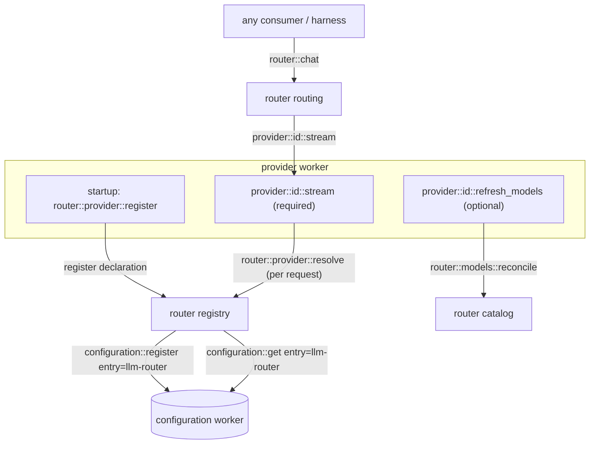

# llm-router

Worker prefix: `router::*` — plus the `provider::<id>::*` protocol it defines for provider workers.

## Definition

`llm-router` is the single front door to every LLM, and the protocol layer between consumers and
provider workers. A consumer never talks to a provider directly; it calls `router::chat` /
`router::complete` with a `model` and messages, and the router dispatches to the right provider. A
provider never talks to a consumer; it implements a narrow contract (`provider::<id>::stream`),
self-registers, and only ever talks back to the router.

The router owns four things:

1. **Routing** — map a `model` (and/or `provider`) to a `provider::<id>::stream` handler, from the
   live registry of declared providers. No hardcoded provider list.
2. **The provider registry** — providers self-declare at startup (`router::provider::register`); the
   router composes their config slices and resolves credentials per request
   (`router::provider::resolve`).
3. **Credentials & settings** — stored in the engine's built-in `configuration` worker under one
   `llm-router` entry; resolved centrally with env-var fallback. Provider workers never read keys
   from disk/env themselves.
4. **The model catalog** — capability records served from `router::models::*`, populated exclusively
   by provider discovery (`router::models::reconcile`); no baked-in seed.

It is **consumer-agnostic**: it assumes no harness, session, or UI. It streams into a caller-supplied
channel and returns. That is exactly what lets a `third-party-worker` "use llm directly without
harness".

## Standalone use

- Any worker calls `router::chat` to stream a completion from whatever provider/model is configured,
  through one stable surface, swapping providers with zero call-site changes.
- A batch job calls `router::complete` for non-streaming one-shots.
- A model picker UI reads `router::models::list` and `router::provider::list`.

## The provider protocol



A provider worker MUST:

1. Register `provider::<id>::stream` honouring the channel-writer contract below.
2. Self-declare to the router at startup via `router::provider::register`.
3. Resolve credentials per request via `router::provider::resolve` (never read keys directly).

A provider worker MAY:

4. Register `provider::<id>::complete` (legacy non-streaming) and
   `provider::<id>::refresh_models` (live model discovery into the catalog).

### Provider stream contract

The router opens a channel and calls `provider::<id>::stream`. The iii SDK hydrates `writer_ref` into
a live `ChannelWriter` before the handler runs. The provider writes each `AssistantMessageEvent` as a
JSON text message, then closes. Terminal event is `done` or `error`.

```typescript
// Input (wire shape; writer_ref arrives hydrated as a ChannelWriter)
type ProviderStreamInput = {
  writer_ref: StreamChannelRef;     // direction "write"
  system_prompt?: string | null;
  model: string;
  messages: AgentMessage[];         // provider serialises to its own wire format
  tools?: AgentFunction[];          // provider adapter: maps to OpenAI/Anthropic "tools" array
  thinking_level?: string;          // "minimal"|"low"|"medium"|"high"|"xhigh"; provider maps or ignores
};

type ProviderStreamOutput = { ok: boolean; status?: string };
```

The router treats `provider::<id>::*` as an interface it *calls*, not functions it registers. See
[Authoring a provider](#authoring-a-provider).

## Functions

Consumer-facing:

- `router::chat` — Stream a single assistant turn for a model into a caller-supplied channel; relays
  `AssistantMessageEvent` frames.
- `router::complete` — Non-streaming: return the final `AssistantMessage` (drains the stream
  internally).
- `router::models::list` — List available models, optionally filtered by provider/capability.
- `router::models::get` — Look up one model's capabilities by `(provider, id)`.
- `router::models::supports` — Check whether a model supports a capability.
- `router::provider::list` — Enumerate declared providers and their configured/available state.

Provider protocol (router side):

- `router::provider::register` — A provider self-declares its id, config schema, and defaults.
- `router::provider::resolve` — A provider resolves its credential + settings at request time.
  **Agent-gated** (see [Security](#security)).
- `router::models::reconcile` — A provider replaces its catalog slice in one write.

## Triggers

### Trigger types emitted

- **`router::models::changed`** — fires when the catalog changes (a provider reconciles). Payload:
  `{ provider: string; count: number }`. Lets pickers refresh reactively.
- **`router::provider::changed`** — fires when the provider registry changes (declare / availability
  flip). Payload: `{ provider: string; op: "register" | "available" | "unavailable" }`.

Bind either the standard two-step way (see [README § Reactive pattern](README.md#reactive-pattern)).

### Triggers bound

- **`router::on_worker_available`** bound to the engine topology trigger so the router notices
  provider workers connecting/disconnecting and flips availability (and can kick discovery):

```typescript
iii.registerFunction("router::on_worker_available", handler);
iii.registerTrigger({
  type: "subscribe",
  function_id: "router::on_worker_available",
  config: { topic: "engine::workers-available" },
});
```

---

## API Reference

Shared types (`AgentMessage`, `AssistantMessage`, `AssistantMessageEvent`, `AgentFunction`, `Model`,
`StreamChannelRef`, `Credential`, `Usage`) are defined in
[README.md § Cross-cutting contracts](README.md#cross-cutting-contracts).

### `router::chat`

Stream one assistant turn. The caller opens a channel and passes its `writer_ref`; the router resolves
the provider for `model`, calls `provider::<id>::stream`, and relays frames to the caller's channel
(or pipes the provider's writer through, implementation's choice). The call resolves when the stream
terminates.

- Invocation: **sync** (open while streaming)

Request:

```typescript
type ChatRequest = {
  writer_ref: StreamChannelRef;     // direction "write"; the caller's channel
  model: string;
  provider?: string;                // disambiguate when a model id exists on multiple providers
  system_prompt?: string | null;
  messages: AgentMessage[];
  tools?: AgentFunction[];          // provider adapter: maps to OpenAI/Anthropic "tools" array
  thinking_level?: string;
  metadata?: Record<string, unknown>; // passthrough for tracing (session_id, message_id, …)
};
```

The `tools` field is the **provider adapter boundary** — it maps to each provider's native
function-calling / tool-use API. In iii domain language these are [function invocation
schemas](README.md#function-invocation-schema), not "tools". The harness always passes a single
`AgentFunction` entry for `agent_trigger`; other callers may pass an empty array or their own schemas.

Response:

```typescript
type ChatResponse = {
  ok: boolean;
  provider: string;
  model: string;
  stop_reason?: StopReason;
  usage?: Usage;
};
```

Streamed over the channel: a sequence of `AssistantMessageEvent`, terminating in `done` (carrying the
final `AssistantMessage`) or `error`.

Errors (thrown before streaming starts): `model is required`; `no provider registered for model
<id>`; `provider <id> unavailable`. Mid-stream failures arrive as an `error` frame, not a thrown
error.

Example:

```jsonc
// request
{
  "writer_ref": { "channel_id": "ch_1", "access_key": "…", "direction": "write" },
  "model": "claude-sonnet-4",
  "provider": "anthropic",
  "system_prompt": "You are concise.",
  "messages": [{ "role": "user", "content": [{ "type": "text", "text": "hi" }], "timestamp": 1 }],
  "tools": []
}
// channel frames (abbreviated)
{ "type": "start", "partial": { "role": "assistant", "content": [], "...": "..." } }
{ "type": "text_delta", "delta": "He", "partial": { "...": "..." } }
{ "type": "text_delta", "delta": "llo", "partial": { "...": "..." } }
{ "type": "usage", "usage": { "input": 12, "output": 2 } }
{ "type": "done", "message": { "role": "assistant", "content": [{ "type": "text", "text": "Hello" }], "stop_reason": "end", "model": "claude-sonnet-4", "provider": "anthropic", "timestamp": 2 } }
// response (after stream closes)
{ "ok": true, "provider": "anthropic", "model": "claude-sonnet-4", "stop_reason": "end", "usage": { "input": 12, "output": 2 } }
```

### `router::complete`

Non-streaming. Internally opens a channel, drains `router::chat`, returns the final message.

- Invocation: **sync**

```typescript
type CompleteRequest = Omit<ChatRequest, "writer_ref">;
type CompleteResponse = {
  message: AssistantMessage;
  usage?: Usage;
  provider: string;
  model: string;
};
```

### `router::models::list`

- Invocation: **sync**

```typescript
type ModelsListRequest = {
  provider?: string;
  capability?: Capability;   // filter to models supporting it
};
type ModelsListResponse = { models: Model[] };
```

### `router::models::get`

- Invocation: **sync**

```typescript
type ModelsGetRequest = { provider: string; id: string };
type ModelsGetResponse = { model: Model } | null; // null when unregistered
```

### `router::models::supports`

- Invocation: **sync**

```typescript
type ModelsSupportsRequest = { provider: string; id: string; capability: Capability };
type ModelsSupportsResponse = { supported: boolean };
```

Unknown model or capability returns `{ supported: false }`. See
[Model capabilities](#model-capabilities) for what each capability means and how callers use it.

### `router::provider::list`

- Invocation: **sync**

```typescript
type ProviderInfo = {
  id: string;
  display_name: string;
  configured: boolean;          // has a usable credential (stored or via env)
  available: boolean;           // the provider worker is currently connected
  supports_model_listing: boolean;
};
type ProviderListResponse = { providers: ProviderInfo[] };
```

### `router::provider::register`

Called by a provider worker at startup. The router merges the declaration's `config_schema` (or a
default `{ api_key (password), api_url, max_tokens }` derived from `defaults`) into the `llm-router`
configuration entry and (re)registers it, so the editable config shape grows with the running set of
providers.

- Invocation: **sync**

```typescript
type ProviderDeclaration = {
  id: string;                       // also the provider::<id>::* prefix and config key
  display_name?: string;
  credential_env_var?: string;      // fallback env var when no api_key configured (e.g. FOO_API_KEY)
  defaults?: { api_url?: string; max_tokens?: number; [k: string]: unknown };
  config_schema?: Record<string, unknown>; // custom JSON Schema; omit for the standard one
  supports_model_listing?: boolean;
};
type ProviderRegisterResponse = { ok: true; id: string };
```

### `router::provider::resolve`

Called by a provider worker per request to get its credential + effective settings. **Agent-gated**:
denied to in-run agents so a credential can't be exfiltrated through function calls (see
[Security](#security)). Worker-to-worker calls bypass the agent gate.

- Invocation: **sync**

```typescript
type ProviderResolveRequest = { id: string };
type ProviderResolveResponse = {
  configured: boolean;
  source: "config" | "env" | "none";
  credential: Credential | null;   // null when neither stored key nor env var present
  api_url?: string;
  max_tokens?: number;
};
```

### `router::models::reconcile`

Called by a provider to replace its catalog slice in one state write — the only catalog write path.

- Invocation: **sync**

```typescript
type ModelsReconcileRequest = { provider: string; models: Model[] };
type ModelsReconcileResponse = { provider: string; count: number };
```

Fires `router::models::changed`.

---

## Model capabilities

A `Model` (see [README § Model descriptor](README.md#model-descriptor)) is mostly a *capability
record*. Beyond `context_window` and `max_output_tokens`, it carries boolean flags and a few
quantitative fields that tell a caller what a model can do **before** a request is sent — so a
consumer adapts the request to the chosen model instead of hardcoding per-model behaviour.

### Capability strings

`router::models::supports` and the `capability` filter on `router::models::list` accept these
strings, each mapping to a field on `Model`:

- `tools` -> `supports_tools` — the model accepts function-calling (provider `tools` / tool-use API)
  and can emit `function_call` content. If false, callers must not attach invocation schemas.
- `vision` -> `supports_vision` — the model accepts `image` content blocks. If false, callers strip
  or textually describe images first.
- `cache` -> `supports_cache` — the provider supports prompt caching; the provider may insert cache
  markers to cut cost/latency on repeated prefixes.
- `thinking` -> `supports_thinking` — the model exposes a reasoning/thinking budget at all.
- `thinking:low` | `thinking:medium` | `thinking:high` -> still `supports_thinking` — the level picks
  a budget tier (mapped to the provider's native knob; see `thinking_budgets`).
- `thinking:xhigh` -> `supports_xhigh` — the model supports the extra-high reasoning tier specifically
  (a separate flag because not every thinking-capable model offers it).

Unknown strings return `{ supported: false }` and match no models.

### How callers use it

- **Discovery / model picker** — a UI lists only relevant models:
  `router::models::list({ capability: "tools" })` for an agent that needs function-calling, or
  `{ capability: "vision" }` for an image task.
- **Request shaping (harness)** — before a turn the harness checks `supports_tools` to decide whether
  to attach the `agent_trigger` invocation schema, `supports_vision` to decide whether to keep image
  blocks, and `supports_thinking`/`supports_xhigh` to decide whether a requested `thinking_level` is
  honoured or dropped. This is how one harness drives many models without per-model branches.
- **Budgeting (context-manager)** — `context::assemble` reads `context_window` / `input_limit` /
  `max_output_tokens` to size the usable window, and `thinking_budgets` to leave room for the
  reasoning tokens a thinking tier consumes.
- **Cost (a budget sibling)** — `pricing` lets a spend-tracking worker turn `Usage` into `cost_usd`.

Capabilities come exclusively from provider discovery (`router::models::reconcile`). A provider that
does not report a flag leaves it absent/false, and callers must treat "unknown" as "unsupported"
rather than assuming a default.

## Configuration

One entry — id `llm-router` — in the built-in `configuration` worker holds provider credentials and
settings. Its `providers` JSON Schema is composed dynamically from each provider's declaration:

```jsonc
{
  "providers": {
    "anthropic": { "api_key": "sk-ant-…", "api_url": "https://api.anthropic.com/v1/messages", "max_tokens": 8192 },
    "openai":    { "api_key": "sk-…" },
    "lmstudio":  { "max_tokens": 8192 }   // local; no key needed
  }
}
```

A configured `max_tokens` overrides the per-model default but is clamped to the model's catalog
ceiling when known, so an over-large value can't cause upstream 400s.

## Routing

`decide(model, provider?)` resolves a target `provider::<id>::stream`:

1. If `provider` is given and registered -> that provider.
2. Else, the unique provider whose catalog contains `model`.
3. Else, an optional model-name heuristic (prefix/regex per provider).
4. Else -> throw `no provider registered for model <id>`.

Routing reads the live registry; adding a provider worker makes its models routable with no router
change.

## Security

- `router::provider::resolve` and `configuration::*` MUST be denied to in-run agents in the
  deployment's `iii-permissions.yaml`. Credentials live in plaintext in the configuration value;
  these denials keep an agent from reading them via a function call. Provider workers (and operator UIs)
  call them as worker/user-initiated calls, which bypass the agent gate.
- `router::chat` / `router::complete` / `router::models::*` / `router::provider::list` are safe to
  expose to consumers.

## Authoring a provider

To add a provider `foo`:

1. Implement `provider::foo::stream` honouring [the provider stream contract](#provider-stream-contract);
   write `AssistantMessageEvent` frames to the hydrated `writer_ref`, end with `done`/`error`, close.
2. At startup, call `router::provider::register` with
   `{ id: "foo", credential_env_var: "FOO_API_KEY", defaults, supports_model_listing }`.
3. In the stream handler, call `router::provider::resolve({ id: "foo" })` for the credential +
   `api_url`/`max_tokens`. Cloud providers throw on `credential: null`; local providers tolerate it.
4. (Optional) Implement `provider::foo::refresh_models` -> `router::models::reconcile` for live model
   discovery.

No router code changes: routing, config schema, and the picker all update from the declaration and
catalog.

## Dependencies

- `configuration` — the `llm-router` entry (credentials/settings).
- `iii-state` — model catalog and provider registry.
- `iii-stream` / channels — `router::chat` streaming.
- Provider workers — one per upstream; discovered at runtime, not a build dependency.

## Boundaries

- Does **not** persist conversations or build context — pass full `messages` in each call (use
  [session-manager](session-manager.md) / [context-manager](context-manager.md) upstream).
- Does **not** run the agent loop, dispatch functions, or gate approvals — that is the
  [harness](harness.md).
- Does **not** seed models from a static list — the catalog is provider-sourced via
  `router::models::reconcile`.
