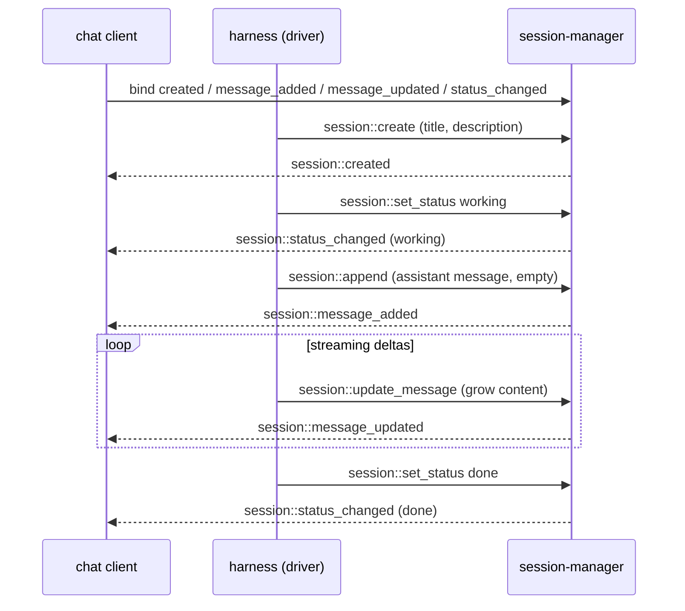

# session-manager

Worker prefix: `session::*`

## Definition

`session-manager` is the durable, reactive store for conversations. A session is an append-only log
of typed message entries (with optional fork branches; see [README § Session entries](README.md#session-entries)).
It carries a small amount of metadata — a `title`, a `description`, and a coarse `status` — and the
ordered messages that make up the conversation.

Two properties define it:

1. **Many message types.** It stores the full `AgentMessage` union — user, assistant,
   `function_result`, and `custom` — where content is the rich `ContentBlock[]` (text, image,
   thinking, function calls, function results). One transcript carries function calls, reasoning, images,
   and app-defined markers without a second store.
2. **Reactive.** State changes are exposed as **triggers other workers bind to** — not as a stream a
   caller has to publish into. The worker emits four trigger types: a session was created, a message
   was added, a message's content was updated, and a session's status changed. Consumers subscribe
   once and render live — no polling, no separate publish call.

It is a **pure storage + notification surface**: it binds no triggers of its own and runs no agent
logic. It is independently useful as a real-time conversation database for any app.

## Session status

Every session has a coarse lifecycle status that consumers can render directly (a spinner, a "done"
badge, a list filter):

- `idle` — created and waiting; no work in progress.
- `working` — the agent is thinking/responding (a turn is running).
- `done` — the agent finished the job and the session is at rest.

`session::create` starts a session at `idle`. The driver (typically the [harness](harness.md)) sets
`working` when a turn starts and `done` when it ends, via [`session::set_status`](#sessionset_status),
which fires [`session::status_changed`](#trigger-types-emitted).

## Standalone use

- A web/mobile chat app uses it as the source of truth and binds the four trigger types for real-time
  UI, with or without the harness.
- A multi-channel bot stores every conversation here and forks sessions to explore alternatives.
- A dashboard binds `session::status_changed` to show which sessions are working vs done.

## Reactivity model

There is no "subscribe" or "publish" function. Reactivity is entirely via the four emitted trigger
types; a consumer binds handlers with the standard two-step pattern (see
[README § Reactive pattern](README.md#reactive-pattern)).

Streaming an assistant reply uses the same primitives as everything else: the driver appends an
(initially empty) assistant message — which fires `session::message_added` — then calls
`session::update_message` as tokens arrive — each firing `session::message_updated`. Updates may be
batched/throttled by the driver. Consumers render the growing message from those updates.



## Functions

Lifecycle:

- `session::create` — Create a session with a `title` + `description` at status `idle`; fires
  `session::created`.
- `session::ensure` — Idempotently ensure a session with a given id exists.
- `session::get` — Read one session's metadata.
- `session::list` — List sessions with pagination/ordering.
- `session::set_meta` — Update a session's `title`/`description` (e.g. an auto-generated title).
- `session::set_status` — Set status `idle`/`working`/`done`; fires `session::status_changed`.
- `session::delete` — Delete a session and its entries.

Messages:

- `session::append` — Append one message entry; fires `session::message_added`.
- `session::append_many` — Append several message entries; fires `session::message_added` per entry.
- `session::update_message` — Replace the content of a message entry; fires `session::message_updated`.
- `session::messages` — Load the active-path `AgentMessage[]` (with entry ids), oldest first;
  supports pagination and role filtering.
- `session::get_message` — Read a single entry by id.

Branching:

- `session::fork` — Fork a session at an entry into a new session sharing history up to that point;
  fires `session::created` for the new session.

## Triggers

### Trigger types emitted

All four are custom trigger types this worker registers. Bind a handler with the two-step pattern
(see [README § Reactive pattern](README.md#reactive-pattern)); the config object filters which events
reach the handler.

```typescript
type SessionStatus = "idle" | "working" | "done";
```

- **`session::created`** — a new session exists (via `session::create` or `session::fork`).
  - Config: `{}` (no filters).
  - Payload:

```typescript
type SessionCreatedEvent = {
  session_id: string;
  title: string;
  description: string;
  status: SessionStatus;        // "idle" on create
  forked_from?: string | null;  // source session id when created by fork
  created_at: number;
};
```

- **`session::message_added`** — a message was appended.
  - Config: `{ session_id?: string; roles?: Role[] }`.
  - Payload:

```typescript
type MessageAddedEvent = {
  session_id: string;
  entry_id: string;
  parent_id: string | null;
  message: AgentMessage;
  timestamp: number;
};
```

- **`session::message_updated`** — a message's content changed (e.g. streaming deltas, edited
  function output).
  - Config: `{ session_id?: string; roles?: Role[] }`.
  - Payload:

```typescript
type MessageUpdatedEvent = {
  session_id: string;
  entry_id: string;
  message: AgentMessage;        // the full updated message
  timestamp: number;
};
```

- **`session::status_changed`** — a session's status changed.
  - Config: `{ session_id?: string }`.
  - Payload:

```typescript
type StatusChangedEvent = {
  session_id: string;
  status: SessionStatus;
  previous_status: SessionStatus;
  timestamp: number;
};
```

Example binding (live-render every assistant delta for one session):

```typescript
iii.registerFunction("ui::on_message_updated", async (evt) => render(evt.entry_id, evt.message));
iii.registerTrigger({
  type: "session::message_updated",
  function_id: "ui::on_message_updated",
  config: { session_id: "s_123", roles: ["assistant"] },
});
```

### Triggers bound

None. `session-manager` only emits; it subscribes to nothing.

---

## API Reference

Shared types (`AgentMessage`, `SessionEntry`, `ContentBlock`, `Role`) are defined in
[README.md § Cross-cutting contracts](README.md#cross-cutting-contracts).

```typescript
type SessionMeta = {
  session_id: string;
  title: string;
  description: string;
  status: SessionStatus;          // "idle" | "working" | "done"
  forked_from?: string | null;
  created_at: number;
  updated_at: number;
  message_count: number;
};
```

### `session::create`

Create a session at status `idle`. `title`/`description` may be supplied up front (e.g. derived from
the opening message) and refined later with `session::set_meta`. Fires `session::created`.

- Invocation: **sync**

```typescript
type CreateRequest = {
  title?: string;                 // default ""
  description?: string;           // default ""
  metadata?: Record<string, unknown>;
};
type CreateResponse = { session_id: string; meta: SessionMeta };
```

Example:

```jsonc
// request
{ "title": "Weather question", "description": "User asks about today's forecast." }
// response
{ "session_id": "s_123", "meta": { "session_id": "s_123", "title": "Weather question",
  "description": "User asks about today's forecast.", "status": "idle", "created_at": 1717800000000,
  "updated_at": 1717800000000, "message_count": 0 } }
```

### `session::ensure`

- Invocation: **sync**. Fires `session::created` only when it creates the session.

```typescript
type EnsureRequest = { session_id: string; title?: string; description?: string };
type EnsureResponse = { session_id: string; meta: SessionMeta; created: boolean };
```

### `session::get`

- Invocation: **sync**

```typescript
type GetRequest = { session_id: string };
type GetResponse = { meta: SessionMeta } | null; // null when unknown
```

### `session::list`

- Invocation: **sync**

```typescript
type ListRequest = {
  limit?: number;        // default 50
  cursor?: string;       // opaque pagination cursor
  status?: SessionStatus; // optional filter
  order?: "created_asc" | "created_desc" | "updated_desc"; // default updated_desc
};
type ListResponse = { sessions: SessionMeta[]; next_cursor?: string };
```

### `session::set_meta`

Update `title`/`description` (e.g. once a titling worker generates them from the first exchange). Does
not change status or messages. Updates `SessionMeta`; surfaced to consumers via `session::get`.

- Invocation: **sync**

```typescript
type SetMetaRequest = { session_id: string; title?: string; description?: string };
type SetMetaResponse = { meta: SessionMeta };
```

### `session::set_status`

Set the session status. Fires `session::status_changed`. No-op (no event) if the status is unchanged.

- Invocation: **sync**

```typescript
type SetStatusRequest = { session_id: string; status: SessionStatus };
type SetStatusResponse = { status: SessionStatus; previous_status: SessionStatus };
```

### `session::delete`

- Invocation: **sync**

```typescript
type DeleteRequest = { session_id: string };
type DeleteResponse = { deleted: boolean };
```

### `session::append`

Append one message entry. The entry id and `parent_id` are assigned by the worker (parent = current
active leaf) unless `parent_id` is provided. Fires `session::message_added`.

- Invocation: **sync**

```typescript
type AppendRequest = {
  session_id: string;
  message: AgentMessage;
  parent_id?: string;           // override the parent (default: active leaf)
};
type AppendResponse = { entry_id: string; parent_id: string | null; timestamp: number };
```

Example:

```jsonc
// request
{
  "session_id": "s_123",
  "message": {
    "role": "user",
    "content": [{ "type": "text", "text": "What's the weather?" }],
    "timestamp": 1717800000000
  }
}
// response
{ "entry_id": "e_001", "parent_id": null, "timestamp": 1717800000000 }
```

### `session::append_many`

- Invocation: **sync**. Fires `session::message_added` for each appended entry, in order.

```typescript
type AppendManyRequest = { session_id: string; messages: AgentMessage[]; parent_id?: string };
type AppendManyResponse = { entry_ids: string[]; last_entry_id: string };
```

### `session::update_message`

Replace the content (and optionally `details`) of an existing message entry. Used for streaming
assistant deltas and for edited function output. Fires `session::message_updated`.

- Invocation: **sync**

```typescript
type UpdateMessageRequest = {
  session_id: string;
  entry_id: string;
  content: ContentBlock[];   // new content for the message
  details?: unknown;         // for function_result entries
};
type UpdateMessageResponse = { updated: boolean };
```

### `session::messages`

Load the active path as `AgentMessage[]`, each paired with its `entry_id`, oldest first.

- Invocation: **sync**

```typescript
type MessagesRequest = {
  session_id: string;
  limit?: number;
  cursor?: string;
  roles?: Role[];                 // filter by role
  from_entry_id?: string;         // start the active path at a specific leaf (branch view)
};
type MessagesResponse = {
  messages: Array<{ entry_id: string; message: AgentMessage }>;
  next_cursor?: string;
};
```

### `session::get_message`

- Invocation: **sync**

```typescript
type GetMessageRequest = { session_id: string; entry_id: string };
type GetMessageResponse = { entry: SessionEntry } | null;
```

### `session::fork`

Create a new session that shares history up to `entry_id`, then diverges. Fires `session::created`
for the new session (`forked_from` set to the source).

- Invocation: **sync**

```typescript
type ForkRequest = { session_id: string; entry_id: string; title?: string };
type ForkResponse = { session_id: string; meta: SessionMeta };
```

---

## State

| Scope | Key shape | Value |
|---|---|---|
| `session:<session_id>` | `<entry_id>` | `SessionEntry` (`message` or `custom`) |
| `session_meta` | `<session_id>` | `SessionMeta` (incl. `title`, `description`, `status`) |
| `session_active_leaf` | `<session_id>` | `<entry_id>` (current active-path leaf) |

Entries are re-sorted by `(timestamp, id)` on load, so resumed/out-of-order writes keep their
transcript position. Backends are pluggable: an iii-state backend (default) and an in-memory backend
for tests; a future SQL/blob backend can implement the same interface.

## Dependencies

- `iii-state` — entry / meta / active-leaf storage.
- Registers four custom trigger types (`session::created`, `session::message_added`,
  `session::message_updated`, `session::status_changed`) and emits their events through the engine on
  every relevant mutation.

## Boundaries

- Does **not** run agent logic, call LLMs, or build context — it only stores and notifies.
- Does **not** compact or summarise history — the full transcript is kept; condensing it for the
  model window is a transient concern of [context-manager](context-manager.md).
- Does **not** export or render transcripts (HTML/PDF/etc.) — that is a separate worker's concern.
- `custom` entries are an app escape hatch — keep large blobs in a blob store and reference them, not
  inline, to keep entries small.
