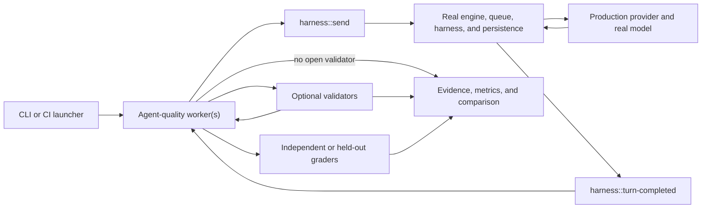

# Harness agent-quality E2E architecture

> Status: proposed architecture; implementation has not started.
>
> Last reviewed: 2026-07-14.

Agent-quality E2E is the real-model evaluation track for the harness. It
measures whether a pinned model, system prompt, tool catalog, worker set, and
harness implementation can complete representative user workflows, then makes
quality and efficiency changes visible against a pinned baseline.

This suite is implemented as one iii worker or a small worker set. Validation
is expressed as dynamic iii functions that developers or agents can add to a
workflow. A thin CLI or CI launcher selects configuration, applies global
budgets, starts the evaluation worker, and collects artifacts.

Agent quality and deterministic
[harness conformance](conformance-e2e.md) are the two E2E test types in the
evaluation program. They may share scenario vocabulary and report envelopes,
but they have different model boundaries, execution owners, cadence, and pass
policies.

## Decision summary

1. The suite itself is one iii worker or a small set of workers.
2. A scenario supplies the default or custom system prompt, task prompt, pinned
   model, optional initial workers, and optional validator.
3. Scenarios may require the agent to discover, install, create, or register a
   worker dynamically.
4. A validator may be supplied by the scenario, authored by the agent during
   the workflow, or omitted when no open runtime objective is needed.
5. After-turn validation begins from durable `harness::turn-completed`
   lifecycle handling, never from a slow synchronous hook.
6. A failed open validator may provide structured feedback for another bounded
   turn. The attempt stops at pass, terminal failure, cancellation, deadline,
   or budget exhaustion.
7. Independent or held-out graders remain outside the subject agent's tool
   catalog and context.
8. Outcome and efficiency metrics are calculated after the attempt is terminal.
9. Outputs and metrics are stored so prompts, models, tool catalogs, worker
   versions, and harness versions can be compared A/B.
10. The corpus covers varied orchestration patterns rather than one canonical
    way to use tools or sub-agents.
11. Real-model comparisons report reliability, spans, turns, latency, context,
    tokens, errors, and cost in addition to outcome quality.
12. Browser functions may provide DOM, network, console, snapshot, screenshot,
    and real-interaction evidence, with deterministic state preferred.

## Goals

The agent-quality suite should answer three questions:

1. **Capability:** can the harness and a real model complete a representative
   user workflow?
2. **Quality:** is a candidate system prompt, model, tool catalog, worker set,
   or harness implementation better than the pinned baseline?
3. **Product validation:** can users express the desired outcome as reusable
   validation functions and use the result to guide a bounded workflow?

The system should make the cause of a failure visible. A model failure, harness
failure, validator error, and unavailable dependency must not collapse into one
generic failing score.

## Non-goals

This document does not propose:

- one composite number that hides correctness, cost, latency, and reliability;
- deterministic protocol conformance, which belongs to
  [the conformance suite](conformance-e2e.md);
- exact-output matching when several correct tool trajectories are possible;
- an unbounded loop that retries until a validator eventually passes;
- exposing private evaluation expectations to the subject agent;
- placing project-specific validation logic in the harness core;
- using the console UI as the only source of truth for lifecycle events;
- a no-code rule authoring UI in the first version.

## Test taxonomy

The July 14 discussion used "unitish", "mocked E2E", and "E2E" for different
boundaries. Use the following names in code, reports, and CI so the result is
unambiguous:

| Layer | Boundary under test | Model behavior | Primary oracle |
|---|---|---|---|
| Unit | One module, parser, state transition, or pure contract | None or in-process fake | Direct code assertions |
| Integration | Several harness components; internal entry points may be used | Fake or scripted | Component state and contracts |
| Conformance E2E | Public entry point through the real engine, queue, harness, persistence, and lifecycle | Scripted router or recorded replay | Durable public state and exact effects |
| Agent-quality E2E | Public workflow plus production provider path and real tools | Real model | Outcome validators plus quality and efficiency metrics |

Conformance is E2E by system boundary even though one dependency is controlled.
"Mock-server E2E" is a useful explanatory label for it. Tests that seed private
turn records or invoke continuation internals remain integration tests.

## Validator visibility and trust

The evaluation track and validator visibility are separate decisions. Within
agent quality, an open runtime objective and an independent release grader have
different trust boundaries even when they inspect the same evidence.

| Visibility | Subject agent can inspect it? | Purpose | Suitable as the only release grader? |
|---|---:|---|---:|
| Open runtime validator | Yes, when the workflow intentionally uses it as its definition of done | Guide planning, provide feedback, and decide whether another turn is needed | No |
| Independent deterministic grader | No | Verify durable state and invariants without changing agent behavior | Yes |
| Held-out model grader | No | Judge subjective or visual properties that deterministic code cannot express | Only with calibration and deterministic checks |
| Human grader | No | Adjudicate ambiguity, safety, or high-risk cases | Yes, but not as an automated gate |

An open validator is useful product functionality. It lets a user say, for
example, that a scan is complete only when the number of database rows equals
the number of source files. However, if the agent can inspect that condition,
passing it proves that the agent satisfied the published objective; it does not
prove that the objective was complete or could not be gamed.

## What end to end means

An agent-quality E2E scenario starts at a supported external boundary, uses the
production provider path and real tools, and ends at durable,
consumer-visible state. Project validation functions are invoked through the
same iii function and trigger mechanisms available to product workflows.



The engine, routing contract, provider path, model, queue delivery, state,
stream handling, harness process, session persistence, and allowed tool workers
are real. The model and external dependencies introduce variance, so comparable
runs pin their inputs and use repeated attempts.

A public-path scenario should:

- enter through `harness::send` or another documented consumer entry point;
- allow the real queue to invoke `harness::turn`;
- observe transcripts, statuses, target invocations, validation results, and
  terminal lifecycle events;
- avoid seeding internal turn records or invoking continuation internals;
- invoke validators through a documented external boundary;
- fail loudly when required infrastructure is unavailable;
- preserve enough evidence to replay or diagnose the run.

Tests that seed state or call internal continuation functions remain valuable
integration tests, but they do not demonstrate the workflow users actually run.

The launcher does not own orchestration. It selects a target, starts or contacts
the quality worker set, supplies budgets, and collects the resulting artifact.
The quality workers own scenario execution, completion handling, validator
invocation, bounded continuation, metric calculation, and reporting.

## Validation functions as a product extension

A validation function describes an observable definition of done for one
workflow. It should be possible to add a project rule without modifying the
harness core or a monolithic external test suite.

Examples include:

- database row count equals the number of discovered inputs;
- an expected state transition occurred exactly once;
- all fan-out children completed before the parent finalized;
- no protected function executed before approval;
- an HTTP endpoint returns the expected schema and persistent effect;
- a browser is at the expected URL and a DOM condition is true;
- the browser emitted no unexpected console errors or failed requests;
- a screenshot is sufficiently similar to a reviewed reference.

The initial authoring surface should be code-first. The expected authors are:

- harness maintainers, for built-in protocol and regression rules;
- application developers, for project-specific outcomes;
- the agent itself, when creating a runtime definition of done as part of the
  requested workflow.

Agent-authored validators must be reviewed or paired with an independent grader
before they become regression gates. Otherwise the same subject can weaken both
the implementation and the test that judges it.

### Responsibilities

The separation of responsibilities should be explicit:

| Component | Responsibilities |
|---|---|
| Harness | Durable turn execution, lifecycle events, dispatch, persistence, and resumption |
| Validation function | Evaluate one scoped outcome and return structured evidence |
| Feedback-loop orchestrator | Decide whether to stop, start another turn, or exhaust the attempt budget |
| Agent-quality worker(s) | Register scenarios, start real-model attempts, handle completion, invoke validators, enforce bounded continuation, calculate metrics, and report |
| Thin CLI or CI launcher | Select the target and scenario set, apply global budgets, trigger the quality worker, and collect artifacts |
| Independent grader | Verify assertions that must not influence the subject agent |

A validation function should not silently start an unlimited new turn, mutate
its own expected result, or mark the overall run as passed. The quality worker
owns continuation policy and the final attempt result.

### Lifecycle model

Use three distinct terms:

- **Turn:** one normal harness turn, potentially containing several model and
  function-call steps.
- **Validation cycle:** the completed turn plus the validators invoked for that
  result.
- **Scenario attempt:** one bounded sequence of validation cycles evaluated as
  a single attempt.

The intended runtime loop is:

1. Start a turn through `harness::send`.
2. Observe the matching `harness::turn-completed` trigger and confirm terminal
   durable state through `harness::status` and the transcript.
3. Invoke the configured after-turn validation functions.
4. If an open validator fails with actionable feedback, append that feedback
   through a supported consumer path and start the next bounded cycle.
5. Stop on pass, terminal error, cancellation, deadline, or maximum cycles.
6. Run independent graders against the final artifacts.
7. After terminal completion, calculate the complete outcome and efficiency
   metrics and record every intermediate failure rather than only the eventual
   pass.

Continuation must use public lifecycle events and entry points rather than
coupling validation to private turn-loop state.

### Hooks are not the general eval API

Synchronous `harness::hook::*` extensions are appropriate when the behavior
under test is itself a hook contract: mutation, rejection, approval hold,
timeout, or failure policy. They are also useful for in-path policy enforcement.

General after-turn validation should use the durable completion boundary, not a
synchronous hook, because it may perform slow database, browser, network, or
model-based work. A slow grader must not keep a harness queue job open. Hooks
remain scenarios within the eval corpus, while validation functions are the
general outcome mechanism.

`Hook` is not a general term for every lifecycle callback in this
specification. In the current harness vocabulary, `harness::hook::*` means the
synchronous in-path extension points; `harness::turn-completed` is the
asynchronous lifecycle trigger used by the quality worker for after-turn
validation.

## Agent-quality execution and scenario inputs

Agent quality is implemented as one worker or a small worker set, not as a
large external test program. One possible split is:

- an **orchestrator worker** that registers scenarios, starts attempts, applies
  limits, handles `harness::turn-completed`, and decides whether to continue;
- a **validator worker** or project-provided validator functions that return
  structured checks and evidence;
- an **evidence worker** that reads transcripts, traces, context and compaction
  counters, token usage, errors, and artifacts, then writes the final report.

The first version may combine these responsibilities in one worker, but the
external launcher remains thin.

The initial scenario surface has five inputs:

| Input | Requirement |
|---|---|
| System prompt | Optional explicit prompt; omission means the current default prompt |
| Task prompt | Normally the task objective; may be omitted when an external trigger or event supplies the work |
| Model | Pinned real model and settings for a comparable run |
| Initial workers | Optional; some scenarios start with all required workers and others require dynamic discovery or installation |
| Validator | Optional; may be scenario-provided, agent-authored, or absent |

Validator modes have distinct meanings:

- `provided`: the scenario registers a known validator;
- `agent_authored`: the task requires the agent to create and register a
  validator on turn completion during the workflow;
- `none`: the scenario intentionally measures behavior without an open
  after-turn objective, though an independent grader may still evaluate it.

For `provided`, the quality worker can invoke the known function after the
matching completion event. For `agent_authored`, the workflow creates the
function and a run-scoped binding to `harness::turn-completed`; the quality
worker still observes the result, enforces the cycle budget, and owns the final
report.

The quality worker registers the configured completion handler before sending
the task, so a very fast turn cannot be missed. It calculates aggregate metrics
only after the attempt reaches pass, terminal failure, cancellation, deadline,
or cycle exhaustion.

## Validation protocol

All validation functions should share a versioned envelope. A conceptual
request is:

```json
{
  "protocol_version": "1",
  "run": {
    "run_id": "eval_123",
    "scenario_id": "repository-security-scan",
    "attempt": 1,
    "cycle": 2
  },
  "subject": {
    "session_id": "session_123",
    "turn_id": "turn_456",
    "trace_id": "trace_789"
  },
  "validator": {
    "id": "validation::database::rows-match-files",
    "version": "1",
    "mode": "runtime"
  },
  "parameters": {
    "repository_fixture": "repo_123",
    "table": "security_findings"
  }
}
```

The response should distinguish a failed outcome from a broken validator:

```json
{
  "status": "fail",
  "checks": [
    {
      "id": "one-row-per-file",
      "passed": false,
      "expected": 42,
      "actual": 39
    }
  ],
  "feedback": "Three repository files do not have a persisted result.",
  "evidence": {
    "artifact_refs": ["eval_123/database/row-count.json"]
  },
  "metrics": {
    "duration_ms": 18,
    "input_tokens": 0,
    "output_tokens": 0
  }
}
```

Allowed statuses should have unambiguous semantics:

- `pass`: all required checks passed;
- `fail`: the subject outcome did not meet the rule;
- `error`: the validator or one of its dependencies failed;
- `inconclusive`: evidence was insufficient to decide.

Only `pass` is green. `error` and `inconclusive` must never become passing skips
in a release gate.

Every result should include the validator id, version or content digest, run id,
scenario id, subject identifiers, individual checks, evidence references, and
duration. Model-backed validators must also report their model, prompt digest,
tokens, and cost.

### Isolation and permissions

Every run needs a unique `run_id` even if a broader iii namespace mechanism is
introduced later. Sessions, database rows, state keys, browser sessions,
artifacts, traces, and validator queries should be scoped by that id.

Validation functions should:

- use read-only access by default;
- receive only credentials and resources required by the check;
- avoid being automatically exposed in the subject model's tool catalog;
- write evidence to a run-scoped artifact location;
- have bounded time, network, token, and cost budgets;
- support deterministic cleanup or a documented retention period.

Some browser validations necessarily perform actions. Those should be labeled
as active validators, record each action, and run before a separate read-only
assertion when possible.

## Adding a new rule

Adding a rule should be an extension workflow, not a harness-core change:

1. Define the invariant in observable terms.
2. Choose its visibility: open runtime objective, independent grader, or both.
3. Implement a versioned validation function with structured checks and
   evidence.
4. Register it in a scenario manifest with its lifecycle phase and limits.
5. Create isolated fixtures tagged with `run_id`.
6. Run it repeatedly against a known passing and deliberately failing case.
7. Review agent-authored rules before promoting them to a shared baseline.
8. Record the validator digest and baseline result with the scenario.

A candidate scenario manifest is:

```yaml
id: fan-out-security-scan
track: agent-quality
entrypoint: harness::send

subject:
  system_prompt:
    strategy: custom
    ref: prompts/fan-out-v2.md
  task_prompt: prompts/scan-repository.md
  model: pinned-provider-model
  initial_workers:
    - state
    - database
  dynamic_workers: allowed
  functions_allow:
    - state::*
    - database::*
    - harness::spawn

validators:
  - function: validation::workflow::all-files-processed
    mode: provided
    phase: after_turn
    visibility: open
    on_fail: continue_with_feedback
  - function: eval-private::workflow::no-duplicate-results
    phase: final
    visibility: held_out

limits:
  max_cycles: 4
  attempt_timeout_seconds: 300
  max_total_tokens: 100000
```

## Scenario corpus

The corpus should demonstrate that the harness supports different user-defined
patterns instead of enforcing one orchestration opinion. Begin with a small,
diagnosable set, then grow toward approximately 20 to 30 representative prompt
and system-prompt combinations.

Recommended families are:

| Family | Representative outcome |
|---|---|
| Plain response | Streamed text reaches durable completion without duplication |
| Single function | Allowed target executes exactly once and its result reaches the next generation |
| Sequential workflow | Steps occur in the required order and resume correctly |
| Fan-out and fan-in | Children may finish out of order, but the parent resolves exactly once after all required work |
| Batched sub-agents | Work is divided into bounded batches, all child results are collected, and no item is lost or processed twice |
| State and queues | State transitions and queued work remain durable across turns |
| Dynamic state watch | A state change or event starts the next workflow stage without polling or duplicate reactions |
| Database workflow | Expected rows are written exactly once and match source inputs |
| Approval | Protected work never runs before approval and resumes or denies correctly |
| HTTP, webhook, and event input | External input or callback starts the correct workflow and produces durable output |
| Human-in-the-loop callback | Work parks for an external decision and resumes exactly once with the supplied decision |
| Steering | A user message arriving during work is neither lost nor duplicated |
| Structured output | Valid output completes; invalid output follows the bounded retry or failure contract |
| Browser workflow | Real navigation and interaction produce deterministic DOM or network evidence |
| System-prompt variation | Different orchestration instructions reach the same required outcome without policy violations |
| Dynamic worker availability | A worker added during development becomes discoverable and usable without restarting the whole stack |
| Worker creation | The agent creates or configures a missing capability, registers it, and uses the verified public contract |
| Console and registry stability | Transient disconnects or an inactive browser tab do not create registration loops, duplicate subscriptions, or trace storms |

## Evaluating system prompts with real models

A system prompt should not be graded by checking its wording. Treat the exact
prompt as a versioned input and grade the resulting behavior.

For each scenario, record:

- system-prompt content or immutable artifact reference and digest;
- user prompt and fixture version;
- harness, engine, and worker versions;
- provider, model identifier, and sampling or reasoning settings;
- exposed function catalog and schemas;
- open-validator ids and independent-grader digests;
- run id, timestamps, and environment metadata.

Compare a candidate and baseline on the same task set, environment, model, and
time window. Run multiple attempts in randomized order to reduce provider and
warm-cache bias. A cross-model matrix is useful only after each prompt variant
has been compared on the same model; otherwise model differences obscure prompt
effects.

Run a small real-model suite locally and in CI on a periodic or release cadence,
not in the deterministic pull-request gate. A lower-cost pinned hosted model can
provide frequent signal; selected reference-provider runs can check whether the
conclusion generalizes. Provider names and models belong in versioned run
configuration, not in the architecture contract. Persist the output transcript,
artifacts, validator evidence, and metrics for side-by-side A/B comparison.

Grade observable properties such as:

- task completion and independent invariant pass rate;
- correct function and argument selection;
- policy and approval compliance;
- exactly-once side effects;
- recovery from tool and dependency failures;
- number of turns, model calls, spans, and function calls;
- context growth, tokens, latency, and cost;
- quality of the final artifact when deterministic checks are insufficient.

Use `pass@1` for direct reliability, `pass@k` for the chance of at least one
success in `k` independent attempts, and `pass^k` for consistency across all
`k` attempts. Do not count cycles within one feedback loop as independent
attempts.

## Browser validation

Browser functions expand the possible evidence, but screenshots should not
become the default oracle.

Prefer checks in this order:

1. URL, DOM, accessibility state, or application state;
2. network requests and responses;
3. browser console errors;
4. stable snapshots;
5. screenshot comparison or a calibrated visual model grader.

Useful adapters include:

- `validation::browser::url`;
- `validation::browser::dom`;
- `validation::browser::network`;
- `validation::browser::console-errors`;
- `validation::browser::snapshot`;
- `validation::browser::screenshot`.

Visual comparisons need explicit viewport, browser version, fonts, animation
policy, device scale, data fixtures, masks, and tolerance. Store the screenshot
and comparison output as evidence. A real click or form submission should be
followed by an independent state assertion rather than inferred only from the
appearance of the page.

## Metrics and regression policy

Report correctness and efficiency separately. A faster run that violates an
invariant is not an improvement, and one aggregate score should not conceal the
tradeoff.

Calculate this rollup only after the attempt is terminal. Intermediate cycles
remain part of the evidence and cost, but they do not produce a competing final
score.

Report:

- `pass@1`, `pass@k`, and `pass^k`;
- independent-grader pass rate;
- cycles and turns required to reach the open objective;
- sub-agents created, maximum depth, fan-out, and unresolved children;
- tool-selection and argument accuracy;
- policy-violation rate;
- model calls, function calls, and spans;
- trace size, span errors, tool errors, provider errors, and terminal errors;
- input, output, cached, and context tokens where available;
- peak context size, context growth, and compaction count;
- latency and provider cost;
- final-artifact score and grader agreement where subjective grading is used.

Separate subject cost from evaluation overhead:

- `agent_input_tokens`, `agent_output_tokens`, and `agent_cost`;
- `validator_input_tokens`, `validator_output_tokens`, and `validator_cost`;
- `agent_duration` and `validation_duration`.

Deterministic validation functions should normally consume no model tokens. A
model-backed validator that materially increases cost must be visible rather
than attributed to the subject agent.

Establish a baseline only from repeated stable runs. A candidate becomes a
regression when it crosses an agreed correctness, reliability, cost, or latency
threshold on the same scenario set. Thresholds should be declared before the
comparison and reported per dimension.

The requested "better or worse" rollup is useful as a comparison aid, but it
must be transparent. A versioned formula may normalize outcome, reliability,
time-to-goal, tokens, context pressure, errors, and cost with declared weights.
Every report must still expose the raw dimensions, formula version, and weight
set. Required validator or safety failures remain disqualifying and cannot be
offset by lower latency or cost. The initial formula and gate relationship are
open policy decisions.

## Execution ownership and artifacts

The iii worker set owns registration, execution, validation, bounded
continuation, time/token/cost limits, browser or project evidence, metrics, and
the report. The external CLI or CI launcher only selects configuration, applies
global budgets, triggers the worker, and collects its output. Domain assertions
belong in validation functions; the launcher must not become a central
collection of every database query, browser condition, or application rule.

A candidate artifact layout is:

```text
harness/evals/
  shared/
    protocol/
    evidence/
  quality/
    workers/
      orchestrator/
      evidence/
    launcher/
    scenarios/
    prompts/
    validators/
      open/
      independent/
    baselines/
  reports/
```

Regardless of layout, scenarios, validators, prompts, and baselines are
versioned independently but referenced by immutable ids or digests in every
run.

## Delivery sequence

1. Define the validation request and result envelopes, status semantics, and
   versioning rules.
2. Implement the first quality orchestrator as an iii worker and add one
   deterministic project validation function invoked after durable turn
   completion.
3. Add a bounded second cycle using structured validation feedback.
4. Add an independent grader that catches a deliberately incomplete open
   validator.
5. Record terminal transcripts, traces, errors, tokens, context, timing, cost,
   and version metadata in one machine-readable report.
6. Introduce a small real-model dataset with repeated baseline and candidate
   attempts in randomized order.
7. Add approval, batched sub-agents, fan-in, steering, queues, state, database,
   HTTP/webhook callbacks, human approval, and dynamic worker creation.
8. Grow toward 20 to 30 prompt and system-prompt patterns.
9. Add browser evidence and calibrated subjective graders only where
   deterministic state cannot express the requirement.
10. Establish release thresholds only after repeated runs characterize provider
    variance and infrastructure noise.

The first prototype is successful when:

- an iii quality worker can start and finish a real-model attempt through
  public harness boundaries;
- a user-defined validation function can assess a real completed workflow;
- a failed open validator can drive one bounded follow-up turn;
- an independent grader can detect a superficially satisfied objective;
- no unavailable dependency or validator error can produce a green result.

## Open questions

The following questions require explicit product and implementation answers:

- How should quality orchestration, validation, and evidence collection be split
  across one or more iii workers?
- What versioned iii function schemas register, discover, and invoke validators?
- Which worker owns the idempotent `harness::turn-completed` subscription and
  how does it handle binding, correlation, duplicate delivery, and out-of-order
  delivery?
- What public continuation contract appends validation feedback without
  conflating it with a new user instruction, starts a bounded follow-up turn,
  and enforces cycle limits?
- Which validators are visible to the agent, and how are held-out functions kept
  outside its catalog and context?
- How are agent-authored validators reviewed, frozen, signed, or content-addressed?
- What permissions and sandbox boundaries apply to database, network, shell,
  and browser validation?
- What is the canonical scenario-manifest format?
- What is the canonical report and artifact storage and retention format?
- What normalization, weights, and eligibility rules define the transparent
  comparison rollup, and can it ever gate a release?
- How should run isolation interact with future iii namespace support?
- Which initial scenarios represent real user workflows, and who owns their
  expected outcomes?
- When should a model or visual grader be trusted as a release gate?
- Which low-cost and reference-model configurations run at each cadence, and
  how many repeated attempts are required?
- Is a future UI needed for selecting, configuring, or authoring validation
  functions?

## References

- Anthropic, [Demystifying evals for AI agents](https://www.anthropic.com/engineering/demystifying-evals-for-ai-agents)
- OpenAI, [Evaluate agent workflows](https://developers.openai.com/api/docs/guides/agent-evals/)
- OpenAI, [Evaluation best practices](https://developers.openai.com/api/docs/guides/evaluation-best-practices)
- Yao et al., [tau-bench: A Benchmark for Tool-Agent-User Interaction in Real-World Domains](https://arxiv.org/abs/2406.12045)
- Anthropic, [When good models go bad: Infrastructure noise in model evaluations](https://www.anthropic.com/engineering/infrastructure-noise)
- UK AI Security Institute, [Inspect AI tasks](https://inspect.aisi.org.uk/tasks.html)

## Related repository material

- [Harness conformance E2E architecture](conformance-e2e.md)
- [Harness architecture overview](../../harness/architecture/README.md)
- [Harness design specification](../2026-06-agentic/harness.md)
- [`harness::send` implementation](../../harness/src/functions/send.rs)
- [Durable turn loop](../../harness/src/turn_loop.rs)
- [Turn lifecycle events](../../harness/src/events.rs)
- [Hook contracts](../../harness/src/hooks/mod.rs)
- [Harness CI workflow](../../.github/workflows/ci.yml)
